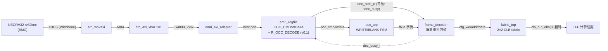

# 报告：P1 BMC 配置真实 fabric（ADR-018 BMC 集成 V + EMRI v0.1 R_OCC_DECODE）— E1-BMC1 真实闭环

> 任务：E1-BMC1 真实 fabric 收尾 — BMC（而非上位机 BFM）经自研 AXI 管理面把**打包列镜像**写入真实 fabric，fabric 开始计算（TFF 翻转）
> 日期：2026-08-30
> Plan-Ref：`ethereal-spec/control/emri-v0.md` §3.1（OCC_DECODE，v0.1）；`ethereal-plan/components/C05-BMC组件.md`；`docs/adr/ADR-018-axi-noc-riscv-cluster.md`（BMC = AXI master）

## 本阶段实现内容

### ✅ EMRI v0.1 `R_OCC_DECODE` 寄存器（spec-first，规格 → RTL → 双 SoT）

- **规格先行**：`emri-v0.md` 新增 §3.1——`OCC_DECODE @ 0x0D`（v0.1，自保留区拔出，沿用 §6 REGION_SEL 惯例）。写入锁存 `col_id` 并单周期脉冲 `dec_start_o`→`frame_decoder.start_i`，使打包部署**自包含于寄存器 ABI**（无需 host/TB 侧带 strobe）。
- **关键自定时背压**：`OCC_DECODE` 写在 decoder 忙时**被挂起**（`host_ready = !dec_busy_i`），start 脉冲仅在被接受（decoder 空闲）时发出——多命令部署（BLANK→WRITE）**自定序**，下一触发自动等到上一解码完成，`start_i` 永不丢失（decoder 忙时忽略 start_i）。无此则 BMC 只能轮询 decoder 状态或猜延迟。
- **RTL**：`emri_regfile` 新增 `dec_start_o`/`dec_col_o` 输出 + `dec_busy_i` 输入；写脉冲逻辑 + host_ready 背压分支。lint-clean。
- **双 SoT 同步**：`emri_pkg.sv` 与 `emri_constants.py` 均 `R_OCC_DECODE = 0x0D`（脚本交叉校验一致），杜绝 ABI 漂移。
- 既有 6 个实例化 `emri_regfile` 的 TB **零改动**（命名端口省略合法，新端口悬空；它们不用 R_OCC_DECODE）——已验证全部通过。

### ✅ 固件 `--mode occ-fabric`（`gen_bmc_hello.py`）

- 新镜像执行**完整打包部署**（对齐 `shell_tb_mgmt_packed.deploy_packed`，blank-before-write）：
  1. `OCC_FRAME_ADDR=0`、`OCC_WORD_COUNT=35`
  2. `OCC_DECODE`（BLANK 触发）→ `OCC_CMD=BLANK`（occ_top 自流零，decoder 写全零基线，**清 X 态配置 SRAM**）
  3. 轮询 done → `OCC_DECODE`（WRITE 触发，背压等到 BLANK 解码完）→ `OCC_CMD=WRITE`
  4. **循环**从 ROM 数据表读 35 个打包字并经 `OCC_WDATA` 推送（`sw` 自然停顿，无需轮询）
  5. 轮询 done，UART 打印 `OF` + hex(status) + `\n`
- 数据表机制：`pack_tb_frames.py` 的 35 个 DATA 字（丢 CRC 尾）附在代码后，推送循环经基址寄存器从 IMEM 读字（基址在代码长度确定后回填）。

### ✅ 真实闭环 TB（`ethereal-fabric/tests/bmc/tb_bmc_axi_fabric.sv`）

- 完整链路：**NEORV32 → XBUS → eth_wb2axi → eth_axi_xbar → emri_axi_adapter → emri_regfile → occ_top → frame_decoder → fabric_top**。
- 三重自检：① UART 精确匹配 `OF 00000008\n`；② 等到**第 2 个 dec_done**（BLANK#1、WRITE#2）；③ `clb_out_obs[0]` **翻转**（TFF 证明 fabric 在计算）。

## 调试记录（4 个真 bug，分层定位）

- **`dec_done` 单周期脉冲被漏检**：TB 在阻塞接收 UART 后才开始轮询 dec_done，错过 1 拍脉冲 → 改**粘性计数**（`dec_done_count`）。
- **查 fabric 时机过早**：TFF 检查在 WRITE 解码完成前采样 → 门控到**第 2 个 dec_done** 之后。
- **缺 BLANK 致 X 态**：初版 WRITE-only 使 `clb_out_obs[0]=X`——fabric 配置 SRAM 上电为 X（无复位），须先 BLANK 写全零基线（FABulous 红线）。固件补 BLANK→WRITE。
- **`dec_start` 时序丢触发（设计 bug）**：WRITE 的 R_OCC_DECODE 在 decoder 还在解码 BLANK 时发出，被 FSM 忽略（decoder 忙时忽略 start_i），WRITE 解码永不发生。修法=**背压自定时**（上节）——BMC 的下一触发写自动停顿到 decoder 空闲。**这是本阶段最有价值的固化点**：让多命令部署自定序，无需轮询/猜延迟。

## 验证结果

| 检查 | 结果 |
| --- | --- |
| `tb_bmc_axi_fabric`（iverilog/vvp） | ✅ TEST PASSED（UART 匹配 + 第2解码完成 + TFF 翻转） |
| `make lint` | ✅ OK — 全项目 RTL lint-clean（含 emri_regfile 新背压逻辑） |
| `make test-sv` | ✅ **27 个自测 TB 全过**（26 + tb_bmc_axi_fabric；既有 TB 零影响） |
| `make test-model`（pytest） | ✅ 2639 passed, 3 xfailed（无回归） |
| `ruff check` | ✅ All checks passed（gen_bmc_hello.py） |

## 链路图（BMC 配置真实 fabric = E1-BMC1 真实闭环）

## 待确认 / ASSUMPTION 清单（G6）

- `frame_decoder.crc_error_o` 在 v0 栓 0（CRC16 校验推迟；OCC 已做流式 CRC32）——v1 启用。
- 本 TB 用 2×2 均质 CLB fabric + 最小 TFF 镜像；异构（MEM/DSP tile）经 R_OCC_DECODE 的 BMC 部署属后续（host 路径已在 `shell_tb_het_packed` 证明）。
- 长帧/多列部署（decoder `col_i` 已支持）列入 E1-DMO2 压力阶段。

## 下一阶段需要做的内容

- **E1-RUN2 真主机化**：daemon 的 run/stop/ps/restart 跑在 BMC 固件上（依赖 E1-BMC2 bmc-fw 框架；当前为生成式镜像）。
- **`eth_wb2axi` + `emri_axi_adapter` + `R_OCC_DECODE` 形式化**：sby 属性证明（ack-仅在-B 后、VALID 稳定、SLVERR 不触达 EMRI、decoder 忙时 start 不丢）。
- **xbar v0.1**：INCR/WRAP burst、ATOP 原子。
- **AXI NI 适配器（AXI↔mailbox NoC）**：region 数据面接 AXI（RFC-002 更新）。
- **E1-BMC2**：bmc-fw 框架（boot/驱动/生命周期/trap handler）。
