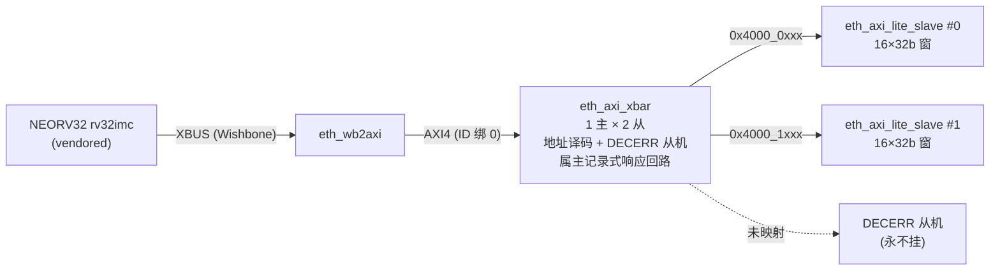

# 报告：P1 BMC→xbar 集成 TB（ADR-018 BMC 集成 II）— 经交叉开关的双从机路由

> 任务：ADR-018 BMC 集成后续 — BMC 经 `eth_axi_xbar` 地址译码访问多从机（report-P1-bmc-axi-bridge-20260808.md 的"下一阶段"第一项）
> 日期：2026-08-30
> Plan-Ref：`ethereal-spec/control/eth-axi-v0.md` §5（xbar）；`docs/adr/ADR-018-axi-noc-riscv-cluster.md`（BMC = AXI master）

## 本阶段实现内容

### ✅ 固件生成器 `--mode xbar`（`ethereal-tools/tools/gen_bmc_hello.py`）

- 新镜像：写 0x5AA5C33C→窗0（0x4000_0000）、0xC33C5AA5→窗1（0x4000_1000），分别读回，UART0 打印 `XB 5AA5C33C C33C5AA5\n`。
- 抽取 `_const32()`（LUI+ADDI 常量加载）与 `_emit_hex32()`（8 位 hex 打印）助手去重；`--mode xbus` 重构为复用助手——**回归验证：重构前后生成镜像逐字相同**（diff 为空）。

### ✅ 端到端集成 TB（`ethereal-fabric/tests/bmc/tb_bmc_axi_xbar.sv`）

- 链路：NEORV32 → XBUS(Wishbone) → `eth_wb2axi` → `eth_axi_xbar`（1 主 × 2 从 + DECERR 错误从机）→ 2× `eth_axi_lite_slave`（4 KiB 窗各一）。
- 接线决策：BMC 侧 ID 绑 0（桥无 ID 引脚，xbar 内部前插主索引）；从机侧 `m_bid/m_rid` 绑 0——**xbar 响应回路由"授权时记录的属主"完成而非返回 ID**（§5.1，已核源码确认），ID-less 的 AXI4-Lite 从机因此直连无碍。
- 自检三件套：两从机各自观察到写入（one-hot `reg_waddr_o[0]`）、UART 字节流精确匹配（读回值正确 ⇒ 译码/路由正确）、看门狗超时。

## 调试记录（隔离定位法）

- **现象**：整链 TB 报 UART "glitch, no valid start bit"，零字节收到。
- **隔离**：先写桥→xbar→2 从机的**无 CPU 调试 TB**（/tmp 临时件）——单写逐拍跟踪 17 拍内完成（AW/W→xbar 转发→从机 B→WB ack），**互联逻辑无 bug**；再在整链 TB 加边界探针——四次传输（2 写 2 读）全部数据正确。
- **根因**：TB 自身参数错误——本 TB 误用 115200 波特（BIT_NS=8680），而 NEORV32 UART 复位默认（PRSC=0/BAUD=0）为 **2 clk/bit = 20 ns/bit**（tb_bmc_hello/axi_master 均如此）。接收器按 8.68µs 采样 20ns 的起始位，必然报"假毛刺"。改为 `2 * CLK_PERIOD_NS` 后一次通过。
- **教训**：新 TB 复制既有接收器代码时连同时序参数一起核对；仿真 UART 波特率由 NEORV32 复位默认决定，不是真实 115200。

## 验证结果

| 检查 | 结果 |
| --- | --- |
| `tb_bmc_axi_xbar`（iverilog/vvp） | ✅ TEST PASSED（两从机路由写 + 读回 + UART 报文全对） |
| `make test-sv` | ✅ **23 个自测 TB 全过**（+tb_bmc_axi_xbar，含图像重生成步骤） |
| `make lint` | ✅ OK — 全项目 RTL lint-clean（无 RTL 变更） |
| `make test-model`（pytest） | ✅ 2639 passed（上一阶段已验证，本阶段无模型改动） |
| `ruff check` | ✅ All checks passed（gen_bmc_hello.py） |

## 链路图（BMC 经 xbar 访问多从机）

## 待确认 / ASSUMPTION 清单（G6）

- 本 TB 仍只覆盖**有效窗口**访问；BMC 触发 DECERR（未映射地址）的端到端行为（wb_err → NEORV32 总线异常 trap）需要固件 trap handler 才有意义——归入 E1-BMC2（bmc-fw 框架）一并做。
- xbar v0 为锁步单 outstanding/方向模型（见模块头 Notes）；BMC 单传输 XBUS 天然契合。burst/ATOP/多 outstanding 属 xbar v0.1（ADR-018 路线图 A 后续）。

## 下一阶段需要做的内容

- **BMC→EMRI regfile 实装**：把 EMRI 寄存器面挂到 xbar 从机口（替换 host 直驱 EMRI 的保底路径），BMC 固件经 AXI 驱动 OCC——E1-BMC1 收尾、E1-RUN2 真主机化的前提。
- **`eth_wb2axi` 形式化**：sby 证明 ack-仅在-B 后 / VALID 稳定 / 无悬挂 B。
- **xbar v0.1**：INCR/WRAP burst、ATOP 原子（SMP Linux 前置）。
- **AXI NI 适配器（AXI↔mailbox NoC）**：region 数据面接 AXI（RFC-002 更新）。
- **E1-BMC2**：bmc-fw 框架（boot / 驱动 / 生命周期 / trap handler）。
