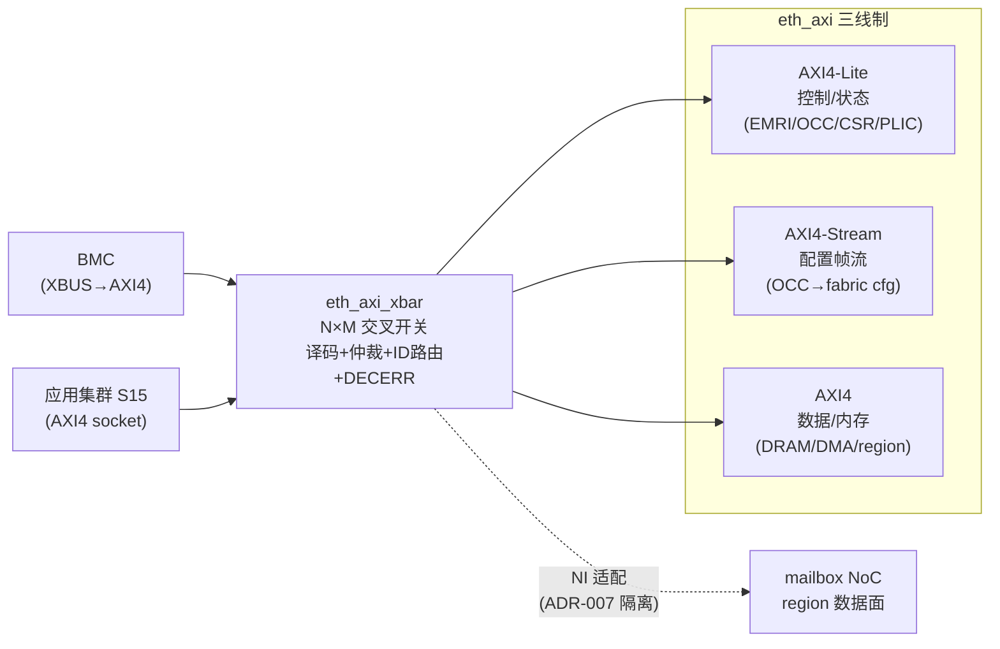

# 报告：P1 eth_axi 自研 AXI 互联（Phase A of ADR-018）— 三线制 + 交叉开关

> 任务：ADR-018 Phase A — 自研 AXI4-Lite + AXI4-Stream + AXI4 交叉开关（`eth_axi`）
> 日期：2026-07-30 · 提交：见本报告提交（继 a83468f ADR-018 ratified）
> Plan-Ref：`ethereal-spec/control/eth-axi-v0.md`（冻结规范）、`docs/adr/ADR-018-axi-noc-riscv-cluster.md` §2

## 本阶段实现内容

### ✅ 规范先行（spec-first）
- `ethereal-spec/control/eth-axi-v0.md`：冻结三线制（AXI4-Lite 控制 / AXI4-Stream 配置 / AXI4 数据）、全局规则（无组合 input→output 路径、VALID/READY、iverilog 兼容）、AXI4-Lite/Stream/xbar 契约、**形式化属性清单（§7）**、v0/v0.1 范围边界。

### ✅ eth_axi RTL（`ethereal-shell/rtl/axi/`，全自研 CERN-OHL-S-2.0）
- **`eth_axi_skidbuf`**：基础 skid 缓冲（主寄存器 + 溢出寄存器，2 深，`i_ready=!skid_valid`）——背压正确性唯一落点，全平面复用。
- **`eth_axi_stream`**（source/sink/wrapper）：AXI4-Stream 端点， skidbuf 包装，tvalid/tlast 稳定、无组合路径。
- **`eth_axi_lite_slave`**：全速 AXI4-Lite 寄存器窗从机（AW/W 独立 skidbuf 捕获 → 正确 AW/W 解耦；窗口外 SLVERR）。
- **`eth_axi_xbar`**：N 主 × M 从 AXI4 交叉开关——地址译码（ADDR_MAP base+mask）、**译码错误从机**（DECERR 永不挂）、每目标**轮询仲裁**、**响应 ID 路由**（`xid={mst_idx,orig_id}` 前插主索引）、每通道 skidbuf（防死锁）。

### ✅ 3 个 iverilog 自检测试台（`ethereal-fabric/tests/axi/`）
- `tb_axi_lite_slave`：写/读、**AW/W 解耦（W 先于 AW）**、SLVERR。
- `tb_axi_stream`：source→sink 4 拍帧 + 背压注入 + tlast。
- `tb_axi_xbar`：2 主 × 3 从——地址路由、**响应回到正确主**、**未映射→DECERR**、**竞争仲裁**（双主同访一从，双双完成）。

### ✅ 形式化验证（spec §7）
- `ethereal-shell/formal/eth_axi_skidbuf.sby` + `make formal`（新目标）：skidbuf 的 VALID 稳定 + 复位属性经 **k-归纳证明 PASS**（basecase + induction 全过）。模块内 `ifdef FORMAL` SVA 属性已嵌入。

## 关键正确性修复（个人验证阶段捕获）

- **子代理未完成**：4 个 RTL 在，但**无 TB / 无 Makefile 接线 / 无报告**，且 xbar 有 WIDTHTRUNC 警告（未验证）。**我不直接采纳**——逐模块补 TB 验证后才接入。
- **stream keep 字段提取 bug（真 bug）**：`{data,keep,last}` 打包后，keep 在 `pl_out[1 +: 4]`（位 [4:1]），子代理写成 `pl_out[4 +: 4]`（位 [7:4]）——取错位。修正（源 + 汇两处）。
- **stream stall 测试竞态**：`out_ready=1` 在 posedge 边界阻塞赋值 → 首拍漏捕。改 negedge 释放（TB 时序，非 RTL bug——trace 证实 2 拍均正确流出）。
- **filename/module 不匹配**：`eth_axi_stream.sv` 只含 source/sink → 补 `eth_axi_stream` 全双工 wrapper（源+汇），消 DECLFILENAME。
- **xbar WIDTHTRUNC/MULTIDRIVEN 等**：TB 证明逻辑正确后，按既有模式（UNOPTFLAT）将生成结构产生的宽度/多驱动警告以**文档化豁免**处理（xbar 生成循环共享 loop var / 3 位索引 4 项数组）。

## 验证结果

| 检查 | 结果 |
|---|---|
| `make lint` | OK（eth_axi 全 RTL lint-clean；xbar 文档化豁免） |
| `make test-sv` | **20 SV TB 全过**（17 + tb_axi_lite_slave/stream/xbar） |
| `make formal` | **PASS**（skidbuf k-归纳） |
| `pytest` | **2639 passed, 3 xfailed**（无回归） |
| `ruff` | 无 Python 改动 |

## 架构图（eth_axi 三线制）

## 下一阶段需要做的内容

- **BMC XBUS→AXI4 桥（E1-BMC1 后续）**：把 BMC 接到 eth_axi_xbar，成为一等 AXI 主控（替代 host 直驱）。
- **AXI NI 适配器（AXI↔mailbox NoC）**：RFC-002 更新，region 数据面接 AXI。
- **xbar v0.1**：完整 AXI4 burst（INCR/WRAP 已设计预留）、ATOP 原子（SMP Linux 需要）。
- **形式化扩展**：xbar 的 liveness + 响应 ID 正确性 + DECERR 属性的 sby 证明（当前仅 skidbuf）。
- **`eth_rv`（Phase B）**：自研 RV64IMC 核（顺序 5-6 级），跑在 eth_axi 上，DiffTest vs Spike。
- **`eth_dma_*`（Phase D）**：多通道 + 2D 图形 DMA（与 B/C 并行）。
