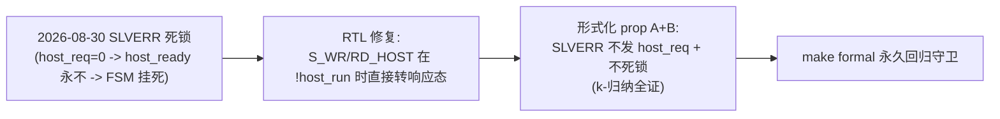

# 报告：emri_axi_adapter 形式化验证（k-归纳全证）— SLVERR 死锁回归的形式化固化

> 任务：`emri_axi_adapter`（AXI4-Lite→EMRI host 端口桥）的 SymbiYosys 形式化证明——把 2026-08-30 设计时自捕的 "SLVERR 死锁" 用形式化永久固化
> 日期：2026-08-30
> Plan-Ref：`ethereal-spec/control/emri-v0.md` §2/§3；`ethereal-spec/control/eth-axi-v0.md` §2/§3；`docs/reports/report-P1-formal-wb2axi-20260830.md`（方法论同源）

## 本阶段实现内容

### ✅ `emri_axi_adapter` k-归纳全证（`ethereal-shell/formal/emri_axi_adapter.sby`，`make formal` PASS）

RTL 内嵌 `ifdef FORMAL` SVA（沿用 eth_wb2axi 已证模式），证明：

| # | 属性 | 意义 |
| --- | --- | --- |
| A | **SLVERR 请求绝不发出 host_req**（`req_resp_r==SLVERR \|-> !host_req_o`） | 错误路径跳过 host 阶段（host_req 由 host_run=OKAY 门控） |
| B | **SLVERR 不死锁**（`S_WR_HOST/RD_HOST && SLVERR \|=> S_WR_B/S_RD_R`，无需 host_ready） | **回归守卫**：2026-08-30 自捕死锁——emri 只在 host_req 高时给 host_ready，SLVERR 路径 host_req 被压低，若等 host_ready 则永久等待 |
| C | 合法（OKAY）host 请求保持到 host_ready | host 反压正确性 |
| D | 响应 VALID 在 stalled 期间稳定（state 派生） | spec §2 规则 1 |
| E | B/R 仅存在于其响应态（结构性） | FSM 一致性 |

环境假设：确定性首拍复位；AXI 主（xbar）请求 VALID+payload 稳定至接受；`host_ready_i` 自由（建模 EMRI 反压）。

### ✅ 配套修复：Yosys 形式化前端兼容

- Yosys 0.67 默认 SV 前端**不接受 `import emri_pkg::*;`**（报 `unexpected TOK_IMPORT`，slang/surelog 前端本构建不可用）。改 `emri_axi_adapter` 用**显式包作用域**（`localparam … = emri_pkg::SPI_OP_RD/WR`）——Yosys/iverilog/verilator 三端通吃，仍用共享 `emri_pkg`（无 ABI 漂移）。lint + test-sv 均验证无回归。

## 验证结果

| 检查 | 结果 |
| --- | --- |
| `sby -f emri_axi_adapter.sby` | ✅ **PASS — successful proof by k-induction**（basecase + induction 全过） |
| `make formal` | ✅ OK（eth_axi_skidbuf + eth_wb2axi + emri_axi_adapter **三证全过**） |
| `make lint` | ✅ OK（显式作用域改动后 lint-clean） |
| `make test-sv` | ✅ 27 个自测 TB 全过（无回归） |

## 属性↔bug 对应

## 待确认 / 后续

- k-归纳给出**无界**证明（性质对任意时长成立）；depth=40 覆盖完整事务（含 OCC 路径多拍反压）2× 裕量。
- 本次三证固化的是**协议层** bug（wb2axi 提前应答、adapter SLVERR 死锁）。**`R_OCC_DECODE` 的时序 bug（dec_start 忙时丢失）已由 `tb_bmc_axi_fabric` 仿真回归覆盖**（BLANK→WRITE 背压场景）；其形式化（dec_start 仅在 !dec_busy 发出）属后续。

## 下一阶段需要做的内容

- **`R_OCC_DECODE` 形式化**（可选；仿真已回归覆盖）。
- **xbar v0.1**：INCR/WRAP burst、ATOP 原子（SMP Linux 前置）。
- **AXI NI 适配器（AXI↔mailbox NoC）**：region 数据面接 AXI。
- **E1-RUN2 真主机化**（依赖 E1-BMC2 bmc-fw 框架）。
