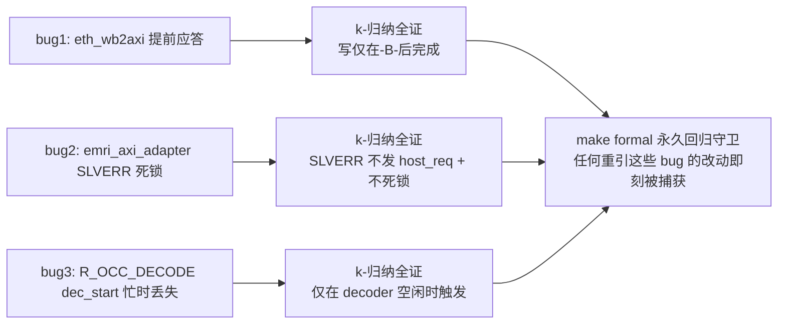

# 报告：R_OCC_DECODE 形式化验证（k-归纳全证）+ 时序窗加固 — 三 bug 形式化回归套装齐

> 任务：`emri_regfile` 的 R_OCC_DECODE 时序契约 SymbiYosys 形式化证明 + 一处时序窗加固——完成本 Session 三个 bug 的形式化回归守卫套装
> 日期：2026-08-30
> Plan-Ref：`ethereal-spec/control/emri-v0.md` §3.1；`docs/reports/report-P1-formal-wb2axi-20260830.md`、`report-P1-formal-emri-adapter-20260830.md`（方法论同源）

## 本阶段实现内容

### ✅ `R_OCC_DECODE` k-归纳全证（`ethereal-shell/formal/emri_r_occ_decode.sby`，`make formal` PASS）

| # | 属性 | 意义 |
| --- | --- | --- |
| 1 | **dec_start_o 仅在"接受时 decoder 空闲"才产生**（`dec_start_o \|-> $past(!dec_busy_i)`） | **回归守卫**：2026-08-30 "dec_start 忙时丢失" bug。注意可证形式是接受时刻条件——脉冲当拍的 dec_busy_i 是 decoder 对触发的响应（模块外），不可在本模块内证明 |
| 2 | **气密背压**：R_OCC_DECODE 写的 host_ready = `!dec_busy_i && !dec_start_r` | 自定序多命令部署（BLANK→WRITE）不丢触发 |
| 3 | dec_start_o 单周期脉冲 | 无连发 |
| 4 | dec_col_o 锁存自被接受写 | 列寻址正确 |

### ✅ 附带加固：dec_start 脉冲窗（隐藏小风险）

- **发现**：原背压 `host_ready = !dec_busy_i` 留 **1 拍窗口**——dec_busy_i 在 dec_start_o 之后一拍（decoder 进 STREAM）才升起，此窗内第二个 R_OCC_DECODE 写仍可被接受，其 start_i 会被已忙的 decoder 静默丢弃（BMC 慢路径实际遇不到，但属真实弱点）。
- **修法**：背压与触发条件同加 `&& !dec_start_r`——脉冲在飞期间拒绝新触发，时序气密。

### ✅ Yosys 形式化前端兼容（emri_regfile）

- 与 emri_axi_adapter 相同，Yosys 0.67 默认 SV 前端不接受 `import emri_pkg::*;`。`emri_regfile` 用常量更多（28 个），改为**显式包作用域 localparam 别名块**（单点替换 import 行，模块其余裸名用法不变）——Yosys/iverilog/verilator 三端兼容，仍用共享 `emri_pkg`（无 ABI 漂移）。lint + test-sv 验证无回归。

## 验证结果

| 检查 | 结果 |
| --- | --- |
| `sby -f emri_r_occ_decode.sby` | ✅ **PASS — successful proof by k-induction** |
| `make formal` | ✅ OK（**四证全过**：skidbuf + eth_wb2axi + emri_axi_adapter + emri_r_occ_decode） |
| `make lint` | ✅ OK（别名块 + 加固 + FORMAL 块 lint-clean） |
| `make test-sv` | ✅ 27 个自测 TB 全过（含 tb_bmc_axi_fabric 背压场景，无回归） |

## 本 Session 三 bug 形式化回归套装（齐）

## 形式化方法论固化（三步坑，适用于后续模块）

1. **初始态约束**：`if (!past_valid) assume(!rst_ni)`——否则引擎任选初始态造假反例。
2. **环境协议假设**：AXI 顺序（A3.4.1）、WB classic 稳定、VALID 稳定——区分"环境契约"与"DUT bug"。
3. **归纳辅助不变式**：FSM 桥需显式状态↔信号链接不变式才可达 k-归纳（skidbuf 类简单结构天然可归纳，桥/FSM 不然）。
4. **可证形式选择**：模块只能证明其可控的条件（如"接受时刻空闲"），不可证明跨模块的响应时序（如"脉冲当拍空闲"）——用 `$past` 锚定可控时刻。
5. **Yosys 前端**：默认 SV 前端不吃 `import pkg::*;`——显式 `pkg::X` 作用域（少常量）或 localparam 别名块（多常量）。

## 下一阶段需要做的内容

- **xbar v0.1**：INCR/WRAP burst、ATOP 原子（SMP Linux 前置）。
- **AXI NI 适配器（AXI↔mailbox NoC）**：region 数据面接 AXI。
- **E1-RUN2 真主机化**（依赖 E1-BMC2 bmc-fw 框架）。
- **形式化扩展**（可选）：xbar liveness + 响应 ID 正确性 + DECERR 属性（沿用本套装方法论）。
