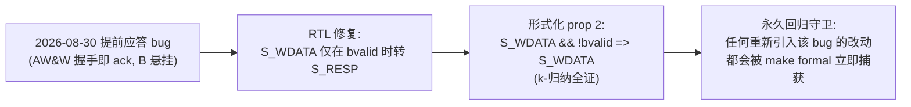

# 报告：eth_wb2axi 形式化验证（k-归纳全证）— ack-before-B 回归的形式化固化

> 任务：`eth_wb2axi`（Wishbone→AXI4 桥）的 SymbiYosys 形式化证明——把 2026-08-30 修复的"提前应答"bug 用形式化永久固化
> 日期：2026-08-30
> Plan-Ref：`ethereal-spec/control/eth-axi-v0.md` §2/§3/§7；`docs/adr/ADR-018-axi-noc-riscv-cluster.md`

## 本阶段实现内容

### ✅ `eth_wb2axi` k-归纳全证（`ethereal-shell/formal/eth_wb2axi.sby`，`make formal` PASS）

在 RTL 内嵌 `ifdef FORMAL` SVA（沿用 `eth_axi_skidbuf` 既有模式），证明：

| # | 属性 | 类型 | 意义 |
| --- | --- | --- | --- |
| 1 | AXI 请求 VALID+payload  stalled 期间稳定 | assert | spec §2 规则 1（VALID 全寄存器，无组合 input→VALID 路径） |
| 2 | **写仅在收到 B 才完成**（`S_WDATA && !bvalid \|=> S_WDATA`） | assert | **回归守卫**：2026-08-30 提前应答 bug（原逻辑 AW&W 握手即转 S_RESP，提前 ack 且 B 悬挂卡死下一写） |
| 3 | 读仅在收到 R 才完成（`S_RDATA && !rvalid \|=> S_RDATA`） | assert | 对称的读路径 |
| 4 | OKAY→wb_ack、SLVERR/DECERR→wb_err（错误响应绝不 ack） | assert | 错误映射正确性 |
| 5 | 辅助不变式：VALID 仅存在于其数据态（awvalid/wvalid→S_WDATA、arvalid→S_RDATA） | assert | 归纳强化（见调试记录） |

环境假设（assume）：AXI 从机 B/R 响应在接受前保持稳定；AXI 顺序（A3.4.1：B 仅在 AW&W 均接受后、R 仅在 AR 接受后）；Wishbone 主（NEORV32 XBUS）经典传输在 ack/err 前保持稳定、完成后撤 stb；首拍强制复位（确定性初始态）。

## 调试记录（4 轮迭代，形式化方法论）

- **R1 任意初始态假反例**：未约束复位 → 引擎任选初始 FSM 态（带滞留 VALID）制造假反例。修：`if (!past_valid) assume(!rst_ni)`——首拍强制复位，确定性初始。
- **R2 AXI 顺序违规假反例**：引擎让从机在 AW stalled 时就发 B（违反 A3.4.1），使 FSM 离开 S_WDATA 掉 awvalid，触发 VALID 稳定属性。修：加 AXI 顺序假设（B 仅在 AW&W 接受后、R 仅在 AR 接受后）——这是环境契约，非 DUT bug。
- **R3 归纳不成立**：basecase 过、induction FAIL——属性单独不可 k-归纳。修：加状态↔VALID 链接辅助不变式，约束归纳状态空间到可达配置 → **k-归纳全证**。
- **方法论固化**：形式化三步坑 = 初始态约束 → 环境协议假设 → 归纳辅助不变式。与 skidbuf 的简单结构天然可归纳不同，FSM 桥需显式不变式。

## 验证结果

| 检查 | 结果 |
| --- | --- |
| `sby -f eth_wb2axi.sby` | ✅ **PASS — successful proof by k-induction**（basecase + induction 全过） |
| `make formal` | ✅ OK（eth_wb2axi + eth_axi_skidbuf 双证全过） |
| `make lint` | ✅ OK（`ifdef FORMAL` 不影响综合/lint） |
| `make test-sv` | ✅ 27 个自测 TB 全过（无回归；含依赖 wb2axi 的 BMC TB） |

## 属性↔bug 对应（形式化固化的价值）

## 待确认 / 后续

- 有界深度 depth=40（覆盖完整写+读事务 ~20 拍 2× 裕量）；k-归纳给出**无界**证明（性质对任意时长成立），非仅有界 BMC。
- 后续：`emri_axi_adapter`（SLVERR 不触达 EMRI host 口）与 `R_OCC_DECODE`（dec_start 仅在 !dec_busy 时发）的同法形式化——沿用本报告的三步方法论。

## 下一阶段需要做的内容

- **`emri_axi_adapter` 形式化**：VALID 稳定 + SLVERR 路径不发 host_req（自捕死锁回归）+ host_req 保持到 host_ready。
- **`R_OCC_DECODE` 形式化**：dec_start 仅在 !dec_busy_i 发出（自定序回归）+ host_ready=!dec_busy。
- **xbar v0.1**：INCR/WRAP burst、ATOP 原子（SMP Linux 前置）。
- **AXI NI 适配器（AXI↔mailbox NoC）**：region 数据面接 AXI。
