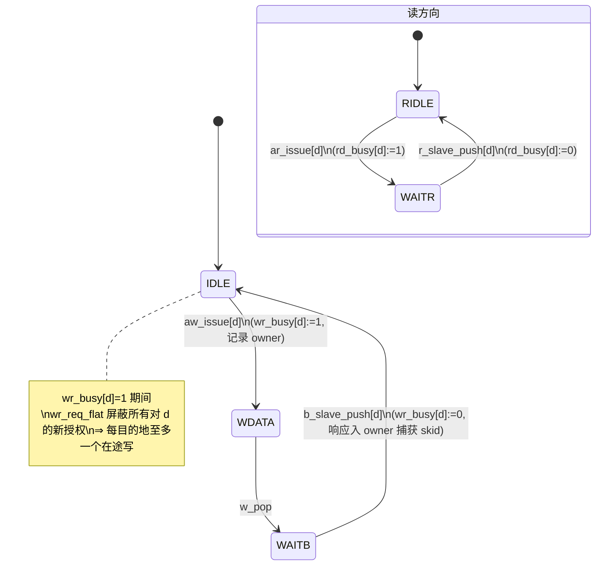

# 报告：P1 — eth_axi_xbar 每目的地 lock-step 形式化加固（SymbiYosys）

> 任务：P1 — 为刚修复的 eth_axi_xbar 跨主同目的地响应混叠 bug 类加形式化性质，
> 使该类 bug 在形式化层面永不回归；接入 `make formal`
> 日期：2026-09-02 · 执行者：Kimi K3（XbarFormal 子 Agent）
> Plan-Ref：`ethereal-spec/control/eth-axi-v0.md` §5（crossbar，lock-step 模型）、§7（props）；
>           `docs/reports/report-E1-RUN3-ethctl-efp-20260901.md`（bug 根因报告）

## 背景

E1-RUN3（2026-09-01）在 tb_ethctl_replay 上实测抓到一个**真实 RTL bug**：eth_axi_xbar v0 注释承诺
"每目的地 lock-step（授予的事务 AW→W→B / AR→R 完成后才接受下一个）"，但**实现从未强制执行**。
两主同时对同一从机有在途事务时，B/R/W 的 owner 判定（对"每主事务状态 + 目的地"做 OR 归并扫描）
发生混叠 —— BMC 读 IMG_DIGEST 的 R 数据被路由给 host 的 EFP_STATUS 轮询，造成假性 LOAD 匹配
并最终死锁。修复（当前工作树）：新增 `wr_busy`/`rd_busy[N_DST]`，在 `aw_issue`/`ar_issue` 置位、
B/R 响应捕获时清零，忙碌期屏蔽 `wr_req_flat`/`rd_req_flat` 的授权资格。

本任务把该修复**锁定为形式化不变量族**：若任何人削弱/移除 busy 门控（或改动引入新的混叠路径），
`make formal` 立即 FAIL 并给出反例 trace。

## lock-step 纪律（被证明的状态机）

关键对称性：`wr_busy[d]` 的置位/清零与 owner 主的 `wr_state` 迁移**发生在同一时钟沿**
（aw_issue⇔aw_pop、b_slave_push⇔b_done），因此 busy 位与在途集合严格同构 —— 这就是性质 (C)。

## 证明的性质（全部 k-归纳通过）

DUT 配置（sby `chparam`）：`N_MST=2, N_SLV=2`（+ 内建 DECERR 从机 = 3 目的地），
`ADDR_MAP = {mask1,mask0,base1,base0} = 0xFFFFFF00_FFFFFF00_00000100_00000000`
（slave0 @ 0x000–0x0FF，slave1 @ 0x100–0x1FF，其余 → DECERR），AW=32/DW=32/IDW=4。

| # | 性质（族） | 内容 | 深度 | 引擎 | 壁时 |
|---|---|---|---|---|---|
| U | 每目的地在途唯一性 | 任意目的地 d：至多一个主处于 WDATA/WAITB（写）或 WAITR（读）且 dest==d —— **OR 归并必然一热，混叠前提不可达** | 40 | smtbmc (z3) k-induction | 126 s（含 basecase 40 步 + 归纳步） |
| C | busy↔在途一致性 | `wr_busy[d]`/`rd_busy[d]` 置位 ⟺ 存在主对 d 有在途写/读 —— 授权掩码**恰好**是在途集合 | 40 | 同上 | 同上（同一证明） |
| O | owner 路由正确性 | `b_slave_push[d]`/`r_slave_push[d]` 时：被选 owner 确实持有对 d 的在途事务，且**其他主均无匹配在途**（真实 bug 的反例场景被排除）；ERR 从机同 | 40 | 同上 | 同上 |
| AUX | 错误从机 FSM 一致性 | `ew_state==EW_W/EW_B`、`er_state==ER_R` 时记录的 xid owner 处于对应事务状态（归纳强化） | 40 | 同上 | 同上 |
| §7 | 响应 VALID 稳定性 | s_bvalid/s_rvalid  stall 期间 VALID+payload 稳定；错误从机 owner 下标 < N_MST；复位后无响应 VALID（既有性质，保留） | 40 | 同上 | 同上 |
| cover ×7 | 非空见证 | 两从机同时忙 / DECERR 从机读写 / 读写双向并发 / RR 授权到主1（写+读）/ 全部主持有 B / 全部主持有 R —— **7/7 可达**（4–7 步内），证明非空虚 | 40 | smtbmc cover | 2 s |

环境假设（与 eth_wb2axi 证明同精神，仅为 AXI 契约）：主侧 AW/W/AR 在 stall 期间 VALID+payload
稳定（A3.1.2）；从侧 B/R 在 stall 期间 VALID+payload 稳定；**A3.4.1 响应定序** —— 从机只对已完整
接受的写（W 已握手、B 未返回）断言 B，只对在途 AR 断言 R（由形式化专用影子计数器
`b_pending`/`r_pending` 跟踪，零综合影响）。

## 证伪性证据（该证明能抓到什么）

把 busy 门控撤掉（回到 bug 版 RTL）时，性质 (U)/(O) 的反例正是 E1-RUN3 实测场景：

1. 主0（BMC）AR→slave0，`ar_issue` 后进入 WAITR；主1（host）AR→slave0 **也被授权**（无 rd_busy
   屏蔽）→ 两个主 `rd_state==1 && rd_dest==0`，违反 (U)：`rcnt==2`。
2. slave0 返回 BMC 的 IMG_DIGEST R 数据时，`rsel=2'b11`，OR 归并 `rm = 0|1 = 1` →
   `r_slave_push` 选中**主1**，但 (O) 断言"其他主无匹配在途"失败 —— 反例 trace 直接展示
   host 收到 BMC 的 digest 字（实测值 `0xfb8b76fa` 导致的假性 LOAD 匹配）。
3. 写方向同理：两主 WDATA/WAITB 同目的地 → `wsel`/`bsel` 混叠，B 路由错误。

修复后的 RTL 上，(U)+(C) 使上述交错**在状态空间层面不可达**（k-归纳证明，非有界测试）。

## 问题与解决

| 问题 | 根因 | 解决 |
|---|---|---|
| 首轮 prove：basecase 40 步全过但**归纳步 FAIL**（`eth_axi_xbar.sv:805`，err_b_push 的 owner 检查） | 不是 RTL bug：错误从机 FSM（EW_AW→EW_W→EW_B）与其记录的 xid 之间的一致性无法从既有性质归纳推出 —— 归纳从任意满足断言的状态出发，可达一个"ew_state==EW_B 但记录的 owner 不在 WAITB"的不可达状态 | 补 AUX 辅助不变量（错误从机各状态 ⟹ 记录 owner 处于对应事务状态）。这些不变量本身可归纳（FSM 与 owner 状态由同一事件同步推进），加入后归纳通过。属典型的 k-归纳强化，非性质弱化 |
| 活性（wr_busy/rd_busy 最终清零）无法在本框架证明 | prove 模式 k-归纳**只证安全性**；进展性需要公平性约束（从机终将响应、主终将接受 B/R）与活性引擎，smtbmc prove 不提供 | 按任务预案**只证安全性并文档化**（FORMAL 块注释 + 本节）；安全性族已钉死 bug 交错。死锁自由另有论证：所有边界为已证 skidbuf（无组合环路），busy 清零唯一依赖 B/R 到达，属环境公平性 |

## 接入与验证

- **Makefile 零改动**：`formal` 目标用 `find ethereal-shell/formal -maxdepth 1 -name '*.sby'`
  自动发现证明文件（Makefile:151），新增 `eth_axi_xbar.sby` 即自动接入（比"加一行"更稳，
  不会与既有行模式漂移）。
- `make formal`：**5/5 PASS**（eth_wb2axi 1s、eth_axi_skidbuf 0s、emri_axi_adapter 7s、
  emri_r_occ_decode 0s、eth_axi_xbar prove 126s + cover 2s），总壁时 138 s（2026-09-02 实测）。
- `make lint` 不受影响：FORMAL 块全部 `ifdef FORMAL` 守卫；xbar 单模块 verilator
  `--lint-only -Wall`（含既有 4 项 waiver）复跑干净。
- 功能无烟回归：tb_axi_xbar（iverilog）PASS —— FORMAL 块对综合/仿真零影响。

## 文件清单

| 文件 | 变更 |
|---|---|
| `ethereal-shell/rtl/axi/eth_axi_xbar.sv` | `ifdef FORMAL` 块扩充：U/C/O/AUX 性质族 + 环境假设（含 b_pending/r_pending 影子计数器）+ 7 个 cover 见证 + 既有 §7 性质保留；功能 RTL 一行未动 |
| `ethereal-shell/formal/eth_axi_xbar.sby` | 新增：prove（k-induction depth 40）+ cover（depth 40）双任务；chparam 2×2+DECERR 配置 |
| `docs/reports/report-P1-formal-xbar-20260902.md` | 本报告 |
| Makefile | **未改**（formal 目标自动发现 .sby） |

## 待确认 / ASSUMPTION 汇总（G6）

1. 🟡 **环境假设即 AXI 契约**：主/从侧 VALID 稳定性与 A3.4.1 响应定序是挂在 xbar 上的真实主/从
   必须遵守的协议（eth_axi_lite_slave、错误从机、wb2axi 均满足；emri_axi_adapter 的从侧行为已由
   其自身 sby 证明覆盖）。若未来接入第三方 AXI IP，需复核其 B/R 定序满足假设，否则证明前提失效。
2. 🟡 **活性未证**：见"问题与解决"。如需死锁自由的形式化证据，建议后续用支持公平性的活性
   引擎（如 sby live 模式 / nuXmv）单独立项。
3. 🟡 **证明配置为 2×2+DECERR**：bug 类（同目的地跨主混叠）与参数无关（busy 门控逻辑按 N_DST
   参数化生成），2 主已覆盖混叠的最小场景；N_MST>2 不引入新的混叠模式（一热性按主逐对成立）。
   DECERR 路径由第 3 目的地显式覆盖。

## 下一阶段需要做的内容

- v0.1（突发 + 多未完成事务）落地时，busy 门控将替换为 outstanding-ID 表：本性质族中的 (U)
  需改写为"同 ID 同目的地唯一"，(O) 的 owner 检查平移到 ID 表查找 —— 性质骨架与假设可直接复用。
- 若引入真正的乱序从机，需为 route-back 增加重排缓冲的形式化模型（当前假设沿用 v0 注释的
  "从机按授予顺序返回"）。
