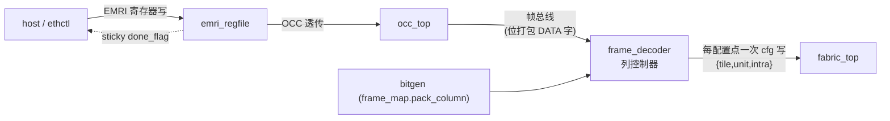

# 报告：P1 bit-packed 帧解码器（列控制器）— 管理面 → 生产帧格式打通

> 任务：帧解码器（C01 §5 列配置控制器 / C03 §0）+ bit-packed capstone TB
> 日期：2026-07-30 · 提交：见本报告提交（继 e91fd73 mgmt hot-swap）
> Plan-Ref：`ethereal-spec/fabric/heterogeneous-config-v0.md §3`、`C01 §5`、`C03 §0`、`frame_map.py`（SoT）

## 本阶段实现内容

### ✅ frame_decoder RTL（`ethereal-shell/rtl/emri/frame_decoder.sv`）
- 接收 OCC 帧总线（fbus_addr/fbus_wdata/fbus_we），缓冲一列的**位打包帧**（`frame_map.pack_column`：每 tile **CB(108)→SB(120)→逻辑(CLB 320/MEM 70/DSP 118)**，LSB-first，+ CRC16 tail），随后**逐配置点**发出 fabric cfg 写（cfg_we/cfg_addr/cfg_data）。
- FSM：`IDLE →(start脉冲)→ STREAM(捕获 OCC 流)→ SETUP → DECODE(逐点写)→ DONE`。
- **MEM/DSP 复合点解复用**：`mem_vbus_ctrl`(22b)→unit11 intra1（va@[13:0]/ven@[16]/vwe@[21:18] 由 fabric_top 解）；`dsp_vcasc`(48b)→intra4(高32 of [47:16])+intra5(低16)。其余 1:1（CLB eLUT/IIB、SB Wilton/inject、CB sel）。
- cfg_addr = `{tile_idx[TIW-1:0]@[7+TIW:8], unit[1:0]@[7:6], intra[5:0]@[5:0]}`，TIW=$clog2(R*C)，tile_idx=r*C+c。
- **lint-clean**（`-Wall`；get_bits 中间变量按字段宽度收窄，消 UNUSEDSIGNAL）。

### ✅ 单位 TB（`tb_frame_decoder.sv`）
- 经 `pack_tb_frames.py`（frame_map SoT 打包 2×2 col-0 已知配置）→ 流式喂入 → 捕获 228 次 cfg 写 → 抽查 eLUT tt / IIB sel / CB sel / SB Wilton / SB inject{dir,en} + tile(row1) 边界偏移，全部命中 SoT。

### ✅ 生产位打包 capstone（`shell_tb_mgmt_packed.sv`）★ 打通管理面↔生产帧格式
- 实例化**真实** `emri_regfile + occ_top + frame_decoder + fabric_top`（2×2 all-CLB）。
- 经管理面部署 **bit-packed** image A（TFF）→ clb_out[0] 翻转 → **BLANK+部署 image B（const1）** → 恒定 1。**与 `tb_mgmt_hotswap`（v0 直连）结果一致，但走真实 bitgen 帧格式**——管理面现在可消费生产 bitgen 输出。

### ✅ 帧生成桥（`ethereal-tools/tools/pack_tb_frames.py`）
- 用 frame_map SoT 打包 dec/img_a/img_b/blank 列帧 → `$readmemh` hex + manifest.json；ruff-clean；`make test-sv` 前先 `pack_tb_frames` 再生。

## 关键集成修复（个人验证阶段捕获）

- **decoder `start_i` 是脉冲**（“开始一列解码”），capstone 初版**全程拉高** → 在 ST_DONE→IDLE 时重复触发、破坏状态（clb_out[0] 恒 0）。修正为每次 deploy **单次脉冲**（BLANK 流前 + WRITE 流前各一次）。✅
- **未报告的 ABI 改动**：sub-agent 在 `emri_pkg.sv` 加了 `R_OCC_DECODE`(0x0D) 常量但 regfile 未实现 → `make lint` 的 UNUSEDPARAM 报错。**移除**（v0.1 的硬件 DECODE 触发需 regfile 真正暴露 dec_start_o，非本次范围；0x0D 在 spec 保留）。
- **iverilog 兼容性**：`func(...)[slice]` 内联切片 iverilog 不支持 → get_bits 一律经中间变量（并按字段宽度收窄，顺带消 lint 警告）。

## 验证结果

| 检查 | 结果 |
|---|---|
| `make lint` | OK（全部 RTL lint-clean，含 frame_decoder） |
| `make test-sv` | **15 SV TB 全过**（13 + tb_frame_decoder + shell_tb_mgmt_packed） |
| `pytest` | **2639 passed, 3 xfailed**（无回归） |
| `ruff` | pack_tb_frames.py clean |

## 架构图（bit-packed 路径）

## 下一阶段需要做的内容

- **异构 capstone**：MEM/DSP tile 的 packed 部署（当前 capstone 是 all-CLB；decoder 已支持 MEM/DSP 解复用，需 fabric_2x2_het capstone 验证）。
- **R_OCC_DECODE 硬件触发（v0.1）**：regfile 暴露 dec_start_o，使 packed 部署自包含（不依赖 host/TB 脉冲）。
- **CRC16 tail 校验**：decoder 端 frame_map.crc16 复算（v0 已跳过，OCC 自带 CRC32 覆盖传输完整性）。
- **多列帧**：当前 decoder 处理单列（col_i 参数）；完整 region 部署需按列循环（OCC 已按 region+col 寻址）。
- **E1-BMC1 BMC SoC（NEORV32）**：G6 — 需确认仿真路径（VHDL，OSS-CAD iverilog/Verilator 不可仿；GHDL/Verilator-co-sim 或 RISC-V 桩核）。
