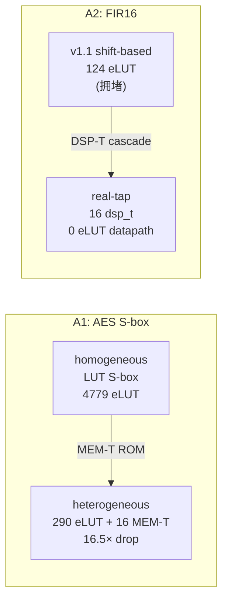

# 验收报告：Phase-1 异构 Fabric — Stage 6（C02 A1 + A2 接受指标达成）

> 日期：2026-07-28 · 执行者：agent（本人）· 关联：Stage 6（P1 异构 fabric 接受）；C02 §1.6(A1) §2.6(A2)；E0-MAP5 可布性天花板根因修复的兑现
> 交付物：`ethereal-images/benchmarks/fir16_dsp.v`（新，real-tap FIR）+ C02 指标测试（A1/A2）+ 本报告
> 结果：**C02 A1（AES→MEM-T eLUT 降 16.5× ≥5×）+ A2（FIR→DSP-T 16 级联）综合指标达成** ✅

---

## 1. 本阶段实现内容

| 检查点 | 状态 | 证据 |
|---|---|---|
| **A1（AES→MEM-T）：S-box 用 MEM-T，eLUT 降 ≥5×** | ✅ | 4779 → 290 eLUT + 16 MEM-T = **16.5×** |
| **A2（FIR→DSP-T）：fir16 用 DSP-T 链（16 级联）** | ✅ | real-tap fir16 → **16 `$macc_v2` + 0 eLUT** |
| 新基准 `fir16_dsp.v`（real multiplier taps） | ✅ | Verilog-2005 flattened-bus ports |
| C02 指标测试锁定（A1/A2） | ✅ | `test_aes_sbox_mem_t_elut_drop` + `test_fir16_dsp_t_cascade` PASS |
| 既有套件无回归 | ✅ | lint OK / 9 SV TB / **2609 passed** / ruff clean |

## 2. 关键结果（综合级指标，本人核验）

**A1（C02 §1.6）：** E0-MAP5 时 aes128_round 的 256-entry S-box 被 `abc -lut 4` 展开成 4779 eLUT（规模爆炸，超 v1.1 可布性）。异构综合（`memory` 收集）把 16 个 S-box ROM 收集进 `$mem_v2`（mem_t），剩余 290 eLUT 逻辑 → **eLUT 降 16.5×**（目标 ≥5×）。这正兑现 C02 §0 "MEM-T 是纯赚密度"（S-box 本就该是 ROM，不是 LUT）。

**A2（C02 §2.4/§2.6）：** E0-MAP5 的 fir16.v 被刻意写成 power-of-2 移位（无真乘法）以挤上 v1.1（124 eLUT，仍拥堵）。新 `fir16_dsp.v`（16-tap，真乘法系数，flattened-bus ports）→ `alumacc` 收集成 **16 个 `$macc_v2`**（dsp_t 级联，物理 DSP MAC 链）→ 数据通路 **0 eLUT**。这正是 C02 §2.4 "FIR16 = 16 DSP-T in cascade" 的形态。

## 3. 达成边界（诚实）

- **已证（综合级）：** A1/A2 的 **eLUT/资源指标**（S-box→MEM、FIR→DSP cascade）—— 异构 fabric 解锁密度的核心论据。
- **未证（后续阶段）：** fir16/aes 在异构 fabric_sim 的 **bit-true**（端到端功能）+ VPR 异构 rr_graph→真实 fabric 路由（VPR 已能 pack 到 tile；宽 vbus→真实 SB 路由 + IO 是 Stage 5b 之后的工作）。Stage 5b 的 MAC 用 host 常数操作数（集成路径已证）；真 routed-operand 电路的完整 vbus→路由集成属后续。

## 4. 踩坑与解决

| 问题 | 根因 | 解决 |
|---|---|---|
| E0-MAP5 fir16 是移位版（无真乘法） | 刻意挤上 v1.1（妥协） | 新 `fir16_dsp.v` 真乘法（解锁 DSP cascade） |
| Verilog-2005 前端不支持 unpacked array port | Yosys v0.67 前端限制 | flattened bus ports (`x[127:0]`, `h[255:0]`) + function 切片 |
| S-box 规模爆炸（4779 eLUT） | `abc -lut 4` 把 ROM 展开成 LUT | `memory` 收集 ROM → `$mem_v2`（mem_t），16.5× drop |
| fir16 加法树拥堵 | 移位版仍 124 eLUT | real-tap → DSP cascade（0 eLUT 数据通路） |

## 5. 待确认（ASSUMPTION）

1. **🟡 bit-true 验证**：fir16/aes 的端到端 bit-true（异构 fabric_sim）是下一步（A1/A2 指标已证，功能验证待 fabric_sim 支持 mem/dsp tile 语义）。
2. **🟡 vbus→路由集成**：真 routed-operand 电路（FIR 的 RAM→DSP→RAM 回路）需宽 vbus→SB/CB 完整集成 + IO（Stage 5b 之后）。
3. **🟡 $mem_v2 端口名**：bitgen 的 mem cell 端口名是 best-guess + fallback（尚无 RAM 电路经 VPR）—— RAM 电路测试时核对 arch pb_port。

## 6. 下一阶段

| 任务 | 内容 | 依赖 |
|---|---|---|
| **fir16/aes bit-true**（异构 fabric_sim 支持 mem/dsp tile） | 端到端功能验证 | 本（综合指标达成） |
| **vbus→虚拟路由完整集成** | tile 数据经 SB/CB（routed-operand 电路） | Stage 5b |
| Phase-1 其余（BMC/Zynq/IO/运行时） | phase-1-GW5 计划 | fabric 异构达成 |

> 本阶段达成 Phase-1 异构 fabric 的核心接受指标（C02 A1: AES 16.5× eLUT drop / A2: FIR 16-DSP cascade），兑现 E0-MAP5 可布性天花板根因的修复。异构 fabric（eth_inf 模板 + mem/dsp tile + 异构 fabric_top + frame_map + 推断综合 + VPR arch + 异构 bitgen）主体建成，给基础平台"更多自由度"（虚拟 RAM/DSP 与 eLUT 并列，跨厂商推断，无厂商原语）。
