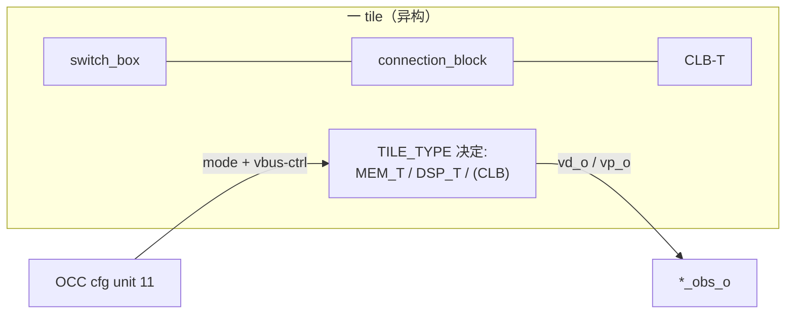

# 验收报告：Phase-1 异构 Fabric — Stage 3（异构 fabric_top）

> 日期：2026-07-28 · 执行者：agent（本人）· 关联：Stage 3（P1 异构 fabric）；前置 Stage 1+2（eth_inf + mem_t/dsp_t + review 修复）；C02 §0 §5（异构 tile 集成 + region）
> 交付物：`ethereal-fabric/rtl/interconnect/fabric_top.sv`（异构重写）+ `ethereal-fabric/tests/interconnect/tb_het_fabric.sv`
> 结果：**MEM_T + DSP_T 与 CLB_T 并列集成进 fabric_top，OCC 可配置、可观测、可计算** ✅

---

## 1. 本阶段实现内容

| 检查点 | 状态 | 证据 |
|---|---|---|
| `TILE_TYPE` 构建时 tile 类型图（0=CLB_T/1=MEM_T/2=DSP_T） | ✅ | fabric.yaml/fabric-gen 参数 |
| cfg **unit 2'b11 = TILE-MODE/vbus-ctrl**（每 tile 模式字 + vbus 控制寄存器） | ✅ | MEM_T intra 0/1/2；DSP_T intra 0..5 |
| mem_t/dsp_t 按 TILE_TYPE 实例化（generate） | ✅ | 异构 tile 与 CLB 并列 |
| `mem_vd_obs_o` / `dsp_vp_obs_o` 观测端口 | ✅ | 每 tile vd_o / vp_o 可观测 |
| **功能 TB `tb_het_fabric`**（2×2：MEM+DSP+2CLB） | ✅ | mem config+读写 CAFEBABE；dsp config+MULT 42；CLB toggle；互联完整 |
| 既有套件无回归（默认全 CLB fabric） | ✅ | lint OK / **9 SV TB** / 2591 model |

## 2. 关键设计

**异构集成（C02 §5）：** 每个 tile = switch_box + connection_block + **逻辑 tile**（默认 CLB-T；MEM_T/DSP_T 时多一个硬块 tile）。TILE_TYPE 是构建时（fabric.yaml → fabric-gen）参数，tile 的 **config 模式字 + 宽 vbus（mem va/vd/vwe、dsp va/vb/vcasc）经 cfg unit 2'b11 写入**（OCC 可配置），tile 输出经 `mem_vd_obs_o`/`dsp_vp_obs_o` 观测。

**vbus v1（明确边界）：** vbus 的 **config/观测已连通**（OCC 可写 tile 模式 + operand/RAM 控制，可读 tile 输出）——本阶段证明异构 tile 在真实 fabric_top 中"可坐、可配置、可计算、可观测"。**宽 vbus → 虚拟路由的完整集成（tile 数据经 SB/CB 与 CLB 通信）+ 映射链（Yosys/VPR 把 RAM/DSP 电路映射到 tile）= Stage 4-5**。

**cfg 布局（沿用 v1.1 + 扩展）：** `cfg_addr = {tile_idx, unit[1:0], intra[5:0]}`；unit 00=CLB / 01=SB / 10=CB / **11=TILE-MODE**。

## 3. 踩坑与解决（本人调试）

| 问题 | 根因 | 解决 |
|---|---|---|
| vbus-ctrl 位域打包错（vwe=1110 而非 1111） | TB 的位拼接字段错位 | 用移位表达式 `<<18/<<16` 明确打包 |
| dsp_obs=0（DSP 明明算对） | **dsp_obs 索引错**（tile1 在 [95:48] 非 [47:0]） | 按 tile 索引 `[i*48 +: 48]` 取 |
| dsp_obs=X | **reset-less mode_r/vcasc** 起始 X（review 修复让 config persist → reset-less）→ 输出 X | TB 显式写 mode + operands + **vcasc**（否则 c_r2 X）+ 等几拍清 X |
| lint UNUSEDPARAM MEM_AW | 默认全 CLB fabric 无 MEM tile → MEM_AW 未用 | `lint_off UNUSEDPARAM`（放置 MEM tile 时用） |
| lint tmode_cfg_we 未用（纯 CLB tile） | 无 het 实例时 unit 11 无操作 | g_no_het 分支消费之 |

> 再次印证本项目反复出现的 **reset-less 配置寄存器 X 传播** 教训：任何 reset-less 配置寄存器（mode_r / vcasc / sel_r / inj_*）在 iverilog 起始都是 X，TB 必须显式写齐或等清。

## 4. 待确认（ASSUMPTION）

1. **🟡 vbus→虚拟路由集成（Stage 4-5）**：本阶段 vbus 仅 config/观测。tile 数据经 SB/CB 与 CLB 通信（C02 §1.2/§2.2 的 CB 连接）+ Yosys DSP/RAM 推断 + VPR 异构 arch = Stage 4-5；届时需定 tile 宽 vbus 如何进 SB（vbus-mux 层，类似 input-CB 但宽）。
2. **🟡 ROM 初始化**：mem_t 的 ROM 内容（S-box）经 eth_inf_ram INIT_HEX（构建时）或 OCC rom.hex（部署时，C02 §1.4）；vbus-ctrl 的 vd_i 写口可用于部署期逐字写（本 TB 即此路径）。
3. **🟡 TILE_TYPE 布局**：本 TB 2×2 手工放置；正式布局由 fabric.yaml → fabric-gen 产出（interleaved columns，Xilinx/Intel column-per-N 风格，研究确认）。

## 5. 下一阶段

| 任务 | 内容 | 依赖 |
|---|---|---|
| **Stage 4** | frame_map + fabric_gen 每-tile-类型配置点（spec-first，C02 模式字进帧）+ fabric.yaml TILE_TYPE 声明 | 本（fabric_top 就绪） |
| Stage 5 | **vbus→虚拟路由集成**（tile 数据经 SB/CB）+ Yosys DSP/RAM 推断进 synth + VPR 异构 arch | Stage 4 |
| Stage 6 | **fir16 on DSP-T 链**（C02 §2.6 吞吐 ≥10×）+ **aes on MEM-T**（S-box ROM）→ 接受基准 | Stage 5 |

> 本阶段把 MEM_T/DSP_T 织入 fabric_top（OCC 可配置/可观测/可计算），打通 Phase-1 异构 fabric 的结构集成。下一步把它们纳入 frame_map/fabric_gen + 虚拟路由 + 映射链，解锁 AES/FIR。
