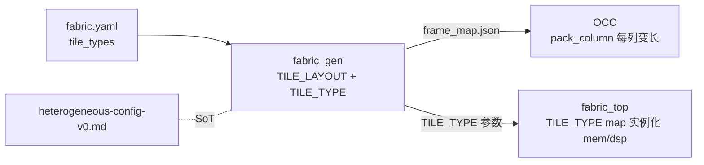

# 验收报告：Phase-1 异构 Fabric — Stage 4（frame_map + fabric_gen 异构 + spec）

> 日期：2026-07-28 · 执行者：agent（本人；frame_map/fabric_gen 精度关键自写）· 关联：Stage 4（P1 异构 fabric）；前置 Stage 3（异构 fabric_top）；C02 §1.3 §2.3 §5；C03 §1（帧=列，长度字段）
> 交付物：`frame_map.py`（+mem/dsp tile types + TILE_LAYOUT）+ `fabric_gen.py`（+tile_types→TILE_TYPE）+ `fabric_2x2_het.yaml` + spec `heterogeneous-config-v0.md`

---

## 1. 本阶段实现内容

| 检查点 | 状态 | 证据 |
|---|---|---|
| `mem_tile_type`（C02 §1.3 冻结接口） | ✅ | mode 16 + vbus_ctrl 22 + vd_i 32 = 70b |
| `dsp_tile_type`（C02 §2.3 冻结接口） | ✅ | mode 24 + va 27 + vb 18 + ven 1 + vcasc 48 = 118b |
| `TILE_LAYOUT` + layout-aware pack/unpack/blank（每列变长） | ✅ | `pack_column`/`unpack_column`/`blank_column` |
| `fabric_gen` `tile_types` → TILE_TYPE（fabric_top 参数） | ✅ | idx=r*C+c row-major，8-bit entries |
| 参考 descriptor `fabric_2x2_het.yaml` → TILE_TYPE=0x201 | ✅ | 与 fabric_top 约定一致（tile0=MEM@idx0, tile1=DSP@idx1） |
| spec `heterogeneous-config-v0.md`（spec-first） | ✅ | 冻结配置点 + 几何 + fabric.yaml + 布局指导 |
| 既有套件无回归（同构 bitgen_pack 路径） | ✅ | lint OK / 9 SV TB / **2598 passed**（+7 异构测试） |

## 2. 关键设计

**每 tile = base(CB 108 + SB 120) + 逻辑 tile（按 TILE_TYPE）** —— CB/SB 互联配置点对所有 tile 类型一致，只有逻辑 tile 不同（C02 §5）。

**帧几何（C03 §1 每列变长）：** 帧 = 一列 tile 配置位 + CRC16。异构后**列宽按该列 tile 混合而变**（OCC 写引擎用 `column_data_words(col)`，对应 C03 §1 "帧头长度字段"）。例 2×2（`fabric_2x2_het.yaml`）：col0=846 bit（27 字）, col1=894 bit（28 字）。

**fabric.yaml 声明：** `tile_types: [[col][row] -> "clb_t"|"mem_t"|"dsp_t"]`；`fabric_gen` 映射为 `fabric_top` 的 `TILE_TYPE` 参数（8-bit entries LSB-first, idx=r*C+c）。

## 3. 验证（本人）

- **同构回归**：321 frame_map/fabric_gen 测试全过（bitgen_pack 全 CLB 路径不变）。
- **异构 round-trip**：col0（MEM+CLB）、col1（CLB+DSP）pack→unpack 逐位一致（mem_vd_i=CAFEBABE, dsp_vcasc=ABCDEF 等）；blank_column 全 0。
- **几何**：col0=846 bit, col1=894 bit（逐点求和核对）；layout shape 校验（错维度 raise）。
- **fabric_gen**：TILE_TYPE=0x201（与 fabric_top 的 idx=r*C+c 约定一致）；heterogeneous manifest + frame_map.json 含 tile_layout/logic_points/per_column_data_words。
- **全套**：lint OK / 9 SV TB / **2598 passed**。

## 4. 待确认（ASSUMPTION）

1. **🟡 vbus→虚拟路由集成（Stage 5）**：本阶段 frame_map 涵盖 tile 配置点（含 vbus-ctrl 操作数）；tile **数据**经 SB/CB 与 CLB 通信的虚拟路由 + 映射链 = Stage 5。
2. **🟡 mem_mode 几何（RAM/ROM/FIFO/双口）**：v0 mem_t 仅基础 RAM；`mem_mode`[2:0] 几何保留（C02 §1.3）—— 完整模式 Stage 6/后续。
3. **🟡 DSP-T cascade 链**：fir16 = 16 DSP-T 级联（C02 §2.4）—— vbus-ctrl 的 vcasc_i 已入帧；链式连接 + 映射 = Stage 5/6。
4. **🟢 同构路径不动**：`pack`/`unpack`（全 CLB）保持原样，bitgen_pack（incr 3/4e）不受影响。

## 5. 下一阶段

| 任务 | 内容 | 依赖 |
|---|---|---|
| **Stage 5** | vbus→虚拟路由集成（tile 数据经 SB/CB）+ Yosys DSP/RAM 推断进 synth + VPR 异构 arch | 本（frame_map/fabric_gen 就绪） |
| Stage 6 | **fir16 on DSP-T 链**（C02 §2.6 ≥10×）+ **aes on MEM-T**（S-box ROM）→ 接受基准 | Stage 5 |

> 本阶段把异构 tile 配置点纳入 frame_map/fabric_gen（SoT）+ 冻结 spec，完成 Phase-1 异构 fabric 的软件侧。下一步 vbus→虚拟路由 + 映射链，解锁 AES/FIR。
