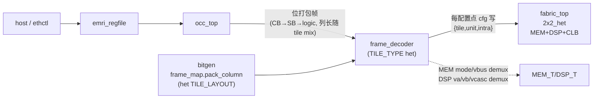

# 报告：P1 异构 packed capstone — frame_decoder MEM/DSP 解复用 → 异构 fabric

> 任务：异构 bit-packed capstone（继 frame_decoder，补齐 MEM/DSP 生产路径）
> 日期：2026-07-30 · 提交：见本报告提交（继 6f903b3 frame decoder）
> Plan-Ref：`ethereal-spec/fabric/heterogeneous-config-v0.md §2/§3`、`C02 §1.3`、`fabric_2x2_het.yaml`

## 本阶段实现内容

### ✅ 异构帧生成（`pack_tb_frames.py --het`）
- 新增 `build_het` + `_main_het`：按 `fabric_2x2_het.yaml` 的 TILE_LAYOUT（col0=[MEM(row0),CLB(row1)], col1=[DSP(row0),CLB(row1)]）用 `frame_map.pack_column` 打包 het 帧，输出到**独立目录** `generated/tb_frames_het/`（all-CLB 路径 `generated/tb_frames/` 不受影响）。
- 帧内容：col0 image A = MEM 解复用探针（mem_mode=0x0001 / mem_vbus_ctrl(va=5,ven=1) / mem_vd_i）+ CLB tile(idx2) TFF；col0 image B = CLB const1；col1 = DSP 解复用探针（mode/va/vb/ven/vcasc）。col0=27 字，col1=28 字（异构列长不同，frame_map SoT）。
- manifest.json 记录期望解码检查点（mem_mode/vbus_ctrl/vd_i @ tile0 unit3；clb_elut0 @ tile2 unit0）。
- **ruff-clean**。

### ✅ 异构 capstone TB（`ethereal-fabric/tests/emri/shell_tb_het_packed.sv`）
- 实例化**真实** `emri_regfile + occ_top + frame_decoder(TILE_TYPE het) + fabric_top(TILE_TYPE het)`（2×2_het）。
- 经管理面部署 het bit-packed image A → **CLB tile(idx2, clb_out_obs[16]) TFF 翻转** → BLANK+部署 image B → **恒定 1**。
- **MEM 解复用 backdoor 探针**：`g_row[0].g_col[0].g_mem_t.u_mem_t.mode_r==0x0001`、`mem_va_r==5`、`mem_ven_r==1` —— 证明复合点（mem_vbus_ctrl 22b → va[13:0]/ven[16]/vwe[21:18]）解复用正确。

## 关键集成修复

- **fabric_top 生成层级**：`g_row[r].g_col[c].g_mem_t`（非 `g_mem_t[idx]`）——backdoor 探针路径需按嵌套 generate 层级写。初版写错 → iverilog `Unable to bind`；对照 fabric_top 的 `genvar r,c / g_row / g_col` 结构修正。
- **CLB tile 索引**：het col0 的 CLB 在 (row1,col0)，row-major idx = 1*2+0 = **2**（非直觉的 1）。clb_out_obs[16] = tile2 eLUT0。对照 `MY_IDX = r*C+c` 确认。

## 验证结果

| 检查 | 结果 |
|---|---|
| `make lint` | OK（全部 RTL lint-clean） |
| `make test-sv` | **16 SV TB 全过**（15 + shell_tb_het_packed） |
| `pytest` | **2639 passed, 3 xfailed**（无回归） |
| `ruff` | pack_tb_frames.py clean |

## 架构图（异构 packed 路径）

## 下一阶段需要做的内容

- **DSP capstone 列**：当前 col1 DSP 帧已生成但未在 capstone 验证（DSP MAC 功能 + vcasc 级联解复用）——可扩展 shell_tb_het_packed 增加 col1 部署断言。
- **R_OCC_DECODE 硬件触发（v0.1）**：regfile 暴露 dec_start_o，packed 部署自包含。
- **CRC16 tail 校验**：decoder 端 frame_map.crc16 复算（v0 跳过，OCC CRC32 覆盖传输）。
- **多列 region 部署**：OCC 按 region+col 寻址，逐列部署（decoder col_i 已支持）。
- **E1-BMC1 BMC SoC（NEORV32）**：G6 — 仿真路径待维护者确认（VHDL）。
