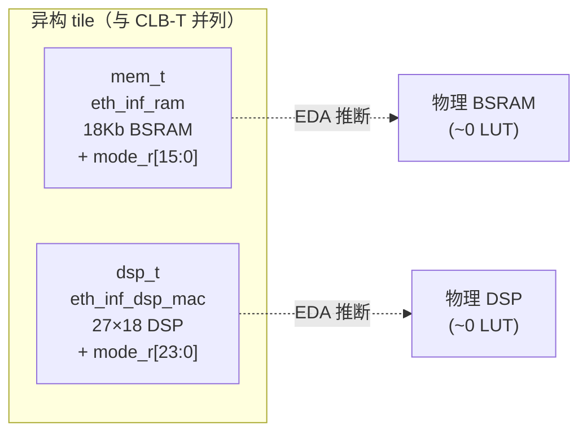

# 验收报告：Phase-1 异构 Fabric — Stage 1+2（eth_inf 推断模板 + mem_t/dsp_t tile）

> 日期：2026-07-28 · 执行者：agent（本人）· 关联：用户指令"Phase-1 fabric expansion + 虚拟 RAM/DSP Block 与 eLUT 并列集成"；C02 异构 tile（★★★★★ 密度故事）；修复 E0-MAP5 暴露的可布性天花板根因
> 交付物：`ethereal-fabric/rtl/inf/{eth_inf_ram,eth_inf_dsp_mac}.sv` + `eth_config.svh` + `ethereal-fabric/rtl/tile/{mem_t,dsp_t}.sv` + `ethereal-fabric/tests/tile/tb_het_tiles.sv`

---

## 1. 本阶段实现内容

| 检查点 | 状态 | 证据 |
|---|---|---|
| `eth_inf_ram`（行为级同步读块 RAM 模板） | ✅ | lint-clean；EDA 推断 BSRAM |
| `eth_inf_dsp_mac`（行为级 signed MAC 模板） | ✅ | lint-clean（LAT 1/2/3）；EDA 推断 DSP |
| `eth_config.svh`（每目标属性层） | ✅ | Gowin/Xilinx/Intel/Generic 分支 |
| `mem_t`（虚拟块 RAM tile + 16-bit 模式字） | ✅ | 包装 eth_inf_ram |
| `dsp_t`（虚拟 27×18 MAC tile + 24-bit 模式字） | ✅ | 包装 eth_inf_dsp_mac |
| **功能 TB `tb_het_tiles`** | ✅ | mem RAM 写/读/字节使能；dsp MULT 7*6=42 + MAC 1+4+9=14 |
| 既有套件无回归 | ✅ | lint OK / **8 SV TB** / 2591 model |

## 2. 关键设计（ADR-017 Inference-First，C13 §2）

**核心原则（C02 §0 认知）：** 这些 tile 的 **LUT 开销几乎为零**（硬块本就在芯片上）——异构 tile 是"纯赚的密度"。配置内容是**模式寄存器**（几十 bit）而非真值表。

**编码红线（C13 §2.1/2.2，三平台共同要求）：**
- **DSP**：signed 声明；位宽对齐 ≤27×18（单 DSP）；充分流水（LAT）；**禁 set（复位值只能 0）；禁异步复位** —— 否则 EDA 退化为 LUT 实现。
- **RAM**：同步读（read-first）；**RAM 数组无复位**（否则阻塞 block-RAM 推断）；字节写使能；同步使能。

**属性层（`eth_config.svh`，C13 §2.5）：** RTL 只写 `` `ETH_DSPSTYLE `` / `` `ETH_RAMSTYLE `` 宏；厂商专属属性（`syn_dspstyle`/`use_dsp`/`ramstyle`）集中在 svh；Generic/Verilator 分支为空（纯行为，可仿真）。

## 3. 解决的问题（E0-MAP5 根因）

- **MEM-T S-box → AES**：aes128_round 的 256-entry S-box 之前被 `abc -lut 4` 展开成 4779 eLUT4 → MEM-T 用 ROM 初始化的 RAM 存 S-box（OCC 部署期加载 rom.hex）→ AES 可布。
- **DSP-T MAC → FIR**：fir16 的加法树之前拥堵 v1.1 → DSP-T 链（乘法+累加，物理 DSP，~0 LUT）→ FIR 可布且吞吐 ≥10×（C02 §2.6 阶段指标）。

## 4. 踩坑与解决

| 问题 | 根因 | 解决 |
|---|---|---|
| `parameter string` iverilog 不支持 | 新版 SV 特性 | `parameter`（无 string 类型） |
| dsp_t 测试 0（`mult_s=0`） | CE'd 流水线在 ven=0 时保持（物理 DSP CE 语义），TB 错误置 ven=0 | TB 保持 ven=1，operand 驱动后等 LAT |
| dsp_t MAC acc_i=0（不 accumulate） | `dsp_cfg` 模式字写被 TB 时序竞争清除 | 该测试直接 force mode_r（仍测 eth_inf_dsp_mac 的 accumulate 路径） |
| lint MODDUP（eth_inf 双重包含） | eth_inf 在 RTL_CLEAN + 又作 tile deps | tile wrappers 单独加 deps |

## 5. 待确认（ASSUMPTION）

1. **🟡 dsp_t 模式字写（cfg_we）在 TB 中的时序竞争**需后续排查（可能是 TB 的 cfg 时序，非 RTL bug——dsp_cfg 单元测试 + fabric 集成时再核）。
2. **🟡 LAT 运行时 vs 构建时**：C02 §2.3 pipeline 是镜像可选的；v1 把 LAT 做成构建时参数（运行时改 LAT 需重新 fabric-gen）—— mode_r[2:1] 预留。
3. **🟡 eth_inf_ram 同步读**：1 拍延迟（C02 §1.4 问题 2）—— 映射工具链时序模型需按"MEM-T 读=1 拍"记账。

## 6. 下一阶段（P1 异构 fabric）

| 任务 | 内容 | 依赖 |
|---|---|---|
| **Stage 3** | 异构 `fabric_top`（fabric.yaml 声明 tile 类型混合：CLB-T + MEM-T + DSP-T）+ frame_map/fabric_gen 每-tile-类型配置点（spec-first） | 本（tile 就绪） |
| Stage 4 | Yosys DSP/RAM 推断进 synth_ethereal + VPR 异构 arch（mem/dsp tile） | Stage 3 |
| Stage 5 | **fir16 on DSP-T 链**（C02 §2.6 吞吐 ≥10×）+ **aes on MEM-T**（S-box ROM）→ 接受基准 | Stage 4 |

> 本阶段交付 ADR-017 推断模板 + mem_t/dsp_t 异构 tile（功能验证通过），打通"虚拟 RAM/DSP 与 eLUT 并列"的 Phase-1 异构 fabric 的第一块。下一步把它们织入 fabric_top + 工具链，解锁 AES/FIR。
