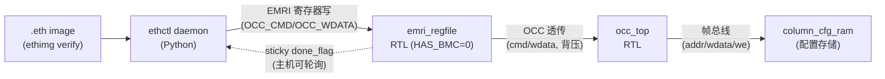

# 报告：P1 管理面最小闭环 — EMRI / ethimg / ethctl / sim loop (mFSM v0)

> 任务：E1-BMC4 (EMRI) + E1-RUN1 (ethimg) + E1-RUN2/3 (daemon/ethctl) 的**仿真可完成子集**
> 日期：2026-07-29 · 提交：5bae9b5 / 75fd193 / a38a48f + 本报告提交
> Plan-Ref：`ethereal-spec/control/emri-v0.md`、`S05`、`S08`、`S09`、`C05`、ADR-013/014/015

## 本阶段实现内容

### ✅ EMRI 统一管理寄存器 ABI（spec-first）
- `ethereal-spec/control/emri-v0.md`：冻结 v0 寄存器图（MAGIC/CAPS/PLATFORM/REGION_INFO/OCC_*/SESSION_*/HEALTH/MON）、OCC_CMD 透传编码、OCC_STATUS（含 sticky done_flag/done_code）、EFP-SPI 7 字节帧格式、BMC vs mFSM 行为差异表。G6 三项已决（EFP-SPI 固定帧 / OCC_CMD 透传 / 主机侧验签）。

### ✅ EMRI 寄存器块 RTL（`ethereal-shell/rtl/emri/`）
- `emri_pkg.sv`（常量单一事实源）+ `emri_regfile.sv`（mFSM 模式，`HAS_BMC=0`）：身份读、RW 配置、OCC 命令/数据透传（含背压）、**sticky 完成锁存**（解决 OCC `DONE` 单周期脉冲主机不可见的关键正确性问题）、REGION_INFO 窗口。
- `tb_emri_regfile.sv`：身份/RW/OCC 透传（含背压注入）/reserved 读 0，全过。
- **lint-clean**（`-Wall`，spec-ABI 常量用文档化 `UNUSEDPARAM` 豁免）。

### ⚠️→✅ mFSM v0 范围（G6 决策）
- v0 mFSM = EMRI regfile（`HAS_BMC=0`，寄存器式、无 CPU、主机直驱 OCC）——满足 ADR-014。
- **设备侧 rx_buf + 5 态 FSM（C05 §4.2）延后到 v0.1**（需 OCC 仲裁，是延迟优化 + BMC-ready 结构，非正确性必需）。spec §1 已记录该范围。

### ✅ ethimg（S09 / E1-RUN1）
- `ethereal-tools/tools/ethimg.py` + `test_ethimg.py`：`.eth` v0.1（tar：manifest + interface/capabilities/resources/health.yaml + targets/*.frames）。SHA-256 逐成员完整性 + **可选 Ed25519 签名**（PyCA cryptography）。`pack/unpack/verify/info/keygen` CLI。
- M-S09-1 验收：篡改任意成员字节→`IntegrityError`；未声明成员→拒绝；签名错误密钥→`SignatureError`；**15 测试全过**。

### ✅ ethctl + daemon（S08 / E1-RUN2/3）
- `ethereal-tools/tools/ethctl.py` + `emri_constants.py`（Python 镜像 `emri_pkg.sv`，**Py↔SV 常量交叉校验测试**防 ABI 漂移）+ `test_ethctl.py`。
- `Daemon`（mFSM 部署编排：验签→BLANK→WRITE 帧流→READBACK，sticky 状态轮询）、`PythonEmriModel`（薄功能模型，RTL 为权威）、`RecordTransport`（生成 deploy-plan JSON 供 SV TB 回放）、CLI（run/inspect/ps）。**11 测试全过**。

### ✅ 仿真最小闭环 capstone TB（`tb_emri_occ_loop.sv`）
- 实例化**真实** `emri_regfile` + `occ_top` + `column_cfg_ram`，主机经 EMRI 端口驱动完整部署+校验循环（BLANK→WRITE 12 帧→READBACK CRC 通过→backdoor 校验 RAM→篡改→CRC 报错）。**证明 host→EMRI→OCC→配置存储 全链真实 RTL**。

### ✅ 管理面→真实 fabric 热替换 capstone TB（`tb_mgmt_hotswap.sv`）★Phase-1 最小闭环里程碑
- 实例化**真实** `emri_regfile` + `occ_top` + `fabric_top`（2×2 all-CLB），OCC 帧总线**直连** fabric_top 的 cfg 端口（v0 帧格式 = cfg-addr-addressed：每 32-bit 帧字 = 一个配置寄存器，cfg_addr = frame_base + 字序号；OCC 已自增 fbus_addr，**无需位级解包 decoder**）。
- 经管理面部署 image A（TFF：clb_out[0] 翻转 1→0→1→0…）→ 运行观测翻转 → **BLANK（FABulous 红线）+ 部署 image B（const1）** → 运行观测恒定 1。**证明 host→EMRI→OCC→fabric_top 端到端运行时重构（热替换）**——Phase-1 最小闭环达成。
- 帧格式说明：v0 用 cfg-addr-addressed（非生产位打包 frame_map 格式）；生产位打包格式 + 列控制器 decoder 为文档化后续（密度优化，非正确性必需）。

## 验证结果

| 检查 | 结果 |
|---|---|
| `make lint` | OK（全部 RTL lint-clean） |
| `make test-sv` | **13 SV TB 全过**（含新增 `tb_emri_regfile`、`tb_emri_occ_loop`、`tb_mgmt_hotswap`） |
| `pytest` | **2639 passed, 3 xfailed**（含 ethimg 15 + ethctl 11，含 Py↔SV 常量交叉校验） |
| `ruff` | ethimg/ethctl/emri_constants 全 clean |

## 关键正确性修复（proactive hardening）

- **OCC `DONE` 单周期脉冲不可观测**：主机 SPI 轮询在 ms 级，永远看不到 1 周期 `DONE`。regfile 增加 sticky `done_flag`/`done_code`（OCC_STATUS[3]/[5:4]），spec §4 同步更新。**这是会隐藏到上板才暴露的真 bug**——在仿真闭环阶段捕获并修复。
- **`OCC_CMD_START` Py↔SV 表示漂移**：SV 为位索引（8），Python 初版误为掩码（1<<8）。交叉校验测试捕获并统一为索引 + `(1 << OCC_CMD_START)` 构掩码。
- **manifest_digest 自引用**：digest 必须剥离 `signature` **和** `manifest_digest` 自身，否则 verify 永远失败。

## 架构图（EMRI mFSM v0 仿真闭环）

## 下一阶段需要做的内容

- **E1-BMC1 BMC SoC（NEORV32）**：`bmc_core` wrapper + ROM/RAM + UART + EBI 桥；本机为 VHDL（OSS-CAD 的 iverilog/Verilator 不可仿），需 GHDL/Verilator-co-sim 流或 RISC-V 桩核——**G6：需与维护者确认仿真路径**。
- **生产位打包帧格式 + 列控制器 decoder**：当前 v0 用 cfg-addr-addressed 帧格式（每字一配置点，直连 fabric cfg）；生产用 frame_map 位打包格式（更密，需 decoder 解包），密度优化、非正确性必需。
- **mFSM v0.1**：设备侧 rx_buf + 5 态 FSM（C05 §4.2），吸收 SPI 往返延迟。
- **E1-IO1/2/3/4、E1-PLT1/2/4、E1-DMO1/2/3**：硬件路径（Gowin EDA / 实板），维护者执行。
- **CI 上板（S14-P1#1）**：self-hosted runner，nightly 上板回归。
