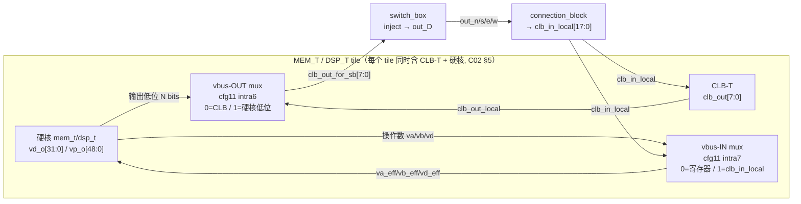

# 验收报告：Phase-1 异构 Fabric — vbus→虚拟路由集成（Stage 5b+）

> 日期：2026-07-29 · 执行者：agent（本人） · 关联：C02 §1.2 §2.2（异构 tile vbus）；Stage 5b+（routed-operand 电路的可路由性）
> 交付物：`ethereal-fabric/rtl/interconnect/fabric_top.sv`（vbus-OUT/IN mux）+ `ethereal-fabric/tests/interconnect/tb_vbus_route.sv`（新，端到端）+ `tb_het_fabric.sv`（默认配置补写）+ `Makefile`（test-sv 增项）
> 结果：**异构 tile 宽 datapath 与虚拟路由（SB inject + CB）双向打通** ✅ —— tile 输出可达路由、路由可达 tile 操作数；自检 TB 通过。

---

## 1. 本阶段实现内容

| 检查点 | 状态 | 证据 |
|---|---|---|
| **vbus-OUT**：硬核输出低位 → SB inject（替代/叠加 CLB 注入） | ✅ | `clb_out_for_sb` mux（cfg unit 11 intra 6） |
| **vbus-IN**：CB 选中 track → 硬核操作数低位（替代 vbus-ctrl 寄存器） | ✅ | `*_eff` 操作数 mux（cfg unit 11 intra 7） |
| 同构全-CLB 路径不变（vbus mux 在 CLB tile 上 inert） | ✅ | `g_no_het` 直通 `clb_out_for_sb = clb_out_local` |
| 端到端 TB：tile→路由→CLB + CLB→路由→tile 操作数 | ✅ | `tb_vbus_route.sv` TEST A + TEST B + sanity PASS |
| lint / test-sv / pytest 无回归 | ✅ | lint OK / **10 SV TB PASS** / **2613 passed** |

## 2. RTL 结构（vbus-out / vbus-in 两条路径）



**vbus-OUT（tile→路由）**：新增每-tile 线网 `clb_out_for_sb[N-1:0]`，送入 `switch_box.clb_out_i`（原来直接接 `clb_out_local`）。在 `g_mem_t`/`g_dsp_t` 内：
`clb_out_for_sb = vbus_out_sel_r ? {mem_vd_o_local / dsp_vp_o_local 低 N 位} : clb_out_local`。
`vbus_out_sel_r` 由 cfg unit 11 intra 6（bit0）写入。选 1 时硬核输出低位 **替代** CLB 注入到 SB tracks（仍走既有的 `inj_en/inj_dir` 机制）；纯-CLB tile 直通 `clb_out_local`（v1.1 行为不变）。

**vbus-IN（路由→tile）**：在 `g_mem_t`/`g_dsp_t` 内为操作数加 `*_eff` mux：
- MEM：`va_eff = sel ? {va_r[13:8], clb_in_local[7:0]} : va_r`；`vd_eff = sel ? {vd_r[31:8], clb_in_local[7:0]} : vd_r`（ven/vwe 仍来自寄存器，属控制非操作数）。
- DSP：`va_eff = sel ? {va_r[26:8], clb_in_local[7:0]} : va_r`；`vb_eff = sel ? {vb_r[17:8], clb_in_local[7:0]} : vb_r`（ven/vcasc 仍来自寄存器）。
`vbus_in_sel_r` 由 cfg unit 11 intra 7（bit0）写入。选 1 时 **CB 选中的本地 track（clb_in_local 低位）驱动操作数低位**，高位仍由 vbus-ctrl 寄存器提供（host 设高位/符号位）。

> 两个 mux 的 select 寄存器沿用本仓库 config 寄存器惯例（**无复位**，OCC 先配置后运行，同 SB/CB `sel_r`、tile `mode_r`）。因此 `tb_het_fabric.sv`（OCC 替身）补写了 intra 6/7=0 的默认值，确立"CLB 注入 + 寄存器操作数"的当前行为。

## 3. 测试：`tb_vbus_route.sv`（端到端证明）

1×2 fabric（tile0=MEM_T + 自带 CLB，tile1=CLB）。MEM_T tile 自带 CLB-T（C02 §5），两条环路都在 **tile0 自身**闭合（无需邻居跳）。

- **TEST A — vbus-OUT（tile 输出→路由→CLB）**：MEM@tile0 读 mem[5]=0xCAFEBABE（`vd_o[3:0]=1110`）；`vbus_out_sel=1` 把 `vd_o[3:0]` 经 SB inject（out_e[3:0]）→ 同 tile CB → `clb_in[3:0]`；4 个 eLUT 接成缓冲（`clb_out[k]=clb_in[k]`）。**断言 `clb_obs[3:0] == vd_o[3:0] == 4'b1110`** —— 4 个比特各自独立穿过 SB inject + CB。✅
- **TEST B — vbus-IN（CLB→路由→tile 操作数）**：tile0 CLB 用 eLUT 虚拟 FF（复位保持）输出常量 `clb_out[7:0]=8'b00000101`（=5）；`vbus_out_sel=0`（CLB 注入）→ out_e[0..7] → CB → `clb_in[7:0]=5`；`vbus_in_sel=1` 把 `clb_in[7:0]` 接到 `va_i[7:0]`（寄存器 `va_r` 同时被强制为 0）。**断言 MEM 读出 `0xCAFEBABE`（addr 5），而非 addr 0** —— 证明地址确实来自路由。✅
- **Sanity**：`vbus_in_sel` 回 0（寄存器 `va_r=0`）→ 读 `0x00000000`（addr 0），反向印证地址来自路由而非寄存器。✅

## 4. 带宽限制（诚实边界）

| 维度 | W=12（当前冻结） | 全宽需要 |
|---|---|---|
| 每 direction 每 cycle 可注入/可回送的操作数位 | **N=8 位** | mem 32 位 → **W≥32**；dsp 48 位 → **W≥48** |
| FIR16（16-DSP 级联，48-bit 积）完整路由 | 仅低 8 位流经 vbus | **W≥48**（与 Stage 5a VPR 以 W=48 路由 MAC 电路一致） |

设计为 **bandwidth-limited vbus**：低 N 位经虚拟路由，高位由 host 经 vbus-ctrl 寄存器设。这与 VPR 在 W=48 才布通 MAC 的现实吻合；本次集成证明"路径存在 + 可配置"，全宽属后续（W 提升或宽 vbus-out/in mux）。

## 5. 踩坑与解决

| 问题 | 根因 | 解决 |
|---|---|---|
| 新 TB/旧 TB 启动即全 X | vbus select 寄存器无复位（同 SB/CB），未写时为 X，ternary 以 X 为条件 → 操作数/注入源全 X | TB（OCC 替身）显式写 intra 6/7=0；属 OCC 契约（所有 config 先配置） |
| MEM 预载 mem[0] 被 mem[5] 覆盖 | 改 vd_i 时 vwe 仍=F、va 仍=旧地址 → 旧地址被瞬态写 | 安全写序列：改 vd_i/地址前先 vwe=0 |
| CLB 缓冲 eLUT 输出 X | **LUT4 被全部 4 输入索引**，任一输入位 X → 读出 X（即使 tt 只依赖 i0） | 把缓冲 eLUT 的 4 个输入都接到 `clb_in[k]`（索引全定义）；常量改用 eLUT 虚拟 FF 复位保持（ff_en=1, ff_rst_en=1, hold rst_ni=0），绕开组合反馈环里的 X |
| vbus-IN 时 va_i 高位 X | clb_in[4..7] 指到未配置的 SB Wilton 输出（sel_r=X） | 全 8 位常量注入 + clb_in[0..7] 全部取自 inject track（不依赖未配置 track） |

## 6. 待确认（ASSUMPTION）

1. **🟡 宽 vbus（W≥48）**：本次仅证 N=8 位路径；全宽 routed-operand（FIR 的 RAM→DSP→RAM 回路）需提升 W 或加宽 vbus-out/in mux —— 后续 Stage。
2. **🟡 异构 rr_graph**：这是"路径存在 + 可配置"的架构探索，**非** VPR 异构 rr_graph 的完整布线；真 FIR/aes bit-true 仍待 fabric_sim 支持 mem/dsp tile 语义 + VPR 异构布线。
3. **🟡 OCC 默认值**：vbus select 寄存器无复位 —— OCC 必须为每个异构 tile 写 intra 6/7（默认 0）。frame_map/blank 流程需含这两点（后续核对）。

## 7. 验证结果（本人核验，OSS-CAD 本地）

```
make lint      → [lint] OK - all project RTL lint-clean.   (fabric_top 含 vbus 改动)
make test-sv   → 10 SV TB PASS（含新 tb_vbus_route；tb_het_fabric 补默认配置后仍 PASS）
pytest         → 2613 passed, 3 xfailed（ethereal-fabric/tests + ethereal-tools，无回归）
ruff           → 未改 Python（仅 RTL/Makefile/TB）；既有 .py 的 87 个告警与本任务无关
```

## 8. 下一阶段需要做的内容

| 任务 | 一句话 | 依赖 |
|---|---|---|
| 宽 vbus（W≥48）/ 宽 vbus-out/in mux | 让 FIR 的 48-bit 积完整路由（当前仅低 8 位） | 本（路径已通） |
| 异构 rr_graph + VPR 布线 | 把 vbus 路径写进 VPR arch，让 Yosys/VPR 真正布通 routed-operand 电路 | 本 + E0-MAP2 arch |
| fir16/aes bit-true（异构 fabric_sim） | mem/dsp tile 语义进 fabric_sim，端到端功能验证 | 本 + fabric_sim |
| frame_map/blank 含 intra 6/7 | OCC 默认为每个异构 tile 写 vbus select=0 | 本（cfg 契约） |

> 本阶段把异构 tile 的宽 datapath **双向**接入虚拟路由（vbus-OUT 硬核输出→SB inject；vbus-IN CB track→操作数），用自检 TB 证明 tile↔路由↔CLB 闭环。带宽限于 W=12→8 位/方向（全宽需 W≥48），同构路径不变。这兑现 Stage 5b+ 的 routed-operand 可路由性探索，为后续宽 vbus + 异构 rr_graph 铺路。
