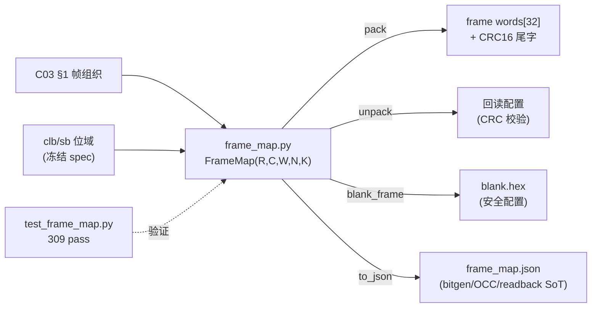

# 验收报告：S02-P0#1 — 帧映射生成脚本（frame_map）

> 日期：2026-07-24 · 执行者：agent · 关联计划：`ethereal-plan/phases/phase-0-基础设施与仿真验证.md §1`（任务 9）· 组件设计：`ethereal-plan/components/C03-OCC组件.md §1`
> 工具：`ethereal-tools/tools/frame_map.py` · 测试：`ethereal-tools/tools/test_frame_map.py`

---

## 1. 本阶段实现内容

| 检查点（phase-0 §1 / C03 §1） | 状态 | 证据 |
|---|---|---|
| frame_map 生成脚本（pack/unpack/blank/json + CRC16） | ✅ | `frame_map.py`；`py_compile` 通过 |
| 帧组织符合 C03 §1（frame=一列 tile 配置位；addr={region[3:0],col[7:0]}；CRC16 尾字；blank=显式安全配置） | ✅ | `FrameMap` 类；`to_json()` 输出 frame_map.json |
| 每瓦片位域与冻结 spec 对齐（CLB 8×20+32×5=320；SB 4×12×2=96；tile=416） | ✅ | `clb_tile_type`/`sb_tile_type`；test_bitfield_widths |
| **抽检回读一致（readback consistent）** | ✅ | 300 组随机 col_config → pack → unpack 完全一致；CRC 自洽 |
| CRC 篡改检出（数据字 + 尾字） | ✅ | test_crc_tamper_data/tail_detected；flip 1 bit → ValueError |
| blank 帧（全零安全配置） | ✅ | test_blank_is_all_zero_and_roundtrips + CRC 一致 |
| 产物 frame_map.json + blank.hex 可生成 | ✅ | 生成至 `generated/`（gitignored）：column=1664bit、53 字/帧（52 数据+CRC） |

## 2. 验证结果

**本地可验（已通过）**：`make test-model` → **2185 passed**（fabric 模型 1876 + frame_map 309）。
- 几何：4×4 → column_bits=4×416=1664、data_words=52、words_per_frame=53。
- 回读：300 随机配置 round-trip bit-true；pack 长度恒定。
- CRC：数据字任一 bit 翻转、或尾字篡改 → 均检出（ValueError "CRC mismatch"）；长度不符拒绝。
- blank：所有配置点=0（tt=0、mux sel=0=disconnect）→ 电气静默；CRC=0x60（52 零字）。
- JSON：可序列化、字段齐全（version/params/tile_points/frame_addr_format/crc）。

**关键设计对齐（C03 §1）**
- frame = **一列 tile 的全部配置位**（不是单 tile）；frame_addr = region<<8 | col。
- 尾字 CRC-16/CCITT-FALSE（poly 0x1021, init 0xFFFF）做帧级自检——错误定位到列。
- blank 是**显式安全配置**（全 0 + mux 断连 + IO oe=0），由 fabric-gen 产出 blank.hex（本工具 `blank_frame()`）。
- 位序：低位/低字先发（C03 §1.2）。

**集成约定（为 E0-FAB4 OCC 铺路）**：frame_map.json 是 bitgen/OCC/readback 的唯一事实源。OCC（E0-FAB4）将按 frame_addr 选列、自增帧内偏移写 32 位字、帧末校验 CRC、再 blank-before-write。当前 `fabric_top` 的 cfg 接口是每瓦片扁平寻址（{tile_idx,unit,intra}）；OCC→fabric_top 的列/帧→瓦片地址翻译是 E0-FAB4 的集成步骤（已记入 ASSUMPTION）。

## 3. 示意图

## 4. 遇到的问题与解决

| 问题 | 根因 | 解决方案 | 搜索关键词 |
|---|---|---|---|
| `make test-model` 只扫 ethereal-fabric 模型测试 | find 仅覆盖 fabric/tests | 扩展 find 同时收 ethereal-tools 纯 Python 测试（无 cocotb） | `pytest collect multiple dirs make find` |
| 生成产物不应入 git | frame_map.json/blank.hex 可重生 | 写入 gitignored `generated/`（已确认 ignored） | `gitignore generated build artifacts` |
| frame（列）vs fabric_top（每瓦片）寻址不一致 | C03 列级帧模型 vs 我 fabric_top 扁平 cfg | frame_map 是逻辑布局；OCC→fabric_top 翻译留给 E0-FAB4（ASSUMPTION） | `FPGA frame based config vs flat tile addressing` |

## 5. 待确认清单（ASSUMPTION）

1. **🟡 OCC→fabric_top 地址翻译**：C03 帧模型（列级）与我 fabric_top 扁平 cfg（{tile_idx,unit,intra}）的映射，在 E0-FAB4 实现（OCC 把帧写翻译成 fabric_top 的 cfg 序列）。是否需要先把 fabric_top 改成列/帧级 cfg 接口以更贴 C03？（当前倾向：OCC 内做翻译，fabric_top 不动。）
2. **🟢 帧长可变（异构 fabric）**：v1 假定每列同构（全 CLB+SB）；C03 §1.3 提异构 fabric 帧头加 8bit 长度字段——Phase 2 异构 tile 再加。
3. **🟢 sel_w=5 vs C01"6 bit"**：frame_map 用 SELW=5（I=26→POOL=32）；与 clb-t-config-v0 一致；C01 的"6 bit"含 1 保留位。

## 6. 下一阶段需要做的内容

| 任务 ID | 内容 | 依赖 |
|---|---|---|
| **E0-FAB4** | OCC v0（命令译码 + write_engine WRITE/BLANK/READBACK FSM + 帧总线驱动 + 列/帧→瓦片地址翻译） | S02-P0#1（本任务） |
| E0-FAB5 | blank-before-write + LOCK（邻区无毛刺断言；LOCK 写被拒） | E0-FAB4 |
| E0-FAB6 | fabric-gen v0（fabric.yaml → RTL + frame_map.json，调用本 frame_map 模块） | E0-FAB3 + S02-P0#1 |

> 本阶段交付帧映射生成器（pack/unpack/blank/json + CRC16），经 309 例本地验证回读一致；为 OCC（E0-FAB4）与 bitgen 提供了帧级配置的单一事实源。
