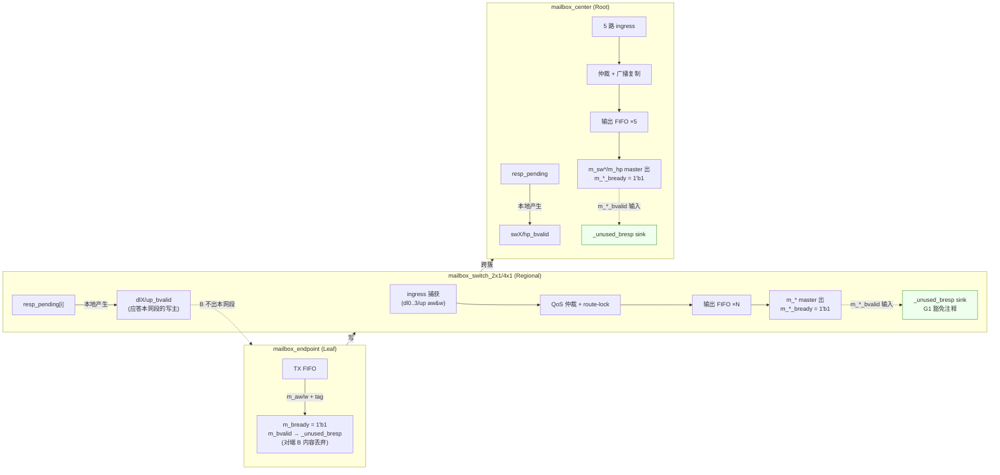

# 报告：Mailbox NoC G1 lint 清理与 B 通道设计评审（S04-P0#2）

> 任务：S04-P0#2 — Mailbox NoC G1 清理：设计评审 `make lint-mailbox` 残余警告，
> 判定 mailbox RTL 能否从 advisory 门毕业进入主 `make lint` 门
> 日期：2026-09-01 · 执行者：Kimi K3（子 Agent MailboxCleanup）
> Plan-Ref：`ethereal-plan/subsystems/S04-EBI总线与Mailbox-NoC集成.md`；
> `ethereal-shell/docs/MIGRATION-mailbox.md` §5；`docs/mailbox_interconnect_spec.md` §2.6

## 背景

S04-P0#1（2026-07-24）将 AXI-MailboxFabric NoC（10 个 `rtl/mailbox/` 文件）与
SPI/UART 适配器（4 个 `rtl/interface/{spi,uart}/` 文件）自 TinyGPU-FPGA 逐字迁入，
lint 状态记为 PENDING，全部 14 个文件挂在 advisory 目标 `make lint-mailbox` 上。
近期提交已修复 `mailbox_switch_2x1.sv` 的 IMPLICITSTATIC（真实的 stuck-at-time-0 bug）
与 WIDTHEXPAND。本任务对剩余警告做设计评审并清理。

## 清理前基线（2026-09-01，`make lint-mailbox`，verilator 5.051）

未经修改的 advisory 目标输出：**7 个 Error + 1 个 Warning**（目标本身 `-` 前缀忽略失败，属 advisory）：

- **7× Error「Reference to … before declaration (IEEE 1800-2023 6.18)」**：
  `mailbox_endpoint.sv`（4 处 `mailbox_tag_t`）与 `mailbox_endpoint_stream.sv`
  （3 处 `mailbox_flit_t`）在 `import mailbox_pkg::*;` 之后使用**未限定**类型名；
  `find` 顺序把 `mailbox_pkg.sv` 排在文件列表中间，verilator 解析到这些文件时包尚未声明。
  注：端口表中的 `mailbox_pkg::` 限定引用不触发该错误（限定名延迟解析）。
- **1× Warning-MULTITOP**：单命令 lint 14 个文件、未指定 `--top-module` 的固有产物。

将包文件提前后可见完整警告集：**88 个警告** ——

| 类别 | 数量 | 分布 |
|---|---|---|
| UNUSEDSIGNAL | 59 | mailbox/ 36（B 通道 14、flit/tag 字段、函数局部变量、stream 变体 clk/rst_n）、interface/ 23 |
| WIDTHEXPAND | 21 | center 15、switch_4x1 3、interface 3 |
| WIDTHTRUNC | 5 | center 1、switch_4x1 2、spi_mailboxfabric 2 |
| BLKSEQ | 1 | spi_sat.sv:143 |
| MULTIDRIVEN | 1 | uart_mailboxfabric.sv（tx_rptr 双驱动） |
| MULTITOP | 1 | 调用方式产物 |

## 核心设计评审：B（写响应）通道是有意弃用还是遗漏？

**结论：有意为之，B 在每一跳本地终结（posted-write 语义），非设计遗漏。**

依据（spec `docs/mailbox_interconnect_spec.md`）：

- **§2.6 Channel Semantics**："Fire-and-Forget: **There is no separate write-response
  (`BVALID`) channel.** Once `tx_ready` is asserted on the handshake cycle, the write is
  accepted. Use `ACK` opcode if software-level confirmation is required." —— fabric 端到端
  无 B 通道；需要确认时用 ACK opcode（软件级）。
- **§2.2 Packet Structure**：包为 "fire-and-forget"，单拍事务、无独立地址相位。
- **§3.1 Flow Control**：硬件流控仅由 valid/ready 反压逐跳传播，未定义响应回传。

RTL 数据流与 spec 一致（AXI4-Lite 前端在每跳边界本地应答）：



要点：写主（endpoint/下级 switch）的 B 由**接受方本网段**在 flit 入队当拍后本地置位
（`resp_pending → *_bvalid`），B 不随 flit 穿越 fabric；每个模块对下游 `m_*_bready = 1'b1`
无条件接收下一跳的 B，且全 fabric **不存在 `bresp` 端口**（B 无数据载荷），其内容天然无需
消费。因此 `UNUSEDSIGNAL m_*_bvalid` 类警告的正确处理是**带注释的 `_unused_*` sink**，
而非把 B 逐级回传（那会改变 spec 语义）。

同法评审的其余 UNUSEDSIGNAL：
- `up/dl*_w_flit[70:19]`（switch_2x1）：入队 flit 只有 tag 的 eop/prio 参与 route-lock/QoS
  记账 → 重构为仅抽取 tag（`mailbox_tag_t'(w_data[$bits(mailbox_tag_t)-1:0])`），
  未用 tag 字段进 `_unused_w_tag` sink；
- `is_latency(t)` 仅读 `t.prio` → 内联为 `.tag.prio` 并删除该恒等函数（3 个文件）；
- stream 变体（`*_stream` ×3）的 `clk/rst_n`：纯组合交叉开关（spec §2.3 单拍跳），
  时钟/复位仅为与 AXI4-Lite 变体端口对齐而保留 → `_unused_clk_rst` sink + 注释；
- `s_araddr[15:4]`、`ep_rx_dest_id[15:4]`：端点/桥只译码 4 位 CSR 索引（spec §2.1），
  高位 node-id 在路由层已消费 → sink + 注释；
- `rx_head[70:55,22:19]`：RX pop 对核只暴露 payload+tag（spec §2.4）→ sink + 注释。

## 修复明细（全部行为保持）

**`rtl/mailbox/`（10 文件 → -Wall 全清，0 个 lint_off 豁免）**

| 文件 | 处理 |
|---|---|
| mailbox_switch_2x1.sv | 3× `m_*_bvalid` → `_unused_bresp` sink（含 spec §2.6 注释）；w_flit→w_tag 重构 + `_unused_w_tag`；删 `is_latency`；`pick_ar_src` 参数 `int o`→`logic [1:0]`（调用点切 `o[1:0]`） |
| mailbox_switch_4x1.sv | 5× bvalid sink；`tgt[dest_local]`→`tgt[dest_local[2:0]]`（守卫 `dest_local<4` 保证等价）；`pick_src` 返回类型 `int`→`logic [RR_W-1:0]`（`-1` 截断为全 1，与调用点既有缺省哨兵一致）；`int'(rr)` 显式扩展；`rr_out[o] == RR_W'(N_IN-1)`；删 `is_latency`；`pick_ar_src` 参数收窄 |
| mailbox_center.sv | 5× bvalid sink；`decode_read_target`/`decode_targets` 参数收窄为簇字节（调用点 `[15:8]`，删除死变量 `dest_local`）；`pick_src` 同 4x1 处理；`araddr_for_idx`/`source_rready`/`target_rdata` 参数收窄 + 调用点切片；`int'(rr)`；`RR_W'(N_IN-1)`；删 `is_latency` |
| mailbox_endpoint.sv | `m_bvalid`/`s_araddr[15:4]`/`rx_head.{adr,strb}` → 3 个带注释 sink |
| mailbox_endpoint_stream.sv | 仅包类型引用全限定化（`mailbox_pkg::mailbox_flit_t` ×3）——修掉 7 个 before-declaration Error 中的 3 个 |
| mailbox_endpoint.sv（同上） | `mailbox_pkg::mailbox_tag_t` ×4 + `mailbox_pkg::compute_parity` —— 修掉其余 4 个 Error |
| mailbox_switch_*_stream.sv ×2、mailbox_center_stream.sv | `clk/rst_n` → `_unused_clk_rst`；decode 函数内 `unused_dest_lo` 吸收未用低位 |
| mailbox_pkg.sv、mailbox_fifo.sv | 本就干净，未改动（仅头注释更新 lint 状态） |

**`rtl/interface/`（仅平凡行为保持修改，经 Main 确认范围）**：`tx_prio` 1→2 位显式
`2'()` 扩展 ×2；`8'(TX_LEN*8)` 截断显式化 ×2；`32'(rx_bits_lat)` ×1；各未用信号
（`ep_rx_hdr/irq/err`、`rx_buf`、`done_flag`、`rx_data_reg/valid`、`cfg_baud_div`、
`rx_shift` 边沿位、`tx/total_bits_lat` 等）→ 带逐条注释的 `_unused_*` sink。

**留作设计判断项（未动，记入 MIGRATION §5.2 新增条目 7–8）**：
1. `BLKSEQ` `spi_sat.sv:143` —— `rx_shift_next` 阻塞临时变量在时序块内（next-value 惯用法，
   提到连续赋值需动 SPI 移位引擎且无 TB）；
2. `MULTIDRIVEN` `uart_mailboxfabric.sv` —— `tx_rptr` 被两个 `always_ff` 进程写，
   疑似**真实 bug**（每消费一字节读指针 +2），需设计裁决 + TB，未用豁免掩盖。

## 验证证据

**`make lint-mailbox`（未修改的 advisory 目标）清理前后**：

| | Error | Warning | 明细 |
|---|---|---|---|
| 前 | 7 | 1（MULTITOP；包提前后展开为 88） | 7× before-declaration；59 UNUSEDSIGNAL / 21 WIDTHEXPAND / 5 WIDTHTRUNC / 1 BLKSEQ / 1 MULTIDRIVEN / 1 MULTITOP |
| 后 | **0** | **3** | 1 MULTITOP（单命令调用固有）+ 1 BLKSEQ + 1 MULTIDRIVEN（均为记录在案的设计判断项）；**`rtl/mailbox/` 贡献 0** |

逐模块 `verilator --lint-only -Wall --top-module <m>`：mailbox/ 9 个模块 + fifo **全部零警告**。

**行为保持证据**：旧（git HEAD）vs 新 RTL 等价冒烟（verilator --binary，同源随机激励，
每周期比对全部输出端口）：
- `mailbox_switch_2x1`：20 000 随机周期，输出逐位一致（`EQUIV-PASS`）；
- `mailbox_endpoint`：20 000 随机周期，输出逐位一致（`EQUIV-PASS`）。

**主门无连带影响**：
- `make lint` → `[lint] OK - all project RTL lint-clean.`（mailbox 不在主 glob，未动）；
- `make test-sv` → 28 个 TB 全 PASS；
- `make test-model` → 2639 passed, 3 xfailed（与基线一致）。

## 毕业判定与建议（集成编辑留给主 Agent）

- **`rtl/mailbox/`（10 文件）：满足毕业条件** —— -Wall 零警告、零豁免、行为等价有实证、
  每条 sink 注释含一行 G1 理由。**建议**将其纳入主 `make lint` 的 `RTL_CLEAN`（推荐按
  模块循环 + `--top-module`，与既有风格一致）。
- **`rtl/interface/{spi,uart}/`（4 文件）：暂不毕业** —— 剩 2 个设计判断警告
  （MIGRATION §5.2 条目 7–8），`lint-mailbox` 须保持 advisory 直至其清零。

**提议的 Makefile 修改（未应用；由主 Agent 在集成时决定/实施）**：

```diff
 # Imported (not-yet-G1-clean) Mailbox RTL — linted separately, never fatal.
 MAILBOX_RTL := $(shell find ethereal-shell/rtl/mailbox ethereal-shell/rtl/interface -type f \( -name '*.sv' -o -name '*.v' \) 2>/dev/null)
+# Mailbox NoC core (G1-clean since S04-P0#2, 2026-09-01) — graduates to `lint`.
+MAILBOX_CORE_RTL := ethereal-shell/rtl/mailbox/mailbox_pkg.sv ethereal-shell/rtl/mailbox/mailbox_fifo.sv ethereal-shell/rtl/mailbox/mailbox_endpoint.sv ethereal-shell/rtl/mailbox/mailbox_endpoint_stream.sv ethereal-shell/rtl/mailbox/mailbox_switch_2x1.sv ethereal-shell/rtl/mailbox/mailbox_switch_2x1_stream.sv ethereal-shell/rtl/mailbox/mailbox_switch_4x1.sv ethereal-shell/rtl/mailbox/mailbox_switch_4x1_stream.sv ethereal-shell/rtl/mailbox/mailbox_center.sv ethereal-shell/rtl/mailbox/mailbox_center_stream.sv
```

```diff
-lint-mailbox: ## Lint the IMPORTED Mailbox NoC (NOT G1-clean yet — see MIGRATION-mailbox.md §5). Advisory; warnings expected.
+lint-mailbox: ## Lint the IMPORTED SPI/UART adapters (2 documented backlog warnings — MIGRATION-mailbox.md §5.2 #7-8). Advisory.
 ifeq ($(VERILATOR),)
 	@echo "[lint-mailbox] ERROR: verilator not found on PATH. Use 'make docker-shell' then 'make lint-mailbox'."
 	@exit 1
 else ifeq ($(strip $(MAILBOX_RTL)),)
 	@echo "[lint-mailbox] No imported mailbox RTL under ethereal-shell/rtl/{mailbox,interface}/."
 else
-	@echo "[lint-mailbox] Imported Mailbox RTL is NOT yet G1-clean (cleanup backlog pending). Warnings are EXPECTED; this target never fails CI."
-	-verilator --lint-only -Wall $(MAILBOX_RTL)
+	@echo "[lint-mailbox] mailbox/ is -Wall CLEAN (S04-P0#2; see report). interface/ retains 2 documented design-judgment warnings (BLKSEQ spi_sat, MULTIDRIVEN uart_mailboxfabric). Advisory: never fails CI."
+	@for f in $(MAILBOX_RTL); do \
+	  m=$$(basename $$f .sv); \
+	  if [ "$$m" = "mailbox_pkg" ]; then continue; fi; \
+	  deps="ethereal-shell/rtl/mailbox/mailbox_pkg.sv"; \
+	  case $$m in \
+	    mailbox_fifo|spi_sat|uart_sat)                          deps="" ;; \
+	    mailbox_switch_2x1_stream|mailbox_switch_4x1_stream|mailbox_center_stream) ;; \
+	    spi_mailboxfabric)  deps="$$deps ethereal-shell/rtl/mailbox/mailbox_fifo.sv ethereal-shell/rtl/mailbox/mailbox_endpoint_stream.sv ethereal-shell/rtl/interface/spi/spi_sat.sv" ;; \
+	    uart_mailboxfabric) deps="$$deps ethereal-shell/rtl/mailbox/mailbox_fifo.sv ethereal-shell/rtl/mailbox/mailbox_endpoint_stream.sv" ;; \
+	    *)                  deps="$$deps ethereal-shell/rtl/mailbox/mailbox_fifo.sv" ;; \
+	  esac; \
+	  echo "[lint-mailbox] --top-module $$m"; \
+	  verilator --lint-only -Wall --top-module $$m -Mdir obj_dir/lint_mbox_$$m $$deps $$f || true; \
+	done
 endif
```

并在 `lint` 目标中追加（mailbox 核逐模块严格 lint）：

```diff
 	@echo "[lint] OK - all project RTL lint-clean."
+# 加入 lint 目标循环前（RTL_CLEAN 循环之后亦可）：
+# 	for f in $(MAILBOX_CORE_RTL); do m=$$(basename $$f .sv); [ "$$m" = "mailbox_pkg" ] && continue; \
+# 	  verilator --lint-only -Wall --top-module $$m -Mdir obj_dir/lint_$$m \
+# 	  ethereal-shell/rtl/mailbox/mailbox_pkg.sv ethereal-shell/rtl/mailbox/mailbox_fifo.sv $$f || exit 1; done
```

（按模块调用同时消除 MULTITOP 与包顺序脆弱性；上述逐模块命令已在本次清理中逐一验证通过。）

## 本阶段实现内容

| 检查点 | 状态 | 证据 |
|---|---|---|
| B 通道设计评审（存废判定） | ✅ | 上节 + spec §2.6/§2.2/§3.1 引用；结论 = 有意逐跳终结，非遗漏 |
| `rtl/mailbox/` -Wall 清零（0 豁免） | ✅ | 9 模块 + fifo 逐模块 lint 全过；88→0（mailbox 部分） |
| 7 个 before-declaration Error 修复 | ✅ | 包类型引用全限定化（RTL 侧，无需改 Makefile） |
| interface/ 平凡修复（宽度 + sink） | ✅ | 23 UNUSEDSIGNAL + 3 WIDTHEXPAND + 2 WIDTHTRUNC → 0；剩 2 设计判断项入 MIGRATION §5.2 #7-8 |
| 行为保持实证 | ✅ | switch_2x1 / endpoint 旧新等价冒烟各 20k 随机周期 EQUIV-PASS |
| `make lint` / `test-sv` / `test-model` 无连带 | ✅ | lint OK；28 TB PASS；2639 passed + 3 xfailed（同基线） |
| MIGRATION-mailbox.md §4/§5 状态更新 | ✅ | §4 lint 行、§5.2 全条目状态、新增 §5.4（评审结论） |
| 毕业建议 + Makefile 集成 diff | ✅（建议形式） | 见"毕业判定与建议"；未自行改 Makefile/主 lint glob（按 Main 指示留集成） |

## 下一阶段需要做的内容

1. **主 Agent 集成**：审阅并应用上述 Makefile diff —— `MAILBOX_CORE_RTL` 入主 `lint`
   （逐模块、`--top-module`），`lint-mailbox` 收敛为 interface 专用 advisory。
2. **interface/ 设计判断项（需维护者裁决 + TB）**：
   - `uart_mailboxfabric` 的 `tx_rptr` 双进程驱动（疑似真 bug：读指针每字节 +2）——
     改单进程 FIFO 并配 testbench；
   - `spi_sat` 的 `rx_shift_next` BLKSEQ —— 提为连续赋值或显式 next-state 信号；
   - 附带：`cfg_baud_div` 运行时波特率配置未接线（CSR3 写了不用）、
     `rx_data_reg/rx_data_valid` 无读回路径、`spi_mailboxfabric` 的 `done_flag`/`rx_buf`
     死寄存器（候选删除）——均已用 `_unused_*` sink 如实标注，未掩盖。
3. **G1 风格残留（非 lint 阻塞，需维护者决策）**：mailbox_center/4x1 的过程化 `for`
   仲裁循环是否授予成文豁免或重构为 `generate`（MIGRATION §5.2 #1）；FSM `typedef enum`
   化（#2）；EOF `default_nettype wire`（#3）；G2 头字段补齐（#4）。
4. **验证闭环**：迁移/重写 mailbox cocotb TB（MIGRATION §5.3），把等价冒烟从 /tmp 一次性
   脚本固化为回归测试；之后方可将 NoC 声明为"已验证"并接入 Shell 顶层（§5.3 EBI 集成）。
