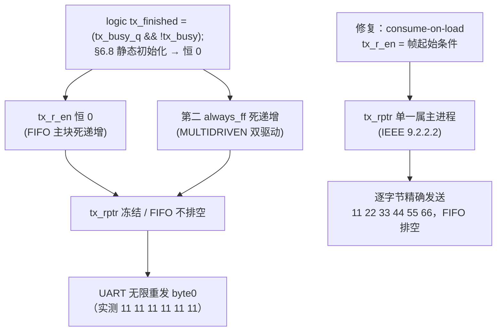

# 报告：interface/ 树 lint 毕业 —— §5.2 #7 BLKSEQ 与 #8 MULTIDRIVEN 清零（S04 interface cleanup）

> 任务：关闭 `ethereal-shell/rtl/interface/` 仅剩的 2 个设计判断 lint 警告
> （MIGRATION-mailbox.md §5.2 #7 BLKSEQ `spi_sat.sv:143`、#8 MULTIDRIVEN
> `uart_mailboxfabric.sv tx_rptr`），使整个迁入树（mailbox/ + interface/）`-Wall` 毕业
> 日期：2026-09-02 · 执行者：Kimi K3（子 Agent InterfaceFix）
> Plan-Ref：`ethereal-plan/subsystems/S04-EBI总线与Mailbox-NoC集成.md`；
> `ethereal-shell/docs/MIGRATION-mailbox.md` §5.2/§5.4；
> 前置报告 `docs/reports/report-S04-P0#2-mailbox-cleanup-20260901.md`

## 背景与基线

S04-P0#2（2026-09-01）已将 `rtl/mailbox/` 10 个文件清到 `-Wall` 零警告零豁免，
`rtl/interface/` 4 个文件仅剩 2 个记录在案的设计判断警告。本任务基线
（`make lint-mailbox`，verilator 5.051 devel）：

```text
%Warning-BLKSEQ:      rtl/interface/spi/spi_sat.sv:143:29  Blocking assignment '=' in sequential logic process
%Warning-MULTIDRIVEN: rtl/interface/uart/uart_mailboxfabric.sv:182:17  'tx_rptr' written by two always_ff processes
```

mailbox/ 9 模块 + fifo + uart_sat 零警告；MULTITOP 为旧的单命令调用产物，
现行逐模块循环调用下本就不出现。

## #8 MULTIDRIVEN 根因诊断（结论：比疑似更严重 —— 真实功能 bug）

任务书疑似「每消费一字节读指针 +2」。逐周期仿真取证后，真实根因链条更深：

1. **变量声明赋值的初始化陷阱（真正的根因）。** 完成检测写作
   `logic tx_finished = (tx_busy_q && !tx_busy);` —— 对变量（非网线）而言这是
   **一次性静态初始化**（IEEE 1800-2023 §6.8），不是连续赋值。最小对照实验
   （`generated/ifx_equiv` 中已验证后删除）：Verilator 与 iverilog **二者**中
   `fin(decl)=0` 恒定、而 `assign` 版本正确跟随。因此 `tx_finished` 恒 0。
2. **两个驱动都是死代码。** `tx_r_en = tx_finished && !tx_empty` 恒假，
   第二个 `always_ff`（`if (tx_finished && !tx_empty) tx_rptr <= tx_rptr+1`）同样恒假
   —— MULTIDRIVEN 警告指向的「双驱动」实际是同一死递增的冗余复写。
3. **可观测量：** `tx_rptr` 冻结在 0、TX FIFO 只进不出、发送器每帧结束后
   重载 `tx_fifo[0]` 无限重发第一字节（定向 TB 实测旧 RTL 输出 `11 11 11 11 11 11`）。



**修复（consume-on-load 重设计）：** 在**装载**（帧起始）而非帧结束时弹出 FIFO ——
同一时钟沿 `tx_shift <= {1'b1, tx_fifo[tx_rptr], 1'b0}` 按 NBA 语义读到递增前的
`tx_rptr`，每字节恰好发送一次；`tx_r_en = !tx_busy && !tx_empty && !UART_CTS`，
FSM 起始条件复用 `tx_r_en`；`tx_rptr` 由 TX-FIFO 主块**唯一**驱动
（IEEE 1800-2023 9.2.2.2）；删除 `tx_busy_q`/`tx_finished` 边沿检测器与重复进程。
注：若保留旧的「完成时弹出」语义，即使修好 `tx_finished`，装载体仍在指针递增前
一拍读到旧 `tx_rptr`，会重发刚发完的字节 —— consume-on-load 是同时消除该
off-by-one 的正确语义。

## #7 BLKSEQ 根因与修复（行为保持重构）

`spi_sat.sv:143`：`rx_shift_next = {rx_shift[62:0], SPI_MISO};` 阻塞临时量在
`always_ff` 内先写后读（next-value 惯用法）。同块内 `rx_shift <= rx_shift_next` 与
`resp <= rx_shift_next[...] >> ...` 均读取**沿前**值。修复：提升为连续赋值
`assign rx_shift_next = {rx_shift[62:0], SPI_MISO};`（声明同步移到 assign 处），
求值点逐周期等价，严格行为保持 —— 由旧新等价冒烟实证（下）。

## 验证证据

环境：`source .venv/bin/activate` + oss-cad-suite PATH；verilator 5.051 devel。
等价/功能台架（scratch，未入库）：`generated/ifx_equiv/{tb_equiv_spi.sv,
tb_equiv_uart.sv, tb_uart_func.sv}`，旧 RTL 取自 `git show HEAD:` 存于
`generated/ifx_equiv/old/`（模块改名 `*_old` 双实例同激励比对）。激励为确定性
xorshift32 PRNG（实测 Verilator 的 `$urandom(seed)` 对 seed 实参不推进逐调用状态，
会退化为恒定激励 —— 第一版台架因此空转，已纠正并加活跃度门）。

| 台架 | 规模 | 活跃度门 | 结果 |
|---|---|---|---|
| `tb_equiv_spi`（旧 vs 新全输出逐周期比对） | 50 000 周期 | 413 次传输完成 / 43 247 busy 周期 | **EQUIV-PASS**，0 mismatch |
| `tb_equiv_uart`（RX→mailbox + CSR2/3/4 配置路径，旧 vs 新） | 50 000 周期 | 450 次 mb_tx 握手 / 12 404 次配置写 | **EQUIV-PASS**，0 mismatch |
| `tb_uart_func`（定向：CSR0 写 6 字节，双解码 UART_TX 帧） | 6 帧 × 8N1 | 新 FIFO 排空断言 | **FUNC-PASS**：旧 `11 11 11 11 11 11`（byte0 无限重发），新 `11 22 33 44 55 66` 精确有序 |

uart 全输出等价刻意拆分：#8 是**修 bug**而非重构，TX 排空路径（UART_TX/RTS/
CSR0 反压）新旧必然分叉 —— 分叉即修复本身（由 `tb_uart_func` 定向实证）；
其余未触碰路径（RX→fabric、配置写、握手）由 `tb_equiv_uart` 证明逐位一致。

**门禁：**

- `make lint-mailbox` → 全部 13 个模块 **0 Error 0 Warning**（interface/ 清零，
  整树毕业）；
- `make lint` → `[lint] OK - all project RTL lint-clean.`（无连带影响）；
- `make test-model` → **2655 passed, 3 xfailed**（首次 4 failed 系漏导
  oss-cad-suite PATH 致 yosys 不可见，导出后全绿）；
- `make test-sv` 的两个慢固件 TB（tb_bmc_fw / tb_bmc_daemon）**未重跑** ——
  本切片不触及 bmc-fw/emri RTL（仅 interface/{spi,uart} 两文件 + 文档），
  符合任务书约定。

## 变更清单（严格限于切片所有权）

- `ethereal-shell/rtl/interface/uart/uart_mailboxfabric.sv` — #8 consume-on-load
  重设计 + 根因 NOTE 注释 + 头 Notes 更新；
- `ethereal-shell/rtl/interface/spi/spi_sat.sv` — #7 `rx_shift_next` 提升为连续赋值
  + 注释 + 头 Notes 更新；
- `ethereal-shell/docs/MIGRATION-mailbox.md` — 顶部 Update 块、§4 lint 行、G6 note、
  §5.2 #7/#8 行（一行根因 + 证据）、§5.4 毕业状态；
- 本报告。**根 Makefile 未动**；其他被跟踪文件未动。

## 本阶段实现内容

- ✅ #8 MULTIDRIVEN 诊断并修复：根因为 `tx_finished` 声明赋值初始化陷阱
  （IEEE 1800-2023 §6.8，Verilator/iverilog 双验证恒 0）+ 冗余重复驱动；
  consume-on-load 重设计，`tx_rptr` 单一属主（IEEE 9.2.2.2）。
- ✅ #8 修复的正确性实证：定向 TB 新 RTL 逐字节精确发送并排空 FIFO，
  旧 RTL 的坏行为（byte0 无限重发）同步留证。
- ✅ #7 BLKSEQ 行为保持修复：阻塞临时量提升为连续赋值；50k 周期旧新等价
  EQUIV-PASS（413 次传输活跃度）。
- ✅ `make lint-mailbox` interface/ 0 警告，整个迁入树（14 文件）`-Wall` 毕业。
- ✅ MIGRATION-mailbox.md §5.2 #7/#8、§5.4、§4、G6 note 同步更新；
  `make lint` / `make test-model` 门禁保持绿。

## 下一阶段需要做的内容

- **S04-P0#3（建议，集成者/Main 决策）**：将 `rtl/interface/{spi,uart}/` 4 文件并入
  主 `make lint` 的 `RTL_CLEAN`（沿用 S04-P0#2 报告提议的逐模块 `--top-module`
  循环），`lint-mailbox` 可退役或留作历史；Makefile 编辑权在集成者。
- **S04 集成 TODO（MIGRATION §5.3，未动）**：EBI 地址映射、`region_endpoint` 接线、
  ADR-008 主机链路角色确认（UART 适配器定位仍 OPEN，见 §8）、时钟域跨越。
- **S14**：EBI 级 cocotb 测试台（mailbox_tb 重托管）仍是 NoC「已验证」声明的前置。
- **建议（风格，非阻塞）**：§5.2 #1（过程循环豁免裁决）与 #2（FSM typedef enum
  重构）仍开放，可并入未来的 interface 集成任务一并处理。
