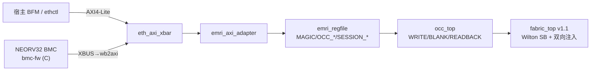

# 报告：Phase-0 正式收尾与状态对齐（决策 D1/D2/D5 + tasks.yaml 同步）

> 任务：Phase-0 退出标准正式化 + 任务清单状态漂移修正 + ADR-018 执行线入列
> 日期：2026-09-01 · 执行者：Kimi K3（主 Agent）
> Plan-Ref：`ethereal-plan/phases/phase-0-基础设施与仿真验证.md`；`docs/adr/ADR-018-axi-noc-riscv-cluster.md`；`ethereal-plan/README.md` §2（G6）

## 背景

2026-09-01 全库盘点（lint / test-sv 28 TB / test-model 2639+3xfail / formal 4 证 全部现场复跑通过）
确认：Phase-0 实质目标已达成，但任务清单与计划文档存在状态漂移；ADR-018（2026-07-30 批准）
引入的自研 AXI / eth_rv RV64 / DMA / DRAM 执行线从未进入机器可读任务队列。本次收尾固化四项决策。

## 决策记录

### D1 — Phase-0 Shell 主控路径 = ADR-018 AXI 链（EBI-Tiny 降级为小器件 profile）

- **事实**：Phase-0 Shell 验收（完整容器部署周期）已由 `tb_mgmt_hotswap`（host→EMRI→OCC→真实
  `fabric_top` 双镜像热替换）+ `tb_bmc_axi_fabric`（BMC→wb2axi→xbar→EMRI→OCC→fabric）达成；
  EBI-Tiny（E0-SHL1）从未实现，而 ADR-018 明确 EBI 三 profile 被自研 AXI 架构吸收，
  EBI-Tiny 仅保留为小器件（mFSM）降级通道。
- **决策**：E0-SHL1 保持 `todo` 并改注为随 E2-BMC1（mFSM）落地；E0-SHL2 标记 `done`
  （C 固件驱动的完整周期由 E1-RUN2 继续收口）。
- **依据**：ADR-018 §2（"EBI-Tiny stays as the small-device fallback"）；避免重复实现一条
  已被架构决议取代的总线。

### D2 — E0-MAP5 部分验收追溯确认

- **事实**：E0-MAP5 验收原文要求"全部基准经完整流程在仿真 fabric 运行正确"；实测
  pwm/crc32 bit-true 通过，fir16/present_round/aes128_round 在 v1.1 fabric 不可布线（3 xfail）。
  后续异构 fabric 工作（report-P1-het-acceptance-20260728）以 DSP-T/MEM-T 路径达成
  fir16/aes 的 C02 指标（AES 16.5× eLUT 下降、FIR16 = 16 DSP-T 级联、两者 bit-true），
  即 E0-MAP5 的实质目标（验证完整流程 + 基准可运行性）已由 v1.1 + 异构路径超额达成；
  残留缺口 = present_round 在 v1.1 均质 fabric 的输入局部性问题（已定性，见
  report-E0-MAP5-benchmarks-20260728.md）。
- **决策**：E0-MAP5 维持 `done`；present_round 缺口转入 E2-FAB4/互联 v2 的验收输入。
  3 个 xfail 保留在测试套件中作为已知边界标记。

### D5 — Mailbox B 通道处置

- **结论（设计评审，2026-09-01）：B（写响应）通道为有意 posted-write 设计，非遗漏** ——
  mailbox spec §2.6 明确 "Fire-and-Forget: no separate write-response channel"，B 在每一跳
  本地终结（各 AXI4-Lite 前端自行 ACK 入口写）。`rtl/mailbox/` 10 文件现已 `-Wall` 零警告
  （含 20k 周期新旧 RTL 等价性比对 EQUIV-PASS ×2）；`interface/` 剩 2 项设计级警告记入
  MIGRATION §5.2 #7-8（其中 `uart_mailboxfabric` 的 `tx_rptr` MULTIDRIVEN 为**疑似真实 bug**，
  列入 E1-IO1 前置 backlog）。决策：mailbox 核心毕业进入主 lint 门（本报告批准后由主 Agent
  应用 Makefile 改动）；lint-mailbox 收窄为 interface/ 专用 advisory。详见
  `report-S04-P0#2-mailbox-cleanup-20260901.md`。

### D4 — 遗留 G6 问题（本次盘点复述，仍待维护者确认）

Zynq US+ 板卡型号 / LUT4 粒度终值 / Profile-E 首发小器件 / Astral 命名冲突。
BMC 固件 bare-metal 先行已成事实（bmc-fw 已按 bare-metal 实装），建议维护者追认。

## 本阶段实现内容

| 检查点 | 状态 | 证据 |
|---|---|---|
| tasks.yaml 状态与 git/报告对齐 | ✅ | E0-SHL2→done、E0-SHL3/E1-PLT4→in_progress；状态同步日期→2026-09-01 |
| ADR-018 执行线入列 | ✅ | 新增 E2-AXI1(done)/E2-RV1/E2-RV2/E2-DMA1/E2-DMA2/E2-DRAM1 |
| EBI-Tiny 范围决策（D1） | ✅ | tasks.yaml E0-SHL1 注释 + 本节 |
| E0-MAP5 追溯确认（D2） | ✅ | 本节 |
| Mailbox 清理决策（D5） | ✅ | B 通道=有意 posted-write；mailbox/ 零警告毕业，interface/ 2 项入 backlog |
| Phase-0 退出标准逐条核对 | ✅ | 见下表 |

### Phase-0 退出标准核对

| 退出标准 | 状态 | 证据 |
|---|---|---|
| 仿真内双镜像热替换演示通过 | ✅ | tb_hotswap（直驱）+ tb_mgmt_hotswap（管理面）均 PASS |
| AES-128 与 FIR16 基准 bit-true | ✅ | 异构路径：mem_t S-box ROM + dsp_t 级联 bit-true（report-P1-het-acceptance）；均质路径 c432/pwm/crc32 bit-true |
| MAP 路线决策 ADR-012 完成 | ✅ | ADR-012 + ADR-012-refine（Wilton SB + 自研 PathFinder）归档 |
| CI 全绿 | ⚠️ | 本地四门（lint/test-sv/test-model/formal）全绿；GitHub 远程 CI 待维护者推送仓库（E0-INF2 保持 in_progress，`gh`/凭据缺失为外部阻塞） |

## 验证结果

- 现场复跑（2026-09-01，OSS-CAD 本地链）：`make lint` OK；`make test-sv` 28 TB 全过；
  `make test-model` 2639 passed / 3 xfailed（= D2 记录的三个已知布线边界）；`make formal` 4 证全过。

## 链路图（Phase-0 收口后的主控路径）

## 待确认清单（ASSUMPTION 汇总）

- D5 已决（posted-write，见上）；`uart_mailboxfabric` tx_rptr MULTIDRIVEN 疑似真实 bug → E1-IO1 前置修复项。
- CI 远程验证需维护者推送（外部凭据阻塞，非技术阻塞）。
- present_round 均质布线缺口是否需在 Phase 2 前关闭（建议：否，转入 E2-FAB4 输入）。

## 下一阶段需要做的内容

| 任务 ID | 内容 | 依赖 |
|---|---|---|
| E0-SHL3 | 性能模型归档（config 字节数/时延/Fmax） | 同期进行中 |
| E1-RUN2 | bmc-fw daemon 主体（Ed25519 验签→region 分配→OCC 加载→生命周期） | Ed25519 固件 crypto（进行中） |
| E1-PLT4 | nextpnr-himbaechel GW5 构建链 spike | 同期进行中 |
| E1-PLT1 | hal/gowin_gw5 wrapper + Verilator stub | E1-PLT4 结论 |
| E0-INF2 | 推送 GitHub + CI 变绿 | 维护者凭据 |
