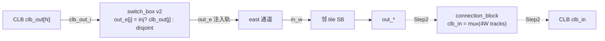

# 验收报告：Routable CB — Step 1（switch_box clb_out 注入 + connection_block）

> 日期：2026-07-25 · 执行者：agent（switch_box v2 / connection_block / fabric_top 自改；模型/TB 经 sub-agent，本人复核）· 关联：架构项（解锁端到端电路运行 + VPR arch）；组件设计 `ethereal-plan/components/C01-fabric-核心单元.md §3`
> RTL：`switch_box.sv`(v2)、`connection_block.sv`(新)、`fabric_top.sv`(rewire) · 模型/TB：sb_model/fabric_model/tb_switch_box（ripple 更新）

---

## 1. 本阶段实现内容

| 检查点 | 状态 | 证据 |
|---|---|---|
| switch_box v2：clb_out 注入（out_e[0..N-1] ← clb_out[j]，inject_en） | ✅ | `switch_box.sv`；`verilator -Wall` 零警告（rc 0） |
| connection_block：clb_in = 4*W 轨 mux（输入 CB） | ✅ | `connection_block.sv`（新）；`verilator -Wall` 零警告 |
| fabric_top：CLB.clb_out → SB.clb_out_i（注入接线） | ✅ | `fabric_top.sv`；6 模块 lint-clean（-Wno-UNOPTFLAT） |
| sb_model/fabric_model：注入边 + clb_out 源（cycle 检测兼容） | ✅ | 668 model 测试通过（注入覆盖 + default 仍 acyclic） |
| tb_switch_box：驱动 clb_out_i + 注入测试 | ✅ | `TEST PASSED`（iverilog） |
| 全套绿（lint + 5 SV TB + 2211 model） | ✅ | `make lint` OK / `make test-sv` 5 PASS / `make test-model` 2211 |
| **端到端可布（CLB→轨→CLB）** | ⚠️ Step 2 | 输出注入已通；**输入 CB 集成**（connection_block 替换 fabric_top 的 minimal tap）+ 可布性测试 = 下一 step |

> ⚠️ = Step 1 完成"输出注入 + 输入 CB 模块就绪"；Step 2 把 connection_block 接入 fabric_top（替 tap）+ 端到端 CLB→轨→CLB 可布性测试。

## 2. 验证结果

**本地可验（OSS-CAD，已通过，本人复核）**：
- `verilator --lint-only -Wall --top-module switch_box` → 零警告（v2 注入路径无 comb 环）。
- `verilator --lint-only -Wall --top-module connection_block` → 零警告（无环）。
- `verilator --lint-only -Wall -Wno-UNOPTFLAT --top-module fabric_top`（6 模块）→ rc 0。
- `make test-model` → **2211 passed**（含 sb_model 注入 7 测试 + fabric_model 注入 3 测试）。
- `make test-sv` → 5 TB PASS（tb_switch_box 含注入检查）。

**关键设计**
- **输出注入（switch_box v2）**：新增 `clb_out_i[N_INJ-1:0]` + inject_en 配置（addr 4W..4W+N_INJ-1）；`out_e[j<N_INJ] = inj_en_r[j] ? clb_out_i[j] : <disjoint sel>`。注入 **override** disjoint（mux，非合并）—— 单 driver（SB 仍驱全部 out_*，clb_out 只是一个 mux 源）。N_INJ≤W；cfg_addr 仍 6-bit（48 sel + 8 inject = 56 < 64）。
- **输入 CB（connection_block）**：`clb_in[i] = pool[sel_r[i]]`，pool = {out_w,out_e,out_s,out_n}（4W 轨）。配置：addr=which clb_in，data=track index。无环。**已写好，待 Step 2 集成**（当前 fabric_top 仍用 minimal tap 读 out_e）。
- **单 driver 保证**：SB 驱动所有 out_*；clb_out 经 SB mux 注入（不直接驱轨）→ 无 multi-drive（解决了 E0-FAB3 的架构 blocker）。

**踩坑（sub-agent 捕获）**：`inj_en_r` reset-less（同 sel_r，OCC 配置后才 un-halt）→ sim 起始 X → 注入 mux 把 X 传到 out_e[0..N-1]，污染 disjoint 检查。TB 修复：启动时把 56 个配置寄存器全写 0（同 clb_t 的 reset-less config 教训）。

## 3. 示意图

## 4. 遇到的问题与解决

| 问题 | 根因 | 解决方案 | 搜索关键词 |
|---|---|---|---|
| multi-drive（clb_out 与 SB 同驱 out_*） | SB 驱全部轨 | clb_out 作 SB mux 源注入（override disjoint），SB 仍唯一 driver | `FPGA connection block CLB output inject switch box single driver` |
| inj_en_r reset-less → X 传播 | 配置寄存器无复位（OCC 配置后才跑） | TB 启动全写 0（56 配置寄存器） | `iverilog X propagation config register no reset testbench` |
| SB 接口变更波及 model/TB | 新增 clb_out_i + inject_en | sub-agent 同步更新 sb_model/fabric_model/tb_switch_box（+tests），全套绿 | — |
| cfg_addr 宽度 | 注入加 8 配置点（48→56） | $clog2(56)=6，仍 6-bit；AW_SB 更新 | — |

## 5. 待确认清单（ASSUMPTION）

1. **🟡 Step 2：connection_block 集成**：把 fabric_top 的 minimal tap（clb_in 读 out_e）换成 connection_block 实例（clb_in = 4W 轨 mux）+ cfg decode 加 unit=CB + 端到端可布性测试（CLB→轨→CLB）。
2. **🟡 注入仅 east**：v1 clb_out 只注入 out_e（保 6-bit cfg_addr）；经邻 SB disjoint 可转到 N/S/W。v2 对称注入（4 dir）会扩 cfg_addr 到 7-bit。
3. **🟢 inj_en override disjoint**：注入时 disjoint sel 被忽略（mux override，非合并）——与 RTL 一致，model 已对齐。

## 6. 下一阶段需要做的内容

| 任务 ID / 步骤 | 内容 | 依赖 |
|---|---|---|
| **Routable CB Step 2** | connection_block 集成进 fabric_top（替 tap）+ unit=CB cfg decode + 端到端 CLB→轨→CLB 可布性 SV TB / model 测试 | Step 1（本） |
| E0-MAP2 | VPR arch（需可布 fabric；Step 2 后） | Step 2 |
| E0-MAP3 | bitgen（消费 frame_map + eLUT4 网表） | S02-P0#1 + E0-MAP1 |

> 本阶段解决 E0-FAB3 的可布性架构 blocker：CLB 输出经 SB 注入轨（单 driver），输入 CB 模块就绪。Step 2 集成后即端到端可布，解锁 VPR arch + 电路运行演示。
