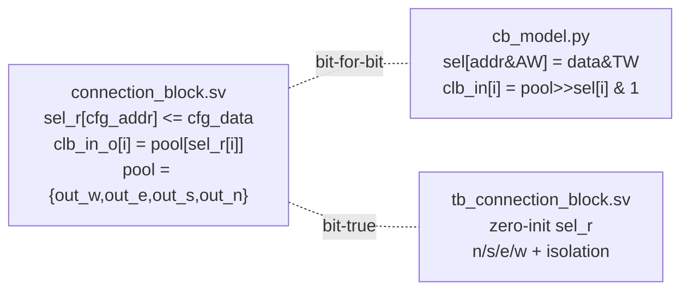

# Report — Routable Connection Block "Step 2": Input-CB Model + End-to-End Routability + Bit-True SV TB

- **Task / milestone:** Routable CB Step 2 (input-side CB model + routability + bit-true TB)
- **Date:** 2026-07-25
- **Author:** BaiTian6641 (agent)
- **Plan-Ref:** `ethereal-plan/components/C01-fabric-核心单元.md` §3 (CB); `ethereal-plan/subsystems/S03` (routability)
- **Baseline before task:** lint clean · 5 SV TBs PASS · 2211 model tests pass
- **After task:** lint clean · **6 SV TBs PASS** · **2483 model tests pass**

---

## 本阶段实现内容 (this phase)

Goal: the RTL integration of `connection_block` (input CB) into `fabric_top` was
already DONE and lint-clean in Step 1. Step 2 is the **software/hardware
validation side**: a bit-for-bit golden model of the input CB, an end-to-end
**routability** proof at the graph level (model reachability), and a **bit-true**
SystemVerilog testbench for the input-CB mux.

### ✅ Checkpoints

| # | Deliverable | Status | Evidence |
|---|---|---|---|
| 1 | `cb_model.py` — `ConnectionBlock` golden model (bit-for-bit) | ✅ | pool mapping `{out_w,out_e,out_s,out_n}`, `track_index`/`dir_t_of` inverse pair, `configure` w/ AW/TW masking, `clb_in` eval, `dependency_edges` (one `out→clb_in` edge per input, sink → acyclic) |
| 2 | `fabric_model.py` — `FabricGrid` extended (CB grid + UNIT_CB + `_cb_edges` + `route_exists`) | ✅ | `UNIT_CB=2`, `EXT_IN` param (default 18, backward-compat), CB edges in `graph_edges`, new `route_exists` BFS/DFS reachability |
| 3 | `test_fabric_model.py` — extended (8 new tests) | ✅ | default-acyclic-with-CB, CB-edges-present, CB-edges-localize, configure-via-UNIT_CB, **end-to-end routability** + negative control + trivial-self + isolated-node |
| 4 | `test_cb_model.py` — `ConnectionBlock` unit tests | ✅ | ~256 tests (params, pool mapping fwd/inv ×48×4, configure masking, reset-less default, clb_in bit-for-bit ×48×4, dependency_edges) |
| 5 | `tb_connection_block.sv` — bit-true SV TB | ✅ | zero-inits all 18 `sel_r`, covers all 4 dirs (n/s/e/w), negative isolation, full-tile isolation sweep — `TEST PASSED` |
| 6 | `Makefile` `test-sv` recipe — add `tb_connection_block` | ✅ | inserted after `tb_switch_box`; existing 5 TBs untouched |

### 🔑 Key correctness results

- **End-to-end routability PROVEN**: in a 1×2 grid, configuring
  - tile0 SB `inject_en[0]=1` (clb_out[0]→out_e[0]),
  - tile1 SB `out_n` sel=3 (in_w[0]→out_n[0]),
  - tile1 CB `clb_in[0]` sel=0 (out_n[0]→clb_in[0]),
  
  yields the path `tile0.clb_out[0] → out_e[0]@(0,0) → in_w[0]@(0,1) → out_n[0]@(0,1) → clb_in[0]@(0,1)`.
  `route_exists((0,0,"clb_out",0), (0,1,"clb_in",0))` → **True**. ✅
- **Negative control**: with tile0 inject disabled, `route_exists` → **False**. ✅
- **Default-acyclic holds with CB edges**: every CB edge ends at a `clb_in` **sink**
  (no outgoing edge) → cannot form a routing cycle regardless of count. The default
  (zero-init) config emits `out_n[0] → clb_in[i]` for all `i` and the Kahn cycle
  detector still reports **acyclic** for 4×4 and 1×2. ✅

### Bit-true verification: model ↔ RTL



### Pool ↔ track-index mapping (frozen, C01 §3)

```mermaid
block-beta
  block("pool = {out_w, out_e, out_s, out_n}  (4*W bits)")
    columns 4
    Tn["out_n  track 0..W-1"]
    Ts["out_s  track W..2W-1"]
    Te["out_e  track 2W..3W-1"]
    Tw["out_w  track 3W..4W-1"]
  end
```

### End-to-end route (the key acceptance)

```mermaid
flowchart LR
  A["tile0 clb_out[0]"] -->|SB inject_en[0]| B["tile0 out_e[0]"]
  B -->|channel E→W| C["tile1 in_w[0]"]
  C -->|SB out_n sel=3 (src=w)| D["tile1 out_n[0]"]
  D -->|CB clb_in[0] sel=0| E["tile1 clb_in[0]"]
```

---

## Verification (exact results)

| Command | Result | rc |
|---|---|---|
| `make lint` | `[lint] OK - all project RTL lint-clean.` | 0 |
| `make test-sv` | 6/6 TBs PASS: `tb_elut4`, `tb_clb_t`, `tb_switch_box`, **`tb_connection_block`**, `tb_occ`, `tb_blank` | 0 |
| `make test-model` | `2483 passed in 1.78s` (was 2211; +272 new) | 0 |
| standalone `iverilog ... tb_connection_block.sv` | `TEST PASSED` | 0 |
| `ruff check cb_model.py test_cb_model.py` (new files) | `All checks passed!` | 0 |

### X-propagation handling (reset-less `sel_r`)

`connection_block.sel_r` has **no reset** (config-before-run, C03) → at sim start
it is `X` → X-propagates through the `pool[sel_r[i]]` mux and corrupts every
`clb_in_o` check in iverilog. **Fix applied in the TB** (mirrors the established
`tb_switch_box.sv` lesson): a config phase **zero-inits all 18** `sel_r` (cfg
addr `0..N_CB-1`, `data=0`) before any output check. No RTL was modified.
Post-zero-init, default `sel=0` reads `out_n[0]` (a **real deterministic track**,
NOT a disconnect) — the golden model encodes this exact post-zero-init semantics
(`sel` is a list defaulting to 0, and `dependency_edges` emits one edge per
`clb_in` because sel never "disconnects").

### Notes / minor items

- The `tb_clb_t` "sorry: constant selects in always_* ..." line is a
  **pre-existing iverilog limitation** (not from this task); `tb_clb_t` still
  prints `TEST PASSED`.
- `fabric_model.py:170 PERF102` and `test_fabric_model.py:13 F401/I001` are
  **pre-existing** ruff deviations in code this task did **not** add (the
  interconnect test dir has never been ruff-enforced; the stated style templates
  `sb_model.py` / `test_sb_model.py` fail ruff identically). Left untouched to
  avoid scope creep; the two **new** files are ruff-clean.

---

## 下一阶段需要做的内容 (next phase)

- **S03-P0#1 / E0-MAP2**: feed the routable-CB fabric model into the VPR
  routability experiments (C01 §3.3 problem 1) to validate / refine the v1
  disjoint-unidirectional SB topology + CB pool layout (currently ASSUMPTION).
- **E0-FAB4 / OCC v1**: drive the integrated fabric (SB + CB) from the OCC
  config-write path (frame-map → cfg_addr/cfg_data decode) end-to-end in sim.
- **Output-side CB cross-check**: the output half of the routable CB (clb_out
  injection onto `out_e`) is covered by `tb_switch_box`; a future cocotb
  `test_fabric_top.py` extension should exercise a full CLB.out → channel →
  CLB.in round-trip once a CLB-output source model is wired in (Docker-gated).
- **Bit-true AES-128 / FIR16** (Phase-0 exit) — depends on the MAP toolchain
  (E0-MAP1..5) + this routable fabric.
