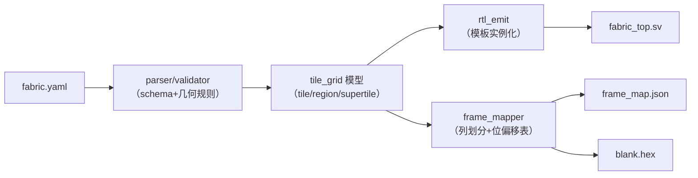
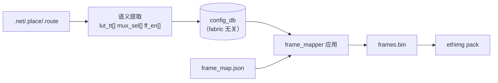
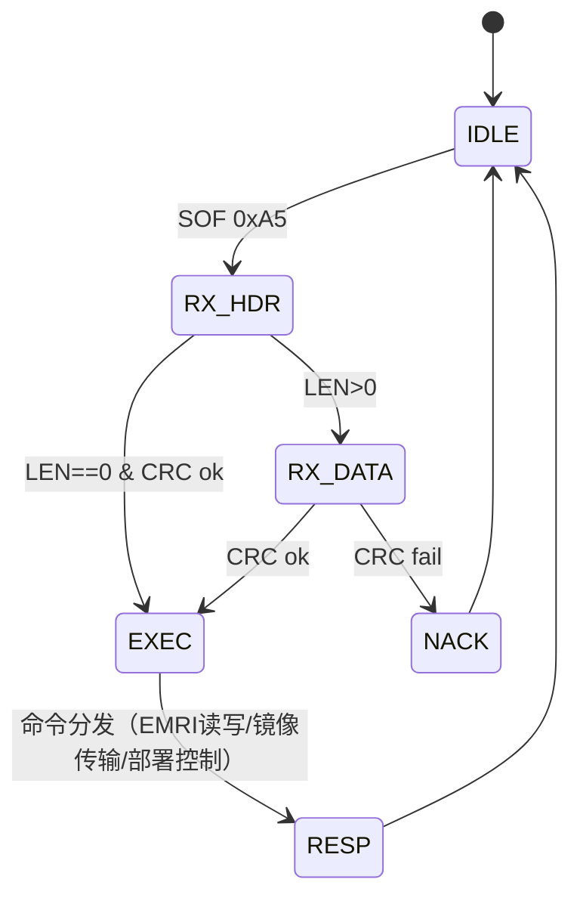

# C-soft · 工具与固件组件（fabric-gen / bitgen / EFP-SPI 引擎 / daemon FSM / 静态检查器 / CI）

> 子系统：S03/S08/S09/S10/S14 · 阶段：P0 起步 · 重要度 ★★★★★
> 说明：这些组件主体是软件，但本文档仍按硬件思维写——每个组件标明它**驱动的硬件结构**与**产出的硬件工件**，软件只是这些硬件的"构造函数"。

---

## 1. fabric_gen（fabric 生成器）

### 1.1 概念
读 fabric.yaml，生成：参数化 fabric 顶层 RTL、frame_map.json、blank.hex、Board Manifest 校验输入。**它是 fabric 硬件的唯一"出生证明"**——frame_map.json 同时被 OCC（硬件译码）、bitgen（镜像生成）、daemon（资源管理）消费，四方一致性的根基。

### 1.2 内部结构

### 1.3 核心设计与问题
- **模板实例化**而非抽象生成：RTL 模板库（CLB-T/SB/IO-T/MEM-T/DSP-T）与生成器共同演进，生成器只做"排列+连接+参数"，不做逻辑合成——保证生成物可读、可 lint；
- 几何规则校验：region 矩形性、supertile 邻接合法性、边界 SB tie-off 一致性——**错在这里=废片，必须最严格校验**；
- 问题：fabric.yaml 的 schema 演进与旧 base image 兼容——frame_map.json 内含 schema 版本，OCC 启动时校验匹配。

### 1.4 测试与评估
黄金测试：3 个参考 fabric.yaml 的生成物 diff 基线；属性测试（hypothesis：随机合法 yaml → 生成物静态检查全绿）；frame_map 与 RTL 的交叉一致性（仿真回读抽检）。

---

## 2. bitgen（镜像比特流生成器）

### 2.1 概念
VPR/nextpnr 的布局布线结果 → 配置帧流。**两级设计**（OpenFPGA 方法学）：第一级产出 fabric 无关的"配置语义数据库"（哪个 eLUT 什么真值表、哪个 mux 什么选择），第二级用 frame_map.json 映射成物理帧——fabric 改版只换 JSON。

### 2.2 数据流

### 2.3 核心设计与问题
- 语义提取的正确性验证：**黄金路径**——提取结果驱动仿真 fabric（功能级）比对原始 Verilog 测试向量，bit-true 才算对；
- 问题：VPR 输出的 mux 路径描述与 SB 拓扑表的对应（拓扑表改→bitgen 映射表同步改——单一事实源仍是 fabric-gen 输出）；
- ROM 段（MEM-T 初始内容）单独成段随帧流下发（C02 §1.4）。

### 2.4 测试与评估
bit-true 黄金路径（基准全集）；边界：空电路/单 LUT 电路/全资源耗尽电路；错误注入（改一 bit → 功能必错，证明映射无"哑位"）。

---

## 3. efp_spi_engine（上位机协议引擎，固件+RTL 各一份）

### 3.1 概念
EFP-SPI 帧协议有两个实现端：BMC 固件版（NEORV32 SDI + 固件解析）与 mFSM RTL 版（C05 §4 的会话 FSM）。**同一协议规范、同一测试套件**——这是 ethctl 无感的实现机制。

### 3.2 协议状态机（两端共有语义）

### 3.3 测试与评估
协议 fuzz（随机字节流/截断/错 CRC）；两端一致性套件（同脚本跑 BMC 与 mFSM）；吞吐实测（镜像传输 MB/s）；断会话恢复。

---

## 4. daemon_lifecycle（BMC 固件生命周期引擎）

### 4.1 概念
S08 §2.2 状态机的固件实现。虽然跑在 CPU 上，但按**硬件 FSM 的纪律**写：状态枚举 + 转移表 + 每状态动作函数，禁止散落在各处的 if-else。

### 4.2 设计
- 转移表驱动：`state × event → (action, next_state)` 的静态表（C 数组），事件来自 EFP 命令/OCC 中断/看门狗/验签结果；
- 每 region 一个状态机实例（数组），BMC 主循环轮询驱动；
- 所有转移写 event_log（C07）——审计链完整；
- 与硬件 FSM（OCC，C03 §2.2）的关系：daemon 是"导演"，OCC 是"执行"——daemon 发命令、等中断、查状态，不直接驱动帧。

### 4.3 测试与评估
状态覆盖测试（全部合法转移路径）；非法事件注入（状态不迁移+错误码）；并发 region（8 实例混合事件）；与 OCC 的失联恢复（超时重同步）。

---

## 5. static_checker（虚拟配置静态检查器，P3）

### 5.1 概念
S10 的 L3：装载前扫描镜像配置帧，重建虚拟网表，检测恶意/危险结构。**overlay 红利**：配置格式是我们的，重建网表是确定性的（原生比特流做这个要逆向）。

### 5.2 检测项与算法

| 检测 | 算法 | 危害 |
|---|---|---|
| 组合环（环振） | 网表重建 → SCC（强连通分量）检测 | 环振=功耗攻击/DoS |
| 非法多驱 | 每虚拟轨驱动源计数 | 电气冲突 |
| 耗尽型布线 | 通道占用率统计 vs 阈值 | 资源耗尽攻击 |
| 可疑真值表模式 | tt 全翻转高频输出启发式 | 振荡器变体（配合 L2 电流监控兜底） |

### 5.3 测试与评估
恶意样本库（自构造 4 类攻击镜像）检出率 100% 目标 + 合法基准集误报率 <5%；性能（检查耗时 < 部署耗时的 20%）。

---

## 6. CI 组件（S14 的硬件关联部分）

### 6.1 概念
验证基础设施中与硬件强相关的三件：**统一 BFM 库**、**黄金向量体系**、**硬件在环 runner**。其余常规 CI（lint/format）从略。

### 6.2 设计要点
- **BFM 库**（cocotb）：mailbox flit BFM（source/sink/monitor 三 modport 对应）、OCC 帧协议 BFM、SPI/I²C 主机 BFM——所有子系统测试共用，BFM 自身有测试；
- **黄金向量体系**：每个基准电路 = RTL + 输入向量 + 期望输出 + 容差说明；仿真与上板跑**同一向量文件**（行为一致性证明链）；
- **硬件在环 runner**：self-hosted，接 GW5 板；CI 任务=烧写+跑向量+回读结果；板卡看门狗（runner 失联自动告警）；fork PR 仅手动触发（安全）。

### 6.3 测试与评估
BFM 自测覆盖率；向量复跑率（仿真/硬件结果一致率 100%）；runner 可用率监控（>95%）。

---

## 7. 待确认清单
1. fabric.yaml schema 的版本化策略（SemVer + OCC 启动校验，§1.3）；
2. bitgen 错误注入测试的"哑位"判定（理论上配置位全有效，需证明）；
3. static_checker 默认开启与否（S10 §7 已问，连带性能预算）；
4. 黄金向量文件格式（hex+JSON 元数据 vs 纯文本）——P0 定。
