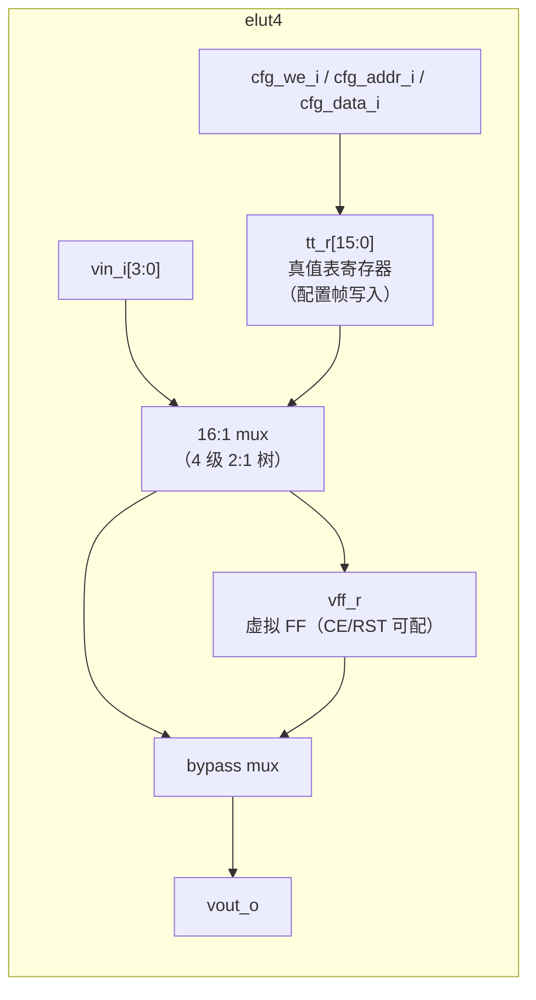
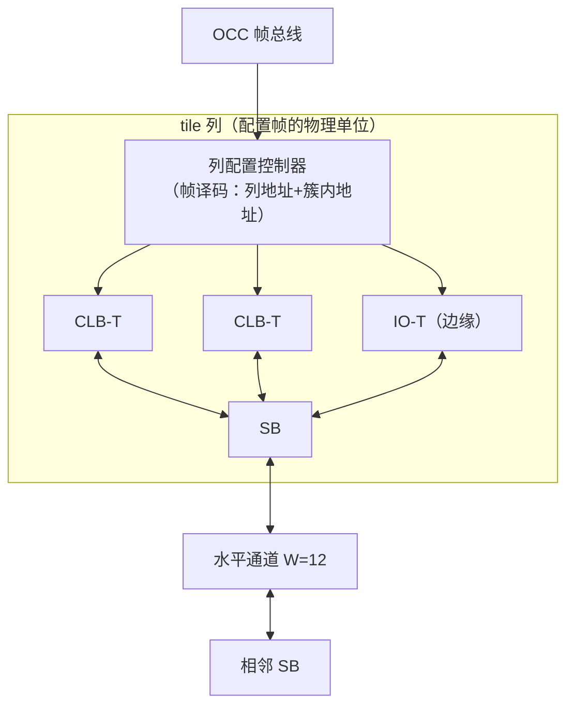

# C01 · Fabric 核心单元（eLUT4 / CLB-T / SB / CB / IO-T）

> 子系统：S01 · 阶段：P0（仿真）→ P1（GW5）· 重要度 ★★★★★
> 本文档粒度：可直接照图编码。所有接口信号表在编码前冻结。

## 0. 物理映射总览（Think Hardware First）

虚拟 fabric 中的每个虚拟资源，必须明确映射到 GW5 的物理资源：

| 虚拟资源 | 物理实现（v1 决策） | 物理实现（v2 优化候选） |
|---|---|---|
| 虚拟 LUT4 真值表（16 bit） | **16 个 FF + LUT 构成的 16:1 mux**（可读回、行为完全可控） | `eth_inf_lutram` 行为模式（异步读 RAM → 各平台 EDA 推断为分布式 RAM/CFU memory 模式，见 C13 §2.3）——Phase 1 推断实验验证后切换 |
| 虚拟 FF | CLS 内寄存器（带 CE/SR/GSR）——行为级描述推断 | 同左 |
| 路由 mux（n:1） | 行为级 mux 描述 → 物理 LUT4 mux 树，选择位存 FF 帧 | 同左（Landy/Stitt 优化减层数） |
| 配置存储（mux 选择位等） | FF 帧（锁存器不用，防毛刺与扫描困难） | 同左 |
| 虚拟 IO | IOB（经 L1 mux，见 C06；电气特性走约束非 IP） | 同左 |

**全表遵守 ADR-017（C13 推断优先）：本表所有"物理实现"均通过行为级 RTL 推断获得，不实例化任何厂商原语。**

**v1 为什么先用 FF+mux 存真值表**：两种方案都是纯行为级、Verilator 可仿真的；FF+mux 是最显式、读回最直白的形式，让 Phase 0/1 的调试没有推断质量这个变量。**v2 切换 `eth_inf_lutram` 模式也不引入任何原语**——异步读 RAM 模式被 GowinSynthesis（SUG550E §2 memory 推断）/Yosys（lutrams libmap）/Vivado（ram_style=distributed）推断为分布式 RAM，面积从 ~10 CFU 降到 ~1-3 CFU——这正是 v1 预算开销比 ≤45:1、v2 目标 ≤35:1 的原因（推断切换 + 互联优化双管齐下）。切换前置条件：C13 §6 推断验证套件确认 Gowin EDA 对该模式稳定推断 CFU memory（Phase 1 实验）。

---

## 1. eLUT4（虚拟查找表单元）

### 1.1 概念
虚拟可编程逻辑的最小单元：一个可按配置实现任意 4 输入布尔函数的 LUT，输出可选经一个虚拟 FF 寄存。对应真实 FPGA 中"LUT+FF"的概念，只是它的"配置"是在运行时可改写的。

### 1.2 框图



### 1.3 接口信号表（冻结 v1）

| 信号 | 方向 | 位宽 | 说明 |
|---|---|---|---|
| `clk_i` | in | 1 | fabric 用户时钟（虚拟 FF 时钟） |
| `rst_ni` | in | 1 | 用户复位（可配置使能，见 `cfg_ff_rst_en`） |
| `vin_i` | in | 4 | 虚拟输入（来自 CLB 本地互联） |
| `vout_o` | out | 1 | 虚拟输出（组合或寄存后，由 `cfg_ff_en` 选择） |
| `cfg_we_i` | in | 1 | 配置写使能（本单元被选中时 1 拍有效） |
| `cfg_data_i` | in | 20 | 配置字：{tt[15:0], ff_en, ff_rst_en, ff_rst_val, out_inv} |
| `cfg_ce_i` | in | 1 | 虚拟 FF 时钟使能（来自虚拟逻辑，映射 CE） |

配置位域（20 bit）：`tt_r[15:0]` 真值表；`ff_en` 输出寄存使能；`ff_rst_en` 虚拟复位使能；`ff_rst_val` 复位值；`out_inv` 输出取反（免费反相，省 LUT）。

### 1.4 核心设计与问题

- **组合输出路径**：vin → 4 级 2:1 mux → out，约 4 个物理 LUT4 层级 + 走线。这是虚拟逻辑关键路径的基本单元延迟，预估物理 100MHz 时钟下虚拟逻辑单级 LUT 延迟 ~4-6ns（实测后写回时序模型）。
- **配置写与运行的隔离**：`cfg_we_i` 有效时本单元输出未定义——**OCC 保证配置时该 region 处于 blank/halt 状态**（C03 状态机），单元自身无需防护。这是"系统级防护替代单元级防护"的决策，省面积。
- **问题 1：16:1 mux 的 LUT 映射**。4 级 2:1 树（15 个 2:1 mux）≈ 物理 8 个 LUT4（2 级）。ASSUMPTION：Gowin EDA 会把 mux 树高效映射到 CFU；若综合报告出现扇出异常，改为显式 `? :` 嵌套或原语。
- **问题 2：虚拟 FF 的 GSR 冲突**。CLS 寄存器支持 GSR；我们的 `rst_ni` 走普通布线资源（GW5 Long Wire 可做控制线）——ASSUMPTION：rst 扇出大（每 CLB 8 个），需要声明为高扇出控制网，必要时用 LW。

### 1.5 扩展与迭代
- v2：切换 CFU memory 模式（真值表 1 CFU）→ 单元面积从 ~10 CFU 降到 ~3 CFU；
- v3：eLUT4 分裂模式（2× LUT3 共享输入）提高小函数密度；`out_inv` 已预留；
- 评估 ALU 模式（CFU 支持）实现虚拟加法器进位链——加密/算术电路的隐形福利。

### 1.6 测试与评估
| 测试 | 方法 | 通过标准 |
|---|---|---|
| 真值表穷举 | cocotb：256 组随机 tt × 16 组输入 | 输出与布尔参考一致 |
| FF 行为 | tt=恒 0/1 + 翻转输入，验证 ff_en/rst_en/rst_val/out_inv 全组合 | 与参考模型一致 |
| 配置写 | 随机 cfg_data 写后功能验证 | 1000 组全对 |
| 物理评估 | Gowin EDA 综合单例与 8 例 | 记录 CFU 占用与 Fmax（目标单例 ≤10 CFU） |

---

## 2. CLB-T（可配置逻辑块 tile）

### 2.1 概念
8 个 eLUT4 + 本地互联（IIB，输入互联块）组成的簇，是 fabric 的基本可布局单元。对应真实 FPGA 的 CLB/ slice。本地互联采用 ZUMA 验证过的 **Clos 两级结构**：第一级把 I 个外部输入扩展到中间轨，第二级为每个 eLUT 的 4 个输入做全交叉选择。

### 2.2 框图与集成

```mermaid
flowchart TB
    subgraph CLBT["clb_t"]
        IIB1["IIB 第一级<br/>I=26 输入 → 中间轨"]
        IIB2["IIB 第二级<br/>中间轨 → 8×4 LUT 输入"]
        L0["eLUT4 #0"] L1["eLUT4 #1"] L2["..."] L7["eLUT4 #7"]
        FB["内部反馈<br/>8 个 vout 回送 IIB"]
    end
    CB["连接块 CB<br/>（通道 W=12 → CLB 输入）"] --> IIB1
    IIB1 --> IIB2 --> L0 & L1 & L2 & L7
    L0 & L1 & L2 & L7 --> FB --> IIB1
    L0 & L1 & L2 & L7 --> OUT["8 输出 → SB/CB"]
```

参数（v1 冻结）：N=8（LUT/簇）、K=4（LUT 输入）、I=26（簇输入，含 8 内部反馈+18 外部）。Clos 参数经 VPR 实验复核（S03 任务 E0-MAP2 输出 arch 文件时联动定标）。

### 2.3 接口信号表（冻结 v1）

| 信号 | 方向 | 位宽 | 说明 |
|---|---|---|---|
| `clk_i / rst_ni` | in | 1/1 | 用户时钟/复位 |
| `clb_in_i` | in | 18 | 外部输入（来自 CB） |
| `clb_out_o` | out | 8 | 簇输出（去 SB 与相邻 CB） |
| `cfg_we_i` | in | 1 | 本簇配置写使能 |
| `cfg_addr_i` | in | 6 | 簇内配置地址（0-7=eLUT4，8-39=IIB mux） |
| `cfg_data_i` | in | 32 | 配置字（eLUT 用 20 bit，mux 用低 6 bit） |

配置位估算：8×20（eLUT）+ 32 个 mux×6bit（IIB 两级合计 32 个选择点，每点 26/16 选 1）≈ 160+192 ≈ **352 bit/CLB ≈ 11 个 32 位配置字**。

### 2.4 核心设计与问题
- **IIB 两级 Clos 的硬件结构**：纯 mux 阵列，无寄存器——注意它是**组合逻辑深锥**。物理映射时第一级 26→16 用 LUT 实现，第二级 16→4（每 LUT 输入一个 16:1 mux）。总延迟目标 ≤ 2 个 eLUT4 级。
- **配置地址解码**：簇内小 decoder（cfg_addr），由列级帧控制器统一驱动（C03）——簇本身只是"最后 1 级解码"，不要在每个 CLB 里放完整地址总线（面积杀手）。
- **问题 1：IIB 面积爆炸**。Clos 全交叉是 O(I×N×K) 个 mux；26→32 个选择点已按 ZUMA 比例裁剪，VPR 实验若显示 routability 不足再调 I=30。
- **问题 2：反馈环**。8 个 vout 回送 IIB 形成合法的组合反馈路径——**虚拟逻辑层面的组合环是用户的自由**（如虚拟锁存器），但物理实现上会形成真实组合环，Verilator UNOPTFLAT 会告警。对策：fabric 顶层对 UNOPTFLAT 做文档化豁免 + 用户侧由 mapper 检测虚拟组合环并告警（S10 静态检查同源）。

### 2.5 扩展与迭代
- v2：IIB 按 Landy/Stitt 平台期裁剪（26:1 与 16:1 同价点取齐）；
- v3：簇内进位链（ALU 模式）；异构簇（4 标准 eLUT + 4 带扫描 eLUT，支持上下文保存的混合簇）。

### 2.6 测试与评估
| 测试 | 方法 | 通过标准 |
|---|---|---|
| 连通性穷举 | cocotb：任一 vin → 任一 LUT 输入的路由存在性 | 全部可达 |
| 随机电路映射 | 手映射 10 个小电路（计数器/加法器/状态机） | 功能正确 |
| 配置位清点 | 脚本统计生成 RTL 的配置位总数 | 与估算偏差 <10% |
| 物理评估 | 综合单 CLB | CFU ≤ 90（≈11 CFU/eLUT 当量），Fmax ≥ 150MHz（物理） |

---

## 3. SB 与 CB（开关块 / 连接块）

### 3.1 概念
SB（Switch Box）是通道交叉口的开关矩阵，决定虚拟信号如何拐弯/直行；CB（Connection Box）把通道信号接入 CLB 输入、把 CLB 输出接入通道。两者是互联开销的主战场（>50%），也是 Landy/Stitt 优化的落点。

### 3.2 框图

```mermaid
flowchart LR
    subgraph SB["switch_box (W=12)"]
        direction TB
        N["北通道 12"] S["南通道 12"] E["东通道 12"] W["西通道 12"]
        SM["开关矩阵<br/>每输出轨一个 mux<br/>（两源轨道优先 → 多数退化为导线）"]
        N --> SM --> S
        W --> SM --> E
        S --> SM --> N
        E --> SM --> W
    end
    CBIN["CB：通道 → clb_in[17:0]<br/>（每输入 1 个 mux）"]
    CBOUT["CB：clb_out[7:0] → 通道<br/>（每输出驱动 2 条轨）"]
    SB <--> CBIN
    SB <--> CBOUT
```

### 3.3 核心设计（冻结 v1 拓扑策略）
- **两源轨道优先**（Landy/Stitt 核心结论）：设计 SB 拓扑使**尽可能多的虚拟轨道只有两个可能驱动源**——此时 n:1 mux 退化为 2:1（1 个 LUT 都不用，直接物理连线+三态？不，FPGA 内无三态——退化为 2:1 mux=1 个 LUT 的 1/4）或直接单源导线。v1 实现：W=12 通道中 8 条为"两源轨"、4 条为"灵活轨"（4-6 源）。
- **CB 输出扇出**：每个 clb_out 驱动 2 条轨（ZUMA 惯例），保证可布性；
- **配置位**：SB 每灵活轨 mux ~3bit×4 + CB 每输入 ~4bit×18 + 输出使能 8 ≈ 92 bit/tile。
- **问题 1：拓扑表的正确性**。SB/CB 拓扑由 fabric-gen 从参数表生成——**拓扑表必须先经 VPR routability 实验验证**（S03），再冻结进 RTL；否则会出现"仿真能连、VPR 布不通"的返工。
- **问题 2：单向 vs 双向通道**。v1 单向通道（每方向 W=12），与 VPR 现代架构一致；双向省线但 mux 复杂，不做。

### 3.4 扩展与迭代
- v2：两源轨比例按基准电路统计上调（目标互联面积 -20%）；
- v3：长度 >1 的轨道（跨 2/4 tile 长线，降低长距离信号延迟）——这是 v1（全部单长轨）到大 fabric 时的必做项。

### 3.5 测试与评估
| 测试 | 方法 | 通过标准 |
|---|---|---|
| 拓扑自洽 | fabric-gen 生成后静态检查：每轨驱动源数≤设计值、无悬空 | 检查脚本全绿 |
| 布通率 | VPR 对基准集布通率 | c432/AES/FIR 全部布通 |
| 面积占比 | 综合报告：互联 LUT / 总 fabric LUT | v1 ≤ 60%，v2 ≤ 45% |
| 延迟 | STA：通道直线 4 tile 延迟 | 记录并回写时序模型 |

---

## 4. IO-T（边缘 IO tile）

### 4.1 概念
fabric 边缘的特殊 tile，把虚拟逻辑信号接到 Shell 的 L1 引脚 mux（C06）。每个 IO-T 提供 8 路虚拟 IO，方向逐位可配。

### 4.2 设计要点
- 每路：输入 2FF 同步器（可旁路）+ 输出寄存器（可旁路）+ 方向配置位 + 上拉/下拉使能（透传到物理 IOB 能力，由 C06 最终落地）；
- 虚拟侧接 CB（与普通 CLB 输出入通道一致）；
- **安全边界**：IO-T 的输出使能由 OCC 在 region 进入 RUNNING 时才放开（`io_oe_gate_i`）——配置中/halt 的容器不会驱动引脚；
- 配置位：8×(dir + oe + pull + sync_bypass + reg_bypass) ≈ 40 bit。

### 4.3 测试与评估
方向切换毛刺测试（SVA 断言：oe 变化时输出无 >1ns 脉冲）；同步器 MTBF 估算记录；与 C06 联调：8 路并行 PWM 经 mux 到引脚。

---

## 5. 组件间集成图（一个 tile 列）



---

## 6. 待确认清单（ASSUMPTION 汇总）
1. mux 树在 Gowin EDA 的映射效率（§1.4 问题 1）——Phase 1 综合报告验证；
2. rst 高扇出网络是否需要 LW 声明（§1.4 问题 2）；
3. CFU memory 模式运行时写口的原语与时序（C03 §6 spike 后决定 v2 切换）；
4. SB 拓扑表最终参数（待 S03 VPR 实验输出）。
