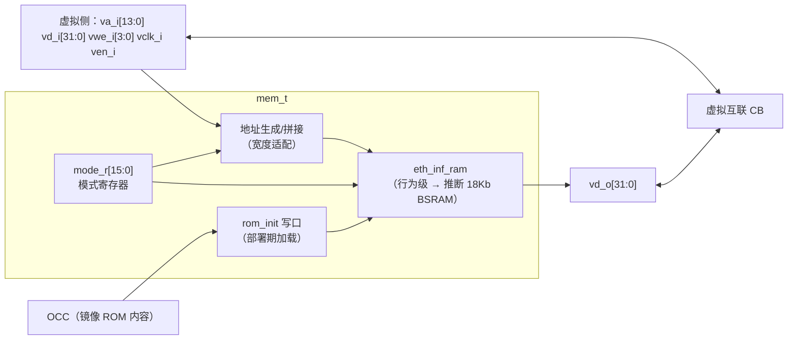
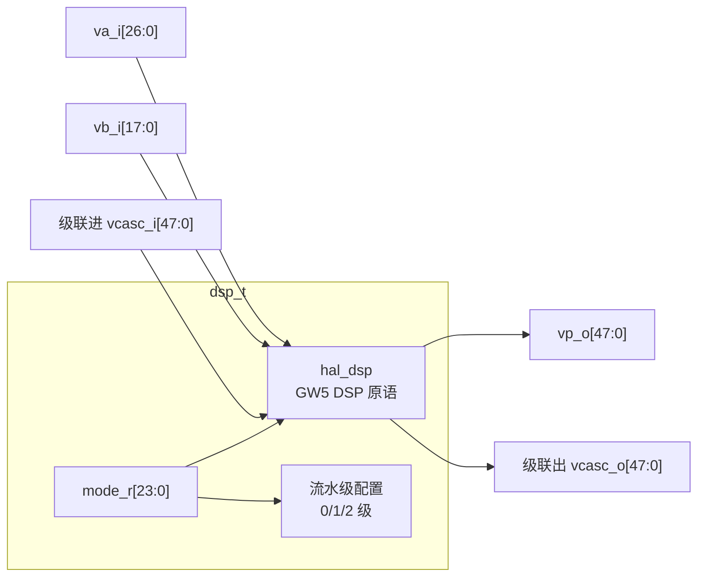

# C02 · Fabric 异构 Tile（MEM-T / DSP-T / SSM-T / Supertile / Region）

> 子系统：S01 · 阶段：P2（主体）· 重要度 ★★★★★
> 定位：密度故事的主角——加密用 MEM-T 做 S-box、信号处理用 DSP-T 做 MAC，把虚拟电路的实用密度拉高一个数量级。

## 0. 物理映射总览

> **ADR-017 说明（2026-07 修订）**：本文件所有 tile 均以 `eth_inf_*` 行为级模板实现（C13），"物理资源"指 EDA 推断目标而非原语实例。

| 虚拟 tile | 推断目标（GW5AST-138） | 数量预算（v2 fabric 示例） |
|---|---|---|
| MEM-T | `eth_inf_ram` → 1× BSRAM（18Kb，双口/字节使能由模式描述推断） | 20~40 块（340 块池内，与 BMC/代理共享预算） |
| DSP-T | `eth_inf_dsp_mac` → 1× DSP（27×18；累加/级联/预加/流水由行为描述推断） | 8~16 个（298 池内） |
| SSM-T | SSRAM 窗口（1080Kb 分布式池） | 按窗口分配 |
| Supertile | 上述任意组合 + 本地直连 | fabric.yaml 声明 |

**关键认知**：这些 tile 的 LUT 开销几乎为零（硬块本就在芯片上）——异构 tile 是纯赚的密度。配置内容是**模式寄存器**（几十 bit）而非真值表，所以异构 tile 的配置帧又小又快。

---

## 1. MEM-T（块 RAM tile）

### 1.1 概念
把一块物理 BSRAM 包装成虚拟逻辑可寻址的 RAM/ROM/FIFO。对应真实 FPGA 设计中例化 BRAM 的体验，只是"连接"走虚拟互联、"模式"由镜像配置决定。加密的 S-box（AES 需 8× 256×8 表）、FIR 的系数/延迟线、协议的缓冲都靠它。

### 1.2 框图与集成

### 1.3 接口信号表（冻结 v1）

| 信号 | 方向 | 位宽 | 说明 |
|---|---|---|---|
| `vclk_i` | in | 1 | 虚拟时钟（与 region 时钟同源） |
| `va_i` | in | 14 | 虚拟地址（按模式拼接） |
| `vd_i / vd_o` | in/out | 32/32 | 虚拟数据（按模式取低 N 位） |
| `vwe_i` | in | 4 | 字节写使能（BSRAM 原生支持） |
| `ven_i` | in | 1 | 使能（映射 CE，省功耗） |
| `cfg_we_i / cfg_data_i[15:0]` | in | — | 模式字写入 |

模式字位域：`mode[2:0]`（RAM 1K×18 / 2K×9 / 512×36 / ROM / FIFO / 双口）；`fifo_flags_en`；`ecc_en`（BSRAM ECC，自检错——可靠性卖点）；`rom_init_en`（部署期允许 OCC 写初始内容）。

### 1.4 核心设计与问题
- **宽度拼接**：虚拟侧固定 32 位视图，AG 按模式把物理 18Kb 拼成对应几何——纯 mux/移位，一级 LUT 延迟；
- **ROM 初始化**：镜像的 `rom.hex` 段随配置流下发，OCC 在 WRITE 阶段经 rom_init 口写入 BSRAM——**BSRAM 内容也是"配置"的一部分**，纳入 CRC 校验范围；
- **双口语义**：v1 开放真双口（A 口虚拟逻辑、B 口可选接 EBI——容器与 BMC 共享内存的通道，Type-F 数据通路的候选）；
- **问题 1：ECC 开销与模式冲突**。ECC 只在特定几何可用（查 Gowin BSRAM 文档）；v1 默认关，可靠性场景开；
- **问题 2：虚拟时序**。BSRAM 读是寄存输出（1 拍延迟）——映射工具链时序模型必须按"MEM-T 读=1 拍"记账，否则用户电路仿真与硬件不符。

### 1.5 扩展与迭代
- v3：多 BSRAM 级联成大 RAM（mapper 自动切分）；FIFO 模式的 almost_full 水位中断；B 口 DMA 化（容器零拷贝上传数据）。

### 1.6 测试与评估
| 测试 | 方法 | 通过标准 |
|---|---|---|
| 全模式读写 | cocotb 每模式随机地址/数据 | 与行为模型一致 |
| ROM 预载 | 部署含 rom.hex 镜像 | 读出内容与镜像一致（CRC 校验） |
| FIFO 标志 | 满/空/almost 边界 | 标志时序正确 |
| 密度对比 | AES-128：LUT S-box 版 vs MEM-T 版 | eLUT 占用降 ≥5×（阶段指标） |

---

## 2. DSP-T（乘法/乘加 tile）

### 2.1 概念
包装一个物理 DSP 块为虚拟 MAC 单元。GW5 的 DSP 支持 27×18/12×12/27×36 乘法、48bit 累加、级联、预加（滤波）、桶形移位、流水/旁路——模式由寄存器配置，正好做成"虚拟可配 DSP"。

### 2.2 框图

### 2.3 模式字位域（冻结 v1）
`op[3:0]`：MULT / MAC / ACC（自累加）/ PREADD_MAC（(a+b)×c，FIR 对称抽头）/ BARREL / PASS（旁路为虚拟互联资源）；`pipeline[1:0]`：0/1/2 级（频率 vs 延迟权衡，用户镜像选择）；`casc_in_en / casc_out_en`：级联链使能；`sat_rnd[1:0]`：饱和/舍入模式（v2）。

### 2.4 核心设计与问题
- **级联链**：FIR16 = 16 个 DSP-T 级联——级联在行为描述中就是"上一级的 p 接下一级的 c_i"——**Vivado/GowinSynthesis 都能把这种行为链推断为 DSP 的专用级联路径（PCOUT→PCIN / 乘法链加），不消耗虚拟互联**（SUG550E §4.3.2 明确支持"Supports multiplication chain addition"；UG901 多 DSP 分解同理）。长 MAC 链性能≈物理性能；
- **问题 1：推断质量验证（替代原"原语映射表"）**。不再逐位核对原语控制信号，改为**推断验证矩阵**（C13 §6）：每种模式（MULT/MAC/ACC/PREADD）在三家工具链构建，核对推断报告（DSP 计数、退化告警）——任一模式被退化为 LUT 实现即调整行为描述或属性；
- **问题 2：流水与虚拟时序**。pipeline 选择改变延迟拍数——时序模型按模式记账；mapper 负责在用户电路的 DSP-T 用法中插入对应延迟补偿或报错。注意：DSP 推断要求**禁 set/异步复位**（UG949），我们的模式字不含异步置位是刻意的；
- **问题 3：桶形移位模式**的推断质量不确定（可能被推断为逻辑而非 DSP 移位器）——标记 ASSUMPTION，首轮推断验证后决定保留或降级为逻辑实现声明。

### 2.5 扩展与迭代
- v3：DSP-T 阵列 supertile（4×DSP + 1×MEM 融合，FIR/卷积加速器形态）；INT8 双乘打包（一个 27×18 装两个 8×8 乘，Libano 技巧）供 NPU-Tiny 借鉴。

### 2.6 测试与评估
| 测试 | 方法 | 通过标准 |
|---|---|---|
| 全模式数值 | cocotb 对 numpy 定点参考 | 全模式 bit-true |
| 级联链 | FIR16 系数/数据随机测试 | 与参考一致；实测 Fmax |
| 吞吐对比 | FIR16：DSP-T 链 vs 纯 eLUT 版 | 吞吐 ≥10×（阶段指标） |

---

## 3. SSM-T（Shadow SRAM 窗口 tile）

### 3.1 概念
SSRAM（1,080Kb 分布式池）不做成细粒度 tile，而是**地址窗口资源**：每个 SSM-T 声明一个窗口（如 64Kb），用于大表/暂存/上下文保存区。SSRAM 物理上是分布式的小 RAM，GW5 将其组织为统一资源池（SSRAM 与 BSRAM 的区别：更低速但更灵活，适合做配置暂存与非关键数据）。

### 3.2 设计要点
- 窗口分配表存于 fabric-gen 产出的 frame_map.json；运行时由 OCC 按镜像 resources.yaml 授权；
- 上下文保存（与 C03 联动）：CLB FF 扫描链的目标区就是 SSM-T 窗口——**SSM-T 是容器抢占/迁移的内存**；
- 问题：SSRAM 接口细节（位宽/时序/是否统一编址）需查 Gowin 文档核实——ASSUMPTION #1 记入待确认清单；若 SSRAM 不适合频繁写，上下文保存改用预留 BSRAM 池。

## 4. Supertile（融合 tile）

### 4.1 概念
把相邻若干 tile 声明为一个 supertile：内部资源**绕过虚拟 SB/CB 直接硬连**（如 MEM-T 的 va/vd 直连 DSP-T 的 a/p），supertile 对外只暴露统一的虚拟接口组。价值：关键路径不付虚拟互联税（FIR 的 RAM→DSP→RAM 回路），同时保持"用户电路映射到虚拟资源"的抽象。

### 4.2 设计要点
- fabric.yaml 声明：`supertile fir_pair: {tiles: [MEM-T, DSP-T], internal: [[mem.vd_o, dsp.va_i], [dsp.vp_o, mem.vd_i]]}`；
- fabric-gen 生成时把 internal 连接直接例化（物理直连），对外接口照常走 CB；
- mapper 把匹配的电路模式（RAM 喂乘法）优先塞进 supertile；
- v1 只支持静态声明的 supertile 类型（fir_pair、mac_acc），用户自定义 supertile 是 v3。

## 5. Region 边界与保护

### 5.1 设计要点（隔离的物理实现）
- **虚拟路由截止**：region 边界的 SB 不把信号路由出 region——拓扑生成时边界 SB 的外向端口直接 tie-off，物理上不存在跨区路径；
- **配置写隔离**：OCC 锁矩阵（C03）按 region 使能配置帧译码；
- **IO 隔离**：IO-T 的 oe_gate 按 region 独立控制（C01 §4）；
- **region 组合**：fabric.yaml 定义多个 region 规格（S=2×2 CLB、M=4×4、L=4×8+2DSP-T+2MEM-T 等），相邻同构 region 可合并给大容器（daemon 决策，v2）；
- 评估：每个 region 的边界 SB tie-off 造成的资源浪费 <5%（边界通道死区），接受。

## 6. 待确认清单
1. Gowin BSRAM 各几何/ECC/字节使能的确切模式表（查 IPUG 系列文档）；
2. GW5 DSP 原语控制信号全表与模式映射（§2.4 问题 1）；
3. SSRAM 接口与写性能（§3.2 ASSUMPTION #1）；
4. Supertile v1 类型清单（fir_pair/mac_acc 之外是否加 crypto_pair：2×MEM-T 表 + 8×CLB）。
