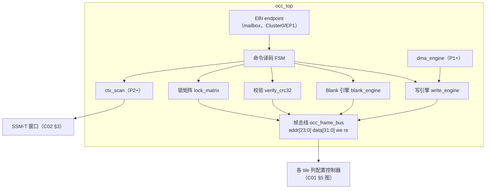
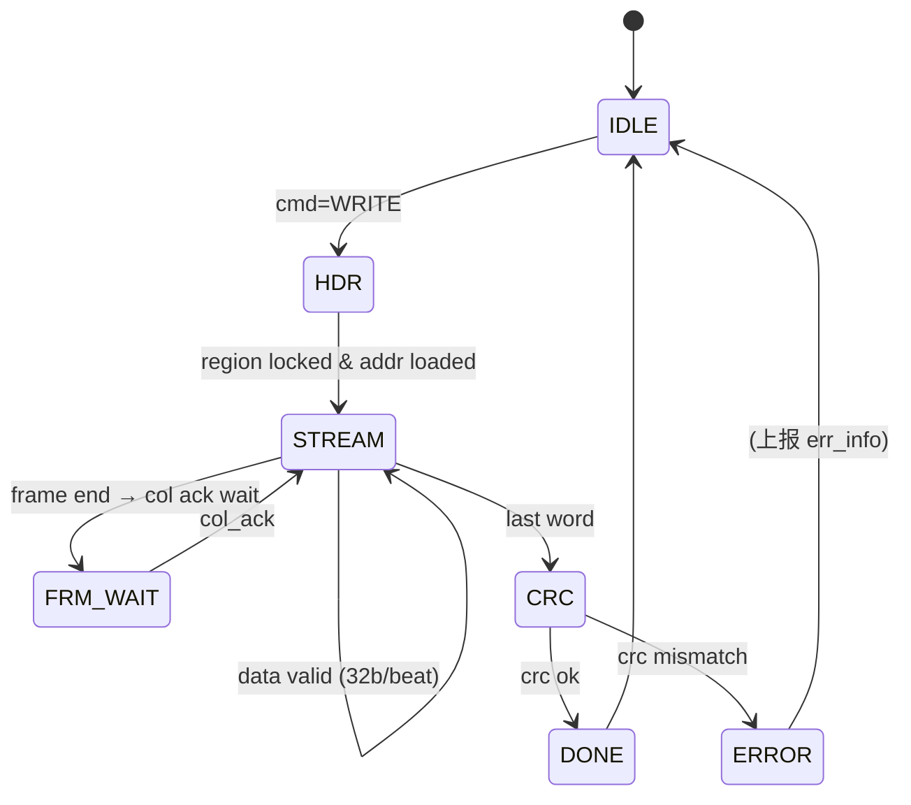

# C03 · OCC 组件（帧组织 / 写引擎 / Blank / 校验 / 锁矩阵 / CRC / 上下文扫描 / DMA）

> 子系统：S02 · 阶段：P0 起步 → P3 完整 · 重要度 ★★★★★
> 红线（FABulous 流片教训）：配置存储禁用移位寄存器链；任何 region 重写必须 blank-before-write。

## 0. 组件总览

**物理映射说明**：OCC 本体是纯控制逻辑（FF+mux，约 500-800 LUT）；真正的"配置存储"分布在各 tile 列（C01/C02 已述）；OCC 与列之间是**一条 32 位配置帧总线**——地址译码采用"列地址广播 + 列内二级译码"（C01 §2.4 决策），OCC 只驱动列选择，列控制器驱动簇内地址。

---

## 1. 帧组织 frame_org

### 1.1 概念
配置数据的寻址方案。帧 = 一列 tile 的全部配置位（C01 估算：CLB-T ≈352bit、SB/CB ≈92bit、IO-T ≈40bit；一列含 2 CLB + 1 SB/CB ≈ 796bit ≈ 25 个 32 位字）。**帧地址 = {region_id[3:0], col_id[7:0]}**，帧内偏移由写引擎自增。

### 1.2 核心设计
- frame_map.json（fabric-gen 产出）是唯一事实源：描述每个 region 每列的 tile 类型序列、每帧字数、bit 偏移含义（供 bitgen 与读回校验使用）；
- 空白帧（blank pattern）：全 0 + IO-T 的 oe=0 + mux 选择位指向常量网络——**blank 不是"无配置"而是一种显式安全配置**，由 fabric-gen 生成 blank.hex；
- 帧字序：低位先发；每帧尾部 1 字为帧校验（CRC16 截断），列控制器本地校验——**帧级自检，把错误定位到列**。

### 1.3 问题
- 列内 tile 数量不一致（异构 fabric）→ 帧长可变：帧头加 8bit 长度字段，列控制器按长度计数；
- 帧总线扇出：全部列挂一条 32 位总线，扇出大——每列输入加寄存器切片（1 拍延迟可接受，配置路径不在用户关键路径上）。

---

## 2. 写引擎 write_engine

### 2.1 概念
接收配置数据流（mailbox 突发或 DMA），按帧写入目标 region 的列控制器。物理上是：地址自增计数器 + 数据转发寄存器 + 背压逻辑 + 字节计数器。

### 2.2 FSM（冻结 v1）

| 信号（内部关键） | 说明 |
|---|---|
| `w_addr_r[23:0]` | 当前帧地址（region+col），帧结束自增 col |
| `w_cnt_r[15:0]` | 字节计数（与 LENGTH 比较） |
| `col_ack_i` | 列控制器写完确认（帧级握手） |
| `stall_o` | 背压给 mailbox/DMA（列忙时拉高等价于 ready=0） |

### 2.3 问题
- mailbox 突发的 route-lock 被高优先级打断（BMC HP 命令）→ 写引擎必须**帧级原子**：任何中断只在帧边界生效，恢复后继续（帧内被打断 = 帧 CRC 错 = 重发该帧，协议层已覆盖）；
- 写速目标：BMC DMA 模式 32bit/拍 @100MHz = 400MB/s 理论；4×4 fabric ≈ 200KB → 0.5ms 级。SPI 上位机模式受 SPI 限制（~20Mbps → 80ms 级），符合 <100ms 指标。

---

## 3. Blank 引擎 blank_engine

### 3.1 概念
把目标 region 的全部列改写为 blank.hex 图案。blank 的硬件意义：所有虚拟 mux 指向常量、所有 IO-T oe=0、eLUT 输出常量——region 进入"电气静默"。

### 3.2 设计
- 复用写引擎数据通路（blank.hex 存 OCC 本地 ROM，64-256 字）；
- 速度优化：blank 内容各列同构时可广播写（多列同写）——广播位图由 LKM 提供；blank 4×4 region 目标 < 100µs；
- **时序红线**：blank 必须先于任何新配置写；blank 完成（所有列 ack）前不得解除 region halt。

---

## 4. 校验 verify_crc32

### 4.1 概念与诚实边界
两级校验：
1. **流式 CRC32**（写时在线计算，与镜像 digest 比对）——覆盖全部写入数据；
2. **读回校验**——v1 覆盖 FF 帧（mux 选择位/模式字）与 eLUT 真值表（FF 存储）；**ADR-017 后的好消息：`eth_inf_lutram` 推断模式自带配置读口（C13 §2.3），v2 切换后真值表读回能力无损保留**——读回校验在全路线图上都是完整能力；

### 4.2 设计
- CRC32（以太网多项式）单字/拍流水，FF 实现约 100 LUT；
- 读回路径：列控制器把配置帧数据经帧总线 `re` 通道回送，verify 模块重算 CRC 比对；
- 失败处置：ERROR 状态 + err_info（帧地址/期望/实际），BMC 按 restartPolicy 决定重试/放弃。

---

## 5. 锁矩阵 lock_matrix

### 5.1 概念
region 配置写使能的硬件开关矩阵：N 个 region 各 1 个 lock 位 + 1 个全局 lock。**锁定后帧总线对该 region 的写使能在列译码处物理关闭**——不是软件检查，是硬件门控。

### 5.2 设计
- lock 位本身只能由 BMC（HP 通道命令）置/清；
- 锁定语义联动容器生命周期：RUNNING 中的 region 自动 locked（防运行中被改写）；LOADING/BLANKING 时 unlocked；
- 寄存器面：LKM_STATUS（只读位图）+ LKM_CMD（BMC 专用 opcode）。

---

## 6. 分布式 RAM 推断实验（Phase 1 任务，ADR-017 后改写并提前）

### 6.1 目的
验证 `eth_inf_lutram` 行为模式（C13 §2.3：异步读 16×1 RAM + 同步写）作为 eLUT 真值表存储的可行性：(a) GowinSynthesis 是否稳定推断为 CFU memory 模式（而非 FF+mux）；(b) Yosys/nextpnr（lutrams libmap）与 Vivado（ram_style=distributed）的对应结果；(c) 运行时改写后的功能正确性（**Verilator 可直接验证**——行为模式无任何原语）；(d) 配置读回途径：推断模式下保留配置读口（`cfg_rdata_o = tt`——行为级额外读口，工具仍推断分布式 RAM，读回能力内建）。

### 6.2 方法
纳入 C13 §6 推断验证套件首轮：`eth_inf_lutram` 在三工具链构建，核对推断报告原语类别与面积；同时 Verilator 跑 eLUT 全套测试（C01 §1.6）确认行为等价。产出《lutram 推断实验报告》→ 决定 eLUT v2 切换（预期收益：eLUT 面积 ~10→1-3 CFU 当量，fabric 开销比 45:1 → ~20:1 量级）。**若 Gowin 推断不稳定，保持 FF+mux 主线不变，无任何返工成本。**

---

## 7. 上下文扫描 ctx_scan（P2）

### 7.1 概念
把 region 内全部虚拟 FF 的当前值读出保存到 SSM-T 窗口（保存），或反向写回（恢复）——容器暂停/迁移/抢占的硬件基础。

### 7.2 设计
- eLUT4 的 vff 增加扫描模式：region halt 后，所有 vff 串成一条扫描链（region 内 daisy-chain，`scan_en` 选择 q→下一级 d 的路径）；
- 扫描链移位经帧总线旁路通道读出到 SSM-T；恢复时反向移位写入；
- 约束：扫描时 region 必须 halt + clk 由 OCC 接管（扫描时钟）——**时钟切换用 BUFG 级 mux（GW5 有动态时钟开关）**；
- 成本估算：每 eLUT +1 mux（~0.5 CFU），仅在声明 `checkpointable` 的 region 启用（C02 §2.4 的混合簇策略）。

---

## 8. DMA 引擎 dma_engine（P1）

### 8.1 概念
BMC 的 NEORV32 DMA 直接驱动写引擎：BMC 把镜像数据从 SRAM 源地址推到 OCC——绕开 mailbox 逐字转发，<10ms 热替换的关键。

### 8.2 设计
- 接口：NEORV32 DMA 的 Wishbone 主口 → OCC 数据接收 FIFO（深度 16）；
- 流控：FIFO 水位触发 DMA 请求；帧边界对齐由写引擎保证；
- 与 mailbox 通道的仲裁：CMD FSM 二选一（部署期间锁死一路）。

---

## 9. 测试与评估汇总

| 组件 | 测试 | 通过标准 |
|---|---|---|
| frame_org | frame_map.json 静态检查 + 抽检回读 | 地址无重叠无空洞 |
| write_engine | cocotb：随机长度流 + 随机背压 | CRC 全过；无丢字 |
| 帧级原子 | 注入 HP 打断 | 打断后帧 CRC 错→重发成功 |
| blank_engine | blank 后 SVA 监测邻区 | 邻区输出无毛刺 |
| lock_matrix | 锁定后注入写 | 写被丢弃 + 状态报告 |
| ctx_scan | 运行中暂停→恢复 | 输出序列与不间断运行一致 |
| 性能 | 上板实测热替换 | <10ms（DMA）/ <100ms（SPI） |
| 稳定性 | 10k 次热替换 | 零配置损坏 |

## 10. 待确认清单
1. 帧总线拓扑（单总线 vs 按 region 分段）——大 fabric（>8 region）时 revisite；
2. 读回校验级别（全量/抽样）——P1 评审；
3. LUTRAM spike 结论（§6）；
4. 扫描链时钟切换的具体原语（GW5 动态时钟开关/DCS 文档核对）。
