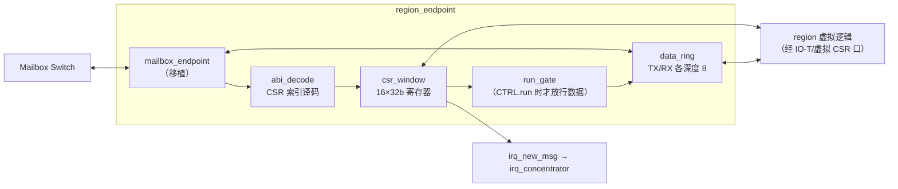
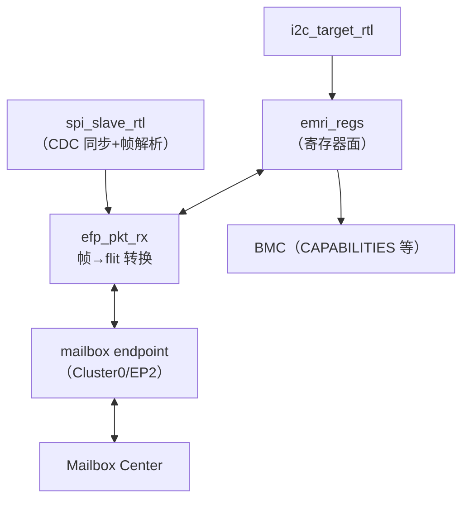
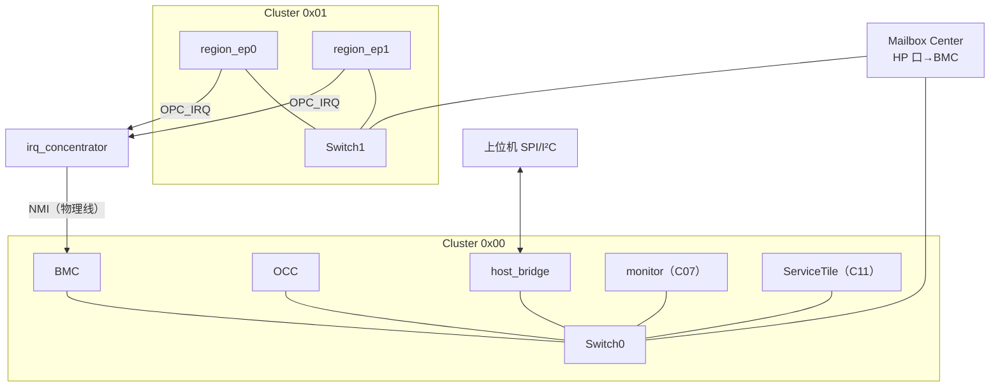

# C04 · EBI 组件（mailbox 移植 / region_endpoint / host_bridge / axi_lite_bridge / irq_concentrator）

> 子系统：S04 · 阶段：P0 起步 → P2 完整 · 重要度 ★★★★★
> 上游：TinyGPU-FPGA `ip/mailbox`（Center/Switch/Endpoint）+ `docs_mailbox_interconnect_spec.md`

## 0. 移植策略（物理映射说明）

mailbox RTL 以**源码级移植**进入 ethereal-shell（你本人迁出，CERN-OHL-S-2.0，文件头注明出处）。移植时的三类改动，全部记录 ADR：

| 改动类型 | 内容 | 原因 |
|---|---|---|
| 兼容性 | SV `interface/modport` 保留，但每个 module 额外提供"展开端口"变体（generate 包装） | Gowin EDA 对 modport 支持需实测（ASSUMPTION #1），nextpnr 也需确认 |
| 扩展 | opcode 新增 `RD_REQ=4'h4 / RD_RESP=4'h5` | 读事务支持（AXI 桥与调试需要）；旧节点收到丢弃+计数，向后兼容 |
| 适配 | endpoint 的 CSR 钩子改为通用 16 字窗口（原设计是 TinyGPU 特化 CSR） | Region ABI 需要 |

---

## 1. region_endpoint（vFPGA 的总线门户）

### 1.1 概念
每个 vFPGA region 挂一个 endpoint，它做三件事：(a) 作为 mailbox 叶子节点收发 flit；(b) 把 CSR 窗口（Region ABI 16 字）暴露为 region 内虚拟逻辑可访问的控制面；(c) 把 DATA 通道流（idx0）桥给虚拟逻辑的数据口。**它是"容器"与"平台"之间的法定边界**。

### 1.2 框图

### 1.3 关键硬件决策
- **run_gate**：CTRL.run=0 时 DATA 通道物理封闭（vout 强制 0，vin 丢弃）——halt 的容器不可能收发数据。这是 L0 结构安全的一部分，2 个 LUT；
- **CSR 双视角**：同一 CSR 窗口，BMC 经 mailbox 访问（管理面），虚拟逻辑经虚拟 CSR 口访问（容器面）——双端口寄存器文件，写优先级：管理面 > 容器面（SCRATCH 区除外，容器面专属）；
- **心跳**：CSR12（HEARTBEAT）写入侧是容器面；看门狗（C07）读侧；
- **问题 1：双口 CSR 的时钟**。管理面在 fabric 时钟、容器面在虚拟时钟——v1 强制**同钟**（region 虚拟时钟=fabric 时钟，由 Shell 统一供），异步留 v3（CDC 版 endpoint）。这是重要的简化决策，记入 ADR；
- **问题 2：flit 宽度 vs 虚拟数据宽度**。mailbox payload=32bit，虚拟数据口也固定 32bit（宽数据在容器内部分拆）——保持 1:1 无封装开销。

### 1.4 扩展与迭代
- v2：DMA 描述符通道（region 直访 BMC SRAM，免 CPU 转发）；
- v3：异步时钟域 endpoint（Gray-code async FIFO 版 data_ring，Cummings 经典结构）；
- 容器间直连：region↔region 的 mailbox 直通流（集群内本地化路由，你的 Switch 原生支持）。

### 1.5 测试与评估
CSR 全地址读写/优先级竞争测试；run_gate 封闭性测试（halt 后注入数据，断言虚拟侧无输出）；DEADBEEF 语义；双视角并发 fuzz。

---

## 2. host_bridge（上位机通道桥）

### 2.1 概念
把 SPI（数据）与 I²C（监控）两个上位机物理口桥进 mailbox 网络，并实现 EMRI 寄存器面（S05 §2.3）。mFSM 模式下它就是管理本体；BMC 模式下它是"BMC 的前台接待"。

### 2.2 框图

### 2.3 关键硬件决策
- **SPI 从机**：Mode 0，≤25MHz。SCK 异步于系统时钟——**全部输入经 2FF 同步 + 边沿检测**，按位收进移位寄存器，字节对齐后入帧 FIFO（ Cummings 风格，深 16）。帧格式 EFP-SPI：[SOF 0xA5][CMD][LEN16][DATA...][CRC16]；
- **I²C target**：SCL 同步采样 + 时钟延展（读遥测时拉低 SCL 等 ADC/数据准备）；7 位地址（默认 0x40，Board Manifest 可配）；
- **EMRI 寄存器面**：见 S05 §2.3 表——host_bridge 持有只读镜像（BMC 周期刷新）+ 直通写（OCC_CMD 转发 mailbox）；
- **问题 1：SPI 帧与 mailbox flit 的速率失配**。SPI 慢（25Mbps），mailbox 快——帧 FIFO 水位背压由 SPI 侧"BUSY 字节"机制表达（主机读到 0x00=忙，轮询）；
- **问题 2：I²C 与 SPI 并发**。两通道独立 FSM，EMRI 访问仲裁（I²C 只读优先，SPI 会话期 I²C 健康数据仍可读——监控永不阻塞原则）。

### 2.4 测试与评估
SPI：随机帧/截断帧/CRC 错误/背压（树莓派+spidev 实测）；I²C：i2cdetect/i2cget 兼容性、时钟延展、24h 轮询；EMRI：两通道并发一致性。

---

## 3. axi_lite_bridge（EBI-Full，P2）

### 3.1 概念
AXI4-Lite 主设备（软核 SoC、外部 AXI IP）→ mailbox 的桥。写=fire-and-forget flit；读=RD_REQ/RD_RESP 配对。

### 3.2 核心设计
- **outstanding 表**：深度 8，每项 {tag[2:0], dest_id, timer[15:0]}；timer 超时（1ms）→ 返回 `32'hDEAD_BEEF` + SLVERR 可选（配置位）；
- **地址映射**：AXI 地址 [23:4] 直接映射 {cluster, ep, csr}（字对齐），[1:0] 忽略（32bit 访问强制）；
- **写响应**：W 通道握手成功即 BVALID——与 mailbox 语义一致（规范 §2.6 fire-and-forget）；
- **问题：读延迟**。读=两跳网络延迟+目标处理，典型 <1µs @100MHz，但 AXI 主设备需容忍长 R 延迟（无固定延迟保证）——文档明示"EBI 读不保证延迟上界"。

### 3.3 测试
随机读写对账（scoreboard）、超时路径、outstanding 满背压、并发多主（两个 AXI master BFM）。

---

## 4. irq_concentrator（中断汇聚）

### 4.1 概念
汇聚全部 region/service 的 OPC_IRQ flit 到 BMC 的 HP 端口，并维护中断挂起表（谁中断了、什么类型），BMC 读表响应。

### 4.2 设计
- 每来源 1 个挂起位（region N → bit N），OPC_IRQ 到达置位，BMC 读 IRQ_ACK 清除对应位；
- 优先级：prio 字段透传；prio=3（看门狗/急停）不仅置位还触发 BMC 的 NMI 物理线（直连，不走 mailbox）；
- 挂起表双口：mailbox 侧只写，BMC 侧读写（经 EBI 桥读 CSR）。

### 4.3 测试
中断风暴（全部 region 同时 IRQ）不丢（挂起位合并可接受，文档化）；NMI 延迟实测 < 100ns（物理直连）。

---

## 5. 组件集成图（EBI 全局）

## 6. 待确认清单
1. Gowin EDA / nextpnr 对 SV interface/modport 的支持（决定是否需要展开端口变体）；
2. RD_REQ/RD_RESP opcode 值域与 TinyGPU 未来规划的冲突（你定）；
3. v1 同钟决策（region 虚拟时钟=fabric 时钟）是否接受；
4. SPI 的 BUSY 字节轮询机制 vs 专用 IRQ 引脚（引脚预算）。
