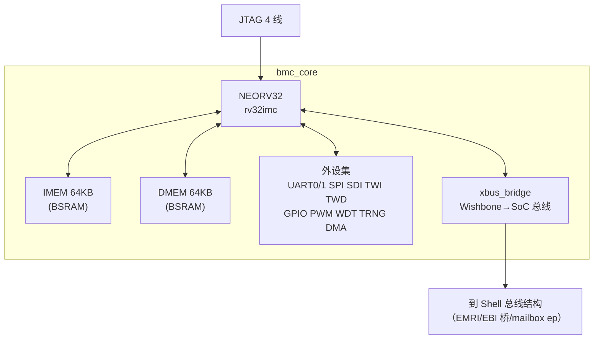
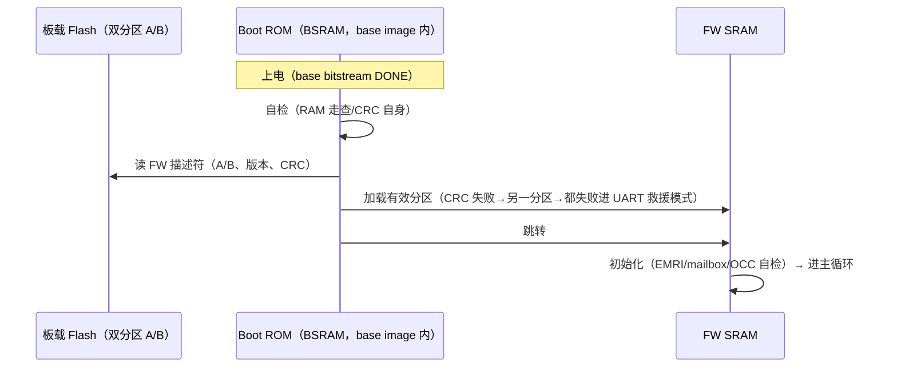

# C05 · BMC 组件（bmc_core / boot 存储 / EMRI 块 / mFSM / 调试 / 时钟复位）

> 子系统：S05 · 阶段：P1 主体 · 重要度 ★★★★★
> 核选型：NEORV32（rv32imc，~2.3K LUT，BSD-3）；备选 VexRiscv。核经 `bmc_core` wrapper 隔离，可换。

## 0. 物理映射总览

| 组件 | 物理实现 | 预算 |
|---|---|---|
| NEORV32 核+SoC 胶合 | fabric LUT | ~2.5K LUT |
| Boot ROM | BSRAM ×4（8KB，初始化随 base bitstream） | 1.2% BSRAM |
| FW SRAM（IMEM+DMEM） | BSRAM ×58（128KB） | 17% BSRAM |
| 镜像暂存双缓冲 | BSRAM ×28（64KB）或 SSRAM 窗口 | 8% |
| 时钟 | PLL 输出 100MHz（源：板载晶振/片内振荡器，见 §6） | 1 PLL |
| 复位 | 上电复位 + BMC WDT + 软复位寄存器，经复位序列器 | — |

---

## 1. bmc_core（核封装层）

### 1.1 概念
NEORV32 的封装壳：固定 generics 配置、实例化所需外设集、把 XBUS（Wishbone）转成内部 SoC 总线、引出调试口。**换核时只改这个 wrapper，SoC 其余部分不动**（E2-BMC2 用 VexRiscv 验证此承诺）。

### 1.2 框图

NEORV32 generics（v1 冻结）：`RISCV_ISA=rv32imc`、`IMEM=64KB`、`DMEM=64KB`、`UART0/1 EN`、`SPI/SDI/TWI/TWD EN`、`GPIO=32`、`WDT EN`、`TRNG EN`、`DMA EN`、`OCD_EN`（JTAG 调试）。

### 1.3 问题
- **NEORV32 是 VHDL**：Gowin EDA 支持 VHDL-2008（实测确认，ASSUMPTION #1）；备选：官方提供 VHDL→Verilog 转换流（GHDL 插件）；
- **外设中断线**：NEORV32 FIRQ 通道分配表（S07/S04 各中断源映射）在固件与 RTL 间必须单一事实源——用 spec 生成头文件；
- **TRNG 在 FPGA 上的熵源**：NEORV32 TRNG 依赖物理结构，FPGA 实现质量需验证（随机性测试套件跑一遍）；不足则验签 nonce 改用计数器+设备 ID 混合。

---

## 2. boot 与存储

### 2.1 启动链路（冻结 v1）

### 2.2 关键决策
- **救援模式**：双分区都坏时，Boot ROM 进 UART XMODEM 接收模式——**永不变砖**（对标 BMC 的 recovery）；
- FW 自更新：运行中经 EFP 收新 FW→写备用分区→校验→置启动标志→软复位；断电安全靠"先写备分区、后切标志"的顺序；
- Flash 访问：GW5 的 MSPI/Flash 接口经 Gowin 原语或 SPI 控制器（Tang Mega 128Mbit Flash）——用 NEORV32 SPI host + 自研 Flash 驱动，避免依赖 AE350 相关 IP。

---

## 3. EMRI 块（管理寄存器面）

### 3.1 概念
S05 §2.3 定义的寄存器面的 RTL 实体：BMC 侧可写（周期刷新健康数据）、host_bridge 侧可读（上位机视角）、mFSM 模式下是主控。物理上是双口寄存器文件 + 刷新同步逻辑。

### 3.2 设计
- BMC→EMRI：SoC 总线写（每 10ms 刷新遥测/健康字）；
- host_bridge→EMRI：I²C/SPI 时钟域读——**读侧全部经 2FF 同步器**（寄存器值慢变，可接受）；
- CAPABILITIES 位由参数生成（has_bmc=1 固定于 BMC 版本；mFSM 版本=0）——同一份 RTL，参数分岔。

---

## 4. mFSM（小器件管理单元）

### 4.1 概念
无 CPU 的管理单元：把 BMC 的"决策"搬到上位机，片内只留 EMRI 寄存器面 + OCC 直通 + 极简会话 FSM（接收缓冲区管理/校验结果上报）。目标器件：<20K LUT 的 GW5AT-15/GW2A 级。

### 4.2 框图与行为

上位机流程（协议与 BMC 模式相同、智能位置不同）：推镜像到 rx_buf → 上位机自算验签（mFSM 不算）→ 写 OCC_GO → 轮询 DONE。**fsm 只有 5 个状态，200 LUT 以内。**

### 4.3 测试
与 BMC 模式跑**同一套 EMRI 一致性测试套件**（ethctl 无感是验收标准）。

---

## 5. 调试组件

| 通道 | 实现 | 用途 |
|---|---|---|
| UART0 控制台 | 115200 8N1，日志分级 | 日常 |
| JTAG（4 线） | NEORV32 OCD → 板级排针 → FTDI/OpenOCD/GDB | 断点/单步（NEORV32 官方推荐接法，已验证） |
| 事件日志 | 64 条环形缓冲（C07），I²C/UART 可读 | 死后验尸 |
| 内部探针 | 关键状态寄存器映射 EMRI（OCC 状态/lock 位图/最近错误） | 上位机 ethctl inspect |

## 6. 时钟与复位（与 C12 联动）

- **主时钟源**：Tang Mega 138K Dock 的主晶振频率需从原理图确认（ASSUMPTION #2，常见为 27/50MHz）；备选 GW5 片内振荡器（1.67~105MHz，精度差，仅救援模式用）；
- PLL 产 100MHz 域：BMC/mailbox/OCC/region（v1 同钟，C04 §1.3）；PLL 锁定信号入复位序列器；
- **复位序列器**：POR → 等 PLL lock → 释放 BMC 复位 → BMC 自检后释放 Shell 其余复位 → region 复位由 lifecycle 单独控制（每 region 独立复位线，Region ABI CTRL.rst）；
- GSR：Gowin 全局复位网络用于 base image 级初始化（DONE 信号后自动释放），我们的 rst_ni 走 LW/普通布线。

## 7. 测试与评估汇总

| 组件 | 测试 | 通过标准 |
|---|---|---|
| bmc_core | Verilator 全仿真 hello/CSR 读写；上板对照 | 仿真与硬件行为一致 |
| boot | 断电/坏分区/双坏注入 | 回退路径全通；救援模式可达 |
| EMRI | BMC/mFSM 一致性套件 | ethctl 输出逐字节一致 |
| mFSM | 上位机脚本全流程 | 部署成功；5 状态覆盖 |
| JTAG | OpenOCD connect/halt/step/断点 | 全流程可用 |
| 复位序列 | 各复位域释放顺序 | 时序图与 spec 一致 |

## 8. 待确认清单
1. NEORV32 VHDL 在 Gowin EDA 的综合（ASSUMPTION #1）；
2. Dock 主晶振频率（ASSUMPTION #2，查原理图）；
3. TRNG 质量（随机性测试结果）；
4. Flash 双分区的布局（128Mbit 如何划分 base/FW A/FW B/镜像池）。
