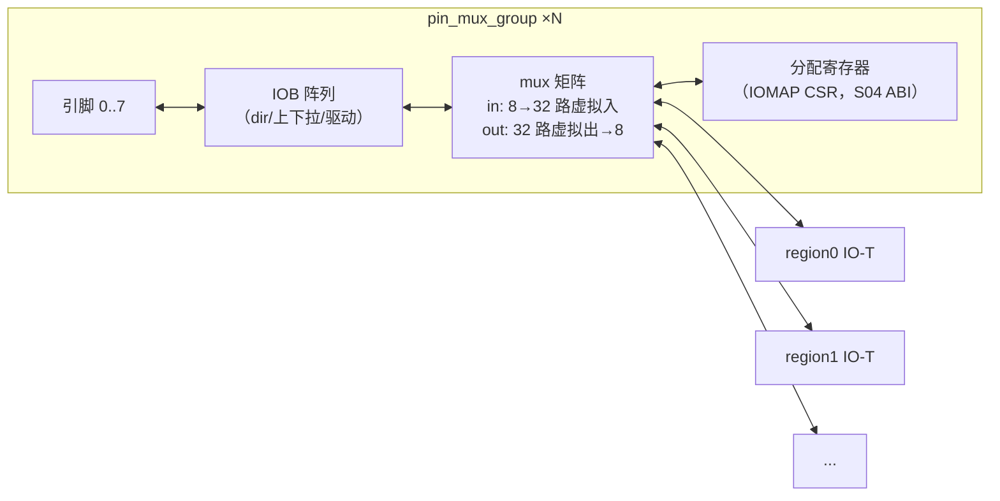

# C06 · IO 组件（引脚 mux 组 / UART·GPIO·SPI·I²C 代理 / 硬核包装 / CDC）

> 子系统：S06 · 阶段：P1 起步 → P2 完整 · 重要度 ★★★★☆
> 两级架构：L1 引脚 Mux（低速通用）+ L2 协议代理（安全省心）。region 逻辑**永不直接触碰物理引脚**。

## 0. 物理映射总览

| 组件 | 物理实现 | 备注 |
|---|---|---|
| 引脚 mux 组 | LUT mux + IOB（方向/上下拉/驱动强度由约束与 Board Manifest 决定） | 每组 8 引脚 |
| 协议代理 | fabric LUT + FF/BSRAM FIFO | 标准寄存器布局（RFC-004） |
| 硬核包装 | GW5 ADC/PLL mDRP/SerDes（后期）、片内振荡器 | 寄存器 façade |
| CDC | 2FF 同步器 / Gray-code async FIFO | 外部时钟接口必备 |

---

## 1. 引脚 mux 组 pin_mux_group（L1）

### 1.1 概念
8 个物理引脚为一组，经 mux 矩阵把其中任意引脚连接到任意 region 的 IO-T 虚拟口。分配决策由 daemon 按 Board Manifest 约束执行，RTL 只提供"可配开关"。

### 1.2 框图



### 1.3 接口与位域（冻结 v1）
每组配置寄存器 8×12bit：`{out_sel[4:0]（哪路虚拟出驱动本引脚，31=高阻）, in_en, pull[1:0], slew, drive[1:0]}`；输入路径：引脚→2FF 同步（可旁路）→虚拟入总线（全组广播，region 自选）。

### 1.4 核心设计与问题
- **高阻默认**：上电/blank 后全部引脚高阻（oe_gate 与 C01 §4 联动）——电气安全默认态；
- **输出寄存**：每引脚输出经 1 级寄存器（IOB 内 oreg，Gowin 支持 oreg_in_iob 选项）——改善引脚时序；
- **问题 1：mux 层级延迟**。8→32 mux 为 2 级 LUT + 走线，引脚路径总延迟预算 10ns（100MHz 级）——**高速接口（>50MHz）不走 L1 走 L2**，写进规范；
- **问题 2：跨组一致性**。同一总线信号的引脚分在不同组 → 偏斜不可控；manifest 中把相关引脚标记为"建议同组"，分配器强制；
- **问题 3：输入广播的扇出**。8 引脚输入广播到全部 region 输入口——扇出大，中间加寄存器切片（输入延迟 +1 拍，文档化）。

### 1.5 测试与评估
mux 全连接穷举（每虚拟出→每引脚）；高阻默认验证（复位/blank 中示波器确认）；频率表征（逐级升频测误码，写回 manifest）；注入分配冲突（daemon 拒绝路径）。

---

## 2. 协议代理（L2）：通用骨架

### 2.1 概念与统一骨架
所有代理共享同一骨架（差异只在协议引擎核）：**寄存器面（RFC-004 标准布局）+ TX/RX FIFO + 协议引擎 + 中断**。统一骨架让固件驱动与 Astral 虚拟 IO 驱动共用代码结构。

```mermaid
flowchart LR
    subgraph PROXY["proxy_<proto>"]
        REG["csr 寄存器面<br/>CTRL/STATUS/TX/RX/CFG/IRQ"]
        TXF["TX FIFO（16×32b）"] RXF["RX FIFO（16×32b）"]
        ENG["协议引擎核"]
        IRQL["中断逻辑"]
    end
    EBI["mailbox endpoint"] <--> REG
    REG --> TXF --> ENG --> PINS["物理引脚（经 mux 或独占）"]
    PINS --> ENG --> RXF --> REG
    REG --> IRQL --> EBI
```

### 2.2 各引擎要点

| 代理 | 引擎核心 | 关键参数/模式 | 特有问题 |
|---|---|---|---|
| UART | 波特率发生器（16x 过采样）+ 移位收发 | 波特率/校验/停止位；16550 简化子集 | 过采样时钟分频精度（误差 <2%） |
| GPIO | 32 路方向/读写/边沿中断 | 每路 dir/in/out/irq_edge | 中断抖动（可配消抖计数） |
| SPI master | 时钟分频 + 4 模式移位引擎 + CS 自动控制 | mode0-3/分频/CS 极性 | 多从机 CS 管理（4 根 CS） |
| I²C master | 位 bang 状态机（START/STOP/ACK/延展检测） | 100/400kHz；7/10 位地址 | 从机延展等待超时处理 |
| PWM | N 路计数器+比较器 | 周期/占空/死区（电机场景） | 多路同步更新（双缓冲装载） |
| QEI | 正交解码计数器（P2+） | x1/x2/x4 模式 | 毛刺滤波 |

### 2.3 与你已有资产的复用
`ip/interface/uart/uart_mailboxfabric.sv`、`spi/spi_mailboxfabric.sv` 已是 fabric 卫星形态——**协议引擎核直接复用**，替换寄存器面为 RFC-004 布局即可（迁移时统一 header 规范）。

### 2.4 测试与评估
每代理：协议一致性（cocotb 对标准 BFM 模型）+ 上板真实外设（UART 回环、SPI EEPROM 25LC、I²C 温度传感器、编码器电机）+ 多容器复用仲裁（P3）。

---

## 3. 硬核包装 hard_wrapper（P2+）

### 3.1 概念
GW5 的硬核资源以寄存器 façade 形式接入 EBI：ADC（X 通道过采样，免外部基准）、PLL mDRP（动态重配时钟）、片内振荡器、SerDes/PCIe（P3+ 高速数据通道）。Zynq 侧则是 PS 外设与 SYSMON。

### 3.2 设计要点（ADC 例）
- façade：CMD（通道选择/启动）/STATUS（忙/完成）/DATA（12bit+）/RATE（采样率分频）；
- 转换完成可发 OPC_IRQ（监控与容器两用）；
- mDRP 注意：ADC/PLL 的 mDRP 是 Gowin 的动态重编程口——façade 只允许白名单寄存器写入（防容器乱改时钟，安全边界）。

## 4. CDC 组件库 cdc_lib

| 组件 | 用途 | 结构 |
|---|---|---|
| `cdc_2ff` | 单bit 控制/状态 | 双触发器同步 |
| `cdc_pulse` | 脉冲跨域 | 翻转同步+边沿检测 |
| `cdc_async_fifo` | 多bit 数据流 | Gray 指针+双口 RAM（Cummings 经典，已交叉验证为工业标准） |
| `cdc_bus_hold` | 慢变多bit 寄存器 | 同步器+一致性说明（EMRI 读侧用法） |

所有跨域组件**只允许从这个库实例化**（CI lint 规则检查自定义 synchronizer）。

## 5. 测试与评估汇总
| 组件 | 测试 | 标准 |
|---|---|---|
| pin_mux | 穷举/高阻/频率表征 | §1.5 |
| proxy_* | 协议一致性+真实外设 | §2.4 |
| cdc_lib | 形式化（SymbiYosys 指针属性）+ 随机时钟比 fuzz | 无亚稳态传播证据 |
| hard_wrapper ADC | 已知电压源读数 | 误差报告 |

## 6. 待确认清单
1. Dock 板上哪些引脚组做 L1 池（PMOD×2、2×20P、DVP——需你按使用习惯圈定）；
2. L2 第三代理：SPI master 还是 I²C master 先（S06 §7 已问）；
3. SerDes 高速通道的目标场景（决定 P3 硬核包装优先级）；
4. ADC 参考电压/输入范围（查 Dock 原理图，差分×2）。
