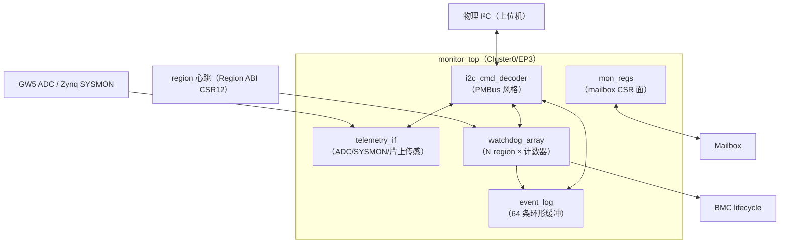
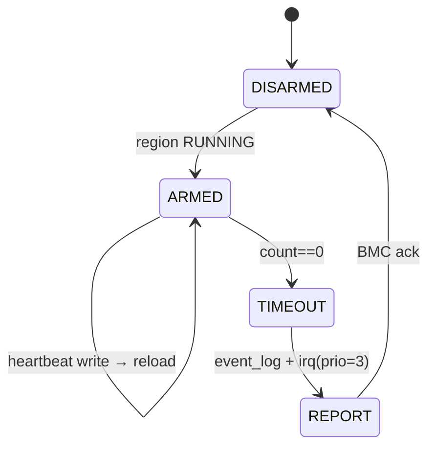

# C07 · 监控组件（I²C 命令解码器 / 遥测接口 / 看门狗阵列 / 事件日志）

> 子系统：S07 · 阶段：P1 起步 → P3 完整 · 重要度 ★★★★☆
> 定位：平台的"神经系统"。对上 i2cget 可读，对内生杀予夺（看门狗），对后留下证据（事件日志）。

## 0. 组件总览

---

## 1. i2c_cmd_decoder（I²C 监控命令解码器）

### 1.1 概念
实现 RFC-003 命令集（PMBus 风格 + MFR 自定义区）的 I²C target：命令字节→寄存器地址映射→读数据复用。物理上是：I²C 字节收发引擎 + 命令锁存器 + 读数据 mux + 分页寄存器。

### 1.2 核心设计
- **PAGE 语义**（PMBus 经典设计）：PAGE 寄存器锁存当前 region 号，MFR_SLOT_STATUS 等命令作用于当前 PAGE——上位机读多 region 状态的协议开销最小化；
- **读序列**：标准 PMBus "command + repeated-start + read"流程；字节序小端在前；
- **时钟延展**：读遥测（0x8B/0x8D）时若 ADC 转换未完成，拉低 SCL 等待（上限 5ms，超时返回 0xFFFF + 置错误位）——树莓派的 stretching bug 规避：优先保证转换在轮询间隔内完成，延展只做兜底；
- **写保护**：除 OPERATION/MFR_RESTART 外全部只读；写命令需先写 UNLOCK 码（0x5AA5 到保留寄存器，防总线噪声误触发 region 重启）。

### 1.3 问题
- I²C 地址冲突：默认 0x40，Board Manifest 可配（7 位空间）；
- 多字节读的原子性：16 位遥测值读取中途被刷新 → 读锁存机制（读命令到达时快照整字）。

---

## 2. telemetry_if（遥测接口）

### 2.1 概念
统一温度/电压采集：GW5 侧经 X 通道过采样 ADC（免外部基准，已验证存在）；Zynq 侧经 SYSMON；另采集 OCC 状态计数、重构计数等"逻辑遥测"。

### 2.2 设计
- 周期采集 FSM：ADC 通道轮询（内核电压/外部差分/温度二极管），原始值→定点转换（查表或移位近似）→ 寄存器；
- 转换公式与校准参数存 Board Manifest（每板可校准）；v1 精度目标：电压 ±50mV、温度 ±5°C（诚实标注"监控级非计量级"）；
- 历史缓冲：每通道 64 点环形（P3，趋势分析/CSV 导出）。

---

## 3. watchdog_array（看门狗阵列）

### 3.1 概念
每 region 一个递减计数器：容器按 manifest 声明周期写 HEARTBEAT 重载；计数值到 0 → 触发故障流程。**硬件上就是 N 个共享时基的递减计数器 + 比较器**，每 region 成本 <30 LUT。

### 3.2 框图与行为

- 计数宽度 24bit（@100MHz ≈ 167ms 最大窗口）；窗口由 manifest 写入（BMC 在 RUNNING 前配置）；
- 窗口期（windowed watchdog，P2）：心跳太早也算异常（防"疯狂踢狗"的死循环容器）；
- 联动链：TIMEOUT → event_log + prio=3 IRQ → BMC lifecycle STOPPING→BLANKING → restartPolicy。

---

## 4. event_log（事件日志）

### 4.1 概念
64 条环形缓冲（BSRAM ×1 足够：64×16B），每条 {timestamp32, region_id4, event8, cause16}。时间戳来自自由运行计数器（上位机换算）。

### 4.2 设计
- 写侧：各子系统事件线（OCC 错误/看门狗超时/验签失败/部署完成…）经优先级编码器写入（同拍多事件按优先级）；
- 读侧：I²C MFR_EVENT_LOG（分页读出）+ mailbox CSR + UART dump；
- 持久化（P3）：关键事件（fatal 级）镜像到 Flash 日志区（磨损均衡：环形页）。

---

## 5. SEU 擦洗接口（Zynq P3 / Gowin 评估）

- Zynq：BMC 经 PCAP/ICAP 调度 SEM IP 周期帧读回；擦洗节奏寄存器可配；修复事件入 event_log；
- Gowin：配置系统官方支持"SEU detection and error correction"（DS1113E §2.10，已交叉验证）——P3 spike 确认其在用户逻辑中的可用接口（UG714 编程配置指南），可行则与 Zynq 统一抽象为 `scrub_if`。

## 6. 测试与评估汇总

| 组件 | 测试 | 标准 |
|---|---|---|
| i2c_cmd_decoder | 命令集对参考主机（树莓派脚本）全遍历；stretching；24h 轮询 | 无锁死、数据一致 |
| telemetry_if | 已知电压/温度源比对 | 误差在目标内并归档 |
| watchdog_array | 超时注入（正常踢狗/停止/过早） | 三种路径全对；邻区无损 |
| event_log | 事件风暴（>64 条溢出） | 环形覆盖正确；fatal 不丢（优先级） |
| 联动 | 端到端故障注入矩阵 | 全部按 restartPolicy 处置 |

## 7. 待确认清单
1. UNLOCK 码机制是否过度设计（vs 直接写保护位）？——评审决定；
2. GW5 SEU 接口的用户可用性（P3 spike）；
3. 事件日志 Flash 持久化的优先级（P2/P3）。
