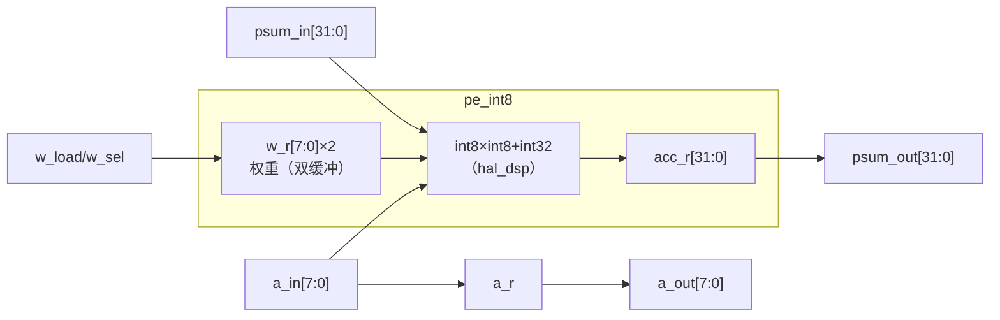
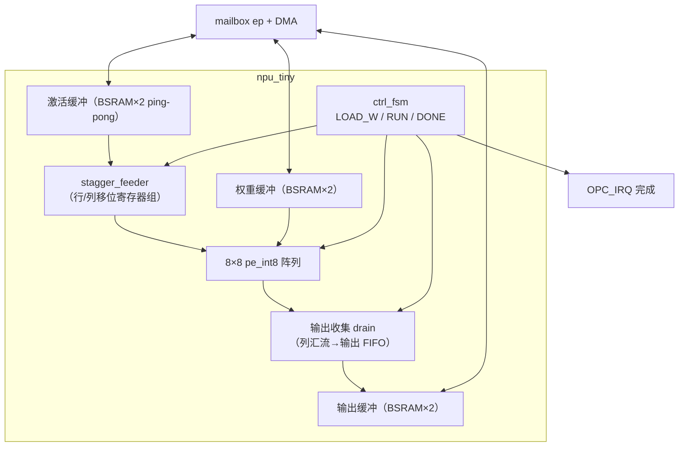
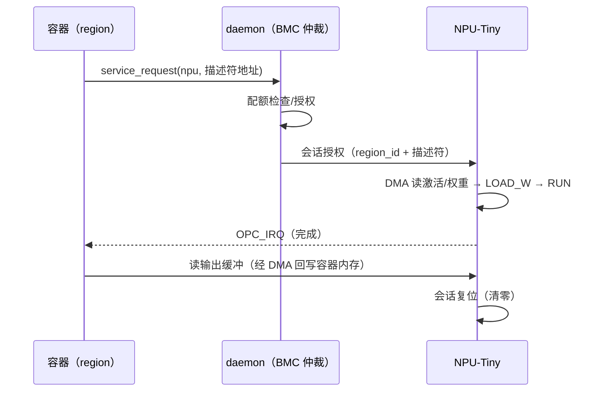

# C11 · NPU-Tiny 组件（PE / systolic 阵列 / 馈送 / 权重缓冲 / DMA / 服务寄存器）

> 子系统：S11 · 阶段：P3 · 重要度 ★★★☆☆（首个 Service Tile，框架意义大于算力）
> 规格基线：8×8 INT8 weight-stationary systolic，≥0.5 GOPS @100MHz，KWS 级 TinyML 负载。

## 0. 物理映射总览

| 组件 | 物理实现 | 预算 |
|---|---|---|
| 64 × PE（INT8 MAC） | GW5 DSP（27×18 装 8×8 乘绰绰有余；优化：一 DSP 双 8bit 乘） | 64 DSP（298 池内）或 32 DSP（双打包优化） |
| 权重/激活/输出缓冲 | BSRAM 双口（双缓冲 ping-pong） | ~20 BSRAM |
| 控制/馈送/寄存器 | fabric LUT | ~3-5K LUT |
| 服务接口 | mailbox endpoint（Cluster0/EP4）+ DMA | — |

## 1. PE（处理单元）

### 1.1 概念
systolic 阵列的细胞：每拍做一次 INT8 乘加，并把激活向右传、部分和向下传（weight-stationary：权重预载在 PE 内不动）。

### 1.2 框图

| 信号 | 说明 |
|---|---|
| `a_in/a_out` | 激活横传（寄存 1 拍） |
| `psum_in/out` | 部分和下传 |
| `w_load` | 权重预载使能（列方向移位装载） |
| `w_sel` | 双缓冲权重选择（当前/下一组，消除预载等待——TPU 缺点的经典解法，已交叉验证） |

### 1.3 问题
- GW5 DSP 的控制（流水/旁路/级联）与 PE 语义映射——复用 C02 DSP-T 的《hal_dsp 映射表》；
- 双打包优化（一 DSP 两 8bit 乘，Libano 技巧）v1 不做，留 v2（PE 数减半或算力翻倍）。

## 2. 阵列与馈送

### 2.1 概念
8×8 PE 网格 + 边缘错位馈送（stagger）：A 矩阵行 i 延迟 i 拍、B/部分和按列对齐——波前式推进。延迟 ≈ 流水深 + 2N-2 拍，满流水后每拍 64 MAC。

### 2.2 框图与集成

### 2.3 ctrl_fsm（冻结 v1）
`IDLE → LOAD_W(64拍移位) → RUN(K+N 拍) → DRAIN(N 拍) → DONE(IRQ) → IDLE`；DONE 后自动会话复位（寄存器清零——**禁止跨会话状态泄漏**，S10 安全用例）。

### 2.4 问题
- stagger 的移位寄存器用 FF（N≤8，开销小）；
- K 维（内积长度）任意：循环分块（tiling），CTRL 计数 K/8 轮；
- 大矩阵分块由驱动软件完成（tiling 参数经服务寄存器下发）。

## 3. DMA 与服务寄存器

### 3.1 服务调用流程

### 3.2 服务寄存器（endpoint CSR）
`DESC_ADDR`（描述符{B矩阵地址,A矩阵地址,C地址,M,K,N}）/`START`/`STATUS`/`IRQ_EN`/`SESSION_ID`/`RESET`。

## 4. 扩展与迭代
- v2：DSP 双打包（128 等效 PE）；16×16 阵列（评估 LUT/DSP 预算）；int8→int4 权重；
- v3：多 NPU-Tiny 实例池化；激活函数硬加速（ReLU/量化）在 drain 路径；
- 长评：CGRA 化 Service Tile（可配数据流阵列）——与 fabric 的粗粒度未来汇合。

## 5. 测试与评估

| 层级 | 测试 | 标准 |
|---|---|---|
| PE | cocotb 对 numpy int8 MAC | bit-true |
| 阵列 | 8×8 手算矩阵 → 随机矩阵 sweep | 与 numpy 一致 |
| 馈送 | K 非 8 倍数、M/N 边界 | 分块结果一致 |
| 系统 | KWS demo（DS-CNN 小型，TFLM 量化模型） | 推理正确率=软件参考 |
| 性能 | 计数器实测 GOPS/能效 | ≥0.5 GOPS @100MHz |
| 安全 | 双容器交替会话 | 会话间寄存器/缓冲检查零泄漏 |

## 6. 待确认清单
1. 阵列 8×8 vs 4×4（LUT/DSP 预算与演示效果的平衡）——P3 开工时定；
2. KWS 模型来源（自训 vs TFLM 示例移植）；
3. 音频输入链路（Dock 的 MIC ARRAY 接口 or 外挂 I²S 模块）。
