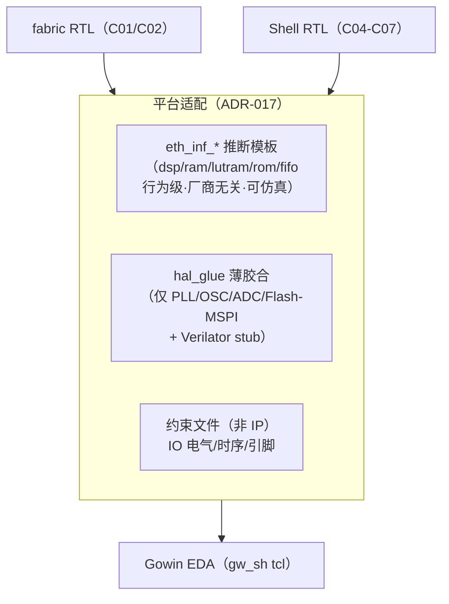
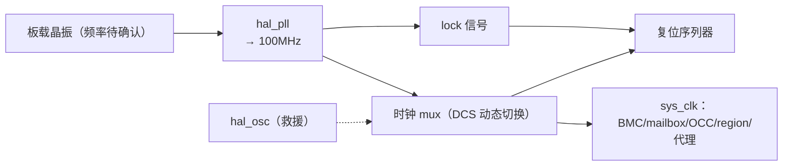
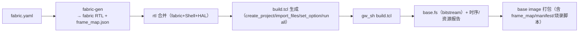

# C12 · 平台组件（HAL 原语 / 时钟复位 / 约束模板 / base 构建）

> 子系统：S12 · 阶段：P1 主体 · 重要度 ★★★★★
> 原则：所有厂商相关性**只能**存在于本文件的组件里。fabric/Shell 其余部分看不到任何厂商原语。

## 0. 组件总览

---

## 1. HAL 构成（ADR-017 后重构：推断模板 + 薄胶合）

**哲学转变（2026-07）**：HAL 不再是"厂商原语 wrapper 层"，而是两部分——(a) `eth_inf_*` **推断模板**（C13 §2，行为级、厂商无关、Verilator 可仿真，覆盖 DSP/RAM/分布式 RAM/ROM/FIFO——**自有逻辑的 95%**）；(b) `hal_glue` **薄胶合**（仅 C13 §4 例外清单中的不可推断资源，允许厂商原语，Verilator 用同名 stub 替换）。

| 类别 | 组件 | 内容 | Verilator |
|---|---|---|---|
| 推断模板（eth_inf_*） | dsp_mac / ram / lutram / rom / fifo | 行为级编码模式 + `eth_config.svh` 属性层 | ✅ 直接仿真 |
| 薄胶合 `hal_pll` | PLL（倍/分频/相位） | 厂商原语区 #1 | stub `clkgen_stub` |
| 薄胶合 `hal_osc` | 片内振荡器 1.67-105MHz | 厂商原语区 #2 | stub |
| 薄胶合 `hal_adc` | X 通道过采样 ADC | 厂商原语区 #3 | stub（伪读数序列） |
| 薄胶合 `hal_flash` | 板载 128Mbit Flash | v1 用通用 SPI 控制器（可推断）；MSPI 专用口留例外 | 开源 SPI Flash 模型 |
| 非 IP 项 | IO 电气（电平/驱动/上下拉）、GSR | **约束文件**（.cst/.xdc），不进 RTL | 不涉及 |

**纪律**：(1) 自有核心只准实例化 `eth_inf_*`；(2) 厂商原语只允许出现在 `hal/<vendor>/glue/` 内；(3) CI grep 门禁：glue 目录之外不得出现厂商原语名（C13 §4 名单）；(4) 推断质量由 C13 §6 推断验证套件持续核对（推断报告原语计数入性能看板）；(5) `hal_ssram` 暂列推断模板候选（SSRAM 推断可行性 ASSUMPTION，首轮套件验证；失败则 SSM-T 改用 BSRAM 池）。

## 2. 时钟复位策略 clk_rst

### 2.1 时钟架构（v1 同钟决策，C04 §1.3）

### 2.2 复位序列（冻结 v1）
1. base bitstream DONE（GSR 自动释放）；
2. 复位序列器等待 PLL lock（超时 → 切 hal_osc 救援钟 + 报警）；
3. 释放 BMC 复位 → BMC boot（C05 §2）；
4. BMC 自检通过 → 释放 Shell 全局复位（mailbox/OCC/monitor/代理）；
5. region 复位：全部保持复位，由 lifecycle 逐个释放（Region ABI CTRL.rst）；
6. region 时钟使能：每 region 一个 `clk_en`（OCC 控制，halt 时关钟省功耗——GW5 支持动态时钟开关）。

### 2.3 问题
- 100MHz 目标的 WNS 余量：fabric 满布时可能紧张——备选 75/50MHz 档位，约束模板参数化；
- 时钟 mux 的毛刺：DCS（动态时钟切换）原语只在救援场景用，正常运行不切换。

## 3. 约束模板 constraints

| 文件 | 内容 | 生成方式 |
|---|---|---|
| `pins.cst` | 引脚分配（SPI/I²C/UART/JTAG/L1 池/调试） | **由 Board Manifest 生成**（单一事实源） |
| `timing.sdc` | 时钟定义/CDC 组/false path（配置总线/EMRI 读侧） | 模板 + 参数 |
| `fabric_floor.tmpl` | fabric 区域 floorplan（P2，稳定性与局部重构铺垫） | fabric-gen 联动 |

纪律：CDC 路径必须有显式约束（异步时钟组），CI 检查未约束 CDC 报告。

## 4. base 构建 base_build

### 4.1 流程（gw_sh tcl，官方 SUG1220E 验证）

### 4.2 关键决策
- build.tcl 由 Python 生成（参数：器件 PBG484A/Device Version B/C、频率、引脚文件）；
- 报告解析器：自动提取 LUT/BSRAM/DSP 占用、WNS——写入每次构建的 JSON 记录（趋势追踪，S14 性能看板数据源）；
- 烧录：openFPGALoader（CI）或 Gowin Programmer（手动）；Flash 布局（C05 §8-4）。

### 4.3 问题
- 教育版 IDE 的 138K 支持（已验证 V1.9.9+ 可用）与商业授权边界：CI 构建节点用哪版——商业用途需商业 license（风险 R4 已登记）；
- gw_sh 每次构建全量重跑（增量策略：base image 本身低频，接受 30-60min 构建）。

## 5. 测试与评估汇总

| 组件 | 测试 | 标准 |
|---|---|---|
| HAL 各原语 | 单独 cocotb + 上板单元 | 行为=参考；综合原语核对 |
| clk_rst | 复位序列仿真 + 上电 20 次循环 | 序列一致；无启动失败 |
| 约束 | 时序报告 + CDC 检查 | WNS≥0；无未约束 CDC |
| base_build | 干净环境一键构建 | 重现性（同输入同 bitstream CRC，允许厂商种子差异则记录） |

## 6. 待确认清单
1. Dock 主晶振频率与可用时钟引脚（查原理图，阻塞 C05 §6）；
2. 教育版 vs 商业版 IDE 的部署（CI 节点授权方案）；
3. fabric floorplan 是否 P1 就需要（建议 P2，P1 让工具自由布局先拿基线数据）；
4. Flash 布局方案（base/FW-A/FW-B/镜像池/日志区的地址划分）。
