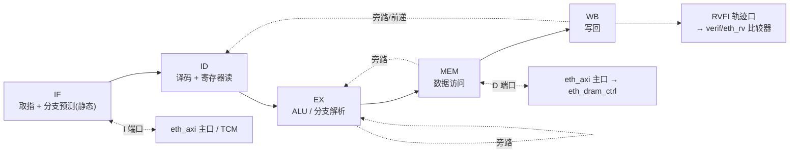

# C14 · eth_rv RV64 核心组件（RV-B 里程碑起始）

> 性质：**HDL 级组件规范**。上游 = `subsystems/S15-应用处理器子系统.md §2.2/§2.3` + `docs/adr/ADR-018-axi-noc-riscv-cluster.md`。
> 本文件补齐 S15 缺失的 component 级细节（此前 `components/` 无 eth_rv 对应文档，RTL 不可开工，见 E2-RV1 注记）。
> 约束继承 C13（推断优先）：**零厂商原语**；DSP/RAM 行为级交 EDA 推断；不可推断块只进 `hal/<vendor>/glue/` 且附 Verilator stub。
> 验证载体（先行已就绪）：`ethereal-shell/verif/eth_rv/`（Spike 锁步 + 4 ELF 语料 + 121 pytest，`make verif-rv`）。

---

## 1. 范围与里程碑

| 里程碑 | 内容 | 启动目标 | 状态 |
|---|---|---|---|
| **RV-B（本文件）** | RV64IMC，顺序单发射 5 级，无 MMU | bare-metal / FreeRTOS over UART，**DiffTest vs Spike 零分歧** | 本规范 |
| RV-C | +F/D（FPU）+ Sv39 MMU | **boot Linux**（GW5 验证档） | 后续 |
| RV-E | 2-4 核共享 L2 相干 | SMP Linux | 后续 |
| RV-F | Hypervisor + Vector 协处理器 + Z\* | RVA23 完整 | 后续 |

RV-B 的**验收（机器可验）**：`corpus/` 全部 ELF 在 RTL 上运行，`rv_difftest.py` 报 `MATCH … 0 divergence`；
且 bare-metal `hello` 经 UART 输出可见。

## 2. 冻结参数包

单一参数包 `eth_core_config_pkg`（S15 §2.3；只 bless 2-3 个配置，CVA6 纪律）：

| 参数 | RV-B 取值 | 语义 |
|---|---|---|
| `XLEN` | 64 | 数据宽度（32 为降级配置，RV-B 不 bless） |
| `CORE_COUNT` | 1 | RV-B 单核（RV-E 才多核） |
| `HAS_MMU/H/V/FPU/CLIC` | 0/0/0/0/0 | RV-B 全关；CLIC 随 RV-C 评估 |
| `ICACHE/DCACHE` | 0（v0：直连 I/D 端口）/可选小容量 | 缓存可选，v0 先用直连 + `eth_axi` 突发 |
| `TCM` | 可选 | BootROM 阶段替代路径 |

## 3. 微架构（RV-B）

- **流水级**：IF → ID → EX → MEM → WB（5 级；若加 I-cache 则 IF 拆 IF1/IF2 → 6 级）。CVA6 结构参考，**RTL 100% 原创**。
- **顺序、单发射、无乱序**；分支：静态预测（向后跳转 taken）+ EX 解析，误预测冲刷。
- **前递**：EX/MEM/WB → EX 三路旁路；load-use 插入一拍气泡。
- **异常/中断**（RV-B 最小集）：ecall/ebreak/非法指令/加载对齐/misaligned fetch → `mepc/mcause/mtval/mstatus/mie/mip`；
  机器定时器中断来自 CLINT（MMIO）。
- **CSR**：RV-B 的 M-mode 最小集（mstatus/misa/mie/mip/mtvec/mepc/mcause/mtval/mscratch/mhartid/mvendorid…）。
  未实现 CSR 访问 → 非法指令异常（**不静默**）。

## 4. 接口（RTL 端口契约）

| 接口 | 信号组 | 说明 |
|---|---|---|
| **I 端口** | `imem_req/valid/ready + addr + rdata + rresp`（AXI4 主或简化的 valid/ready 直连） | 取指；v0 单未完成事务，允许 1-2 拍延迟 |
| **D 端口** | 同上 + `wdata/wstrb/we` | 数据访问；**目标内存 = `eth_dram_ctrl` 插座**（`ethereal-spec/control/eth-axi-v0.md` §9 契约） |
| **CLINT/PLIC** | MMIO（经 D 端口地址译码） | 定时器/中断（Linux 标准驱动；RV-B 仅需 CLINT 定时器） |
| **RVFI 轨迹口** | `rvfi_valid/order/pc/insn/rd/wdata + mem_valid/addr/wdata/rmask/wmask` | **专为 DiffTest**：与 `verif/eth_rv/rv_trace.py` 的 `cycle pc rd value` 规范一一对应；这是 RV-B 的**一等接口**，不是调试附加 |
| **调试** | 可选 JTAG/调试模块 | RV-B 不做，留 RV-C |

## 5. DiffTest 集成契约（必须遵守）

1. RTL 必须能按提交顺序吐出 `cycle pc rd value`（无架构写时 `rd=-`；x0 写丢弃），与
   `ethereal-shell/verif/eth_rv/README.md` 的规范逐字段一致；
2. 内存访问比对（下一增量）要求 D 端口旁路出 `mem_addr/mem_wdata/mem_rmask/mem_wmask`，与 Spike 的 `mem` 日志比对；
3. 任何"轨迹与实际执行不一致"（例如提交了被冲刷的指令）都算 FAIL——轨迹口是**硬约束**；
4. 已知坑（由语料差分环实测）：C 扩展 `C.J` 立即数位 5、`c.addi16sp` 分散位映射、`mulh/mulhsu/mulhu` 高半字——
   实现时必须有针对性用例（语料已覆盖）。

## 6. 与平台其余部分的衔接

- **AXI**：核经 `eth_axi` 主口接 `eth_dram_ctrl`；**注意 v0 xbar 尚无突发端口**（E2-AXI2 进行中）——
  RV-B 可先**直连** DRAM 插座（单主设备），xbar 突发扩展落地后再挂到 xbar 之后。
- **BMC 共存**：BMC（NEORV32，S05）与应用核是**两个独立主设备**；EMRI 寄存器面归 BMC，应用核不碰 fabric 配置面。
- **无 DDR 配置**（GW5 bring-up 前，S15 §4）：核运行于 BootROM + 片上 SRAM + 可选 SPI-flash rootfs；
  `eth_dram_ctrl` 的 `MEM_BASE/MEM_BYTES` 参数承载该差异（当前 ASSUMPTION：`0x8000_0000`）。

## 7. 风险与关键词

| 风险 | 缓解 | 关键词 |
|---|---|---|
| 180 人日量级、进度杀手 | 分阶段（RV-B 先行）+ DiffTest 从第一天在场（已完成载体） | `riscv-isa-manual RV64I M C` |
| 工具链无 `rv64imc` multilib | `-nostdlib` 已验证可用（语料 4 ELF）；需要 libc 时用 `rv64imac` 库 | `riscv64-unknown-elf multilib` |
| 内存模型/一致性错误 | RV-B 单核，先不管一致性；Rvfi 的 mem 流随 RV-C 扩展 | `RVWMO fence` |
| 时序收敛 | 5 级 + 无 MMU/FPU 是低风险起点；GW5 实测档 115.61 MHz（E1-PLT4） | `nextpnr GW5A timing` |
| 规范漂移 | 本文件 + S15 §2.2 冻结；变更走 ADR | — |

## 8. 验收检查点（RV-B）

| # | 检查点 | 判据 |
|---|---|---|
| 1 | 取指/译码正确性 | `cor_alu.elf` 在 RTL 上 MATCH vs Spike |
| 2 | 内存路径 | `cor_mem.elf` MATCH（+ 内存访问比对增量） |
| 3 | M/C 扩展 | `cor_muldiv` / `cor_model` MATCH（含压缩指令） |
| 4 | 异常/CSR | 非法指令与 ecall 用例 MATCH，`mcause/mepc` 正确 |
| 5 | UART hello | bare-metal `hello` 经 UART 可见（mFSM/BMC 之外的独立通道） |
| 6 | 形式化 | 轨迹口与提交顺序的一致性质（sby，仿 `ethereal-shell/formal/` 风格） |
