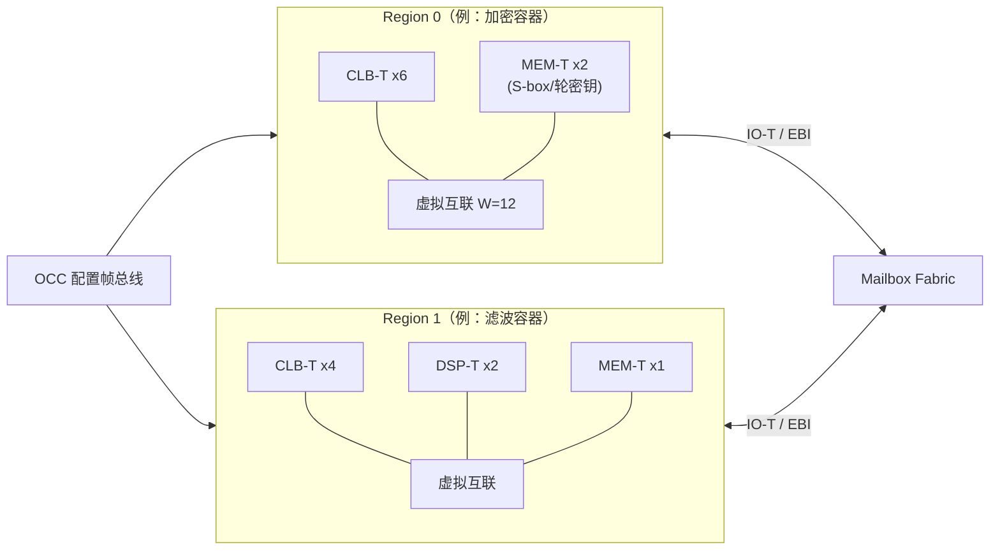

# S01 · Ethereal Fabric 虚拟逻辑架构

> | 属性 | 值 |
> |---|---|
> | 仓库 | ethereal-fabric |
> | 许可证 | CERN-OHL-S-2.0 |
> | 重要度 | ★★★★★（项目的核心创新） |
> | 关联 | ADR-001/002/004/011；任务 E0-FAB1..6、E1-PLT1、E2-FAB1..5；方法学 ZUMA/FABulous/Landy-Stitt |

## 1. 是什么 / 做什么 / 重要度

Ethereal Fabric 是实现在物理 FPGA 之上的**虚拟可重构架构（overlay）**：一片由 eLUT（虚拟 LUT）、虚拟互联、异构 tile（MEM/DSP/SSRAM）组成的"FPGA 里的 FPGA"。用户的自定义加密、信号处理等电路被映射成 fabric 的**配置数据**（而非厂商比特流），由 OCC（S02）写入 fabric 的某个 region 后运行。

**为什么重要**：它是全部差异化价值的来源——跨厂商二进制兼容（同一逻辑镜像跑在 Gowin/AMD/Intel）、微秒~毫秒级热替换（写 SRAM 而非烧比特流）、Gowin 等无 PR 器件上的"逻辑容器"。同时它也是最大技术风险（开销比与虚拟 Fmax），所以架构参数全部做成生成器可调（S03），用数据驱动迭代。

## 2. 大体规划

### 2.1 架构要素（v1 参数基线）

| 要素 | 设计 | 依据 |
|---|---|---|
| eLUT4 | 虚拟 LUT4 + 可旁路 FF；配置存物理 CFU 的 memory 模式（GW5）/ LUTRAM（Xilinx） | GW5 CFU 原生 LUT4；ZUMA 的 LUTRAM 技巧 |
| CLB-T | N=8 eLUT4 + Clos 两级输入互联（I≈26） | ZUMA 定标方法，VPR 实验复核 |
| Switch Box | 通道宽 W=12 起步；**两源虚拟轨道优先退化为导线**；mux 尺寸对齐物理 LUT4 输入平台期 | Landy & Stitt：互联占开销 50%+，此二法降 48~54% |
| 异构 tile | MEM-T（BSRAM：RAM/ROM/FIFO/双口）、DSP-T（27×18 MAC 模式集）、SSM-T（SSRAM 窗口）、IO-T（边缘 8 虚拟 IO） | FABulous 异构方法论；密度靠硬块 |
| Supertile | 相邻 tile 融合（如 DSP+MEM 对），绕过虚拟互联直连 | FABulous |
| Region | 矩形 tile 组，容器分配单位；**region 组成在 fabric.yaml 定义、base image 构建时固化**（ADR-004：初始化时自定义各区大小与资源包装） | 用户决策 |
| 虚拟路由边界 | 虚拟布线不跨 region；region 间通信只走 EBI（S04） | 容器隔离的物理基础 |

### 2.2 结构示意图

### 2.3 宿主移植层（HAL）

所有物理原语经 `hal/<vendor>/` wrapper 引用：`hal/gowin_gw5/`（CFU memory 模式、BSRAM、DSP27×18、SSRAM）、`hal/xilinx_us/`（LUTRAM/BRAM36/DSP48E2）。架构参数（N、W、I）可按宿主重新定标，**但虚拟架构语义（eLUT4 接口、帧格式、镜像格式）不变**——二进制兼容承诺的实现机制。

## 3. 详细规划与阶段检查点

### Phase 0（仿真 fabric v0，仅 CLB）
| # | 步骤（任务 ID） | 检查点 |
|---|---|---|
| 1 | eLUT4+FF RTL（E0-FAB1） | cocotb 随机真值表 1000 组全对 |
| 2 | CLB-T cluster（E0-FAB2） | cluster 内连通性穷举通过；无组合环（`verilator --lint-only` + UNOPTFLAT 零报告） |
| 3 | SB+通道互联（E0-FAB3） | 4×4 网格例化成功；拓扑表参数可配 |
| 4 | 配置帧组织（与 S02 联合，E0-FAB4） | 配置写入后行为=目标电路 |
| 5 | 性能建模（E0-SHL3） | 输出 4×4 fabric 配置字节数、虚拟 Fmax 估算 |

### Phase 1（GW5 物理化）
| # | 步骤 | 检查点 |
|---|---|---|
| 1 | `hal/gowin_gw5`（E1-PLT1） | 综合报告确认 CFU 被推断为 memory 模式（而非寄存器堆）；**开销比 ≤ 45:1（4×4）并诚实记录实际值** |
| 2 | 时序收敛 | fabric 全速 ≥ 50 MHz（物理）；虚拟逻辑目标 ≥ 25 MHz |
| 3 | 基准上板 | AES-128、PWM 在 fabric 内 bit-true 运行 |

### Phase 2（异构 v2）
| # | 步骤 | 检查点 |
|---|---|---|
| 1 | MEM-T（E2-FAB1） | RAM 全模式（1K×18…16K×1/双口/FIFO/ROM 预载）cocotb 通过；**AES S-box 用 MEM-T 后 eLUT 占用降 ≥5×** |
| 2 | DSP-T（E2-FAB2） | FIR16 用 DSP-T 链，吞吐 vs LUT 版 ≥10× |
| 3 | SSM-T + 上下文保存（E2-FAB3） | 容器暂停→FF 状态扫描读出→恢复→继续运行结果一致 |
| 4 | fabric.yaml v2 异构 region（E2-FAB4） | 混合 tile region 生成→配置→运行全链路通过 |
| 5 | 互联优化 v2（E2-FAB5） | 同规模物理 LUT 降 ≥20%（两源轨道+平台期） |

### Phase 3+
- 进位链/ALU 模式利用（GW5 CFU ALU 模式 → 虚拟快速加法器，相对 ZUMA 的现代化增量）；
- 时序反标：实测 tile 延迟库更新 STA 模型；
- 大 fabric（16×16+）的布局布线可伸缩性实验。

## 4. 验证与里程碑验收

**方法**：cocotb 单元测试（每 tile）→ 拓扑连通性穷举 → 基准电路 bit-true（黄金向量对比）→ 毛刺监测断言（配置期间相邻 region 输出无脉冲）→ 上板实测（开销比、Fmax、吞吐）。所有报告按 README §3 模板，附图（mermaid）。

| 里程碑 | 验收标准 |
|---|---|
| M-S01-1（P0） | 仿真 4×4 fabric 跑通 AES-128/PWM 基准 |
| M-S01-2（P1） | GW5 上 fabric 运行三演示镜像；开销比与 Fmax 实测公开 |
| M-S01-3（P2） | 异构 tile 基准达标（5×/10×）；互联优化 -20% 达成 |
| M-S01-4（P2） | **同一镜像文件在 GW5 与 Zynq US+ 上直接运行**（二进制兼容首验） |

## 5. 可能的问题与快速查找关键词

| 问题 | 症状 | 搜索关键词 |
|---|---|---|
| Gowin CFU memory 模式推断失败 | 综合成寄存器堆，资源爆炸 | `Gowin distributed RAM inference`、`Gowin GowinSynthesis LUTRAM attribute`；备选：显式例化原语 `gw_lutram` |
| 虚拟互联组合环 | Verilator UNOPTFLAT 报警/仿真挂死 | `VPR routing combinational loop`、`overlay switch box loop avoidance` |
| 配置瞬态短路（one-hot mux 多驱） | 改写时电流尖峰/逻辑错乱 | `FABulous blank before overwrite`（S02 强制流程） |
| 开销比远超 40:1 | 可用 eLUT 太少 | `ZUMA overlay LUT overhead`、`Landy Stitt virtual interconnect low overhead` |
| 虚拟 Fmax 过低（<15 MHz） | 实用价值受疑 | `overlay critical path register retiming`、`coarse grained overlay DSP block 300MHz`（异构 tile 对冲） |
| VPR 收敛差（W=12 布不通某些电路） | 路由失败 | `VPR routability-driven packing`、`FPGA channel width MCNC benchmark` |

## 6. 实现守则速查
见 `../README.md` §2。本仓库额外：tile 级模块必须附带 cocotb 测试与综合报告（`reports/synth/`）。

## 7. 不确定时需向用户确认的问题
1. 虚拟 LUT 粒度最终确认 LUT4？（影响全部下游；仿真阶段可参数化切换 LUT6 对比后再定）
2. fabric.yaml 的 region 定义是否需要支持"运行时重划 region"（v1 为构建期固化，运行时重划是 Phase 4+ 的重大特性）？
3. 进位链支持提前到 Phase 2 还是留 Phase 3（影响加密/算术基准表现）？
