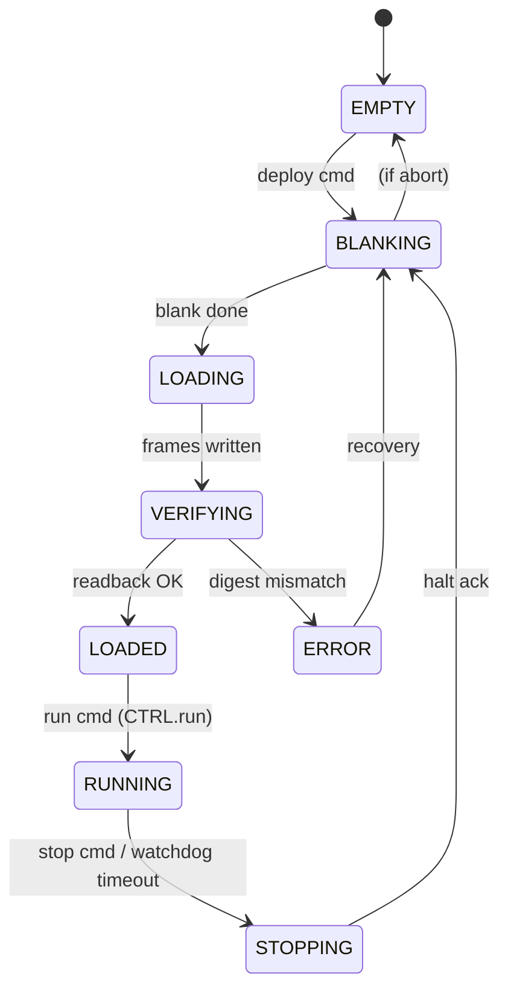

# S02 · OCC 与配置体系（帧 / 加载 / 隔离 / 上下文）

> | 属性 | 值 |
> |---|---|
> | 仓库 | ethereal-fabric（RTL）/ ethereal-runtime（策略） |
> | 许可证 | CERN-OHL-S-2.0 |
> | 重要度 | ★★★★★（"容器运行时"的硬件心脏） |
> | 关联 | ADR-004/011；任务 E0-FAB4/5、E1-RUN2、E2-FAB3；上游 FABulous 帧式配置经验 |

## 1. 是什么 / 做什么 / 重要度

OCC（Overlay Configuration Controller）是把逻辑镜像"注入"fabric 的引擎：它接收配置帧流，写入指定 region 的配置存储（分布式 RAM/锁存器），并执行**安全流程**（blank-before-write、region 锁、读回校验）。配置体系还包括：帧地址组织、配置缓存（BMC SRAM/DDR）、上下文保存/恢复（FF 状态扫描）。

**为什么重要**：Docker 的 `docker run` 体验在本平台= "OCC 写帧 + 状态机转移"。重构速度、隔离可靠性、容器能否抢占/迁移，全部由本子系统决定。FABulous 用多次流片换来的教训（禁移位寄存器、blank-before-write）都落在这里。

## 2. 大体规划

### 2.1 设计要点

| 要素 | 设计 | 依据/红线 |
|---|---|---|
| 配置存储 | 帧式组织（帧=一列 tile 的配置位）；存储介质=物理 CFU memory 模式/锁存器 | **红线：禁用移位寄存器链**（配置期高功耗、半途配置产生短路/环振、无法真部分重构——FABulous 流片教训） |
| 写流程 | `REGION_SELECT → BLANK_REGION → 逐帧 WRITE_FRAME → READBACK 校验 → UNLOCK/RUN` | blank 防 one-hot mux 多驱瞬态短路；读回校验防写错 |
| Region 锁 | 每 region 写使能位矩阵；LOCK 后该 region 配置口物理关闭 | 容器间配置隔离的硬件根 |
| 接口 | EBI endpoint（Cluster0/EP1，见 S04）；命令+状态寄存器；数据经 mailbox route-lock 突发或 BMC DMA | 单拍转发、突发不穿插 |
| 读回 | `READBACK_FRAME`：逐帧读回与镜像 digest 比对 | 装载校验 + SEU 检测基础 |
| 上下文保存 | CLB FF 经扫描链读出到 SSM-T/SSRAM；恢复时反向写入 | overlay 独有红利（原生 DPR 极难），容器抢占/迁移的前提 |
| 性能目标 | region 热替换 < 10 ms（BMC 内存映射 + DMA）；< 100 ms（上位机 SPI 推流） | 4×4 fabric 虚拟比特流 ~200KB 级（ZUMA 同规模实测） |

### 2.2 状态机（与 BMC lifecycle 对齐，语义参照 AMD DFX Controller）

### 2.3 寄存器接口（OCC endpoint CSR 窗口，16 字）

| idx | 名称 | 语义 |
|---|---|---|
| 0 | DATA | 配置帧数据流口（route-lock 突发目标） |
| 1 | CMD | REGION_SELECT/WRITE_FRAME/BLANK/READBACK/LOCK/UNLOCK |
| 2 | STATUS | busy/done/error + 当前状态 |
| 3 | REGION | 目标 region 号 |
| 4 | FRAME_ADDR | 帧地址（自增模式可省写） |
| 5 | LENGTH | 帧数/字节数 |
| 6 | CRC | 写入流 CRC32 实时值 |
| 7 | ERR_INFO | 错误帧地址/类型 |
| 8-11 | LOCK_MATRIX | region 锁位图 |
| 12-15 | CTX_* | 上下文保存控制/状态/地址 |

## 3. 详细规划与阶段检查点

### Phase 0
| # | 步骤 | 检查点 |
|---|---|---|
| 1 | 帧映射生成脚本（fabric.yaml→帧地址 JSON，与 S03 生成器联合） | 2×2 与 4×4 fabric 帧表生成正确（抽检回读一致） |
| 2 | OCC v0 RTL（WRITE/BLANK/READBACK）（E0-FAB4） | 仿真配置加法器/计数器样例并读回校验 |
| 3 | blank-before-write + LOCK（E0-FAB5） | **功能级：改写 region A 期间 region B 输出逻辑值不变（SVA 断言，Verilator 可证）；物理级毛刺留上板示波器验证（ADR-017/C13 §3 表述拆分）**；LOCK 后写被丢弃且状态位报告 |
| 4 | CRC32 流校验 | 注入单比特错误→VERIFYING→ERROR 路径正确 |

### Phase 1
| # | 步骤 | 检查点 |
|---|---|---|
| 1 | OCC 上 GW5（经 mailbox endpoint） | 综合时序 ≥100 MHz；route-lock 突发 1000 次无穿插 |
| 2 | BMC DMA 直连模式（绕过逐字 mailbox 写） | region 重配置 < 10 ms 实测（示波器/计数器） |
| 3 | 看门狗联动（超时→STOPPING→BLANKING） | 死锁镜像被 blank，相邻 region 无损（E1-RUN4 联合验收） |
| 4 | 稳定性 | 2 region ×10,000 次热替换零配置损坏（E1-DMO2） |

### Phase 2
| # | 步骤 | 检查点 |
|---|---|---|
| 1 | 上下文保存 v1（扫描链+SSM-T） | 容器暂停→恢复后输出序列与不间断运行一致 |
| 2 | LOCK 矩阵完整化 + 与镜像能力清单联动（S10） | 越权 region 写被拒绝 |
| 3 | 配置缓存（BMC SRAM 双缓冲 + DDR/Flash 镜像池） | 预取命中冷启动 < 20 ms（SPI 场景） |

### Phase 3+
- 容器迁移（region A→B 的上下文搬迁）；碎片整理；SEU 周期读回擦洗（Zynq，与 S07 联合）；配置压缩（空帧跳过+RLE）。

## 4. 验证与里程碑验收

**方法**：帧级 fuzz（随机帧地址/数据写读回）→ 状态机断言（非法转移不可达）→ 毛刺监测（SVA）→ 故障注入（CRC 错误/写冲突/LOCK 违例）→ 上板 10k 次压力。

| 里程碑 | 验收标准 |
|---|---|
| M-S02-1（P0） | 仿真内完整部署周期 + 无毛刺断言通过 |
| M-S02-2（P1） | GW5 上 <10 ms 热替换 + 10k 次零故障 |
| M-S02-3（P2） | 上下文保存/恢复演示；LOCK 矩阵安全用例全过 |
| M-S02-4（P3） | 容器 region 间迁移演示 |

## 5. 可能的问题与快速查找关键词

| 问题 | 症状 | 搜索关键词 |
|---|---|---|
| 配置存储推断成寄存器堆 | LUT 爆炸 | `Gowin latch inference avoidance`、`distributed RAM config storage overlay` |
| 帧地址映射与生成器不一致 | 配置写错区域 | 单一事实源：帧映射 JSON 由 fabric-gen 生成，OCC/工具链/daemon 共用；`golden reference frame map test` |
| route-lock 被高优先级打断 | 配置帧穿插 | mailbox prio 策略：配置突发固定 prio=1，BMC HP 口命令除外；`NoC route lock preemption` |
| 读回慢 | 校验耗时翻倍 | 读回与 CRC 流水化；必要时抽样校验+全量校验分级 |
| 扫描链上下文保存时序 | 状态读出错 | `scan chain FPGA overlay context save restore`、`state readback ZUMA` |
| 空白配置本身触发虚拟短路 | blank 后仍有毛刺 | blank 图案设计（全输入置常量）；`FPGA overlay blanking safe state` |

## 6. 实现守则速查
见 `../README.md` §2。本模块所有状态机变更必须同步更新本文件 §2.2 的 mermaid 图与规范文档。

## 7. 不确定时需向用户确认的问题
1. 读回校验的强制级别：每次部署全量读回（稳但慢）还是抽样+周期全量？
2. 上下文保存是否值得为 Phase 2 的 eLUT FF 增加扫描链开销（约 +10~15% FF 路径逻辑）？还是仅对声明 `checkpointable` 的容器启用？
3. 配置压缩（RLE/空帧跳过）是否提前到 Phase 1（可降低 SPI 通道时间到 <30 ms）？
