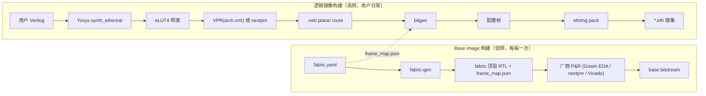

# S03 · fabric-gen 与映射工具链（Ethereal Tools）

> | 属性 | 值 |
> |---|---|
> | 仓库 | ethereal-tools |
> | 许可证 | MIT |
> | 重要度 | ★★★★★（没有它 fabric 只是摆设） |
> | 关联 | ADR-002/011/012；任务 E0-MAP1..5、E0-FAB6、E2-MAP1；上游 VPR/Yosys/FABulous/OpenFPGA |

## 1. 是什么 / 做什么 / 重要度

两条工具链的合称：
1. **fabric-gen**：读 `fabric.yaml`（tile 阵列、region 划分、supertile、Service Tile 声明）→ 生成参数化 fabric 顶层 RTL + **帧地址映射 JSON**（OCC、bitgen、daemon 的单一事实源）+ base image 工程骨架；
2. **mapper**：用户 Verilog → Yosys 综合（eLUT4 techlib）→ VPR/nextpnr 布局布线 → **bitgen**（生成 fabric 配置帧）→ `ethimg pack`（打包+签名，见 S09）产出可部署的逻辑镜像。

**为什么重要**：Docker 体验的一半是 `docker build`。工具链的可用性直接决定镜像生态能否长出来；同时它是"同一镜像跨厂商"承诺的执行者（bitgen 只依赖帧映射 JSON，不依赖厂商格式）。

## 2. 大体规划

**关键设计：两级比特流**（借鉴 OpenFPGA FPGA-Bitstream）：bitgen 第一阶段产出 fabric 无关的"配置语义数据库"，第二阶段用 frame_map.json 排序/映射成物理帧——fabric 改版只换 JSON，不动 bitgen 核心。

**路线决策（ADR-012，Phase 0 spike）**：A=VPR+自定义 arch XML（ZUMA 路线现代化，可控性最强）；B=FABulous/nextpnr 通道（生态现成）。熔断：A 两周不收敛转 B 或自研 placer+PathFinder（5 人日上限）。

## 3. 详细规划与阶段检查点

### Phase 0
| # | 步骤（任务 ID） | 检查点 |
|---|---|---|
| 1 | fabric-gen v0（E0-FAB6）：YAML→RTL+帧映射 | 2×2 与 4×4 fabric 生成物通过 S01/S02 验收用例 |
| 2 | Yosys techlib + `synth_ethereal`（E0-MAP1） | c17/c432 映射为 eLUT4 网表；面积报告合理 |
| 3 | VPR arch XML（E0-MAP2） | c432 pack/place/route 完成；时序报告可读 |
| 4 | bitgen v0（E0-MAP3） | c432 端到端载入仿真 fabric，**bit-true** |
| 5 | FABulous spike + ADR-012（E0-MAP4） | 路线决策记录归档 |
| 6 | 基准电路集（E0-MAP5）：AES-128/PRESENT/FIR16/CRC32/PWM + 黄金向量 | 全部经完整流程仿真运行正确 |

### Phase 1
| # | 步骤 | 检查点 |
|---|---|---|
| 1 | 工具链打包（pip 包 + Docker 镜像） | 干净机器 `pip install ethereal-tools && ethimg build demo.v` 一键出镜像 |
| 2 | 基准镜像上板（与 S12 联合） | AES/PWM/UART 三镜像在 GW5 fabric bit-true |
| 3 | 错误信息人性化（映射失败的诊断输出） | 路由失败时输出拥塞热点图（文本版） |

### Phase 2
| # | 步骤 | 检查点 |
|---|---|---|
| 1 | 异构映射（E2-MAP1）：Yosys memory/DSP 推断→虚拟原语；VPR 异构块；bitgen v2 | 含 RAM/DSP 基准端到端 bit-true |
| 2 | 时序估算 v1：预表征 tile 延迟库 + STA 报告 | 报告标注"估算值"；与实测偏差 ≤30%（诚实声明） |
| 3 | 增量构建（改一行 RTL 只重映射受影响部分） | 增量构建时间 < 全量 30% |

### Phase 3+
- 时序反标（实测延迟库）；HLS 前端（CIRCT/XLS 评估）；GUI 拥塞/布局可视化；映射质量基准套件公开。

## 4. 验证与里程碑验收

**方法**：黄金向量 bit-true（仿真 fabric）→ 上板复验 → 映射回归集（每次工具链改动重跑全部基准，防质量回退）→ 与 VPR 自带报告交叉核对（route 成功率、关键路径）。

| 里程碑 | 验收标准 |
|---|---|
| M-S03-1（P0） | c432 + 5 基准端到端 bit-true；ADR-012 归档 |
| M-S03-2（P1） | 一键安装；三镜像上板正确 |
| M-S03-3（P2） | 异构基准通过；STA 估算报告发布 |
| M-S03-4（P2） | 同一 `.eth` 在 GW5 与 US+ 运行（与 S01 M-S01-4 联合验收） |

## 5. 可能的问题与快速查找关键词

| 问题 | 症状 | 搜索关键词 |
|---|---|---|
| VPR arch XML 合法性错误 | packer 直接报错退出 | `VPR architecture file pb_type crossbar complete`、`VTR arch XML tutorial` |
| packer 合法化失败（cluster 内 LUT 打包冲突） | `cluster legality check failed` | `VPR packer cluster legality`、`VPR pack_interconnect` |
| Yosys 把 ROM/SRAM 推断成触发器 | 面积爆炸 | `yosys memory_dff memory_bram`、`yosys custom techlib memory` |
| VPR 输出→帧映射错位 | bit-true 失败 | 用 frame_map.json 抽检单帧回读；`OpenFPGA bitstream generation two stage` |
| nextpnr generic 后端限制（若走路线 B） | 时序/约束缺失 | `nextpnr generic architecture viaduct`、`FABulous nextpnr flow` |
| 大电路映射时间过长 | VPR 数小时 | `VPR fast placement seed`、`incremental VPR reroute` |
| Python 打包原生依赖（VPR 二进制） | 用户装不上 | 随包发布预编译 VPR 或 Docker 化；`manylinux wheel bundling binaries` |

## 6. 实现守则速查
见 `../README.md` §2。工具链代码 Python 过 `ruff+mypy --strict`；所有生成物（RTL/JSON）头部注明"自动生成勿手改"+ 生成器版本。

## 7. 不确定时需向用户确认的问题
1. ADR-012 路线选择若有实测数据后仍两难，是否接受"先 B 快速可用、A 并行打磨"的双轨（维护成本+）？
2. 用户 RTL 子集范围：v1 是否禁止厂商原语实例（强制走推断）？（强烈建议禁止，否则二进制兼容失效）
3. 是否提供图形化 floorplan 查看器（Phase 3）还是纯文本报告即可？
