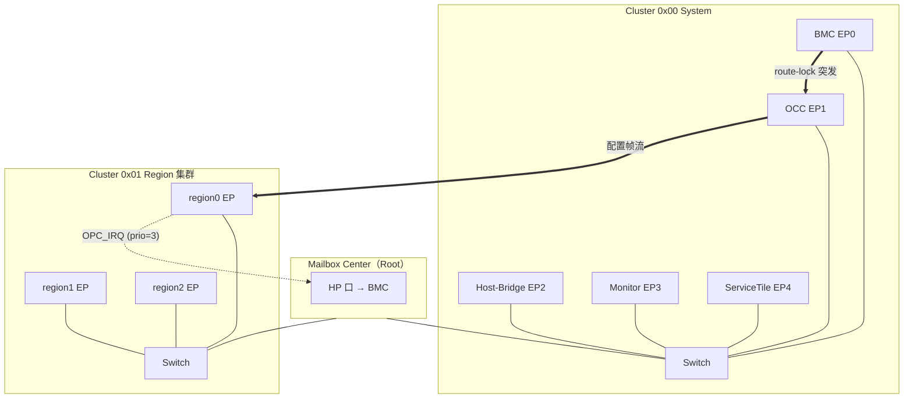

# S04 · EBI 总线与 Mailbox NoC 集成

> | 属性 | 值 |
> |---|---|
> | 仓库 | ethereal-shell（RTL）/ ethereal-spec（规范） |
> | 许可证 | CERN-OHL-S-2.0（mailbox 派生代码注明移植自 TinyGPU-FPGA） |
> | 重要度 | ★★★★★（所有子系统的通信底座） |
> | 关联 | ADR-006、ADR-015；任务 E0-SHL1、E1-IO1、E2-IO1；上游 `TinyGPU-FPGA/ip/mailbox` |

## 1. 是什么 / 做什么 / 重要度

EBI（Ethereal Bus Interface）是平台内所有组件——BMC、OCC、vFPGA region、Service Tile、IO 代理、监控单元——之间的**控制面与数据面互联规范及其 RTL 实现**。它分三档 profile（ADR-006）：

- **EBI-Lite**：以你的 **AXI-MailboxFabric** 为骨干（本项目默认主力）；
- **EBI-Full**：在 Mailbox 骨干上加 AXI4-Lite 桥，兼容 AXI 生态 IP；
- **EBI-Tiny**：小器件回退的简易 32 位寄存器总线（valid/ready，单主）。

**为什么重要**：互联选型决定了 region ABI、中断模型、IO 代理形态、调试可达性——是除 fabric 本身外锁定效应最强的决策。Mailbox Fabric 已是验证过的设计（TinyGPU-FPGA 中 Center/Switch/Endpoint 三级 + 完整测试台 `testbench/mailbox_tb*.sv`），直接继承可把本项目最枯燥的底层风险清零。

## 2. 大体规划

### 2.1 Mailbox Fabric 的能力映射（你的设计 → Ethereal 用法）

| Mailbox 特性（规范 §2） | Ethereal 中的角色 |
|---|---|
| 16 位地址 Cluster[15:8]+EP[7:4]+CSR[3:0] | **节点寻址方案**（见 §2.2 节点地图），每节点 16×32 位 CSR 窗口 |
| flit = header(src/opcode/prio/eop/debug) + 32b payload | 控制消息 + 配置帧数据 + 中断的统一载体 |
| `dest_id` 侧带 look-ahead 路由 | 保持单拍转发，region 到 region 通信低延迟 |
| OPC_DATA/IRQ/ACK/NACK | region 中断（OPC_IRQ→BMC HP 口）、需确认的管理命令（ACK/NACK） |
| 2 位 prio + HP 端口 | 看门狗/全局急停用 prio=3；BMC 挂 Center 的 HP 口 |
| 广播（Cluster/Group/Global） | 全局 blank-all、紧急停止、固件广播日志 |
| Route-lock 突发 | **OCC 配置帧流式下发**：一串 flit 携带连续配置字，同一 region 不被穿插 |
| Must-Sink 安全阀 | 容器逻辑死锁不拖垮全网——与 region 看门狗联动 |
| CSR 索引 0=data 通道，1-15=寄存器 | **Region ABI**：每个 vFPGA 暴露标准 16 字窗口（§2.3） |

### 2.2 节点地图（Ethereal Cluster Plan v1）

```
Cluster 0x00  System（挂 Center HP 口）
  EP 0x0  BMC（管理核）
  EP 0x1  OCC（配置控制器）
  EP 0x2  Host-Bridge（SPI/I2C 上位机通道，EMRI 面）
  EP 0x3  Monitor（遥测/I2C 监控通道）
  EP 0x4-0x7  Service Tiles（NPU-Tiny 等，至多 4 个）
Cluster 0x01-0x08  Region 集群（每集群一个 Switch，≤16 个 region endpoint）
  EP 0x0-0xE  vFPGA region
  EP 0xF      集群广播（急停/同步）
Cluster 0xFF  全局广播（blank-all、固件升级通知）
```

### 2.3 Region ABI（每个 vFPGA endpoint 的 16 字标准窗口，RFC-002 核心内容）

| CSR idx | 名称 | 语义 |
|---|---|---|
| 0 | DATA | 数据通道（读=pop RX ring，写=enqueue TX），空读返回 `32'hDEAD_BEEF`（沿用你的惯例） |
| 1 | CTRL | bit0 run/halt、bit1 reset、bit2 irq_enable |
| 2 | STATUS | bit0 configured、bit1 running、bit2 fault、bit[15:8] heartbeat 计数 |
| 3 | FAULT_CODE | 最近故障码（看门狗/总线错误/用户断言） |
| 4-7 | SCRATCH0-3 | 容器自由使用 |
| 8-11 | IOMAP0-3 | L1 引脚 mux 分配位图（见 S06） |
| 12 | HEARTBEAT | 看门狗心跳寄存器（写任意值踢狗） |
| 13 | IRQ_STATUS / ACK | 中断挂起与确认 |
| 14 | CTX_CTRL | 上下文保存/恢复触发（Phase 2） |
| 15 | ABI_VERSION | 只读，ABI 版本 |

### 2.4 架构图



### 2.5 AXI4-Lite 桥（EBI-Full，Phase 2）

- 写：AXI-Lite 写 → fire-and-forget flit（BVALID 立即返回）；
- 读：AXI-Lite 读 → 需要往返。Mailbox 是无应答语义，桥内实现**请求-响应配对**：定义扩展 opcode `0x4=RD_REQ`（payload=返回序号）、`0x5=RD_RESP`；桥维护 outstanding 表（深度 8，超时 1ms 返回 `DEAD_BEEF` 并置错误计数）。**这是对你协议的唯二扩展之一，需写入 RFC-002 并注明向后兼容（旧节点收到未知 opcode 丢弃+计数，符合规范 §3.3 Invalid DestID 惯例）**；
- 地址映射：AXI-Lite 地址 `0x7000_XXXX` 直接复用你的窗口约定，region 窗口按 §2.3，OCC/监控/EMRI 地址段沿用 v2.0 蓝图 §4.2。

## 3. 详细规划与阶段检查点

### Phase 0（仿真验证）
| # | 步骤 | 检查点（可验证） |
|---|---|---|
| 1 | 从 TinyGPU-FPGA 导出 mailbox RTL（pkg/center/switch_4x1/switch_2x1/endpoint/fifo）到 `ethereal-shell/rtl/ebi/mailbox/`，文件头加移植注记 | 全部文件过 G1 lint；header 含移植注记与 Created 日期 |
| 2 | 建立 cocotb 参考测试：复刻 `mailbox_tb` 的定向用例（单播/广播/回压/突发 route-lock） | 4 用例全过 |
| 3 | 实现 EBI-Tiny（简易寄存器总线）+ 地址 decoder | BFM 随机读写 10k 次一致 |
| 4 | 定义 Region ABI 草案（RFC-002 §0.1）并实现 `region_endpoint`（mailbox endpoint + 16 字窗口适配） | CSR 读写、DATA 通道 pop/enqueue、`DEAD_BEEF` 语义测试通过 |
| 5 | 仿真集成：BMC-BFM 经 Center→Switch→region endpoint 收发 | E0-SHL2 的"容器部署"演练数据通路走通 |

### Phase 1（GW5 闭环）
| # | 步骤 | 检查点 |
|---|---|---|
| 1 | 节点地图 v1 例化（Cluster0 + 1 个 Region 集群，2 region） | Gowin 综合后时序 ≥ 100 MHz（报告 WNS） |
| 2 | OCC 接入：BMC 经 mailbox 向 OCC endpoint 发命令 + route-lock 突发传配置帧 | 连续 1000 次 region 重配置无帧穿插/丢帧（逻辑分析仪断言） |
| 3 | 中断路径：region OPC_IRQ → Center HP → BMC | 中断延迟实测并记录（目标 < 1 µs @100MHz） |
| 4 | Must-Sink 联动：region 死锁时 endpoint 安全阀 + 看门狗上报 | 注入死锁后全网其余流量不受影响 |

### Phase 2
| # | 步骤 | 检查点 |
|---|---|---|
| 1 | AXI4-Lite 桥（RD_REQ/RD_RESP 扩展） | 随机读写与超时用例全过；RFC-002 升 v1.0 冻结 |
| 2 | Region 集群扩到 2 个（验证多 Switch 拓扑与跨集群通信） | 跨集群 region→region 数据通道 demo |
| 3 | L2 代理外设挂为普通 endpoint（见 S06） | UART/GPIO/SPI/I2C 代理经 mailbox 收发 |
| 4 | NoC 扩展评估（ADR-006 路线）：DMA 描述符通道设计评审 | ADR-017 决策记录 |

### Phase 3+
- QoS 调优（prio 类与 BE 保底 1/4 策略的实测调参，沿用你 Center 的加权 RR 设计）；
- 虚通道评估（容器间通信隔离等级提升）；
- 多板 mailbox 隧道（经 SPI/以太网把两片 FPGA 的 fabric 桥接成一个逻辑 NoC——编排器前置技术）。

## 4. 验证与里程碑验收

**单元级**：endpoint（FIFO 满/空、安全阀计数）、switch（本地/上行/广播、route-lock 不穿插、RR 公平性）、center（广播回压汇聚、HP 抢占）。**集成级**：§3 各检查点。**压力级**：随机混合流量（单播+广播+IRQ）72h 仿真回归无丢包（统计 checker 按 src/dst 对账）。**硬件级**：Phase 1 检查点 2/3/4。

| 里程碑 | 验收标准 |
|---|---|
| M-S04-1（Phase 0 末） | 仿真内 BMC→OCC→region 全链路部署演练通过，Region ABI 草案评审完成 |
| M-S04-2（Phase 1 末） | GW5 上 1000 次无错重配置 + 中断延迟实测归档 |
| M-S04-3（Phase 2 末） | RFC-002（EBI 规范）v1.0 冻结发布；AXI 桥与双集群拓扑验收 |

## 5. 可能的问题与快速查找关键词

| 问题 | 症状 | 搜索关键词 |
|---|---|---|
| Mailbox 读语义缺口（fire-and-forget 无读响应） | AXI 桥/调试器需要读回 | `request response over AXI-Stream bridge`、`outstanding transaction table RTL` |
| 组合路径过长（look-ahead 路由经多级 switch） | 时序违例 | `NoC router pipelining register slice timing closure` |
| 广播回压死锁（某 region 长期不 ready） | 全局流量停摆 | 你的规范 §2.5 Must-Sink；`NoC broadcast backpressure deadlock` |
| 跨时钟域（region 时钟 ≠ fabric 时钟） | 亚稳态/丢数 | `async FIFO CDC AXI-Stream clock crossing` |
| Gowin 综合对 SV interface/modport 支持差异 | 综合报错 | `Gowin EDA SystemVerilog interface support`、`nextpnr gowin interface modport`（备选：按你规范 §2.4 展开为裸信号列表） |
| opcode 扩展冲突 | 旧节点误解新 opcode | 规范 §3.3 无效包丢弃惯例；ADR 记录扩展分配 |

## 6. 实现守则速查

全局守则见 `../README.md` §2（G1 语法 / G2 header / G3-G5 报告 / G6 提问）。本子系统所有 RTL 文件 `Plan-Ref` 指向本文件 §3。

## 7. 不确定时需向用户确认的问题

1. Mailbox RTL 移植到 ethereal-shell 时，是否同意以 CERN-OHL-S-2.0 重新许可（你是原作者，需你在 TinyGPU-FPGA 侧加一行授权说明）？
2. opcode 扩展（RD_REQ=0x4 / RD_RESP=0x5）是否占用你 TinyGPU 侧未来规划的值域？
3. EBI-Full 的 AXI4-Lite 桥在 Phase 2 的优先级，是否高于"NoC DMA 描述符通道"？
