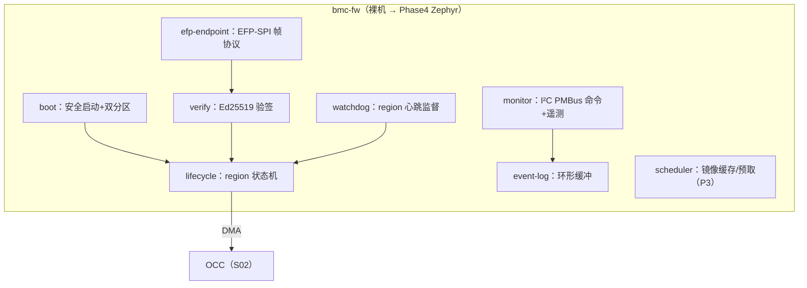

# S05 · BMC 管理子系统（含 EMRI 与 mFSM）

> | 属性 | 值 |
> |---|---|
> | 仓库 | ethereal-shell（RTL）/ ethereal-runtime（固件） |
> | 许可证 | CERN-OHL-S-2.0（RTL）/ MIT（固件）；NEORV32 为 BSD-3（保留其声明） |
> | 重要度 | ★★★★★（平台的常驻大脑） |
> | 关联 | ADR-013/014/015/016；任务 E1-BMC1..4、E2-BMC1/2、E1-RUN2/4、E3-SCH1/2、E4-BMC1 |

## 1. 是什么 / 做什么 / 重要度

BMC（Baseboard Management Controller 式管理核）是集成在 fabric 内的 RISC-V 软核（主选 **NEORV32**，备选 VexRiscv，封装在可换核的 `bmc_core` wrapper 内），常驻运行 `bmc-fw` 固件，负责：镜像验签、region 生命周期、看门狗监督、遥测采集、I²C 监控通道服务端、SPI 数据通道端点、事件日志、健康策略执行。

小器件（LUT 养不起 CPU）降级为 **mFSM**：无 CPU 的寄存器式管理单元，策略由上位机执行。**BMC 与 mFSM 对上位机暴露同一套寄存器 ABI（EMRI）**——ethctl 无感。

**为什么重要**：它让平台"脱离上位机也能自治"（对标服务器 BMC），并且同一套 RTL+固件跨 Gowin/AMD/Intel——管理面跨厂商统一是 FPGA 行业稀缺品。同时它是 Astral 的天然桥头堡（v2 迁 Zephyr 后 BMC 即 Astral 节点）。

## 2. 大体规划

### 2.1 NEORV32 外设 → BMC 职能映射

| NEORV32 外设 | BMC 职能 |
|---|---|
| SDI（SPI device） | 上位机数据通道端点（EFP-SPI） |
| TWD（I²C device） | 监控通道服务端（PMBus 风格命令，RFC-003） |
| TWI（I²C host） | 板级传感器/电源扩展（可选） |
| DMA | OCC 配置帧高速搬运（<10 ms 热替换的关键） |
| TRNG | 验签 nonce / 安全用途 |
| WDT | BMC 自身看门狗（兜底：触发全 region blank） |
| UART0/1 | 控制台调试 / 预留上位机命令通道 |
| XBUS（Wishbone） | 接 EBI（mailbox endpoint 或 EBI-Tiny decoder） |
| JTAG OCD | 免费 GDB 调试（排针引出，OpenOCD） |

### 2.2 固件模块（`ethereal-runtime/bmc-fw/`）

### 2.3 EMRI 寄存器面（BMC/mFSM 统一 ABI，ADR-015）

| 偏移 | 寄存器 | 语义 |
|---|---|---|
| 0x00 | MAGIC/ABI_VERSION | `0x45544852` ("ETHR") |
| 0x04 | CAPABILITIES | bit0 has_bmc / bit1 has_dma / bit2 has_i2c_mon … |
| 0x08 | PLATFORM_ID | 器件/板卡 ID |
| 0x10-0x1F | REGION_TABLE | region 描述（数量/规格） |
| 0x20 | OCC_CMD/STATUS | OCC 透传（BMC 模式=通知，mFSM 模式=直驱） |
| 0x30 | HEALTH_STATUS | region 健康字位图 |
| 0x38 | EVENT_LOG_PTR | 事件环形缓冲头尾 |
| 0x40+ | MON_TEMP/VCC/… | 遥测 |

**模式语义**：BMC 模式=上位机发高级命令（"部署镜像到 region1"），BMC 全流程执行；mFSM 模式=上位机逐步驱动（收镜像→验签→写 OCC→轮询状态）。协议相同，智能位置不同。

### 2.4 存储预算（GW5AST-138）
Boot ROM 8KB（BSRAM×4）+ FW/堆栈 128KB（BSRAM×58，17%）+ 镜像暂存 256KB（SSRAM 池）+ 逻辑 ~2.5K LUT（<2%）。**总计 <2% LUT、<20% BSRAM。**

## 3. 详细规划与阶段检查点

### Phase 1
| # | 步骤（任务 ID） | 检查点 |
|---|---|---|
| 1 | BMC SoC 集成（E1-BMC1）：bmc_core wrapper + ROM/RAM + UART + EBI 桥 | 仿真+GW5 双平台 hello-world + CSR 读写；**开销报告（LUT/BSRAM）归档** |
| 2 | 固件框架（E1-BMC2）：boot 双分区、驱动层、lifecycle 骨架 | UART 启动；状态机空转；FW 自更新演示 |
| 3 | 调试通道（E1-BMC3）：UART 控制台 + JTAG 排针 + OpenOCD cfg | **GDB 断点/单步成功；全程零付费工具** |
| 4 | EMRI 实现 + 模式探测（E1-BMC4） | ethctl 自动识别 BMC/mFSM |
| 5 | daemon（E1-RUN2）：验签→分配→OCC(DMA)→生命周期 | run/stop/ps/restart 全通；异常路径优雅报错 |
| 6 | region 看门狗（E1-RUN4） | 死锁镜像超时 blank，邻区无损 |

### Phase 2
| # | 步骤 | 检查点 |
|---|---|---|
| 1 | mFSM（E2-BMC1）：无 CPU 寄存器面 | 仿真中上位机脚本经 EMRI 完成完整部署；ethctl 无感切换 |
| 2 | VexRiscv 备选核（E2-BMC2，可选） | 同一固件 ABI 跑通，验证换核能力 |
| 3 | 遥测深化（与 S07 联合）：ADC 温度/电压、事件日志上位机拉取 | i2cget 读温度；日志 24h 无溢出锁死 |

### Phase 3
- 配置调度器（E3-SCH1：镜像分组/预取/缓存，冷启动 P50<100ms）；容器迁移编排（E3-SCH2）；Zynq SEM 擦洗调度（E3-MON1）。

### Phase 4
- **bmc-fw 迁 Zephyr（E4-BMC1）→ BMC 成为 Astral 节点**（NEORV32 有上游 Zephyr 支持）；远程 gdbstub（经 EFP 隧道，对标 SOL）。

## 4. 验证与里程碑验收

**方法**：Verilator 固件协同仿真（NEORV32 支持 Verilator 全仿真）→ cocotb 寄存器面测试 → 上板压力（10k 部署循环、24h I²C 轮询、断电恢复）→ 故障注入（坏签名/写冲突/固件崩溃→双分区回退）。

| 里程碑 | 验收标准 |
|---|---|
| M-S05-1（P1） | BMC 全职能上线；GDB 可用；开销报告公开 |
| M-S05-2（P1） | 10k 次部署零故障；FW 双分区回退演示 |
| M-S05-3（P2） | mFSM 验收；EMRI v1.0 冻结 |
| M-S05-4（P4） | Zephyr 版 bmc-fw；BMC 作为 Astral 节点运行 Type-F 容器 |

## 5. 可能的问题与快速查找关键词

| 问题 | 症状 | 搜索关键词 |
|---|---|---|
| NEORV32 VHDL 在 Gowin EDA 综合问题 | 原语推断/时序异常 | `NEORV32 Gowin synthesis`、`neorv32-setups osflow`；备选：官方 VHDL→Verilog 转换流 |
| JTAG 引出与板级资源冲突 | 引脚不够 | JTAG 与 UART 复用引脚+jumper；`RISC-V JTAG two wire cJTAG` |
| Ed25519 软件验签慢 | 部署延迟 | `monocypher Ed25519 Cortex-M benchmark`、`Ed25519 RISC-V embedded`；后期用 Service Tile 硬加速（自举范例） |
| 裸机固件复杂度失控 | 状态机面条化 | 提前规划 Zephyr 迁移；`NEORV32 Zephyr board support` |
| 双分区更新的断电安全 | 变砖 | `embedded bootloader A/B update power fail safe`、`swap move bootloader` |
| mFSM 与 BMC 行为漂移 | 上位机兼容 bug | 共享 EMRI 一致性测试套件（同一测试跑两种模式） |

## 6. 实现守则速查
见 `../README.md` §2。固件 C 代码：禁动态内存（静态池需注释论证）；所有寄存器定义由 `ethereal-spec` 的 EMRI 文档自动生成头文件（单一事实源）。

## 7. 不确定时需向用户确认的问题
1. BMC 固件 v1 裸机是否确认（vs 直接上 Zephyr 省一次迁移）？建议裸机起步（启动链路最短），Phase 4 迁 Zephyr。
2. JTAG 排针在你的 Tang Mega 138K 载板上是否可引出？若不可，备选为 UART gdbstub。
3. mFSM 的最小器件目标具体是哪颗（GW5AT-15？GW2A-18？）——决定 mFSM 的寄存器裁剪程度。
