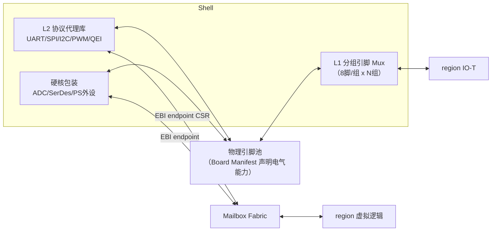

# S06 · IO 重定向（L1 引脚 Mux + L2 协议代理）

> | 属性 | 值 |
> |---|---|
> | 仓库 | ethereal-shell（RTL）/ ethereal-spec（Board Manifest、虚拟设备寄存器规范） |
> | 许可证 | CERN-OHL-S-2.0 / CC-BY-SA-4.0（规范） |
> | 重要度 | ★★★★☆（嵌入式场景的差异化核心） |
> | 关联 | ADR-007；任务 E1-IO3/4、E2-IO1/2；上游 vFPIO（学术先例）、你的 spi/uart fabric 卫星适配器 |

## 1. 是什么 / 做什么 / 重要度

把物理引脚与外设能力安全地分配给 region 内运行的虚拟逻辑，两级实现（ADR-007）：

- **L1 引脚 Mux**：分组 Crossbar 把引脚池路由到 region 的 IO-T（低速、通用、引脚独占）；
- **L2 协议代理**：Shell 内建的协议引擎——软核（UART/SPI/I²C/PWM/QEI/CAN）与**硬核资源包装**（GW5 的 ADC/SerDes/PCIe、Zynq PS 外设）——region 只见标准寄存器/流接口，不碰物理引脚。

**为什么重要**：数据中心 FPGA 虚拟化（Coyote 等）从不碰 GPIO；嵌入式场景的价值恰恰在引脚。两级设计同时给出隔离保证：**恶意/出错逻辑在结构上无法造成电气冲突**（不直接驱动引脚），这与 Astral 的"代理 IO"互为镜像、共享同一份能力清单规范。

## 2. 大体规划

**引脚分配规则**：编排器（daemon）按镜像 `capabilities.yaml` 的 IO 需求 + Board Manifest 的引脚能力表（电平标准/bank/最大频率）做**约束感知分配**；冲突即拒绝并给出原因。L1 路径频率上限实测后写入 manifest（一级 mux 后约 100MHz 级，以实测为准）。

**虚拟设备寄存器规范（RFC-004）**：每类代理定义标准布局（TX/RX FIFO、STATUS、CONFIG、IRQ），与 Astral 虚拟 IO 规范同源——**一份规范，两侧驱动**。

## 3. 详细规划与阶段检查点

### Phase 1
| # | 步骤（任务 ID） | 检查点 |
|---|---|---|
| 1 | L1 mux v1（E1-IO3）：8 脚组×4 组 + `boards/tang-mega-138k.yaml` | PWM 镜像经 mux 输出到任意两组引脚，示波器验证 |
| 2 | UART 代理（E1-IO4）：标准寄存器布局 | region 内逻辑 115200 收发无丢字节（回环+对端校验） |
| 3 | GPIO 代理（E1-IO4）：方向/读写/中断 | 按键中断→region→LED 链路演示 |
| 4 | IOMAP 接入 Region ABI（S04 §2.3 CSR 8-11） | ethctl inspect 显示引脚分配位图 |

### Phase 2
| # | 步骤 | 检查点 |
|---|---|---|
| 1 | SPI/I²C master、PWM 多路、QEI 代理（E2-IO1） | 每类代理配 cocotb 测试 + 上板对真实外设（EEPROM/编码器）验证 |
| 2 | L1 mux v2 + 时序表征（E2-IO2） | 8 组引脚池；各路 max 频率实测写回 manifest |
| 3 | RFC-004 冻结（E2-IO1 联合） | 虚拟设备寄存器规范 v1.0 发布 |
| 4 | 硬核包装 v1：GW5 X 通道 ADC（遥测兼用）、Zynq PS UART/GMAC 评估 | ADC 读数经 EBI 可读 |

### Phase 3+
- CAN(FD) 代理；SerDes/PCIe 硬核服务化（高速数据通道，Profile-Z 优先）；IO 虚拟化配额（多容器复用同一物理 UART 的时分仲裁）；引脚分配的热重配置（容器迁移时 IO 跟随）。

## 4. 验证与里程碑验收

**方法**：协议一致性（cocotb BFM 对标准协议模型）→ 电气实测（示波器/逻辑分析仪：电平、频率上限、串扰）→ 冲突用例（两镜像争同一引脚→拒绝路径）→ 故障注入（region 狂写代理→仲裁不饿死其他 region）。

| 里程碑 | 验收标准 |
|---|---|
| M-S06-1（P1） | PWM 任意两组引脚输出 + UART 代理无丢字节 |
| M-S06-2（P2） | RFC-004 v1.0 冻结；5 类代理上板验证 |
| M-S06-3（P2） | 引脚时序表征表公开（manifest 内） |
| M-S06-4（P3+） | 硬核服务化 demo（SerDes 或 PS GMAC 任选一） |

## 5. 可能的问题与快速查找关键词

| 问题 | 症状 | 搜索关键词 |
|---|---|---|
| I²C 代理时钟延展处理 | 对端 MCU 通信挂死 | `I2C slave clock stretching verilog`；你仓库 `uart_sat/spi_sat` 的卫星模式可参照 |
| SPI 从机 CDC（外部时钟→系统时钟） | 数据错乱 | `SPI slave clock domain crossing FPGA` |
| mux 后引脚时序不达标 | 高速信号失真 | `FPGA pin mux timing constraint false path`；对 L1 路径做静态时序约束 |
| 引脚冲突检测遗漏（bank 电压不同） | 硬件损伤风险 | Board Manifest 强制声明 bank 电压；分配前校验；`FPGA bank VCCIO constraint` |
| 代理复用仲裁饿死 | 某容器独占外设 | 加权 RR + 配额计数；与 S04 QoS 联动 |
| Gowin ADC IP 配置 | 读数异常 | `Gowin GW5A X-channel ADC IP user guide`（S07 联合） |

## 6. 实现守则速查
见 `../README.md` §2。协议代理模块必须带：cocotb 协议一致性测试 + 标准寄存器头文件（由 RFC-004 自动生成）。

## 7. 不确定时需向用户确认的问题
1. L2 代理 v1 的协议清单优先级（UART/GPIO 已定，第三个上 SPI 还是 I²C master？）；
2. 是否需要在 Phase 2 就做"多容器共享单物理 UART"的时分复用（还是 Phase 3）？
3. 你仓库的 `spi_mailboxfabric/uart_mailboxfabric` 适配器可否作为 L2 代理的直接起点（协议上已是 fabric 卫星）？
