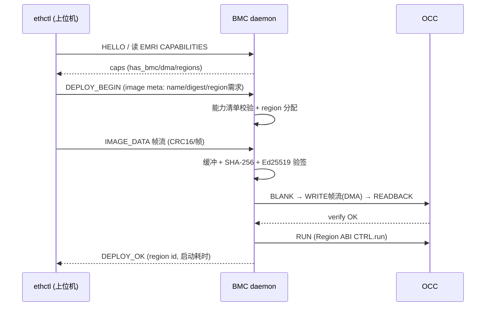

# S08 · 运行时 daemon 与 ethctl（EFP 协议）

> | 属性 | 值 |
> |---|---|
> | 仓库 | ethereal-runtime（daemon/BMC 固件模块）/ ethereal-tools（ethctl） |
> | 许可证 | MIT |
> | 重要度 | ★★★★☆（用户天天摸的界面） |
> | 关联 | ADR-010；任务 E1-RUN2/3、E1-IO1、E3-SCH1；上游 Docker CLI 习惯、DFX Controller 状态语义 |

## 1. 是什么 / 做什么 / 重要度

平台的"Docker Engine + docker CLI"：
- **daemon**：运行在 BMC 固件（或 mFSM 模式的上位机脚本）中的管理守护——镜像接收/验签/region 分配/OCC 调度/生命周期/看门狗/事件（与 S05 固件模块同构，本文件侧重**协议与状态机语义**）；
- **ethctl**：PC/上位机 CLI，命令集刻意对齐 Docker（`run/ps/stop/rm/images/logs/inspect/pull/push`）；
- **EFP（Ethereal Fabric Protocol）**：ethctl↔daemon 的会话协议，SPI（EFP-SPI 帧协议）/UART/后期网络三种承载。

**为什么重要**：开发者体验决定开源项目生死。"一条命令部署逻辑容器"是本项目的招牌瞬间，必须稳、快、错误信息人话化。

## 2. 大体规划

### 2.1 部署会话（EFP 协议核心流程）

### 2.2 生命周期状态机（同 S02 §2.2，daemon 侧视角）

EMPTY→BLANKING→LOADING→VERIFYING→LOADED→RUNNING→STOPPING→(ERROR)→BLANKING。每条转移记录事件日志（S07）。语义对齐 AMD DFX Controller（Empty/Shutdown/Clearing/Loading/SW Startup/Reset/Loaded），便于未来原生 DFX 槽位共用同一状态机。

### 2.3 ethctl 命令映射

| 命令 | 语义 | 底层 |
|---|---|---|
| `ethctl run img.eth [--region N] [--name xx]` | 部署+启动 | EFP DEPLOY 会话 |
| `ethctl ps` | 列出 region 容器 | EMRI REGION_TABLE + HEALTH |
| `ethctl stop/restart <name>` | 停止/重启 | Region ABI CTRL |
| `ethctl rm <name>` | 停止+blank+释放 | OCC BLANK |
| `ethctl images` | 本地/设备镜像列表 | BMC 缓存目录 |
| `ethctl logs <name>` | 事件日志 | I²C MFR_EVENT_LOG / EFP |
| `ethctl inspect <name>` | 详情（镜像/引脚/资源） | EMRI+IOMAP |
| `ethctl pull/push`（P3） | 仓库拉取/推送 | OCI registry |
| `ethctl monitor` | 遥测仪表盘 | I²C 命令集 |

## 3. 详细规划与阶段检查点

### Phase 1
| # | 步骤（任务 ID） | 检查点 |
|---|---|---|
| 1 | EFP-SPI 帧协议（E1-IO1）：addr/len/data/CRC16，重传语义 | CRC 错误注入测试全过；断线重连会话恢复 |
| 2 | daemon v1（E1-RUN2，BMC 固件） | run/stop/ps/restart 全通；坏签名/满 region/写冲突优雅报错（错误码表人话化） |
| 3 | ethctl v1（E1-RUN3） | `ethctl run aes128.eth` 30s 内完成；`--help` 自文档化 |
| 4 | UART 承载（备用通道） | 同一 EFP 会话经 UART 完成部署 |

### Phase 2
| # | 步骤 | 检查点 |
|---|---|---|
| 1 | mFSM 模式上位机驱动库（与 E2-BMC1 联合） | 同一 ethctl 二进制无缝操作两种模式 |
| 2 | 批量操作（`ethctl compose up`，bundle YAML 先行版） | 双镜像一键部署 demo |
| 3 | 镜像缓存目录 + `images/inspect` | 缓存命中部署 < 20 ms（SPI 场景） |

### Phase 3
- 调度器接入（预取/分组，E3-SCH1，冷启动 P50<100ms）；`pull/push`（S09）；远程调试隧道（gdbstub over EFP）。

### Phase 4
- 统一编排器命令面（多板 `ethctl -H board1,board2`）；TUI 仪表盘。

## 4. 验证与里程碑验收

**方法**：协议 fuzz（随机帧/乱序/截断）→ 错误路径矩阵（每错误码一个用例）→ 体验测试（新用户 5 分钟上手计时）→ 长会话稳定性。

| 里程碑 | 验收标准 |
|---|---|
| M-S08-1（P1） | 核心命令全通；错误矩阵全过；30s 部署达标 |
| M-S08-2（P2） | mFSM/BMC 双模式无感；compose 先行版 demo |
| M-S08-3（P3） | 冷启动 P50<100ms；pull/push 可用 |

## 5. 可能的问题与快速查找关键词

| 问题 | 症状 | 搜索关键词 |
|---|---|---|
| SPI 长传输可靠性 | 大镜像偶发 CRC 错 | `SPI long transfer reliability CRC retransmit protocol`；分块+滑窗 |
| BMC SRAM 缓冲 vs 大镜像 | 内存不够 | 流式写 OCC（边收边写，DMA 直通）；`streaming firmware update low RAM` |
| CLI 跨平台串口兼容 | Windows 用户踩坑 | `pyserial cross platform`、`serial port enumeration library` |
| 会话状态与 BMC 重启不同步 | 部署中固件复位 | HELLO 时交换会话纪元号（epoch），不一致则重同步 |
| 错误信息不友好 | 用户流失 | 错误码表+建议动作；参考 `docker error message UX` |

## 6. 实现守则速查
见 `../README.md` §2。协议字段变更必须 EFP 规范先行（ethereal-spec，语义化版本）。

## 7. 不确定时需向用户确认的问题
1. EFP 是否需要认证/加密（局域网场景 v1 明文+验签即可，远程场景 Phase 3 加 TLS-over-TCP 承载）？
2. `ethctl compose` 的 YAML 语法是否直接子集化 docker-compose（降低学习成本）？
3. TUI 仪表盘技术选型（Textual/Ratatui/Go 二选一）——Phase 4 前需你拍板。
