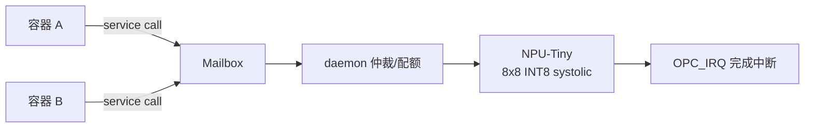

# S11 · Service Tile（固定功能模块，如 NPU）

> | 属性 | 值 |
> |---|---|
> | 仓库 | ethereal-shell（框架）/ ethereal-images（具体 tile） |
> | 许可证 | CERN-OHL-S-2.0 |
> | 重要度 | ★★★☆☆（Phase 3 起；系统灵活性的倍增器） |
> | 关联 | ADR-009；任务 E3-SVC1/2；上游 Coyote v2 服务层、Gemmini、Gowin GoAI 参考 |

## 1. 是什么 / 做什么 / 重要度

Service Tile 是随 base image（或原生 DFX 槽位）部署的**固定功能模块**：占用 fabric 描述中标记 `type: service` 的专用 region，通过 EBI 服务接口（Cluster0/EP4-7，见 S04 节点地图）向所有容器与宿主提供共享加速服务。首发候选 **NPU-Tiny**（INT8 systolic 阵列）。

**为什么重要**：这是你的"虚拟化 FPGA 不止是虚拟化"构想的落地——固定高性能模块（NPU、加密硬核、SDR 前端）与可替换的 vFPGA 容器共存，系统既有灵活性又有硬性能。对标 Coyote v2 的"服务"层，但我们把它做成平台一等公民（注册/发现/配额）。

## 2. 大体规划

### 2.1 框架三要素

1. **部署形态**：base image 构建期固化（fabric.yaml `type: service`）；或 Zynq 原生 DFX 槽位动态部署；
2. **服务接口**：EBI endpoint + 服务描述符（功能 ID/版本/寄存器 ABI/中断），BMC 维护**服务目录**，容器经 mailbox 消息调用；
3. **共享语义**：多容器分时复用（daemon 仲裁+配额）；每次服务会话前 reset，**禁止跨会话状态泄漏**（安全用例）。

### 2.2 NPU-Tiny 规格（v1）

| 项 | 规格 | 备注 |
|---|---|---|
| 阵列 | 8×8 INT8 systolic（Gemmini 架构启发） | BSRAM 喂权重/激活；约 15-20K LUT + 20× BSRAM + 8× DSP |
| 接口 | EBI endpoint：CMD/ADDR/LEN/IRQ；DMA 双缓冲 | 与 OCC DMA 模式复用 |
| 负载 | 关键词唤醒（KWS）级 TinyML | demo：DS-CNN 小型 |
| 性能目标 | ≥ 0.5 GOPS INT8 @100MHz | 实测报告 |

## 3. 详细规划与阶段检查点

### Phase 2（框架预埋）
| # | 步骤 | 检查点 |
|---|---|---|
| 1 | fabric.yaml 支持 `type: service` region | 生成器正确保留 service 区不参与容器分配 |
| 2 | 服务描述符 schema（RFC-005 草案） | 描述符可被 daemon 解析注册 |

### Phase 3
| # | 步骤（任务 ID） | 检查点 |
|---|---|---|
| 1 | NPU-Tiny RTL（E3-SVC1） | 8×8 GEMM cocotb bit-true；上板 ≥0.5 GOPS |
| 2 | 服务注册/发现（E3-SVC2） | `ethctl services` 列出 NPU；容器调用 demo |
| 3 | 多容器分时复用 | 两容器交替推理，无状态泄漏（会话间寄存器检查） |
| 4 | KWS demo | 实时音频关键词唤醒演示 |

### Phase 4+
- 第二 Service Tile：加密硬核（SM4/AES，同时给验签加速——平台自举）；SDR 前端（Zynq）；Service Tile 市场（官方镜像仓库分发 service image）。

## 4. 验证与里程碑验收

**方法**：算子级 bit-true（对 numpy 参考）→ 端到端模型推理精度 → 并发/配额压力 → 状态泄漏安全检查。

| 里程碑 | 验收标准 |
|---|---|
| M-S11-1（P3） | NPU-Tiny 上板达标 + KWS demo |
| M-S11-2（P3） | 服务目录 + 多容器复用无泄漏 |
| M-S11-3（P4） | 第二 Service Tile 上线 |

## 5. 可能的问题与快速查找关键词

| 问题 | 症状 | 搜索关键词 |
|---|---|---|
| systolic 阵列时序收敛 | Fmax 不达标 | `systolic array FPGA timing closure pipeline` |
| 量化精度损失 | KWS 精度掉 | `INT8 quantization aware training TinyML`、`DS-CNN keyword spotting tflite micro` |
| BSRAM 带宽瓶颈 | 阵列空转 | `systolic array data reuse tiling weight stationary` |
| 会话间状态泄漏 | 安全用例失败 | 会话 reset 序列 + 寄存器清零断言 |
| 与容器争抢 fabric 资源 | 部署失败 | service region 与容器 region 的预算配比文档化 |

## 6. 实现守则速查
见 `../README.md` §2。Service Tile 必须附带：服务描述符、调用示例、状态泄漏自检测试。

## 7. 不确定时需向用户确认的问题
1. NPU-Tiny 阵列规模 8×8 是否合适（还是 4×4 起步更稳）？
2. 第二个 Service Tile 选加密硬核还是 SDR 前端（建议加密硬核，自举价值大）？
3. Service Tile 是否允许第三方发布（Phase 4 生态问题）？
