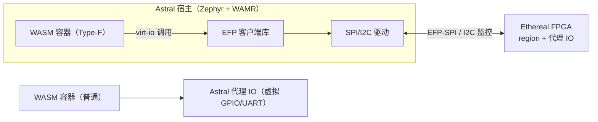

# S13 · Astral 聚合（固件容器 ↔ 逻辑容器）

> | 属性 | 值 |
> |---|---|
> | 仓库 | astral-os / ethereal-runtime（EFP 客户端库） |
> | 许可证 | MIT |
> | 重要度 | ★★★★☆（"聚合化"愿景的另一半） |
> | 关联 | ADR-010；任务 E2-AST1、E4-BMC1；上游 Zephyr userspace、WAMR、AkiraOS/TinyContainer |

## 1. 是什么 / 做什么 / 重要度

Astral Universal OS Platform 与 Ethereal 的聚合层：**Type-F 容器**——Astral 侧的 WASM/原生应用把 FPGA region 当作一种可调度资源，经标准接口（EFP 客户端库）部署、调用、共享 vFPGA 逻辑。聚合的控制面先独立（EFP/ACP 双协议）、Phase 4 统一编排（ADR-010）。

**为什么重要**："固件容器 + 逻辑容器同屏运行"是本项目无人做过的组合创新，也是 Phase 2 最有传播力的演示。同时 Astral 侧有自己的完整规划（见 v1.0 文档 §4），本文件只覆盖**聚合面**；Astral 独立子系统的详细计划待你确认后单独立项（见 §7）。

## 2. 大体规划

### 2.1 Type-F 容器数据通路

### 2.2 能力对齐

| Astral 侧 | Ethereal 侧 | 共享物 |
|---|---|---|
| 能力清单（capability manifest） | capabilities.yaml（S09/S10） | **同一份 schema** |
| 代理 IO（虚拟 GPIO/UART/I²C） | L2 协议代理寄存器规范（RFC-004） | **同一份虚拟设备规范** |
| 健康/崩溃管理 | S07 监控通道 | I²C 命令集 |
| 镜像仓库（OCI） | OCI artifact（S09） | 同一 registry 生态 |

## 3. 详细规划与阶段检查点

### Phase 2（聚合 v1，E2-AST1）
| # | 步骤 | 检查点 |
|---|---|---|
| 1 | Zephyr + WAMR 最小运行时（一块 MCU 或 Zynq R5） | WASM hello + 原生 GPIO |
| 2 | EFP 客户端库（C，Zephyr 模块） | MCU 经 SPI 完成 `efp_deploy/stop/status` 全流程 |
| 3 | Type-F 容器 demo：WASM 应用部署 PWM 逻辑镜像并控制占空比 | **聚合演示视频**（"固件容器+逻辑容器同屏"） |
| 4 | 统一能力 schema v0 | 两侧用同一 YAML 描述权限 |

### Phase 3
| # | 步骤 | 检查点 |
|---|---|---|
| 1 | 双向数据通路（WASM↔region 流数据，经 L2 代理） | 吞吐/延迟实测报告 |
| 2 | 崩溃联动（WASM 容器崩溃→关联 region 按策略处置） | 用例全过 |
| 3 | ACP（Astral Control Protocol）v0 草案 | 与 EFP 的关系图（RFC） |

### Phase 4
| # | 步骤 | 检查点 |
|---|---|---|
| 1 | BMC 迁 Zephyr 后成为 Astral 节点（E4-BMC1） | BMC 本机运行 Type-F 容器（无外挂 MCU） |
| 2 | 统一编排器（E4-ORC1）：bundle 同时含固件镜像与逻辑镜像 | 一键部署聚合应用 demo |
| 3 | Astral 完整运行时（Type-N/W/F） | 见 v1.0 §5.A 任务清单 |

## 4. 验证与里程碑验收

**方法**：端到端 demo 驱动 → 数据通路性能实测 → 崩溃/异常联动矩阵 → 统一 schema 一致性测试。

| 里程碑 | 验收标准 |
|---|---|
| M-S13-1（P2） | 聚合演示视频 + 统一能力 schema v0 |
| M-S13-2（P3） | 双向数据通路报告；ACP v0 |
| M-S13-3（P4） | 统一编排器一键部署聚合应用 |

## 5. 可能的问题与快速查找关键词

| 问题 | 症状 | 搜索关键词 |
|---|---|---|
| WAMR 在 Zephyr 的集成 | 构建/内存问题 | `WAMR Zephyr integration guide`、`wasm-micro-runtime product-mini zephyr` |
| WASM 性能（解释器模式） | 控制循环太慢 | `WAMR AOT Cortex-M`、`wasm3 vs wamr benchmark MCU` |
| SPI 吞吐成为瓶颈 | 数据通路慢 | 升级通道（并口/SDIO/内部总线）；`MCU FPGA high speed interface` |
| 能力 schema 两侧漂移 | 兼容 bug | 单一 schema 源（ethereal-spec）+ 两侧代码生成 |
| MCU 资源紧张（WASM runtime + 协议栈） | OOM | `WAMR memory tuning`、`Zephyr memory domain sizing` |

## 6. 实现守则速查
见 `../README.md` §2。聚合层所有协议/Schema 单一事实源在 ethereal-spec。

## 7. 不确定时需向用户确认的问题
1. Astral 完整运行时（Type-N/W、代理 IO、内存安全子系统）的详细计划文件集——是否需要现在按本计划库同规格单独立项（S15-S18 系列），还是 Phase 2 聚合演示后再展开？
2. 首个 Astral 宿主硬件：你的某块 MCU 开发板？还是直接用 GW5 外挂 MCU / Zynq R5？
3. WASM 是否确认为 Astral 默认镜像格式（v1.0 文档的建议）？
