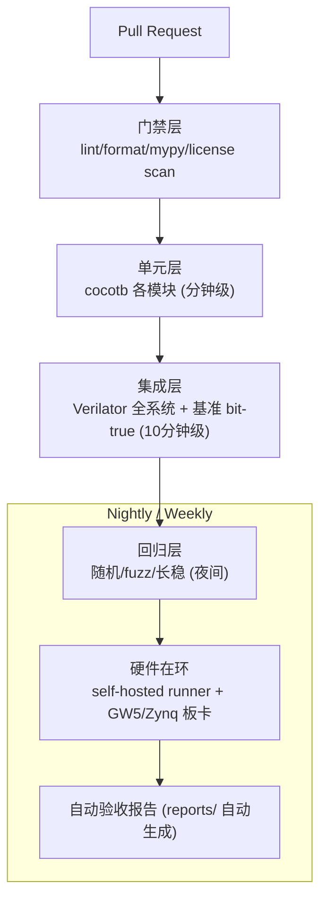

# S14 · 验证与 CI 基础设施

> | 属性 | 值 |
> |---|---|
> | 仓库 | 各仓库 `.github/workflows/` + ethereal-tools（测试框架） |
> | 许可证 | MIT |
> | 重要度 | ★★★★★（单人项目活下来的前提） |
> | 关联 | 任务 E0-INF2/3、E1-DMO2；上游 cocotb、Verilator、GitHub Actions |

## 1. 是什么 / 做什么 / 重要度

覆盖全项目的验证体系与自动化设施：RTL 单元测试（cocotb）、集成仿真（Verilator）、lint/冒烟综合门禁、基准回归、硬件在环测试（self-hosted runner + 真实板卡）、验收报告自动生成。

**为什么重要**：单人 + Agent 混合开发模式下，CI 是唯一的质量守门员。"测试先行、报告自动"能把你从重复验证中解放出来，也让外部贡献者敢提 PR。

## 2. 大体规划

**分层原则**：门禁层秒级、单元层分钟级、集成层十分钟级、回归层夜间、硬件层 nightly——任何一层变红都阻塞合并，硬件层例外（先告警）。

## 3. 详细规划与阶段检查点

### Phase 0
| # | 步骤（任务 ID） | 检查点 |
|---|---|---|
| 1 | CI 骨架（E0-INF2）：lint + cocotb + 文档构建 | dummy 测试变绿 |
| 2 | 仿真 Docker（E0-INF3） | 干净机器 30 分钟复现 |
| 3 | cocotb 公共库（BFM：EBI/mailbox、OCC 协议、SPI/I²C 主机模型） | 三个 BFM 自带测试通过 |
| 4 | 报告模板 action（按 README §3 自动生成骨架） | CI 产出的报告含 mermaid 占位 |

### Phase 1
| # | 步骤 | 检查点 |
|---|---|---|
| 1 | self-hosted runner 接入（挂 GW5 板卡的常开机器） | CI 一键烧写+跑上板测试 |
| 2 | 上板回归套件（与仿真同向量） | 三演示镜像 nightly 上板全过 |
| 3 | 10k 热替换压力（E1-DMO2）自动化 | 失败自动上传日志/波形 |

### Phase 2
| # | 步骤 | 检查点 |
|---|---|---|
| 1 | 双平台硬件回归（GW5+Zynq 两台 runner） | 同一镜像双板直跑 CI 验证（M-S01-4 的执行者） |
| 2 | 覆盖率收集（cocotb coverage / Verilator coverage） | 覆盖率报告趋势图 |
| 3 | fuzz 常态化（协议 fuzz/帧 fuzz  nightly） | 发现的问题归档为回归用例 |

### Phase 3+
- 形式化验证试点（SymbiYosys：OCC 状态机、mailbox 无死锁属性）；性能回归看板（开销比/Fmax/部署时间历史曲线）；社区 PR 的硬件测试机器人。

## 4. 验证与里程碑验收（本子系统的验收=它对别人验收的支撑度）

| 里程碑 | 验收标准 |
|---|---|
| M-S14-1（P0） | 三层 CI 全绿；报告 action 上线 |
| M-S14-2（P1） | 硬件在环 nightly；10k 压力自动化 |
| M-S14-3（P2） | 双平台回归；覆盖率趋势可见 |
| M-S14-4（P3+） | 形式化试点报告 |

## 5. 可能的问题与快速查找关键词

| 问题 | 症状 | 搜索关键词 |
|---|---|---|
| self-hosted runner 安全（公共仓库） | 恶意 PR 触碰板卡 | `GitHub self-hosted runner security fork PR approval`（仅对 approve 后 PR 跑硬件层） |
| 板卡掉线/烧写失败 | nightly 红 | runner 看门狗 + 自动重试；`openFPGALoader CI automation` |
| cocotb 与 Verilator 版本兼容 | 测试挂 | `cocotb verilator compatibility matrix`；Docker 锁版本 |
| 波形体积爆炸 | 磁盘满 | 失败时保留波形+定期清理；`Verilator trace fst compress` |
| 覆盖率工具链碎片化 | 数据不可比 | `cocotb coverage` 统一；趋势而非绝对值 |

## 6. 实现守则速查
见 `../README.md` §2。测试代码标记 `// TESTBENCH`；每个回归用例注明来源（计划任务 ID 或历史 issue 号）。

## 7. 不确定时需向用户确认的问题
1. self-hosted runner 用哪台机器（你的常开主机/树莓派即可，需能接触两块板卡）？
2. 硬件层测试对 fork PR 的审批流程（建议：仅你手动触发）？
3. 形式化验证试点是否值得 Phase 3 投入（还是先堆随机测试）？
