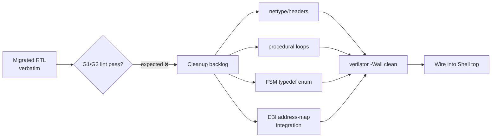

# Migration Note — AXI-MailboxFabric NoC & SPI/UART Adapters

> Task: **S04-P0#1** (Mailbox RTL export + migration note)
> Date: 2026-07-24 · Repo: `ethereal-shell/` · Plan-Ref: `ethereal-plan/subsystems/S04-EBI总线与Mailbox-NoC集成.md`
> Licensing decision authority: `ethereal-plan/README.md §4` (finalized 2026-07)

This document records the one-way migration of the self-owned **AXI-MailboxFabric**
Network-on-Chip (the EBI backbone, subsystem S04) plus its SPI/UART host adapters
**out of** the maintainer's other repo `github.com/BaiTian6641/TinyGPU-FPGA`
**into** this repo (`ethereal-shell/`), re-released under **CERN-OHL-S-2.0**.

---

## 1. What was migrated

Source commit: `BaiTian6641/TinyGPU-FPGA@main` (`2d97bc1`, "Fix formatting in _vmake configuration file…"),
fetched 2026-07-24 via sparse shallow clone.

### 1.1 NoC core → `rtl/mailbox/` (10 files)

| # | Source path (`TinyGPU-FPGA/`) | Destination (`ethereal-shell/`) | Role |
|---|---|---|---|
| 1 | `ip/mailbox/mailbox_pkg.sv` | `rtl/mailbox/mailbox_pkg.sv` | Shared package: types (`mailbox_header_t`, `mailbox_tag_t`), localparams (`DATA_WIDTH=32`, `NODE_ID_WIDTH=16`). **Dependency of all other mailbox files.** |
| 2 | `ip/mailbox/mailbox_center.sv` | `rtl/mailbox/mailbox_center.sv` | Root router (center): 4 switches + HP port, full-duplex AXI4-Lite |
| 3 | `ip/mailbox/mailbox_center_stream.sv` | `rtl/mailbox/mailbox_center_stream.sv` | Root router, stream-hybrid variant |
| 4 | `ip/mailbox/mailbox_endpoint.sv` | `rtl/mailbox/mailbox_endpoint.sv` | Leaf endpoint, full-duplex AXI4-Lite + CSR, pop-on-read |
| 5 | `ip/mailbox/mailbox_endpoint_stream.sv` | `rtl/mailbox/mailbox_endpoint_stream.sv` | Leaf endpoint, stream-hybrid dual-role |
| 6 | `ip/mailbox/mailbox_switch_2x1.sv` | `rtl/mailbox/mailbox_switch_2x1.sv` | 2-to-1 switch (1 uplink / 2 downlinks), QoS + route-lock |
| 7 | `ip/mailbox/mailbox_switch_2x1_stream.sv` | `rtl/mailbox/mailbox_switch_2x1_stream.sv` | 2-to-1 switch, stream variant |
| 8 | `ip/mailbox/mailbox_switch_4x1.sv` | `rtl/mailbox/mailbox_switch_4x1.sv` | 4-to-1 switch (1 uplink / 4 downlinks), QoS + route-lock |
| 9 | `ip/mailbox/mailbox_switch_4x1_stream.sv` | `rtl/mailbox/mailbox_switch_4x1_stream.sv` | 4-to-1 switch, stream variant |
| 10 | `ip/mailbox/mailbox_fifo.sv` | `rtl/mailbox/mailbox_fifo.sv` | Parameterizable synchronous FIFO (used by switches/center) |

### 1.2 SPI host/fabric adapters → `rtl/interface/spi/` (2 files)

| # | Source path | Destination | Role |
|---|---|---|---|
| 11 | `ip/interface/spi/spi_mailboxfabric.sv` | `rtl/interface/spi/spi_mailboxfabric.sv` | SPI ↔ MailboxFabric bridge (host-side adapter) |
| 12 | `ip/interface/spi/spi_sat.sv` | `rtl/interface/spi/spi_sat.sv` | SPI satellite (MailboxFabric endpoint-side adapter) |

### 1.3 UART host/fabric adapters → `rtl/interface/uart/` (2 files)

| # | Source path | Destination | Role |
|---|---|---|---|
| 13 | `ip/interface/uart/uart_mailboxfabric.sv` | `rtl/interface/uart/uart_mailboxfabric.sv` | UART ↔ MailboxFabric bridge (host-side adapter) |
| 14 | `ip/interface/uart/uart_sat.sv` | `rtl/interface/uart/uart_sat.sv` | UART satellite (MailboxFabric endpoint-side adapter) |

### 1.4 Specification document → `docs/` (1 file)

| # | Source path | Destination | Notes |
|---|---|---|---|
| 15 | `docs/docs_mailbox_interconnect_spec.md` | `docs/mailbox_interconnect_spec.md` | AXI-MailboxFabric spec (concept, routes, packets, behavior). Copied verbatim with a one-line provenance comment prepended. |

**Totals:** 14 RTL files (`.sv`) + 1 spec doc migrated. All RTL copied **verbatim**
(module names, signal names, and bodies unchanged); only the file header block was
added/replaced (see §3).

### 1.5 Explicitly NOT migrated (intentional)

- `ip/mailbox/README.md` — empty (0 bytes); nothing to carry.
- `ip/interface/spi/README.md`, `ip/interface/uart/README.md` — non-RTL adapter
  docs; skipped per the task's "RTL-only" copy rule. They remain available at the
  source paths above for reference during integration.
- `ip/interface/spi_AXI/`, `ip/interface/uart_AXI/` — contain only a `README.md`,
  **no RTL** (these are AXI-variant stubs, not the MailboxFabric adapters). Nothing to copy.
- `ip/interface/{hub75,lcd_spi,octal-spi,oled_spi,sdio_master}/` — device-specific
  peripheral controllers, **out of scope** for the Mailbox NoC migration (S04/S06/S08).
- `ip/AXI/` — contains only an empty `README.md`; no AXI package file.
- `docs/mailbox_interconnect_plan.md`, `docs/SystemVerilog_RTL_Policy.md`,
  `docs/axi4.md` — related but not part of this migration. The RTL policy is already
  absorbed into project rule **G1** (`ethereal-plan/README.md §2.1`).

---

## 2. License change

| Item | Detail |
|---|---|
| **Original repo license** | **Not declared.** `TinyGPU-FPGA` has **no top-level `LICENSE` file** and the migrated files carried **no `SPDX-License-Identifier`** header and no copyright line. The repo README's "License & legal" section only addresses third-party benchmarks (CoreMark, Dhrystone), not the author's own RTL. The single file in the source repo that does carry an SPDX header (`ip/compute unit/regfile_scalar.sv` → `Apache-2.0`) is **outside** the migrated set. |
| **New license** | **CERN-OHL-S-2.0** (this repo's `ethereal-shell/LICENSE`), applied to all 14 migrated RTL files and the spec doc. |
| **Authority** | `ethereal-plan/README.md §4` — "Mailbox IP 为你本人所有 … 已定稿（2026-07）：你本人将 NoC 核及部分核心从 TinyGPU-FPGA 迁出，直接以 CERN-OHL-S-2.0 发布于 ethereal-shell，文件头注明出处". |
| **Effective date** | 2026-07-24 |

### Provenance & attribution (no third-party conflict)

Both the source repository (`BaiTian6641/TinyGPU-FPGA`) and this repository
(`BaiTian6641/Astral_Platform`) are **owned and authored by the same maintainer**
(BaiTian6641). The AXI-MailboxFabric NoC and the SPI/UART adapters are the
maintainer's **own work** (no external contributors or third-party copyright on
these specific files). Re-licensing one's own work from "unspecified" to
CERN-OHL-S-2.0 is therefore the maintainer's own act — there is **no third-party
licensing conflict** and no permission gap. Each migrated file records this via the
`// Provenance:` / `// SPDX-License-Identifier: CERN-OHL-S-2.0` header block.

---

## 3. Header / provenance convention applied

Every migrated RTL file now begins with (inserted during this migration; the
original `` `timescale 1ns/1ps `` line and the entire RTL body below it are
**unchanged**):

```systemverilog
`default_nettype none
// SPDX-License-Identifier: CERN-OHL-S-2.0
// Provenance: Migrated from github.com/BaiTian6641/TinyGPU-FPGA/<original-relative-path>
//             (c) BaiTian6641. Re-licensed to CERN-OHL-S-2.0 per ethereal-plan/README.md §4 (2026-07).
//             Original repo license: not declared (no top-level LICENSE; these files carry no SPDX header).
//             Migration date: 2026-07-24. Task: S04-P0#1.
// Module:      <module name>
// Plan-Ref:    ethereal-plan/subsystems/S04-EBI总线与Mailbox-NoC集成.md
// Notes:       Migrated verbatim (RTL body unchanged). verilator --lint-only -Wall verification is PENDING (Docker-gated; no verilator in authoring env).
`timescale 1ns/1ps
// <…original body begins here, byte-for-byte identical to source…>
```

The spec doc (`docs/mailbox_interconnect_spec.md`) carries an equivalent provenance
block as an HTML comment at its top.

**Verification (post-migration self-check):** all 14 RTL files contain
`SPDX-License-Identifier: CERN-OHL-S-2.0`, the `Provenance:` line, and
`` `default_nettype none `` as line 1 (0 files missed). See §6.

---

## 4. Verification status

| Check | Status | Why |
|---|---|---|
| `verilator --lint-only -Wall` | ⏳ **PENDING** | The authoring environment has **no `verilator` installed** (and no `docker`). This is a **Docker-gated** validation per `AGENTS.md §7` — the agent authors RTL/scripts; the maintainer runs `make lint`/`docker build` and pastes results. Project rule G1 requires zero warnings (or documented, justified exemptions); that gate is **not yet satisfied** for these files. |
| `cocotb` mailbox testbench | ⏳ **PENDING** | No testbench was migrated in this task (the `TinyGPU-FPGA/testbench/mailbox_tb.sv` exists upstream but is **out of scope** for S04-P0#1, which is RTL-export-only). A dedicated Ethereal EBI-level cocotb test is a later task. |
| Header presence (SPDX + Provenance + nettype) | ✅ **DONE** | All 14 files — see §6 self-check output. |
| Body integrity (verbatim copy) | ✅ **DONE** | Copy was via `cp`; only the header block was inserted. Module names, signal names, line counts unchanged vs source. |

> **G6 note:** the lint result is the maintainer's to provide. Until then, these files
> must be treated as **lint-unverified** and must NOT be wired into a synthesizable
> top until `verilator --lint-only -Wall` passes (see cleanup backlog §5 — several
> items are *expected* to produce `-Wall` findings).

---

## 5. Cleanup backlog (lint-policy deviations vs G1/G2)

These were observed while reading the migrated files. They are **not fixed in this
task** (this task is "migrate verbatim + re-license"; fixing them is a follow-up,
tracked here so nothing is lost). Target policy: `ethereal-plan/README.md §2.1` (G1).



### 5.1 Already satisfied during this migration ✅

- **G1 nettype directive:** original files started with `` `timescale `` and had **no**
  `` `default_nettype none ``. **Fixed**: `` `default_nettype none `` is now line 1 of
  all 14 files.
- **G2 `Plan-Ref:` back-trace:** added to all 14 files (→ `S04-EBI总线与Mailbox-NoC集成.md`).
- **G1 `always_ff`/`always_comb` discipline (good news):** the source already uses
  SystemVerilog `always_ff` (×29) / `always_comb` (×36) with async-low reset
  (`posedge clk or negedge rst_n`); **zero** old-style `always @(*)` or
  `always @(posedge …)`. All 22 `case` statements include a `default:` (no latch risk
  from missing case arms). **No `initial` blocks** (fully synthesizable).

### 5.2 Open deviations to fix before `-Wall` is declared clean ⚠️

| # | Deviation | Where (representative) | G1 rule | Fix direction |
|---|---|---|---|---|
| 1 | **Procedural `for` loops inside `always_comb`/`always_ff`** | `mailbox_center.sv`: ~17 loops in `always_comb` (e.g. lines 447, 475, 482–483, 492, 499–502, 515, 526, 567, 581, 587, 615) and ~5 in `always_ff` (638, 644, 654, 751, 757) | "no procedural loops inside `always_*` (use `generate/genvar`)" | Convert unrolled-arbitration loops to `generate … for (genvar)`. Bounded `for` with `int i` unrolls fine in most tools but is **forbidden by project policy** and may trip `-Wall`. Likely needs a documented exemption OR refactor. **Largest cleanup item.** |
| 2 | **FSMs use plain `logic [N:0] state`** instead of `typedef enum` + two-segment style | e.g. `spi_mailboxfabric.sv` `send_state` (`logic [1:0]`, states 0/1/2 as magic numbers); similar patterns in other interface adapters | "FSM must use `typedef enum logic [N:0]` + two-segment" | Introduce `typedef enum`, name the states, split next-state/output. (`mailbox_pkg.sv` does use `typedef enum` for opcodes — extend that idiom to the FSMs.) |
| 3 | **No trailing `` `default_nettype wire `` restore** at EOF | all 14 files | good hygiene (not strictly G1, but TinyGPU RTL Policy convention) | Append `` `default_nettype wire `` after `endmodule`/`endpackage`. Optional. |
| 4 | **Incomplete G2 header fields** | all RTL files | G2 header has `Maintainer / Created / Modified / Tags` | Add the missing fields (`Maintainer: BaiTian6641`, `Created: 2024-..` (recover from source git history), `Tags: RTL, SYNTH`, etc.). `Module/Plan-Ref/SPDX/Provenance` already present. |
| 5 | **`` `timescale 1ns/1ps `` present** | all 14 files | not forbidden by G1; harmless and aids sim reproducibility | Keep as-is, OR centralize timescale at the sim-top per future policy. No action required now. |
| 6 | **Width-cast / literal-width spot checks** | needs `-Wall` run to enumerate | "literals carry width+base (e.g. `8'hFF`)" | Run `verilator -Wall`, fix each `WIDTH`/`UNOPTFLAT`/`UNUSEDPARAM` finding. Cannot be done without verilator. |

### 5.3 Integration TODOs for later phases (S04 / S06 / S08)

These are *functional* (not lint) items — the NoC must be adapted to the Ethereal
context, not just lint-cleaned:

- **EBI address map:** re-map `mailbox_pkg::NODE_ID_WIDTH=16`
  (`Cluster[15:8] + Endpoint[7:4] + CSR[3:0]`) onto the Ethereal **EBI** address
  space defined in `ethereal-spec` (region/endpoint addressing per S04). Confirm the
  16-bit node-id encoding matches the EBI profile (Full/Lite/Tiny, ADR-006) — **open
  question for the maintainer** if the EBI map diverges.
- **`region_endpoint` wiring:** the Ethereal **region** is the isolation root; mailbox
  endpoints that today peer with compute-unit leaves must instead peer with
  **region endpoints** (the region ↔ NoC boundary per S04/S06). Re-target the endpoint
  instantiation accordingly.
- **Host-link profile (ADR-008):** the SPI/UART adapters map onto the host link
  (SPI = data/config, I2C = monitor). Verify `spi_mailboxfabric` aligns with the
  PMBus-style monitor split; the UART adapter is a candidate **debug/console** path,
  not the primary host link — confirm intended role with the maintainer (G6).
- **IO redirect (ADR-007):** region logic must **not** touch physical pins directly;
  the SPI/UART adapters here are **host-side bridges**, so they are exempt, but their
  use inside a region must go through the L1 pin Mux / L2 protocol proxy. Document.
- **Reset/clock domain:** migrated code assumes a single `clk`/`rst_n` domain; the
  Ethereal Shell may have separate fabric/BMC/IO clock domains (S12 bring-up). Add
  clock-domain crossing where the NoC straddles domains.
- **`mailbox_tb` re-hosting:** upstream `TinyGPU-FPGA/testbench/mailbox_tb.sv` was
  **not** migrated; an Ethereal EBI-level **cocotb** test (per S14 / G1 verification
  vehicle) must be authored as a separate task before the NoC is declared verified.

---

## 6. Structural self-check (no verilator available locally)

Run after migration (commands + results):

```text
$ find ethereal-shell/rtl -name '*.sv' | wc -l
14

$ # every file: SPDX + Provenance + default_nettype-none at line 1
$ for f in $(find rtl -name '*.sv' | sort); do
    grep -q "SPDX-License-Identifier: CERN-OHL-S-2.0" "$f" \
      && grep -q "Provenance: Migrated from github.com/BaiTian6641/TinyGPU-FPGA" "$f" \
      && head -1 "$f" | grep -q "default_nettype none" \
      && echo "OK $f" || echo "MISS $f"; done
# → 14× OK, 0× MISS

$ # body integrity: timescale line preserved exactly once per file
$ grep -c "timescale 1ns/1ps" rtl/mailbox/mailbox_center.sv rtl/interface/spi/spi_mailboxfabric.sv
rtl/mailbox/mailbox_center.sv:1
rtl/interface/spi/spi_mailboxfabric.sv:1
```

- 14/14 RTL files carry the full CERN-OHL-S-2.0 + provenance header.
- `` `default_nettype none `` added (was absent in source) — **line 1 of all 14 files**.
- Original `` `timescale `` and bodies preserved verbatim.

### Files that originally lacked `` `default_nettype none `` (now added)

**All 14 migrated files** originally had only `` `timescale 1ns/1ps `` as line 1 and
**no** nettype directive. The directive was added during migration for every one of
them, so the "add `default_nettype none`" cleanup item (§5.1) is already closed.
What still remains open is the **trailing restore** (`` `default_nettype wire ``
at EOF) — none of the 14 files have it (§5.2 item 3).

---

## 7. Sync policy

- **One-way migration.** `TinyGPU-FPGA` is the historical origin; from 2026-07-24
  onward, the **authoritative** copy of this NoC lives in `ethereal-shell/`.
- Future bug fixes, lint cleanup (§5), and EBI integration (§5.3) happen **here**,
  not back in `TinyGPU-FPGA`. The source repo should be considered frozen for these
  modules.
- If a fix is so fundamental that it would benefit the original GPU project, it may
  be cherry-picked back manually — but the canonical version is `ethereal-shell/`.
- Re-licensing is final: any re-export of these files from this repo carries
  CERN-OHL-S-2.0 (and the per-file provenance header must travel with the file).

---

## 8. Open questions / ASSUMPTIONS for the maintainer (per G6)

- **ASSUMPTION (2026-07-24):** "Original repo license = not declared" is recorded
  for every migrated file. If the maintainer later adds a `LICENSE` to
  `TinyGPU-FPGA` retroactively, the provenance lines here may want updating for
  accuracy (no legal effect, since the maintainer owns both).
- **ASSUMPTION (2026-07-24):** the 16-bit node-id encoding
  (`Cluster[15:8]+Endpoint[7:4]+CSR[3:0]`) is assumed compatible with the (not yet
  finalized) EBI address map. Confirm when `ethereal-spec` EBI section lands.
- **OPEN:** is `uart_mailboxfabric` intended as the primary host link, a debug
  console, or not used in the GW5 Phase-1 minimal loop? (ADR-008 fixes SPI as the
  data/config host link; UART's role is TBD.)
- **OPEN:** should the upstream `mailbox_tb.sv` testbench be migrated as-is for an
  interim smoke test, or wait for the Ethereal cocotb harness (S14)? This task took
  the "wait" path (RTL-only).
