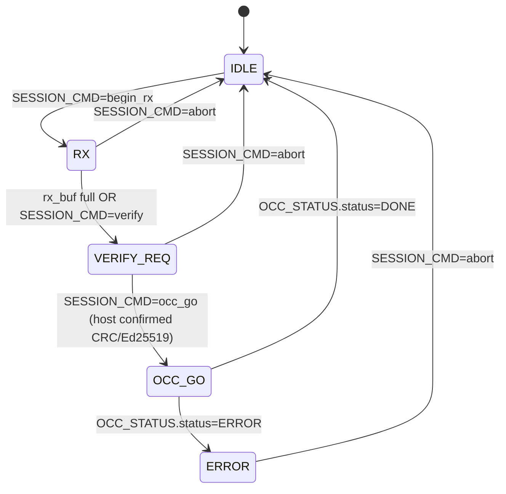

# EMRI — Ethereal Management Register Interface (v0.7, draft)

> Repo: `ethereal-spec` (CC-BY-SA-4.0) · Status: **draft v0.7** (v0.7 adds the **context save/restore orchestration** surfaces — `CTX_CMD`/`CTX_WORDS`/`CTX_STATUS` @ `0x26`-`0x28` (§3.9), `EFP_CMD=8 ctx_save` / `9 ctx_restore`, `EFP_STATUS=9 PAUSED`, `EFP_ERR=13 ctx_error` — for the E2-FAB3 scan-chain engine (`ethereal-spec/fabric/ctx-scan-v0.md`); v0.6 added the **capability-declaration gate** (`CAP_DECL_IO` @ `0x22` / `CAP_DECL_SVC` @ `0x23` / `CAP_STATUS` @ `0x24`, §3.7) + **anomaly monitoring v1** (per-region reconfig/watchdog counters @ `0x32`/`0x33`, spike flags + throttle mask @ `0x34`, window/threshold config @ `0x35`/`0x36`, §3.8) + `EFP_ERR=11 capability_denied` / `12 rate_limited` + event codes 4/5, and **re-maps `OCC_FRAME_ADDR`** to `{region_id[15:12], col_id[11:8], word[7:0]}` — v0.5's 4-bit column field/16-word stride aliased adjacent columns of a multi-column packed image in the readback store (E1-DMO2b; `capabilities.yaml` schema in `ethereal-spec/security/capabilities-v0.md`). v0.5 added the **OCC expected-CRC gate** — `OCC_EXPECT_CRC` @ `0x0E` + `OCC_CRC_RESULT` @ `0x0F`, §3.1.1 — READBACK now compares the readback stream CRC against a **software-supplied** expected CRC the caller captures from `OCC_CRC_RESULT` after the WRITE; this makes multi-column packed deploys (§3.3 step 4) and the §3.5 region heartbeat sound and supersedes the v0.2–v0.4 implicit "compare against the last write anywhere" behaviour. v0.4 added the **event-log ring** @ `0x38`/`0x39` + `EFP_ERR=9 watchdog_timeout` + the OCC op-watchdog/region-heartbeat semantics §3.5 and the sim-scoped dual-partition fw-update demo cmds §3.6 — E1-RUN4/E1-BMC2; v0.3 added `EFP_IMG_COLS` @ `0x21` + `EFP_CMD=run_packed`, §3.3, plus the §7.1 EFP-SPI CRC16 transport-integrity addendum: `SPI_CRC` @ `0x3F`, status `0x04=CRC_ERR`, `EFP_ERR=8=crc_transport`)
> Plan-Ref: `ethereal-plan/subsystems/S05-BMC与EMRI-mFSM.md §2.3`, `ethereal-plan/components/C05-BMC组件.md §3/§4`
> Date: 2026-07-29 · v0.2: 2026-09-01 · v0.3: 2026-09-02 · v0.4: 2026-09-08 · v0.5: 2026-09-11 · v0.6: 2026-09-11 · v0.7: 2026-09-11 · Implements: ADR-013/014/015/016

The **unified management register ABI** exposed to the host by **both** the BMC
(NEORV32 soft-core) and the **mFSM** (register-based small-device fallback).
`ethctl` is transparent to which side it talks to — the same register map, the
same transport, the same commands. Per ADR-015 this is the load-bearing contract
that makes "small device = same host experience" true.

**Why v0 here:** this spec freezes the minimum needed for the **sim-complete
minimal loop** (host `ethctl` → SPI/EMRI → mFSM → OCC → fabric, dual-region
hot-swap in iverilog). It is intentionally narrow: no I²C monitor telemetry
registers (Phase-1 E1-IO2), no event-log ring (E1-RUN4), no scheduler regs
(P3). Those land as v0.1/v1 increments against this same offset map.

---

## 1. Design principles

1. **One map, two implementations.** Identical register layout on BMC and mFSM.
   The ONLY field that differs is `CAPABILITIES.has_bmc` (1 on BMC, 0 on mFSM).
   The RTL is parameterized: `parameter bit HAS_BMC`.
2. **Host-centric in mFSM mode.** In mFSM mode the host executes the full deploy
   flow step-by-step (push image → host verifies → drive OCC → poll). In BMC
   mode the host issues a single high-level command and the BMC runs the flow.
   The register writes are the **same words**; only the division of labor
   differs (S05 §2.3 "protocol identical, intelligence location differs").
3. **Slow host, fast fabric.** All host-visible registers are read through a
   2-flop synchronizer (C05 §3.2); values change at most once per ~ms. No
   coherency machinery beyond 2FF.
4. **OCC is the only fabric-mutating path.** EMRI never touches config storage
   directly — only via the OCC command passthrough (`OCC_CMD` + `OCC_WDATA`).
   This preserves the FABulous blank-before-write red line (C03 §0): the OCC
   enforces it; EMRI just feeds it.

> **v0 mFSM scope (realized in `emri_regfile.sv` with `HAS_BMC=0`):** the v0
> mFSM is the EMRI regfile in mFSM mode — **register-based, no CPU, host-driven**
> (ADR-014 satisfied). The host streams `OCC_WDATA` directly to the OCC through
> the regfile's passthrough; the host implements the session FSM (it holds the
> image and issues BLANK/WRITE/poll). The **device-side rx_buf + 5-state FSM**
> (C05 §4.2 — IDLE/RX/VERIFY_REQ/OCC_GO/DONE streaming from rx_buf) is **v0.1**,
> deferred until the sim loop is measured: it absorbs SPI round-trip latency
> (host pushes whole image fast into rx_buf, then `OCC_GO`) and is the
> BMC-ready structure, but requires OCC-ownership arbitration and is not
> load-bearing for correctness. The `SESSION_CMD`/`SESSION_STATUS` registers
> exist in v0 as plain host-visible storage for forward-compat.

---

## 2. Register map (v0)

Word-addressed, 32-bit. All offsets in **words** (×4 for byte address).

| Offset | Name | R/W | Width | Meaning |
| --- | --- | --- | --- | --- |
| `0x00` | `MAGIC` | R | 32 | `0x45544852` ("ETHR"). Presence/endianness probe. |
| `0x01` | `ABI_VERSION` | R | 32 | `{maj[31:16], min[15:0]}`. v0 = `0x0000_0000`. |
| `0x02` | `CAPABILITIES` | R | 32 | bit0 `has_bmc`, bit1 `has_dma`, bit2 `has_i2c_mon`, bit3 `has_trng`, bit4 `has_jtag_dbg`. Others reserved-0. |
| `0x03` | `PLATFORM_ID` | R | 32 | `{vendor[31:24], dev[23:8], board_rev[7:0]}`. `vendor`: 0=sim, 1=gowin, 2=amd, 3=intel. |
| `0x04` | `NUM_REGIONS` | R | 8 | Region count (v0: 2). |
| `0x05` | `REGION_INFO(idx)` | R | 32 | Per-region geometry: `{cols[31:24], rows[23:16], tiles[15:0]}`. `idx` = host-supplied sub-address (see §6). |
| `0x08` | `OCC_CMD` | RW | 32 | OCC command trigger. See §3. Write → latches a command; self-clears on `OCC_STATUS.busy=0` transition. |
| `0x09` | `OCC_WDATA` | W | 32 | OCC write-data stream. Each write pushes one 32-bit word into the OCC wdata FIFO. |
| `0x0A` | `OCC_STATUS` | R | 32 | `{status[6:0], region_id[11:8], crc_error[16], reserved, frame_addr[31:16]}`. Mirrors `occ_top.status_o` + sticky `crc_error`. See §4. |
| `0x0B` | `OCC_FRAME_ADDR` | RW | 16 | OCC frame base address (`frame_addr_i` to `occ_top`). `{region_id[15:12], col_id[11:8], word[7:0]}` (v0.6). `col_id` = column index; `word` = word offset within the column's frame (256 words = 8 KB/column). v0.5's `{col_id[11:4], rsv[3:0]}` gave a 16-word stride, which aliased adjacent columns of a packed image in the readback store (E1-DMO2b). |
| `0x0C` | `OCC_WORD_COUNT` | RW | 16 | Frame word count (`word_count_i` to `occ_top`). |
| `0x0D` | `OCC_DECODE` | W | 32 | **frame_decoder start trigger** (v0.1). Writing pulses `dec_start_o` → `frame_decoder.start_i`; `data[7:0]` = target fabric column (`col_i`). Self-clearing pulse. Makes a packed deploy self-contained (no host/TB sideband strobe). See §3.1. |
| `0x0E` | `OCC_EXPECT_CRC` | RW | 32 | **Expected streaming CRC for the next READBACK** (v0.5, §3.1.1): latched by `occ_top` at command accept; the READBACK stream CRC must equal it or `crc_error`/`ERROR` (→ `EFP_ERR=occ_crc` in daemon mode). Plain RW storage in the regfile; the caller writes the value captured from `OCC_CRC_RESULT` after the corresponding WRITE/BLANK. |
| `0x0F` | `OCC_CRC_RESULT` | R | 32 | **OCC running/streaming CRC** (v0.5, §3.1.1): after a completed WRITE/BLANK = that stream's final CRC; after a READBACK = the readback stream's CRC; reseeded to `0xFFFF_FFFF` at command accept. The daemon latches it per column at deploy time for §3.3 step 4 and §3.5 heartbeat probes. |
| `0x10` | `SESSION_CMD` | RW | 8 | mFSM session FSM control. `0=nop, 1=begin_rx, 2=verify(host-done), 3=occ_go, 4=abort`. BMC mode: ignored (BMC drives OCC directly). |
| `0x11` | `SESSION_STATUS` | R | 8 | `{state[3:0], done[4], err[7:4]}`. See §5. |
| `0x12` | `RX_BUF_CTRL` | RW | 32 | `{wr_ptr[31:16], depth[15:0]}`. Image-staging buffer (mFSM rx_buf). v0: depth ≤ 16KB. |
| `0x13` | `EFP_CMD` | W | 8 | **Daemon doorbell (v0.2, BMC mode)**. `0=nop, 1=run, 2=stop, 3=restart, 4=abort, 5=run_packed` (v0.3, §3.3), `6=fwupdate, 7=reboot` (v0.4, §3.6 — **sim-demo only**; the production daemon answers `6/7` with `bad_cmd`). `8=ctx_save`, `9=ctx_restore` (v0.7, §3.9). See §3.2. |
| `0x14` | `EFP_REGION` | RW | 8 | Target region for the next `EFP_CMD`. `0xFF` = auto-allocate first free (run only). |
| `0x15` | `EFP_IMG_WORDS` | RW | 16 | Frame-word count of the image being deployed (incl. CRC tail words). |
| `0x16` | `EFP_STATUS` | R | 8 | Daemon lifecycle: `{state[3:0], busy[4], done[5]}`. States: `0=IDLE,1=VERIFY,2=ALLOC,3=BLANK,4=LOAD,5=READBACK,6=RUNNING,7=ERROR,8=STOPPED`. `9=PAUSED` (v0.7, §3.9: context saved, fabric frozen).|
| `0x17` | `EFP_ERR` | R | 8 | Sticky last-error: `0=none,1=bad_sig,2=region_full,3=region_locked,4=occ_crc,5=occ_reject,6=bad_cmd,7=img_len_mismatch,8=crc_transport` (§7.1, SPI-transport CRC16 mismatch), `9=watchdog_timeout` (§3.5, v0.4), `10=fwupdate` (§3.6, v0.4 sim-demo CRC mismatch). `11=capability_denied` (§3.7, v0.6 — declared capability set exceeds what the platform can grant), `12=rate_limited` (§3.8, v0.6 — target region throttled by anomaly monitoring). `13=ctx_error` (§3.9, v0.7 — context save/restore refused or failed: wrong lifecycle state, engine error, or `CTX_WORDS` = 0). Cleared on next `EFP_CMD` write. |
| `0x18-0x1F` | `IMG_DIGEST[0..7]` | RW | 8×32 | 32-byte manifest digest (SHA-256). Word `i` holds digest bytes `[4i+3:4i]` (little-endian in-word). |
| `0x50-0x5F` | `IMG_SIG[0..15]` | RW | 16×32 | 64-byte Ed25519 signature over the digest. Same in-word byte order as `IMG_DIGEST`. |
| `0x20` | `HEALTH_STATUS` | R | 32 | bit-per-region health: bit0=region0 ok, bit8=region1 ok, … v0: all-ok = `0x0000_0101`. |
| `0x21` | `EFP_IMG_COLS` | RW | 8 | Number of fabric columns the staged image spans (`run_packed` only, v0.3 §3.3). Plain RW storage like the other EFP regs. **v0 region→column mapping ASSUMPTION:** in the v0 sim fabric (2×2, one column per region slot) region `r` covers the columns starting at column `r`. |
| `0x22` | `CAP_DECL_IO` | RW | 32 | **Declared IO pin-group bitmap** (v0.6, §3.7): bit `g` = the staged image declares L1 pin group `g` (one group = 8 physical pins, S06:24). Plain RW staging storage, written by the host from `capabilities.yaml` before `EFP_CMD`. |
| `0x23` | `CAP_DECL_SVC` | RW | 32 | **Declared service bitmap** (v0.6, §3.7): bit `k` = declares L2 proxy/virtual-device instance `k` (RFC-004 device-class index, S06:39). |
| `0x24` | `CAP_STATUS` | R | 32 | **Capability-check verdict** (v0.6, §3.7): `[0]=checked`, `[1]=denied`, `[2]=throttled`, `[15:8]=denied_io` (low 8 bits of the offending group bitmap), rest reserved-0. Cleared on the next `EFP_CMD` write. |
| `0x26` | `CTX_CMD` | W | 8 | **Context engine trigger** (v0.7, §3.9): `bit0=start` (one-shot), `bit1=mode` (`0=save`, `1=restore`). Reads 0. The engine ignores a start while busy. |
| `0x27` | `CTX_WORDS` | RW | 16 | **Chain word count** for the next context operation (v0.7, §3.9): `ceil(N/32)` where `N = R*C*8` (one bit per eLUT vff). `0` → the command is refused with `EFP_ERR=13`. |
| `0x28` | `CTX_STATUS` | R | 8 | **Context engine status** (v0.7, §3.9): `{done[0], busy[1], err[2]}`. `done` is a latched completion flag cleared by the next `CTX_CMD` write; `err` is sticky until then too. |
| `0x3F` | `SPI_CRC` | W | 16 | **EFP-SPI transport-CRC16 latch** (§7.1, v0.3): `DATA[15:0]` = expected CRC16 of the session's OCC_PUSH stream. Intercepted by the SPI front-end; not a regfile storage word. RD returns front-end debug `{state[17:16], crc_acc[15:0]}`. |
| `0x30` | `MON_TEMP` | R | 16 | Temperature (°C, signed). v0: hardwired `0x0019` (25°C) in sim. |
| `0x31` | `MON_VCCINT` | R | 16 | Core voltage (mV). v0: hardwired `0x0338` (824mV ≈ GW5 nominal... **ASSUMPTION** TBD). |
| `0x32` | `MON_RECFG_COUNT` | R | 32 | **Per-region reconfiguration counter** (v0.6, §3.8): `{region1[31:16], region0[15:0]}`, incremented on each completed deploy (BLANK→RUNNING), saturating. |
| `0x33` | `MON_WDT_COUNT` | R | 32 | **Per-region watchdog-event counter** (v0.6, §3.8): same layout; counts §3.5 watchdog timeouts + heartbeat mismatches per region, saturating. |
| `0x34` | `MON_ANOM_STATUS` | R/W1C | 32 | **Anomaly flags + throttle mask** (v0.6, §3.8): `[7:0]` throttle mask (bit `r` = deploys targeting region `r` are refused with `EFP_ERR=12`), `[11:8]` flags (8+r0/9+r1 = reconfig-rate spike, 10+r0/11+r1 = watchdog-rate spike). Write-1-clears the written bits; `W1C` release is host-initiated. |
| `0x35` | `MON_ANOM_WINDOW` | RW | 16 | **Anomaly observation window** (v0.6, §3.8) in monitor ticks; `0` disables the monitor. Reset default `0x1000`. // ASSUMPTION: value TBD at bring-up (TBD, 2026-09-11). |
| `0x36` | `MON_ANOM_THRESH` | RW | 32 | **Per-window spike thresholds** (v0.6, §3.8): `{wdt[31:16], recfg[15:0]}`. A counter delta exceeding its threshold inside one window sets the matching flag + throttle bit. Reset default `0x0008_0010`. // ASSUMPTION: values TBD at bring-up (TBD, 2026-09-11). |
| `0x37` | `MON_NOTIFY` | W | 16 | **Event notify (v0.6, §3.8)**: write-1 pulses — bit `r` (0..7) = "a deploy completed in region `r`" (reconfig counter `+1`), bit `8+r` = "a §3.5 watchdog/heartbeat event was observed on region `r`" (watchdog counter `+1`). The daemon writes it; hardware does the counting/windowing. Reads as 0. |
| `0x38` | `EVT_LOG_CTRL` | R/W1C | 32 | **Event-log ring control** (v0.4, §3.4): R = `{count[15:0], wr_ptr[31:16]}`; a write with `bit16=1` CLEARS the ring (count/wr_ptr/read-ptr = 0, entries dropped); all other writes are no-ops. |
| `0x39` | `EVT_LOG_DATA` | push-W / pop-R | 32 | **Event-log ring data** (v0.4, §3.4): a WRITE pushes one entry (the written word, `{code[7:0], region[15:8], stamp[31:16]}`); a READ pops the OLDEST un-read entry (advancing the read pointer; empty reads 0, no advance). Depth 16, overwrite-oldest when full. |

**Reserved ranges** after v0.7 allocations: `0x07`, `0x29-0x2F`,
`0x3A-0x3E`, `0x60+` — read-as-0, write-ignored. Allocation map:
telemetry @ `0x40-0x4F` (planned), `IMG_SIG` @ `0x50-0x5F` (v0.2), scheduler @
`0x60+` (planned).
History: `0x06`=`REGION_SEL` (v0.1, §6), `0x0D`=`OCC_DECODE` (v0.1, §3.1),
`0x13-0x1F`/`0x50-0x5F`=EFP block (v0.2, §3.2),
`0x21`=`EFP_IMG_COLS` (v0.3, §3.3), `0x3F`=`SPI_CRC` (v0.3, §7.1),
`0x0E`=`OCC_EXPECT_CRC` / `0x0F`=`OCC_CRC_RESULT` (v0.5, §3.1.1),
`0x38-0x39`=event-log ring (v0.4, §3.4),
`0x22-0x24`=capability gate / `0x32-0x36`=anomaly monitor (v0.6, §3.7/§3.8),
`0x26-0x28`=context engine / `EFP_CMD` 8/9 (v0.7, §3.9).

---

## 3. OCC_CMD register (offset `0x08`)

The OCC command trigger. **Bit layout:**

| Bits | Field | Meaning |
| --- | --- | --- |
| `[1:0]` | `cmd` | OCC opcode: `0=NOP, 1=WRITE, 2=READBACK, 3=BLANK` (matches `occ_top.cmd_i`). |
| `[5:2]` | `region_id` | Target region (v0: 0 or 1). Sets `region_locked_i` source + `OCC_FRAME_ADDR.region_id`. |
| `[7:6]` | reserved | 0. |
| `[8]` | `start` | **Pulse**: 1 → issue the command this cycle (host writes `0x1XX` to trigger). mFSM/BMC auto-clears after `cmd_ready` pulse. |
| `[31:9]` | reserved | 0. |

**Sequence for a WRITE (host-driven, mFSM mode):**

1. Host writes `OCC_FRAME_ADDR` + `OCC_WORD_COUNT`.
2. Host writes `OCC_CMD = {region_id, cmd=WRITE, start=1}`.
3. mFSM/BMC asserts `cmd_valid` to OCC until `cmd_ready`.
4. Host streams `OCC_WDATA` words (one per host write); mFSM forwards each to
   OCC `wdata_i` with `wdata_valid`, honoring `wdata_ready_o` backpressure.
5. Host polls `OCC_STATUS.status` until `DONE`/`ERROR`/`NEEDS_BLANK`.

**BLANK** is identical but with no `OCC_WDATA` stream. **READBACK** likewise.
**READBACK compare (v0.5, §3.1.1):** READBACK compares its stream CRC against
`OCC_EXPECT_CRC` (latched at command accept); the caller sets it to the CRC
captured from `OCC_CRC_RESULT` after the corresponding WRITE/BLANK. This
replaces the v0.2–v0.4 implicit "compare against the last write anywhere"
behaviour, which could not gate multi-column deploys (§3.3 step 4) and
false-quarantined healthy regions in the §3.5 heartbeat.

> **Blank-before-write (FABulous red line):** the OCC hardware-enforces this via
> its per-region dirty bit + `S_NEEDS_BLANK` status (E0-FAB5). A WRITE to a dirty
> region returns `NEEDS_BLANK`; the host MUST issue `BLANK` first. EMRI does not
> second-guess this — it surfaces the status verbatim.

---

## 3.1 OCC_DECODE register (offset `0x0D`, v0.1)

The **frame_decoder start trigger** for the packed/bit-packed frame path
(`frame_decoder` demuxes an OCC bit-packed column stream into fabric `cfg`
writes). In the host-driven capstones the decoder's `start_i` was pulsed by a
**testbench sideband** (`dec_start`), which the BMC/host cannot reach through
EMRI. `OCC_DECODE` makes the deploy **self-contained over the register ABI**:

| Bits | Field | Meaning |
| --- | --- | --- |
| `[7:0]` | `col_id` | Target fabric column (`col_i` to `frame_decoder`). |
| `[31:8]` | reserved | 0. |

**Semantics:** a write latches `col_id` and pulses `dec_start_o` for **one**
fabric-clock cycle (→ `frame_decoder.start_i`), starting capture of the OCC
frame stream that the next `OCC_CMD`(BLANK/WRITE) streams. Self-clearing (a
write is a pulse, not a level). Read-as-0.

**Self-timing backpressure (v0.1):** the `OCC_DECODE` write is **held**
(`host_ready` low) while the frame decoder is BUSY (`dec_busy_i`), and the
start pulse fires only when the write is *accepted* (decoder idle). This makes
back-to-back deploys (BLANK then WRITE) self-sequencing: the next `OCC_DECODE`
write stalls until the previous decode completes, so its `start_i` is never
dropped (the decoder ignores `start_i` while busy). Without this the host/BMC
would have to poll decoder status or guess a delay.

**Deploy sequence (packed, BMC- or host-driven):**

1. Write `OCC_FRAME_ADDR` + `OCC_WORD_COUNT` (= DATA words, CRC tail excluded).
2. Write `OCC_DECODE = {col_id}` → `dec_start_o` when the decoder is idle
   (held if busy, see backpressure above).
3. Write `OCC_CMD = {region_id, cmd=BLANK|WRITE, start=1}` (+ stream `OCC_WDATA` for WRITE).
4. Decoder auto-decodes once `column_data_words(col)` DATA words are captured;
   the next `OCC_DECODE` write self-times against decode completion.

---
## 3.1.1 OCC expected-CRC gate (offsets `0x0E`/`0x0F`, v0.5)

**Problem (v0.2–v0.4).** `occ_top` kept ONE `write_crc_r` latch (the last
WRITE/BLANK completion CRC anywhere) and READBACK compared against it. Two
consequences the v0.3/v0.4 drafts never noticed because every verified deploy
used a single column: (a) §3.3 step 4 (per-column READBACK after all columns
were written) could never pass for `cols>1` — column `c`'s readback compares
against column `region+cols-1`'s write CRC; (b) §3.5's per-region heartbeat
probes any region that is not the most recently written one → guaranteed
mismatch → a healthy region is BLANKed (false quarantine). Both were
observed on the E1-RUN4 capstone (2026-09-11).

**v0.5 contract.** The compare value is **software-supplied**:

- `OCC_EXPECT_CRC` (`0x0E`, RW): plain regfile storage, driven into `occ_top`
  (`expect_crc_i`) and **latched at command accept**. `ST_CMP` compares
  `crc_r == expect_crc_latched_r`.
- `OCC_CRC_RESULT` (`0x0F`, R): `occ_top.crc_r` — after a completed
  WRITE/BLANK the stream's final CRC; reseeded to `0xFFFF_FFFF` at accept.

**Caller flow (both `run` and `run_packed`, §3.2/§3.3):** after the WRITE's
`done_flag` sets, read `OCC_CRC_RESULT` (CRC of exactly the words streamed);
write it to `OCC_EXPECT_CRC`; issue READBACK. The daemon also keeps the value
per (region, column) for later heartbeat probes (§3.5). A caller that forgets
to set `OCC_EXPECT_CRC` fails the compare (stale/seed value) → fail-safe.

---

## 3.2 EFP command block (offsets `0x13-0x1F` + `0x50-0x5F`, v0.2, BMC mode)

The **host↔BMC-daemon mailbox**: the host (ethctl) stages image metadata in
the window registers, rings `EFP_CMD`, and polls `EFP_STATUS`/`EFP_ERR`.
The BMC firmware polls `EFP_CMD` (doorbell; the daemon clears it back to `0=nop` with a write once it accepts the command — reads never auto-clear, since host and BMC share one AXI port) and drives the
OCC lifecycle. Single outstanding command: the host MUST wait for
`EFP_STATUS.busy=0` before writing a new `EFP_CMD`; a doorbell write while
busy sets `EFP_ERR=bad_cmd` and is otherwise ignored.

**Write roles (software convention, v0 accident-prevention only):** the host
writes `EFP_CMD`/`EFP_REGION`/`EFP_IMG_WORDS`/`IMG_DIGEST`/`IMG_SIG` and
treats `EFP_STATUS`/`EFP_ERR` as read-only; the daemon writes
`EFP_STATUS`/`EFP_ERR` (and clears `EFP_CMD`). The regfile implements all
EFP-block registers as plain RW storage — it has no port-role distinction.

**run sequence:**

1. Host writes `IMG_DIGEST[0..7]` (32 B manifest digest) + `IMG_SIG[0..15]`
   (64 B Ed25519 signature) + `EFP_IMG_WORDS` + `EFP_REGION` (or `0xFF` = auto).
2. Host writes `EFP_CMD=run` → daemon: `VERIFY` → `ALLOC` → `BLANK` →
   `LOAD` → `READBACK` → `RUNNING` (visible in `EFP_STATUS.state`).
3. **VERIFY:** daemon hex-encodes the 32-byte digest to 64 lowercase-hex
   chars (matching `ethimg`, which signs the hex-UTF-8 digest) and runs
   `eth_ed25519_verify(sig, trusted_pk, hex_digest, 64)`. Failure →
   `EFP_ERR=bad_sig`, state `ERROR`. v0 keyring: a single trusted public key
   compiled into the firmware (`keyring.h`); real key management is E2-SEC1.
4. **ALLOC:** `EFP_REGION=0xFF` → first FREE region; explicit index → that
   region if FREE/STOPPED. None available → `region_full`. Locked region
   (OCC lock) → `region_locked`.
5. **BLANK/LOAD:** daemon programs `OCC_FRAME_ADDR`+`OCC_WORD_COUNT`, issues
   BLANK (mandatory per blank-before-write), then arms WRITE; the **host
   streams the frame words** through `OCC_WDATA` (same passthrough as mFSM
   mode) while the daemon supervises `OCC_STATUS`. Dirty-region WRITE reject
   surfaces as `occ_reject`.
6. **READBACK:** the daemon writes `OCC_EXPECT_CRC` = the CRC it captured
   from `OCC_CRC_RESULT` right after the WRITE completed (§3.1.1), then issues
   READBACK; `crc_error`/ERROR → `occ_crc`, state `ERROR` (region stays
   non-RUNNING). Success → `RUNNING`, `done=1`.

**stop** → daemon BLANKs the region, state `STOPPED`, region FREE.
**restart** → stop + re-run with the last staged metadata (digest/sig/words
retained until overwritten). **abort** → best-effort BLANK, state `IDLE`.
**ps** is a pure read: the host reads `EFP_STATUS` (+ per-region detail via
`REGION_SEL`/`REGION_INFO`); no `EFP_CMD` needed.

**Byte order:** all multi-byte blobs are stored little-endian within each
32-bit word and in ascending word order (word `i` = bytes `[4i+3:4i]`) —
identical to a C `memcpy` of the byte array into the window on a
little-endian host. In mFSM mode these registers are plain host-visible
storage (the mFSM has no daemon; `EFP_CMD` writes are ignored).

---

## 3.3 `run_packed` — bit-packed production-frame deploy (v0.3, BMC mode)

`EFP_CMD=5` deploys **BIT-PACKED production frames** (the `frame_map.py` /
interconnect-config-v0.md §7 format — a column of tiles' config bits packed
into 32-bit DATA words + a CRC16 transport tail) through the per-column
`OCC_DECODE` loop of §3.1. `run` keeps the legacy v0 cfg-addr-addressed
semantics unchanged; `run_packed` is the production frame path.

**Staged metadata:** as `run` (§3.2 step 1), plus `EFP_IMG_COLS` (`0x21`) =
the number of fabric columns the image spans, and with `EFP_IMG_WORDS`
reinterpreted as the **per-column DATA word count** (CRC16 tail excluded —
the tail is a transport trailer the OCC never consumes, §3.1 step 1). v0 is
**homogeneous**: every column of the image has the same DATA word count.
`EFP_IMG_WORDS=0` or `EFP_IMG_COLS=0` fails `img_len_mismatch`; a column
range exceeding the fabric (`region + cols >` fabric columns) fails
`img_len_mismatch` too.

**Sequence (VERIFY/ALLOC identical to §3.2, then per column):**

1. **VERIFY / ALLOC:** unchanged from §3.2 (same Ed25519 gate, same region
   table). Region→column mapping per the §2 `EFP_IMG_COLS` ASSUMPTION.
2. **BLANK each covered column** (`EFP_STATUS.state=BLANK`): for each column
   `c` in `[region, region+cols)` the daemon programs
   `OCC_FRAME_ADDR={region,col}` + `OCC_WORD_COUNT=EFP_IMG_WORDS`, pulses
   `OCC_DECODE=c` (so the zero stream is decoded into fabric cfg writes),
   and issues BLANK.
3. **LOAD per column** (`state=LOAD`): for each column `c` the daemon
   reprograms `OCC_FRAME_ADDR`/`OCC_WORD_COUNT`, pulses `OCC_DECODE=c`, arms
   WRITE, and the **host streams that column's DATA words** via `OCC_WDATA`
   while the daemon polls `OCC_STATUS`. The host detects "WRITE for column
   `c` armed" as `EFP_STATUS.state==LOAD` **and** `OCC_STATUS.done_flag==0`,
   bounded by the previous column's `done_flag==1` (the daemon guarantees a
   ≥decode-latency `done_flag==1` window because the `OCC_DECODE(c+1)` write
   self-times against the busy frame decoder, §3.1 backpressure). After
   streaming exactly `EFP_IMG_WORDS` words the host polls `done_flag==1`
   before starting the next column — streaming early can stall the shared
   register port behind a full wdata skid with the OCC unarmed. The daemon
   then reads `OCC_CRC_RESULT` (v0.5, §3.1.1) and records this column's CRC
   for step 4 and for later heartbeat probes.
4. **READBACK per column** (`state=READBACK`): for each column the daemon
   writes `OCC_EXPECT_CRC` = the CRC recorded in step 3 and issues READBACK
   (v0.5, §3.1.1); `crc_error`/ERROR → `occ_crc`, state `ERROR` (region stays
   non-RUNNING). Success → `RUNNING`, `done=1`.

`EFP_STATUS` reuses the v0.2 state codes; the BLANK/LOAD/READBACK
transitions **repeat per column** (the state value alone does not identify
the column — hosts track the loop by the `done_flag` handshake above).
Error mapping is identical to `run` (`occ_reject`/`occ_crc`/... per §3.2).
`restart` of a packed image re-runs the **packed** flow with the retained
metadata (`EFP_IMG_COLS` included); `stop`/`abort` BLANK a packed region
per column.

---

## 3.4 Event-log ring (offsets `0x38`/`0x39`, v0.4)

Device-side diagnostics the host can drain after a failure (E1-RUN4): the
BMC daemon pushes small fixed-format events; the host pops them over the
register ABI. The ring lives in the regfile as **plain storage + two
monotonic 16-bit pointers** — no port-role distinction (same convention as
the EFP block: roles are software).

| Word | Access | Semantics |
| --- | --- | --- |
| `EVT_LOG_CTRL` `0x38` | R | `{count[15:0], wr_ptr[31:16]}`. `count` = entries pushed-but-not-yet-popped; `wr_ptr` = total pushes since clear (wraps mod 2^16; the storage index is `wr_ptr mod 16`). |
| `EVT_LOG_CTRL` `0x38` | W | **Write-1-to-bit16-clears**: a write with `wdata[16]=1` clears the ring (`wr_ptr=read-ptr=count=0`, all entries dropped). Any other write is a no-op. |
| `EVT_LOG_DATA` `0x39` | W | **Push**: the written 32-bit word is the entry. Pushing into a full ring (`count=16`) overwrites the OLDEST entry (read pointer auto-advances; `count` saturates at `EVT_LOG_DEPTH=16`). |
| `EVT_LOG_DATA` `0x39` | R | **Pop-oldest**: returns the oldest un-popped entry and advances the read pointer. Reading an EMPTY ring returns `0x0000_0000` and does NOT advance (reads are idempotent when empty, so host polling is harmless). |

**Entry format** (32 bit): `{code[7:0], region[15:8], stamp[31:16]}`.

| `code` | Meaning (v0.4) | `region` field | `stamp` field |
| --- | --- | --- | --- |
| `1` | `watchdog_timeout` — the §3.5 OCC op watchdog fired on this region | affected region id | daemon tick |
| `2` | `hb_readback_mismatch` — the §3.5 heartbeat READBACK CRC mismatched | affected region id | daemon tick |
| `3` | `slot_change` — §3.6 dual-partition demo: slot selected at boot or marked active by an update | slot id (0=A, 1=B) | slot version |
| `4` | `policy_denied` — §3.7 capability gate refused the staged declaration (`EFP_ERR=11`) | target region id | daemon tick |
| `5` | `anomaly_throttle` — §3.8 anomaly monitor set a throttle bit for this region | throttled region id | daemon tick |

**Stamp semantics (v0):** producer-supplied 16-bit; the daemon uses a
free-running firmware loop tick (wraps at 65536). v0 has no RTC — stamps
ORDER events within/across rings, they are not wall-clock times.

**Roles (software convention):** the daemon WRITES `0x39` (push) and never
reads it (a read pops); the host READS `0x39` (drain) and writes only the
`0x38` clear. In mFSM mode the storage is present identically but has no v0
producer.

---

## 3.5 OCC op watchdog + region heartbeat (v0.4, E1-RUN4, BMC mode)

**Op watchdog.** Every daemon `occ_wait_done` poll runs under a budget of
**2^20 = 1,048,576 poll iterations** (one iteration = one `efp_spi_service()`
call + one `OCC_STATUS` window read ≈ 100 fabric cycles → ≈ 1.05×10^8 cycles
≈ 1.05 s @ 100 MHz). The budget is ≫ the worst legit case: the only
host-paced OCC op is LOAD (the host streams `OCC_WDATA`); the v0 worst legit
stream is the 16 KiB `rx_buf` bound (4096 words) over a 1 MHz EFP-SPI link
(≈56 µs/word ≈ 0.23 s) — a >4.5× margin — and AXI hosts are ~10^3× faster.
BLANK/READBACK are self-driven (word_count fabric cycles) and complete in µs.

**Abort semantics (drain-complete, then BLANK).** `occ_top` only accepts
commands in `ST_IDLE` and latches `WORD_COUNT` at accept, so a wdata-starved
WRITE can be neither cancelled nor shrunk — the daemon must let it FINISH:

1. **Drain-complete:** stream zeros through `OCC_WDATA` until the sticky
   `done_flag` sets. Bounded by the armed word count (≤ N pushes: the OCC
   consumes exactly N words for the frame and the starved host supplied < N).
   The done_flag is checked BEFORE every push so the drain never leaves a
   surplus word in the regfile wdata skid (which a later WRITE arm would
   mis-consume); during the drain the daemon is the sole wdata source — a
   host that already exceeded the µs-scale budget is by construction ≥ one
   budget away from its next word.
2. **BLANK** the region (per-column for packed images) — restores the
   pre-command blank state and clears the OCC dirty bit the drained WRITE set.
3. **Report:** `EFP_ERR=9 watchdog_timeout`, event code `1` pushed to the
   §3.4 ring (region = starved region), state `ERROR`. The region never
   reached `RUNNING` and stays FREE (a later `restart` re-runs it).

A watchdog expiry on a non-WRITE op (BLANK/READBACK are self-driven; only a
hardware fault starves them) skips the drain/BLANK (the OCC state is then
unknown) and goes straight to step 3.

**Region heartbeat (v0 software simplification).** While idle (doorbell NOP),
every **2×10^5 poll-loop iterations** (≈ 2×10^7 cycles ≈ 0.2 s @ 100 MHz —
never reached between commands of a live session, whose gaps are µs-ms) the
daemon READBACKs every RUNNING region (per-column for packed) — a liveness
probe of deployed config. **v0.5:** before each per-column probe READBACK the
daemon writes `OCC_EXPECT_CRC` = the column CRC it recorded at deploy time
(§3.1.1), so probing any region/column is a true integrity check; with the
v0.4 implicit "compare against the last write" model any region that was not
the most recently written one false-mismatched and was quarantined. On
success nothing visible changes (`EFP_STATUS` untouched — the probe is
invisible to a healthy host); on mismatch the region is BLANKed, marked FREE,
event code `2` is pushed, `EFP_ERR=occ_crc` and state `ERROR` are set. **HW
heartbeat tap (a fabric-side counter the daemon samples) is E2 scope** — the
READBACK CRC is the v0 stand-in.

---

## 3.6 Dual-partition FW self-update (v0.4, E1-BMC2 — **sim-scoped demo**)

**ASSUMPTION (TBD 2026-09-08):** this flow lives in a SIM-ONLY firmware
variant (`bmc-fw/fwupdate/`); it demonstrates the partition MECHANISM
(staging → CRC32 → slot write → active-mark → re-boot → fallback). The
production daemon firmware answers `EFP_CMD=6/7` with `bad_cmd`. Real SPI
flash, Boot-ROM anchoring, and anti-rollback are E2-SEC1/E2-BMC scope.

**Slots:** two FW slots in a TB-writable XBUS-attached memory standing in
for external SPI flash (sim window `0x4001_0000`, 512 B; slot A at word 0,
slot B at word 64). Slot header (5 words): `{magic 0x4644_5731, version,
len(payload words), crc32(payload), flags}` — `flags.bit0 = active`. Payload
= RV32IMC words executed in place (XIP through XBUS).

**Boot stub:** pick the ACTIVE-flagged slot, CRC32-verify it; on mismatch
fall back to the other slot (last-known-good), then jump to its payload
entry (`slot_base + 5 words`). "Reboot" is EMULATED by re-entering the boot
stub — the vendored NEORV32 netlist exposes no reachable in-core soft reset
(documented ASSUMPTION); the §3.4 ring still records every slot change.

**fw_update (`EFP_CMD=6`)** — reuses the EFP staging registers (no new
registers; this is the demo's entire EMRI-visible state besides the event
ring):

1. Host stages: `IMG_SIG[0..15]` = payload words (padded to 16),
   `IMG_DIGEST[0]` = expected CRC32 trailer, `EFP_IMG_WORDS` = 16,
   `EFP_IMG_COLS` = new version, `EFP_REGION` = target slot (0/1).
2. Stub recomputes CRC32 over the 16 staged words (same algorithm as the
   OCC streaming CRC32 — poly `0x04C11DB7`, init `0xFFFFFFFF`, MSB-byte-first,
   no final xor; self-consistency, not interop) and compares to the trailer.
   Mismatch → `EFP_ERR=10 fwupdate`, NO flash write.
3. Match → write slot payload + header, set `flags.bit0` on the target and
   clear it on the other slot (target-first ordering), push event code `3`
   (region = slot, stamp = version), then "reboot" into it.

`EFP_CMD=7 reboot` re-enters the boot stub on demand (used to demonstrate
the corrupted-active-slot fallback).

---

## 3.7 Capability-declaration gate (offsets `0x22`-`0x24`, v0.6, E2-SEC1)

Enforces the `capabilities.yaml` declaration (`ethereal-spec/security/capabilities-v0.md`)
at deploy time. **Division of labour:** the host parses the YAML and stages a
compact bitmap; the daemon checks it — firmware parses no YAML.

| Step | Actor | Action |
| --- | --- | --- |
| 1 | host | `CAP_DECL_IO` ← declared pin-group bitmap (`io[].group` → bit `g`), `CAP_DECL_SVC` ← declared service bitmap (`services[].name` → device-class index `k`) |
| 2 | daemon | post-ALLOC / pre-BLANK: `declared_io ⊆ DAEMON_IO_GROUPS` and `declared_svc ⊆ DAEMON_SERVICES` |
| 3a | daemon (pass) | `CAP_STATUS[0]=checked`, deploy continues to BLANK |
| 3b | daemon (fail) | `EFP_ERR=11 capability_denied`, `CAP_STATUS[1]=denied` + `[15:8]=denied_io`, event `code=4`, `EFP_STATUS=ERROR`; **no ALLOC kept, no BLANK, no fabric mutation** |

Rules:

0. **`CAP_STATUS[0]` (`checked`) semantics.** It latches on the first
   `CAP_DECL_*` write and is cleared by the next `EFP_CMD` write — i.e. it is a
   *pre-doorbell staging indicator* for the host (did my staging land?), not a
   device-side verdict: a device-side reader sampling it after the doorbell
   always sees 0. **Enforcement therefore uses the live `denied`/`throttled`
   bits only** (both daemon implementations read `[1]`, never `[0]`).
1. **Empty declaration is always allowed** (no bits set) — pure-logic images.
2. **No silent narrowing**: a declaration that exceeds the grantable set is
   refused outright; the host may re-pack and redeploy.
3. Both words are cleared/ignored unless the corresponding `EFP_CMD` run
   command was preceded by a host write in the same session; a stale bitmap
   from a previous session is the host's responsibility to overwrite (the
   regfile clears `CAP_STATUS` on every `EFP_CMD` write).
4. Checkpoint (S10 §3 Phase-2 #2): *越权 IO 请求拒绝* — covered by case 3b.

**v0 sim scope:** the fabric has no physical IO and no board manifest, so
`DAEMON_IO_GROUPS` / `DAEMON_SERVICES` are daemon-side compile-time masks.
// ASSUMPTION: sim allowed-mask stands in for the Board Manifest pin table +
EBI proxy inventory until E1-IO3 / E2-IO1 land (TBD, 2026-09-11).

## 3.8 Anomaly monitoring v1 (offsets `0x32`-`0x36`, v0.6, E2-SEC1)

Implements S10 §3 Phase-2 #3 (*重构次数突增/看门狗频发 → 标记并限流*) with
**real-time counters + per-window thresholds** in hardware/EMRI (maintainer
decision 2026-09-11: option A, not host-side post-hoc analysis).

| Element | Behaviour |
| --- | --- |
| `MON_NOTIFY` (`0x37`) | the daemon (or the host in mFSM mode) writes bit `r` on a completed deploy, bit `8+r` on a watchdog/heartbeat event; hardware latches the pulse and does all counting |
| `MON_RECFG_COUNT` | `+1` for region `r` on each notify bit `r`, saturating at `0xFFFF` per region |
| `MON_WDT_COUNT` | `+1` for region `r` on each notify bit `8+r`, saturating at `0xFFFF` per region |
| window | `MON_ANOM_WINDOW` monitor ticks (`0` disables), **1 tick = 4096 clock cycles** (fixed divider in RTL): the default `0x1000` ticks ≈ 160 ms @ 100 MHz. On window expiry: `delta = counter − snapshot`; if `delta_recfg > thr_recfg` set flag `8+r`; if `delta_wdt > thr_wdt` set flag `10+r`; a set flag also sets throttle bit `r`; snapshot ← counter |
| throttle | while bit `r` is set, the daemon refuses `EFP_CMD=run`/`run_packed` targeting region `r`: `EFP_ERR=12 rate_limited`, `CAP_STATUS[2]=throttled`, `EFP_STATUS=ERROR`, no ALLOC |
| release | host writes `MON_ANOM_STATUS` with 1s in the bits to clear (W1C); clearing a throttle bit re-enables deploys to that region |
| event | on the first flag set for a region in a window: push event `code=5 anomaly_throttle` |

**Region scoping (v0):** the monitor covers `NUM_REGIONS` regions (v0: 2). Notify
bits and throttle bits for region indices ≥ `NUM_REGIONS` are ignored (never act,
always read 0). A wider monitor needs an explicit flag-field allocation in a
later revision.

Not covered in v1 (explicit): power/temperature-driven isolation (S10 §2 L2
puts that P2-P3; `MON_TEMP`/`MON_VCCINT` are still hardwired constants),
side-channel/fault-injection defence (L4, commercial), and automatic
un-throttling (host-initiated only).

// ASSUMPTION: window length and thresholds ship with reset defaults
`0x1000` ticks / `0x10` reconfig / `0x8` watchdog; final values TBD at
bring-up (TBD, 2026-09-11).

## 3.9 Context save/restore (offsets `0x26`-`0x28` + `EFP_CMD` 8/9, v0.7, E2-FAB3b)

Orchestrates the scan-chain context engine (`ethereal-spec/fabric/ctx-scan-v0.md`)
so a container can be paused and resumed **without re-deploying its image**.

| Step | Actor | Action |
| --- | --- | --- |
| 0 | host/BMC | `CTX_WORDS` ← `ceil(R*C*8 / 32)` (chain bits / 32); `0` is invalid |
| 1a | daemon | `EFP_CMD=8 ctx_save`: requires the target region RUNNING → `CTX_CMD = {mode=0, start=1}` → wait `CTX_STATUS.busy` low → on `done=1`: `EFP_STATUS = 9 PAUSED` |
| 1b | daemon | `EFP_CMD=9 ctx_restore`: requires the region PAUSED → `CTX_CMD = {mode=1, start=1}` → on `done=1`: `EFP_STATUS = 6 RUNNING` |
| 2 | engine | while `CTX_STATUS.busy`: `scan_en` is held high (computation frozen); **a completed `ctx_save` leaves the fabric frozen for the whole PAUSED period** (a pause must not let the container advance); a completed `ctx_restore` releases the freeze and computation resumes from the restored state |

Rules:

1. The chain is **fabric-global** in v0 (every eLUT `vff`, positional order), so one
   context operation covers the whole fabric: v0 context == the single container
   that owns the fabric (per-region chains are a later revision).
2. Neither operation touches configuration: the region's frames, `dirty` state and
   CRC baselines are unchanged — a pause is **not** a re-configuration and no BLANK
   occurs.
3. Refusals (`EFP_ERR=13`, `EFP_STATUS=ERROR`, no state change): save from a
   non-RUNNING region, restore from a non-PAUSED region, `CTX_WORDS=0`, or
   `CTX_STATUS.err` set by the engine.
4. `stop`/`abort` from PAUSED blank the region exactly as from RUNNING, but must
   **first release the PAUSED freeze** — the daemon issues a `ctx_restore` to drop
   the armed context and unfreeze the fabric, then performs the per-column BLANK
   (the saved context is discarded).
5. A `restart` from PAUSED is refused with `EFP_ERR=13` (the state lives in the
   context window, not in the image) — restore or stop instead.
6. The context window is the dedicated context storage (the SSM-T window, C02 §3);
   v0 exposes no window address register — the engine owns it.

## 4. OCC_STATUS register (offset `0x0A`)

| Bits | Field | Meaning |
| --- | --- | --- |
| `[2:0]` | `status` | **Live** `status_o` from `occ_top` (`0=IDLE,1=BUSY,2=DONE,3=ERROR,4=LOCKED,5=NEEDS_BLANK`). `DONE`/`ERROR`/etc. pulse for **one cycle** — unobservable by a host polling over SPI; use `[3]`/`[5:4]` instead. |
| `[3]` | `done_flag` | **Sticky** completion pending (host polls THIS). Latched when `occ_top` reaches any terminal state; cleared on the next `OCC_CMD.start` write. |
| `[5:4]` | `done_code` | Completion code, valid when `[3]=1`: `0=DONE, 1=ERROR, 2=NEEDS_BLANK, 3=LOCKED`. |
| `[11:8]` | `region_id` | Current OCC region. |
| `[16]` | `crc_error` | Sticky; mirrors `occ_top.crc_error_o`. Cleared on next accepted `OCC_CMD`. |
| `[31:17]` | `frame_addr` | Echo of current `OCC_FRAME_ADDR` (debug). |

> **Why sticky `[3]`/`[5:4]`:** `occ_top` completes a frame in microseconds (one
> `DONE` cycle), but a host over SPI polls in milliseconds. A 1-cycle status
> pulse is invisible to the poller. The regfile latches the completion into
> sticky bits so `ethctl` can reliably poll for "done + result".

---

## 5. mFSM session FSM (offset `0x10`/`0x11`)

The 5-state session FSM (C05 §4.2). Present and meaningful only in mFSM mode
(`HAS_BMC=0`); in BMC mode `SESSION_*` read as 0 and the BMC drives OCC directly.

`SESSION_STATUS.state`: `0=IDLE, 1=RX, 2=VERIFY_REQ, 3=OCC_GO, 4=ERROR`.
`SESSION_STATUS.err[7:4]`: `0=none, 1=bad_crc, 2=occ_locked, 3=occ_error`.

**Verification location (G6 resolution):** per S05 §4.2, the **host** computes
Ed25519 + CRC32 (mFSM has no CPU). `ethimg` verifies on the host; the mFSM only
needs the host to signal "verified" (`SESSION_CMD=occ_go`) and per-frame CRC32 is
still OCC-enforced. The BMC, by contrast, verifies in-firmware.

---

## 6. REGION_INFO sub-addressing

`REGION_INFO` is a windowed register: the host first writes the region index to a
sub-address latch, then reads `0x05`. To keep v0 transport-simple, **the region
index is encoded in the high byte of the read address's data phase is NOT used**;
instead v0 uses a **separate `REGION_SEL` write** at offset `0x06`:

| Offset | Name | R/W | Meaning |
|---|---|---|---|
| `0x06` | `REGION_SEL` | W | Region index for the next `REGION_INFO` read (v0: 0 or 1). |

(Reserved `0x06` repurposed for `REGION_SEL` in v0.1; documented here to avoid
surprise. `0x07` stays reserved.)

---

## 7. EFP-SPI transport (v0)

ADR-008: SPI = data/config channel. The EMRI registers are accessed over SPI via
a fixed **7-byte request/response frame** (simplest framing that fits a register
ABI; chosen over a variable mailbox stream for sim-provability):

### Request frame (host → device, 7 bytes, MSB-first)

| Byte | Field | Meaning |
| --- | --- | --- |
| 0 | `OP` | `0x00=RD, 0x01=WR, 0x02=BLOCK_RD, 0x03=OCC_PUSH`. |
| 1-2 | `ADDR` | Word offset (big-endian). |
| 3-6 | `DATA` | Write data (big-endian); ignored on RD. |

### Response frame (device → host, 7 bytes)

| Byte | Field | Meaning |
| --- | --- | --- |
| 0 | `STATUS` | `0x00=OK, 0x01=BAD_OP, 0x02=BAD_ADDR, 0x03=BUSY, 0x04=CRC_ERR` (§7.1). `0xFF` on the wire = "no response ready yet — retry" (§7.1 link convention). |
| 1-2 | `ADDR` | Echo of request ADDR. |
| 3-6 | `DATA` | Read data (RD) or 0 (WR). |

### Operations

- **RD/WR**: single-register access. Standard path for everything except
  `OCC_WDATA` streaming.
- **OCC_PUSH (`0x03`)**: optimized `OCC_WDATA` push — `ADDR=0x09`, `DATA` = one
  word; the device forwards to OCC with `wdata_valid` and returns `STATUS=OK`
  immediately (the mFSM buffers locally; backpressure surfaces as `BUSY` on the
  next push if the FIFO is full). This avoids a WR+poll round-trip per word.
- **BLOCK_RD**: reserved for future block readback (event log / readback frames);
  v0 returns `BAD_OP`.

### Clock domain

SPI clock (host SCK) is async to the fabric clock. The SPI slave deserializes
into a fabric-clock-domain register; the mFSM/EMRI block reads it there. No
2FF needed on the SPI→fabric path (it's already registered by the slave); 2FF is
on the EMRI-register **read** path back to the SPI master (C05 §3.2).

### 7.1 CRC16 transport integrity for OCC_PUSH streams (v0.3)

**Realization note.** The v0 SPI device is the BMC's NEORV32 **SDI** peripheral
(SPI device, mode 0, byte-level MSB-first, CSR base `0xFFF70000`) plus a
polled firmware front-end (`bmc-fw/efp-spi/`). The front-end assembles 7-byte
frames (CS-low delimited) and translates them into the **same EMRI window
accesses** an AXI host would make — the daemon picks up `EFP_CMD` from the
shared regfile unchanged (§3.2 write-roles: the SPI front-end is "host").

**Link convention (v0 BMC-SDI realization).** The SDI FIFOs are depth-1 and the
serial engine reloads the TX shift register 3 fabric clocks after each byte
completes — far faster than any polled/IRQ CPU refill — so the host pulses CS
**per byte**: a §7 "frame" is 7 CS-delimited 8-bit pulses. The firmware re-arms
the TX FIFO whenever it empties: response bytes in order while a response is
delivering, else `0xFF` fill. Responses are **pipelined at byte granularity**:
the 7 pulses of request frame N return the response to frame N-1 (MISO), or
`0xFF` bytes (**"not ready — retry"**, never a real status; real codes are
`0x00-0x04`) if none is pending. TX-empty hardware fill is `0x00`, so the host
treats both `0xFF` and any wrong ADDR echo as retry/resync. Frame boundaries
are additionally delimited Modbus-RTU-style: the host keeps inter-byte CS gaps
short and leaves one **long inter-frame gap** (≫ the firmware's idle counter,
v0: 50 µs); the firmware resets its assembler after ~25 serviced idle gaps
and at every `EFP_CMD` accept. Host discipline (makes a polled depth-1 link
safe): strictly one request in flight; all retry/poll frames are the all-zero
RD-MAGIC frame, so a frame misassembled after a CPU-away window (Ed25519
VERIFY) decodes as a harmless RD MAGIC; WR/OCC_PUSH requests are re-issued
only when the device provably never saw them (responses are delivered in
process order, so a response to a LATER poll arriving first proves the loss).
The daemon **drains** any pending response before accepting an `EFP_CMD` (the
polling host is clocking it out) so VERIFY cannot split a delivery.
`BUSY (0x03)` is therefore unused on the BMC-SDI realization in v0.

**CRC16 session semantics.** Transport integrity for the image word stream
(the OCC CRC32 remains the per-frame integrity gate; this CRC16 covers the
*transport*, host→device):

1. The device maintains a CRC16-CCITT-FALSE accumulator (poly `0x1021`, init
   `0xFFFF`, no final xor) over the payload words of all `OCC_PUSH` frames of
   the current image session — byte-wise over the big-endian bytes of each
   32-bit word (identical to `frame_map.crc16`, i.e. the same value as the
   packed frame's own CRC16 tail word).
2. **Session boundaries are the `EFP_CMD` doorbell writes**: a WR to `0x13`
   resets the accumulator to `0xFFFF` and the push count to 0, and snapshots
   the session's expected word total (`EFP_IMG_WORDS` × `EFP_IMG_COLS` for
   `run_packed`, ×1 for `run`).
3. The host latches the expected CRC **before** ringing the doorbell with a WR
   to reserved offset **`0x3F` (`SPI_CRC`)**, `DATA[15:0]` = expected CRC16.
   (The `0x3F` write is intercepted by the front-end; it is not regfile
   storage.) Ordering: stage metadata → WR `SPI_CRC` → WR `EFP_CMD` →
   OCC_PUSH stream (gated on `state=LOAD` per §3.3) → poll terminal state.
4. The comparison completes the moment the push count reaches the session
   total (strictly before the OCC signals the last column's completion, so
   the daemon's gate below never waits). Result: `crc_ok` / `crc_err`.
   **Pushes beyond the session total are answered `BUSY (0x03)` and NOT
   forwarded** (the OCC was armed for exactly that many words; over-feeding
   would corrupt the frame or hard-block the regfile skid) — this is the one
   `BUSY` use on the BMC-SDI realization, and also what makes a resent push
   frame safe. `OCC_WDATA` writes made via plain WR frames (op `0x01`, addr
   `0x09`) do not accumulate — **v0 ASSUMPTION: SPI hosts stream image words
   exclusively via OCC_PUSH** (mixing defeats the check).
5. **Daemon gate (BMC mode):** on a CRC-armed session the daemon checks the
   front-end flag when the LOAD of the *last* column completes, before
   READBACK. On `crc_err` it re-BLANKs the covered columns (restoring the
   pre-command blank state), sets `EFP_ERR=8=crc_transport`, enters `ERROR`
   and never reaches `RUNNING`. On `crc_ok` (or a CRC-less session — AXI host
   path) the flow is unchanged. (The check is at the LOAD→READBACK
   transition, not at VERIFY, because the §3.3 stream happens *after* the
   doorbell; VERIFY-time checking would require pre-armed buffering, deferred
   to v0.1.)
6. **SPI-visible error:** while `crc_err` is latched, every response carries
   `STATUS=0x04 (CRC_ERR)`; RD frames still execute and return their data (so
   the host can observe `EFP_STATUS=ERROR`/`EFP_ERR`); `EFP_CMD` writes still
   execute (any code, incl. `nop` — this clears the latch for the next
   session); **all other WR frames and OCC_PUSH frames are suppressed** (no
   regfile/OCC side effect — a failed session's tail must not touch the
   fabric after the gate has fired).

`SPI_CRC` RD (debug): `DATA = {14'h0, state[1:0], crc_acc[15:0]}` with
`state: 0=none (CRC-less session), 1=collecting, 2=ok, 3=err`.

---

## 8. BMC vs mFSM behavioral differences (the full table)

| Aspect | BMC mode (`has_bmc=1`) | mFSM mode (`has_bmc=0`) |
| --- | --- | --- |
| OCC_CMD start | BMC firmware issues it internally | host writes `OCC_CMD.start=1` |
| Image verify | Ed25519 + CRC32 in firmware | host (`ethimg`) verifies; mFSM trusts host + OCC CRC32 |
| Session FSM | absent (BMC is the FSM) | present, host-driven |
| RX buffer | BMC manages its own SRAM | fixed 16KB `rx_buf`, host fills via SPI |
| `ethctl` commands | high-level (`run img.eth @r1`) | identical command; host driver splits into steps |
| Register writes from host | commands to BMC | direct control |

**Acceptance (C05 §7):** the same `ethctl` EMRI consistency test suite runs
identically on both modes — `ethctl inspect` output is byte-identical for the
fields both expose.

---

## 9. Open items / ASSUMPTIONs (G6, TBD)

1. **`MON_VCCINT` nominal value** — GW5AST-138 VCCINT nominal ≈ 0.82-0.90V
   (ASSUMPTION 824mV placeholder); confirm from datasheet before HW bring-up.
2. **`OCC_PUSH` FIFO depth** — v0 mFSM buffers ≥1 word; host must poll `BUSY`.
   Deeper FIFO (e.g. 16-word) would let the host burst — defer to v0.1 once we
   measure deploy latency in sim.
3. **Region count discovery** — v0 hardcodes `NUM_REGIONS=2` in RTL; the host
   reads it. No runtime re-partition (ADR-004: regions are build-time).
4. **Ed25519 public-key provisioning** — where does the verify key live? v0:
   host-side only (mFSM doesn't verify). BMC mode: a single compiled-in key
   (`bmc-fw/daemon/keyring.h`, generated by `gen_daemon_vectors.py`) — **E2-SEC1
   keeps this as the trust anchor and makes the host path enforce verification
   by default**; real key management (key ring/rotation/anti-rollback, multiple
   keys, keyless signing à la sigstore) remains OPEN — Phase 4 evaluation.
5. **I²C monitor transport** — separate from EFP-SPI; not in v0 EMRI (E1-IO2).
