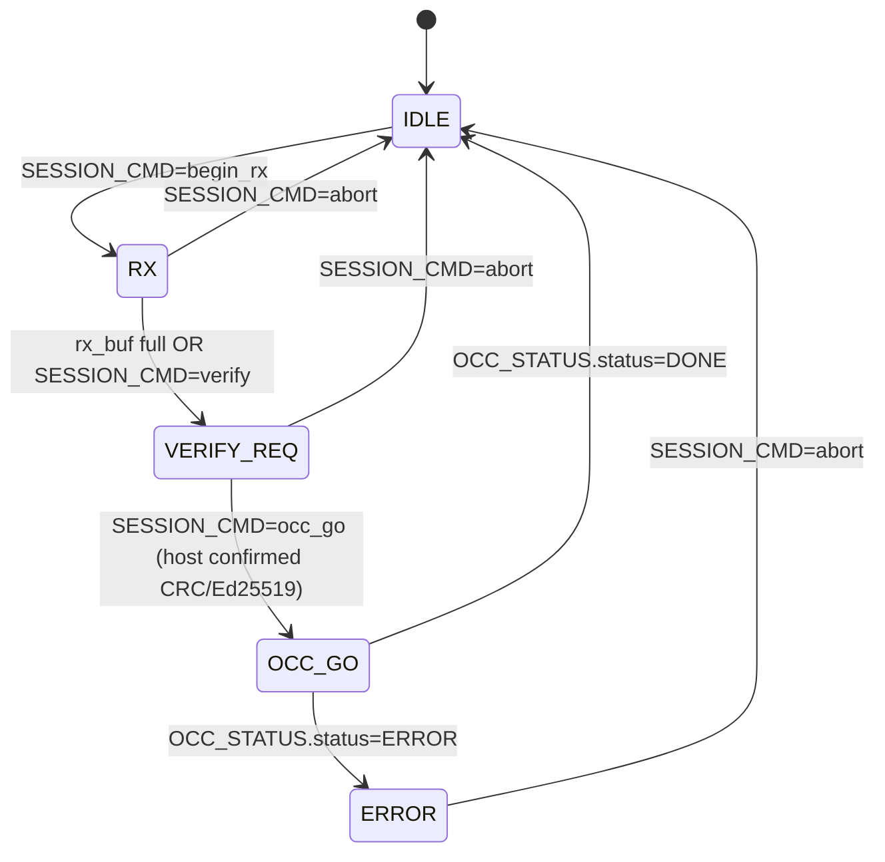

# EMRI — Ethereal Management Register Interface (v0, draft)

> Repo: `ethereal-spec` (CC-BY-SA-4.0) · Status: **draft v0**
> Plan-Ref: `ethereal-plan/subsystems/S05-BMC与EMRI-mFSM.md §2.3`, `ethereal-plan/components/C05-BMC组件.md §3/§4`
> Date: 2026-07-29 · Implements: ADR-013/014/015/016

The **unified management register ABI** exposed to the host by **both** the BMC
(NEORV32 soft-core) and the **mFSM** (register-based small-device fallback).
`ethctl` is transparent to which side it talks to — the same register map, the
same transport, the same commands. Per ADR-015 this is the load-bearing contract
that makes "small device = same host experience" true.

**Why v0 here:** this spec freezes the minimum needed for the **sim-complete
minimal loop** (host `ethctl` → SPI/EMRI → mFSM → OCC → fabric, dual-region
hot-swap in iverilog). It is intentionally narrow: no I²C monitor telemetry
registers (Phase-1 E1-IO2), no event-log ring (E1-RUN4), no scheduler regs
(P3). Those land as v0.1/v1 increments against this same offset map.

---

## 1. Design principles

1. **One map, two implementations.** Identical register layout on BMC and mFSM.
   The ONLY field that differs is `CAPABILITIES.has_bmc` (1 on BMC, 0 on mFSM).
   The RTL is parameterized: `parameter bit HAS_BMC`.
2. **Host-centric in mFSM mode.** In mFSM mode the host executes the full deploy
   flow step-by-step (push image → host verifies → drive OCC → poll). In BMC
   mode the host issues a single high-level command and the BMC runs the flow.
   The register writes are the **same words**; only the division of labor
   differs (S05 §2.3 "protocol identical, intelligence location differs").
3. **Slow host, fast fabric.** All host-visible registers are read through a
   2-flop synchronizer (C05 §3.2); values change at most once per ~ms. No
   coherency machinery beyond 2FF.
4. **OCC is the only fabric-mutating path.** EMRI never touches config storage
   directly — only via the OCC command passthrough (`OCC_CMD` + `OCC_WDATA`).
   This preserves the FABulous blank-before-write red line (C03 §0): the OCC
   enforces it; EMRI just feeds it.

> **v0 mFSM scope (realized in `emri_regfile.sv` with `HAS_BMC=0`):** the v0
> mFSM is the EMRI regfile in mFSM mode — **register-based, no CPU, host-driven**
> (ADR-014 satisfied). The host streams `OCC_WDATA` directly to the OCC through
> the regfile's passthrough; the host implements the session FSM (it holds the
> image and issues BLANK/WRITE/poll). The **device-side rx_buf + 5-state FSM**
> (C05 §4.2 — IDLE/RX/VERIFY_REQ/OCC_GO/DONE streaming from rx_buf) is **v0.1**,
> deferred until the sim loop is measured: it absorbs SPI round-trip latency
> (host pushes whole image fast into rx_buf, then `OCC_GO`) and is the
> BMC-ready structure, but requires OCC-ownership arbitration and is not
> load-bearing for correctness. The `SESSION_CMD`/`SESSION_STATUS` registers
> exist in v0 as plain host-visible storage for forward-compat.

---

## 2. Register map (v0)

Word-addressed, 32-bit. All offsets in **words** (×4 for byte address).

| Offset | Name | R/W | Width | Meaning |
|---|---|---|---|---|
| `0x00` | `MAGIC` | R | 32 | `0x45544852` ("ETHR"). Presence/endianness probe. |
| `0x01` | `ABI_VERSION` | R | 32 | `{maj[31:16], min[15:0]}`. v0 = `0x0000_0000`. |
| `0x02` | `CAPABILITIES` | R | 32 | bit0 `has_bmc`, bit1 `has_dma`, bit2 `has_i2c_mon`, bit3 `has_trng`, bit4 `has_jtag_dbg`. Others reserved-0. |
| `0x03` | `PLATFORM_ID` | R | 32 | `{vendor[31:24], dev[23:8], board_rev[7:0]}`. `vendor`: 0=sim, 1=gowin, 2=amd, 3=intel. |
| `0x04` | `NUM_REGIONS` | R | 8 | Region count (v0: 2). |
| `0x05` | `REGION_INFO(idx)` | R | 32 | Per-region geometry: `{cols[31:24], rows[23:16], tiles[15:0]}`. `idx` = host-supplied sub-address (see §6). |
| `0x08` | `OCC_CMD` | RW | 32 | OCC command trigger. See §3. Write → latches a command; self-clears on `OCC_STATUS.busy=0` transition. |
| `0x09` | `OCC_WDATA` | W | 32 | OCC write-data stream. Each write pushes one 32-bit word into the OCC wdata FIFO. |
| `0x0A` | `OCC_STATUS` | R | 32 | `{status[6:0], region_id[11:8], crc_error[16], reserved, frame_addr[31:16]}`. Mirrors `occ_top.status_o` + sticky `crc_error`. See §4. |
| `0x0B` | `OCC_FRAME_ADDR` | RW | 16 | OCC frame base address (`frame_addr_i` to `occ_top`). `{region_id[15:12], col_id[11:4], rsv[3:0]}`. |
| `0x0C` | `OCC_WORD_COUNT` | RW | 16 | Frame word count (`word_count_i` to `occ_top`). |
| `0x10` | `SESSION_CMD` | RW | 8 | mFSM session FSM control. `0=nop, 1=begin_rx, 2=verify(host-done), 3=occ_go, 4=abort`. BMC mode: ignored (BMC drives OCC directly). |
| `0x11` | `SESSION_STATUS` | R | 8 | `{state[3:0], done[4], err[7:4]}`. See §5. |
| `0x12` | `RX_BUF_CTRL` | RW | 32 | `{wr_ptr[31:16], depth[15:0]}`. Image-staging buffer (mFSM rx_buf). v0: depth ≤ 16KB. |
| `0x20` | `HEALTH_STATUS` | R | 32 | bit-per-region health: bit0=region0 ok, bit8=region1 ok, … v0: all-ok = `0x0000_0101`. |
| `0x30` | `MON_TEMP` | R | 16 | Temperature (°C, signed). v0: hardwired `0x0019` (25°C) in sim. |
| `0x31` | `MON_VCCINT` | R | 16 | Core voltage (mV). v0: hardwired `0x0338` (824mV ≈ GW5 nominal... **ASSUMPTION** TBD). |

**Reserved ranges** (`0x06-0x07`, `0x0D-0x0F`, `0x13-0x1F`, `0x22-0x2F`, `0x32+`):
read-as-0, write-ignored. Reserved for v0.1/v1 (event-log ring @ `0x38`,
telemetry block @ `0x40+`, scheduler @ `0x60+`).

---

## 3. OCC_CMD register (offset `0x08`)

The OCC command trigger. **Bit layout:**

| Bits | Field | Meaning |
|---|---|---|
| `[1:0]` | `cmd` | OCC opcode: `0=NOP, 1=WRITE, 2=READBACK, 3=BLANK` (matches `occ_top.cmd_i`). |
| `[5:2]` | `region_id` | Target region (v0: 0 or 1). Sets `region_locked_i` source + `OCC_FRAME_ADDR.region_id`. |
| `[7:6]` | reserved | 0. |
| `[8]` | `start` | **Pulse**: 1 → issue the command this cycle (host writes `0x1XX` to trigger). mFSM/BMC auto-clears after `cmd_ready` pulse. |
| `[31:9]` | reserved | 0. |

**Sequence for a WRITE (host-driven, mFSM mode):**
1. Host writes `OCC_FRAME_ADDR` + `OCC_WORD_COUNT`.
2. Host writes `OCC_CMD = {region_id, cmd=WRITE, start=1}`.
3. mFSM/BMC asserts `cmd_valid` to OCC until `cmd_ready`.
4. Host streams `OCC_WDATA` words (one per host write); mFSM forwards each to
   OCC `wdata_i` with `wdata_valid`, honoring `wdata_ready_o` backpressure.
5. Host polls `OCC_STATUS.status` until `DONE`/`ERROR`/`NEEDS_BLANK`.

**BLANK** is identical but with no `OCC_WDATA` stream. **READBACK** likewise.

> **Blank-before-write (FABulous red line):** the OCC hardware-enforces this via
> its per-region dirty bit + `S_NEEDS_BLANK` status (E0-FAB5). A WRITE to a dirty
> region returns `NEEDS_BLANK`; the host MUST issue `BLANK` first. EMRI does not
> second-guess this — it surfaces the status verbatim.

---

## 4. OCC_STATUS register (offset `0x0A`)

| Bits | Field | Meaning |
|---|---|---|
| `[6:0]` | `status` | `{status_o[2:0], reserved[6:3]}`. `0=IDLE,1=BUSY,2=DONE,3=ERROR,4=LOCKED,5=NEEDS_BLANK`. |
| `[11:8]` | `region_id` | Current OCC region. |
| `[16]` | `crc_error` | Sticky; mirrors `occ_top.crc_error_o`. Cleared on next accepted `OCC_CMD`. |
| `[31:16]` | `frame_addr` | Echo of current `OCC_FRAME_ADDR` (debug). |

---

## 5. mFSM session FSM (offset `0x10`/`0x11`)

The 5-state session FSM (C05 §4.2). Present and meaningful only in mFSM mode
(`HAS_BMC=0`); in BMC mode `SESSION_*` read as 0 and the BMC drives OCC directly.

`SESSION_STATUS.state`: `0=IDLE, 1=RX, 2=VERIFY_REQ, 3=OCC_GO, 4=ERROR`.
`SESSION_STATUS.err[7:4]`: `0=none, 1=bad_crc, 2=occ_locked, 3=occ_error`.

**Verification location (G6 resolution):** per S05 §4.2, the **host** computes
Ed25519 + CRC32 (mFSM has no CPU). `ethimg` verifies on the host; the mFSM only
needs the host to signal "verified" (`SESSION_CMD=occ_go`) and per-frame CRC32 is
still OCC-enforced. The BMC, by contrast, verifies in-firmware.

---

## 6. REGION_INFO sub-addressing

`REGION_INFO` is a windowed register: the host first writes the region index to a
sub-address latch, then reads `0x05`. To keep v0 transport-simple, **the region
index is encoded in the high byte of the read address's data phase is NOT used**;
instead v0 uses a **separate `REGION_SEL` write** at offset `0x06`:

| Offset | Name | R/W | Meaning |
|---|---|---|---|
| `0x06` | `REGION_SEL` | W | Region index for the next `REGION_INFO` read (v0: 0 or 1). |

(Reserved `0x06` repurposed for `REGION_SEL` in v0.1; documented here to avoid
surprise. `0x07` stays reserved.)

---

## 7. EFP-SPI transport (v0)

ADR-008: SPI = data/config channel. The EMRI registers are accessed over SPI via
a fixed **7-byte request/response frame** (simplest framing that fits a register
ABI; chosen over a variable mailbox stream for sim-provability):

### Request frame (host → device, 7 bytes, MSB-first)

| Byte | Field | Meaning |
|---|---|---|
| 0 | `OP` | `0x00=RD, 0x01=WR, 0x02=BLOCK_RD, 0x03=OCC_PUSH`. |
| 1-2 | `ADDR` | Word offset (big-endian). |
| 3-6 | `DATA` | Write data (big-endian); ignored on RD. |

### Response frame (device → host, 7 bytes)

| Byte | Field | Meaning |
|---|---|---|
| 0 | `STATUS` | `0x00=OK, 0x01=BAD_OP, 0x02=BAD_ADDR, 0x03=BUSY`. |
| 1-2 | `ADDR` | Echo of request ADDR. |
| 3-6 | `DATA` | Read data (RD) or 0 (WR). |

### Operations

- **RD/WR**: single-register access. Standard path for everything except
  `OCC_WDATA` streaming.
- **OCC_PUSH (`0x03`)**: optimized `OCC_WDATA` push — `ADDR=0x09`, `DATA` = one
  word; the device forwards to OCC with `wdata_valid` and returns `STATUS=OK`
  immediately (the mFSM buffers locally; backpressure surfaces as `BUSY` on the
  next push if the FIFO is full). This avoids a WR+poll round-trip per word.
- **BLOCK_RD**: reserved for future block readback (event log / readback frames);
  v0 returns `BAD_OP`.

### Clock domain

SPI clock (host SCK) is async to the fabric clock. The SPI slave deserializes
into a fabric-clock-domain register; the mFSM/EMRI block reads it there. No
2FF needed on the SPI→fabric path (it's already registered by the slave); 2FF is
on the EMRI-register **read** path back to the SPI master (C05 §3.2).

---

## 8. BMC vs mFSM behavioral differences (the full table)

| Aspect | BMC mode (`has_bmc=1`) | mFSM mode (`has_bmc=0`) |
|---|---|---|
| OCC_CMD start | BMC firmware issues it internally | host writes `OCC_CMD.start=1` |
| Image verify | Ed25519 + CRC32 in firmware | host (`ethimg`) verifies; mFSM trusts host + OCC CRC32 |
| Session FSM | absent (BMC is the FSM) | present, host-driven |
| RX buffer | BMC manages its own SRAM | fixed 16KB `rx_buf`, host fills via SPI |
| `ethctl` commands | high-level (`run img.eth @r1`) | identical command; host driver splits into steps |
| Register writes from host | commands to BMC | direct control |

**Acceptance (C05 §7):** the same `ethctl` EMRI consistency test suite runs
identically on both modes — `ethctl inspect` output is byte-identical for the
fields both expose.

---

## 9. Open items / ASSUMPTIONs (G6, TBD)

1. **`MON_VCCINT` nominal value** — GW5AST-138 VCCINT nominal ≈ 0.82-0.90V
   (ASSUMPTION 824mV placeholder); confirm from datasheet before HW bring-up.
2. **`OCC_PUSH` FIFO depth** — v0 mFSM buffers ≥1 word; host must poll `BUSY`.
   Deeper FIFO (e.g. 16-word) would let the host burst — defer to v0.1 once we
   measure deploy latency in sim.
3. **Region count discovery** — v0 hardcodes `NUM_REGIONS=2` in RTL; the host
   reads it. No runtime re-partition (ADR-004: regions are build-time).
4. **Ed25519 public-key provisioning** — where does the verify key live? v0:
   host-side only (mFSM doesn't verify). BMC mode: TBD key store (Boot ROM vs
   fuse vs image-bundled) — Phase-1 E1-BMC2 decision.
5. **I²C monitor transport** — separate from EFP-SPI; not in v0 EMRI (E1-IO2).
